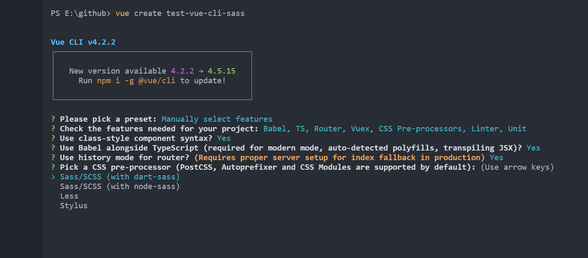

### 一、安装

#### 1、Sass

第一步，安装`Ruby`

第二步，安装`Sass`

[Sass 安装](https://www.sass.hk/install/)

#### 2、vue-cli

使用`vue-cli`创建项目时，`CSS Pre-processors`选择`Sass/SCSS`即可在项目中使用`Sass/SCSS`的语法，无需安装`Ruby`。




### 二、基本语法

#### 1、使用变量

##### 1.1 变量声明

```scss
$highlight-color: #F90;
```

##### 1.2 变量引用

```scss
$highlight-color: #F90;
.selected {
  border: 1px solid $highlight-color;
}
```

##### 1.3 变量名用下划线或中划线分隔

#### 2、嵌套CSS规则

```scss
#content {
  article {
    h1 { color: #333 }
    p { margin-bottom: 1.4em }
  }
  #content aside { background-color: #EEE }
}
```

##### 2.1 父选择器的标识符&

```scss
article a {
  color: blue;
  &:hover { color: red }
}
```

##### 2.2 群组选择器嵌套

```scss
.container {
  h1, h2, h3 {margin-bottom: .8em}
}
```

##### 2.3 子组合选择器和同层组合选择器：>、+和~


#### 3、导入Sass文件

#### 4、静默注释

#### 5、混合器

#### 6、使用选择器继承

[Sass 快速入门](https://www.sass.hk/guide/)

**推荐：**

[Sass 中文网](https://www.sass.hk/)

[Sass总结笔记 基础入门（超级直观细节）](https://juejin.cn/post/6971458017267187719)

[听说你还不会SCSS？带你掌握scss所有知识点(上)：Sass的介绍、安装和文件编译【学会Scss，评论抽奖！】](https://juejin.cn/post/7023199071439421471)

[听说你还不会SCSS？带你掌握scss所有知识点(中)：掌握Scss基础语法和使用、局部文件导入【学会Scss，评论抽奖！】](https://juejin.cn/post/7023544559095250975)

[Sass 可能会节约你 50%的 CSS 代码](https://juejin.cn/post/6869375816162082823)

[sass和 less的区别](https://juejin.cn/post/6906845910157525000)