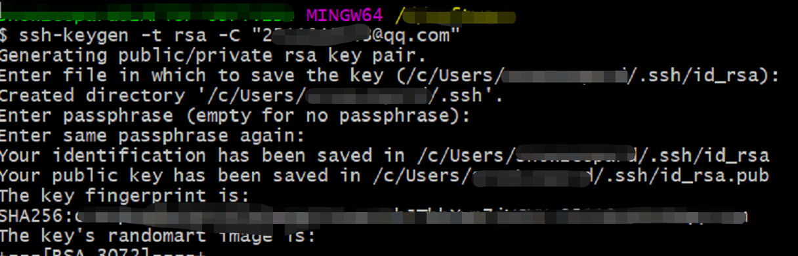
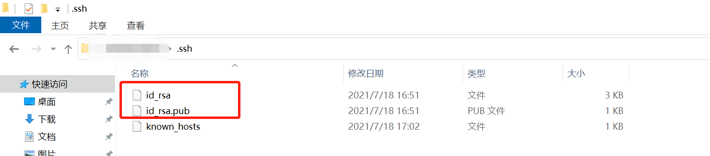
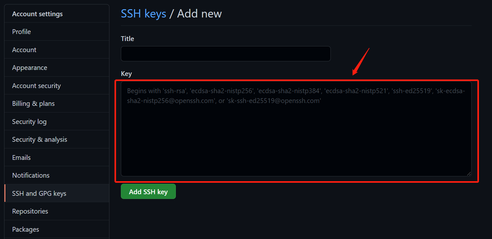

### 一、Git安装

#### [1、Git下载](https://git-scm.com/)


#### 2、Git安装

除了第一步注意可以修改Git安装目录以外（默认是安装在C盘，可以选择安装到D盘等），其他均按照默认配置即可。

安装完成后，打开命令行窗口执行`git --version`，查看git版本。

### 二、Git配置

#### 1、配置SSH key

第一步，鼠标右键单击之后，选择`Git Bash Here`，打开`Git Bash`窗口。

第二步：输入如下命令：

```git bash
// 注意： xxxx@qq.com需要替换成实际的邮箱地址
ssh-keygen -t rsa -C "xxx@qq.com"
```

第三步：接下来会弹出多个确认提示，直接回车即可，key生成之后会有一行提示信息，显示key的保存位置，如下图所示：



第四步：打开id_rsa.pub文件所在的目录，打开id_rsa.pub，将内容复制出来，如下图所示：




#### 2、登录Github，配置SSH key

第一步，依次点击右上角的Settings->SSH And GPG keys->new SSH key。

第二步，将复制出来的内容粘贴到 Key 输入框中，Title可以任意填写，然后保存即可，如下图所示：



**推荐：**

[如何在在win10上安装Git（图文并茂）超详细](https://blog.csdn.net/Deng872347348/article/details/111883306)

[Windows 10 配置 Github SSH Key](https://blog.csdn.net/MissXy_/article/details/79901949)