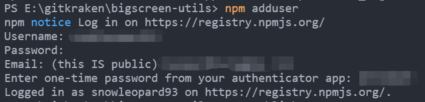

### 一、准备工作

#### 1、注册`npm`账号

[npm官网](https://www.npmjs.com/)

#### 2、初始化项目

```
npm init
```

#### 3、将代码提交至`git`

### 二、第一次发布包

#### 1、切换`npm`镜像源

如果默认不是`npm`官方镜像源，则需要先切换`npm`镜像源。

```
npm config set registry https://registry.npmjs.org/
```

`npm`包发布成功之后，再切换回其他镜像源。

```
npm config set registry http://registry.npm.taobao.org/
```

#### 2、添加用户

```
npm adduser
```



#### 3、发布包

```
npm publish
```

### 三、非第一次发布包

#### 1、修改`package.json`的`version`

#### 2、控制台登录`npm`

```
npm login
```

#### 3、发布包

```
npm publish
```