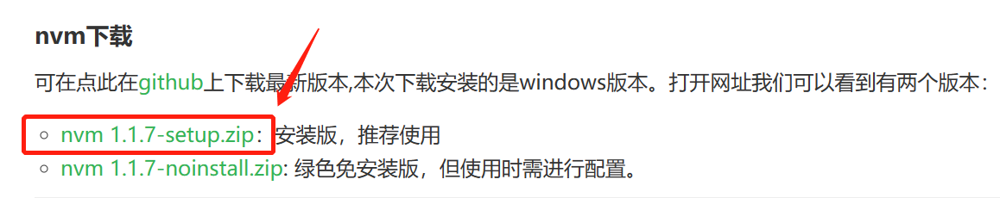
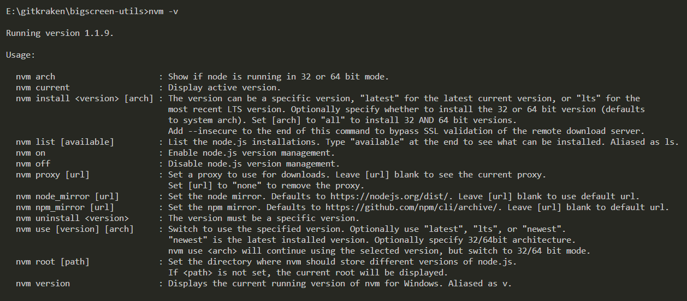
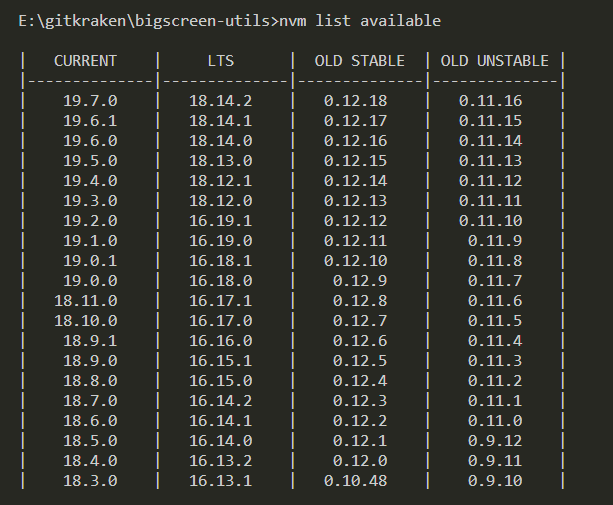
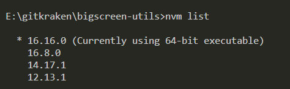

### 一、nvm下载安装

[nvm](https://nvm.uihtm.com/)

1、推荐使用安装版，安装后无需配置环境变量。



2、nvm 安装路径默认为`C:\Users\<用户名>\AppData\Roaming\nvm`

### 二、nvm切换国内镜像

#### 1、阿里云

```
$ nvm npm_mirror: https://npmmirror.com/mirrors/npm/
$ nvm node_mirror: https://npmmirror.com/mirrors/node/
```

#### 2、查看nvm镜像

在nvm安装路径下的settings.txt文件中。

```
root: D:\Users\Lenovo\AppData\Roaming\nvm
arch: 64
proxy: none
originalpath: .
originalversion: 
node_mirror: https://npmmirror.com/mirrors/node/
npm_mirror: https://npmmirror.com/mirrors/npm/
```

### 三、nvm常用命令

#### 1、查看nvm版本

```
$ nvm -v
```



#### 2、查看可安装的node版本

```
$ nvm list available
```



#### 3、查看已安装的node版本

```
$ nvm list
```

#### 4、安装指定的node版本

```
$ nvm install <version>
```

#### 5、卸载到指定的node版本

```
$ nvm uninstall <version>
```

#### 6、切换到指定的node版本

```
$ nvm use <version>
```



### 四、问题处理

#### 1、切换不同版本node时报错，提示exit 1 .....

以管理员身份运行即可。

#### 2、npm安装依赖时报错，提示`error cb() never called!`

查看npm配置，是否存在registry为https://registry.npm.taobao.org

```
$ npm config list
```

如果存在，则编辑C:\Users\<用户名>\.npmrc文件，比如用户名是Lenovo，则编辑C:\Users\Lenovo\.npmrc文件，删掉对应配置，然后执行以下命令。

```
$ npm cache clean -f
$ npm cache verify
```

重新进入项目安装依赖

```
$ npm i
或
$ npm i --registry=https://registry.npm.taobao.org
```

### 五、参考

[nvm 配置国内镜像](https://blog.csdn.net/weixin_39786582/article/details/128009601)

[nvm 镜像配置，安装管理 nodejs 版本](https://blog.csdn.net/qq_41409353/article/details/109553940)

[error cb() never called!](https://blog.csdn.net/m0_37859032/article/details/113179899)
