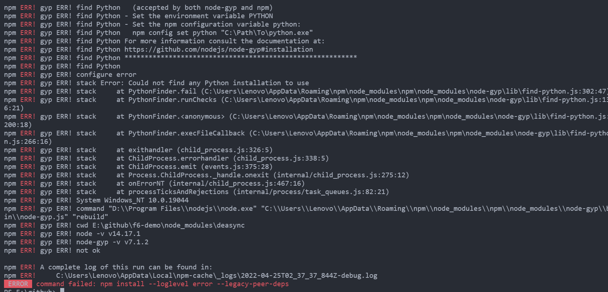

### 一、版本兼容问题

#### 1、node和node-gyp版本不兼容

node的使用版本改为`14.17.1`

#### 2、vue create xxx 报错

出现报错时的版本如下：`Vue CLI`版本为`v4.5.15`，`node`版本为`v14.17.1`，`npm`版本为`7.22.0`。

经排查，可能与选择的单元测试工具有关系，选择`Jest`时会报错，选择`Mocha/chai`的时候不会报错。

```bash
npm ERR! code 1
npm ERR! path E:\github\f6-demo\node_modules\deasync
npm ERR! command failed
npm ERR! command C:\WINDOWS\system32\cmd.exe /d /s /c node-gyp rebuild
npm ERR! gyp ERR! find Python
npm ERR! gyp ERR! find Python Python is not set from command line or npm configuration
npm ERR! gyp ERR! find Python Python is not set from environment variable PYTHON
npm ERR! gyp ERR! find Python checking if "python3" can be used
npm ERR! gyp ERR! find Python - "python3" is not in PATH or produced an error
npm ERR! gyp ERR! find Python checking if "python" can be used
npm ERR! gyp ERR! find Python - "python" is not in PATH or produced an error
npm ERR! gyp ERR! find Python checking if "python2" can be used
npm ERR! gyp ERR! find Python - "python2" is not in PATH or produced an error
npm ERR! gyp ERR! find Python checking if Python is C:\Python37\python.exe
npm ERR! gyp ERR! find Python - "C:\Python37\python.exe" could not be run
npm ERR! gyp ERR! find Python checking if Python is C:\Python27\python.exe
npm ERR! gyp ERR! find Python - "C:\Python27\python.exe" could not be run
npm ERR! gyp ERR! find Python checking if the py launcher can be used to find Python
npm ERR! gyp ERR! find Python - "py.exe" is not in PATH or produced an error
npm ERR! gyp ERR! find Python
npm ERR! gyp ERR! find Python **********************************************************
npm ERR! gyp ERR! find Python You need to install the latest version of Python.
npm ERR! gyp ERR! find Python Node-gyp should be able to find and use Python. If not,
npm ERR! gyp ERR! find Python you can try one of the following options:
npm ERR! gyp ERR! find Python - Use the switch --python="C:\Path\To\python.exe"
npm ERR! gyp ERR! find Python   (accepted by both node-gyp and npm)
npm ERR! gyp ERR! find Python - Set the environment variable PYTHON
npm ERR! gyp ERR! find Python - Set the npm configuration variable python:
npm ERR! gyp ERR! find Python   npm config set python "C:\Path\To\python.exe"
npm ERR! gyp ERR! find Python For more information consult the documentation at:
npm ERR! gyp ERR! find Python https://github.com/nodejs/node-gyp#installation
npm ERR! gyp ERR! find Python **********************************************************
npm ERR! gyp ERR! find Python
npm ERR! gyp ERR! configure error
npm ERR! gyp ERR! stack Error: Could not find any Python installation to use
npm ERR! gyp ERR! stack     at PythonFinder.fail (C:\Users\Lenovo\AppData\Roaming\npm\node_modules\npm\node_modules\node-gyp\lib\find-python.js:302:47)npm ERR! gyp ERR! stack     at PythonFinder.runChecks (C:\Users\Lenovo\AppData\Roaming\npm\node_modules\npm\node_modules\node-gyp\lib\find-python.js:136:21)
npm ERR! gyp ERR! stack     at PythonFinder.<anonymous> (C:\Users\Lenovo\AppData\Roaming\npm\node_modules\npm\node_modules\node-gyp\lib\find-python.js:200:18)
npm ERR! gyp ERR! stack     at PythonFinder.execFileCallback (C:\Users\Lenovo\AppData\Roaming\npm\node_modules\npm\node_modules\node-gyp\lib\find-python.js:266:16)
npm ERR! gyp ERR! stack     at exithandler (child_process.js:326:5)
npm ERR! gyp ERR! stack     at ChildProcess.errorhandler (child_process.js:338:5)
npm ERR! gyp ERR! stack     at ChildProcess.emit (events.js:375:28)
npm ERR! gyp ERR! stack     at Process.ChildProcess._handle.onexit (internal/child_process.js:275:12)
npm ERR! gyp ERR! stack     at onErrorNT (internal/child_process.js:467:16)
npm ERR! gyp ERR! stack     at processTicksAndRejections (internal/process/task_queues.js:82:21)
npm ERR! gyp ERR! System Windows_NT 10.0.19044
npm ERR! gyp ERR! command "D:\\Program Files\\nodejs\\node.exe" "C:\\Users\\Lenovo\\AppData\\Roaming\\npm\\node_modules\\npm\\node_modules\\node-gyp\\bin\\node-gyp.js" "rebuild"
npm ERR! gyp ERR! cwd E:\github\f6-demo\node_modules\deasync
npm ERR! gyp ERR! node -v v14.17.1
npm ERR! gyp ERR! node-gyp -v v7.1.2
npm ERR! gyp ERR! not ok

npm ERR! A complete log of this run can be found in:
npm ERR!     C:\Users\Lenovo\AppData\Local\npm-cache\_logs\2022-04-25T02_37_37_844Z-debug.log
 ERROR  command failed: npm install --loglevel error --legacy-peer-deps
```



### 二、npm包依赖问题

#### 1、ERESOLVE unable to resolve dependency tree

解决方案：

```
npm install --legacy-peer-deps
```

### 三、npm镜像

#### 1、最新淘宝镜像

最新淘宝镜像地址：`https://registry.npmmirror.com/`

```bash
npm config set registry https://registry.npmmirror.com/
```

#### 2、查看本地镜像

```bash
npm config get registry
```
