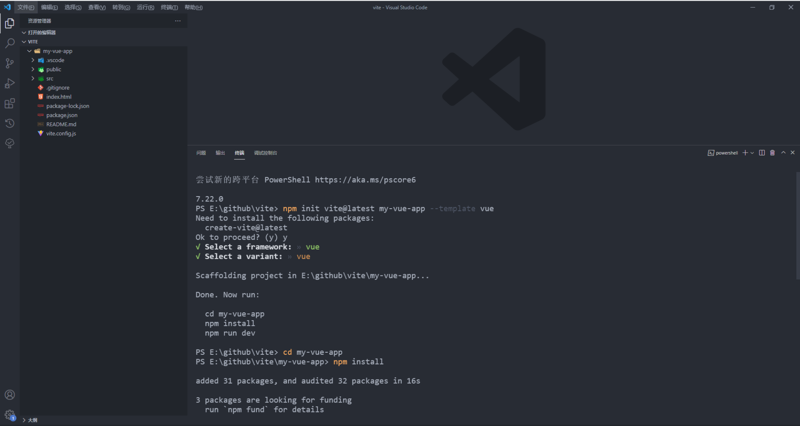
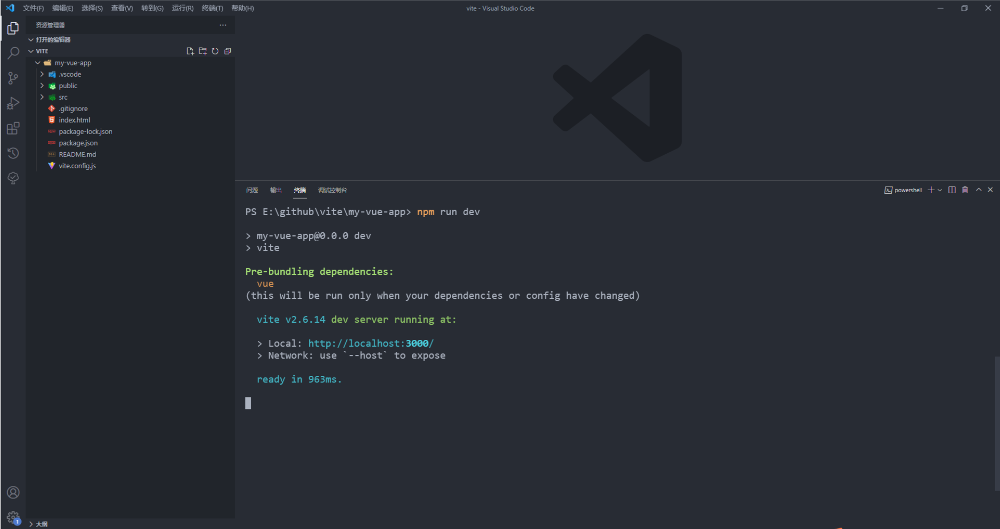
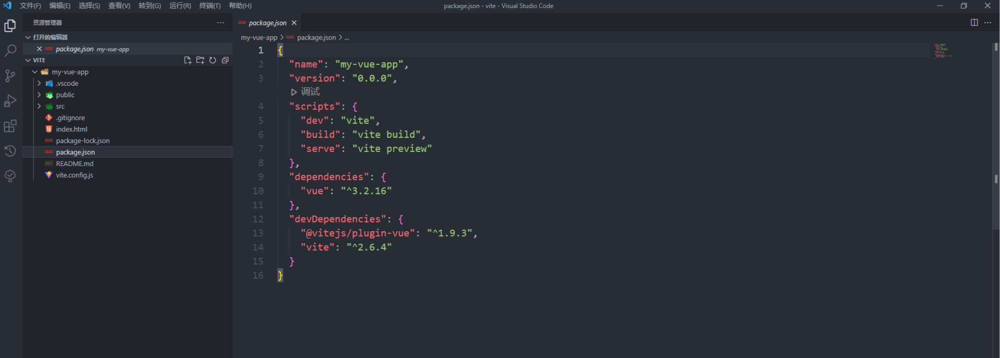
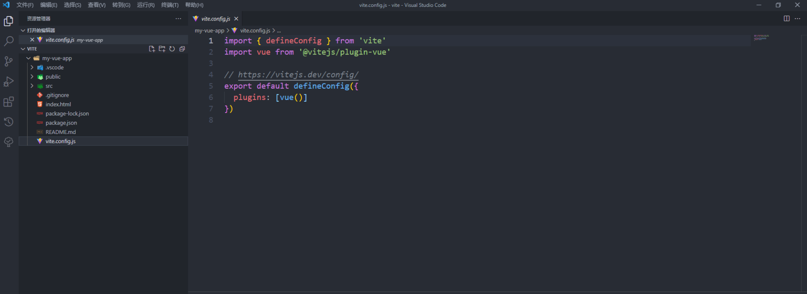

### 一、搭建Vite项目

```bash
# npm 7+
npm init vite@latest my-vue-app --template vue
```



### 二、目录结构



#### 1. package.json



#### 2. vite.config.js



### 三、区别

#### 1. index.html的文件位置

`public`文件夹 -> 根目录

### 四、常用命令

#### 1. 构建应用

```bash
$ npm run build
```

#### 2. 本地测试应用

```bash
$ npm run serve
```

### 五、配置

#### 1. 默认配置

```javascript
import { defineConfig } from 'vite'
import vue from '@vitejs/plugin-vue'

export default defindConfig({
    plugins: [vue()]
})
```

#### 2. 共享配置

**（1）base**

**（2）mode**

可选值为`development`/`production`

**（3）plugins**

**（4）publicDir**

**（4）cacheDir**

**（5）resolve.alias**

**（6）css.postcss**

**（7）logLevel**

可选值为`info`/`warn`/`error`/`silent`

**（8）envDir**

**（9）envPrefix**

#### 3. 开发服务器选项

```javascript
import { defineConfig } from 'vite'
import vue from '@vitejs/plugin-vue'

export default defindConfig({
    server: {
        port: 8080,
        open: true
    }
})

```

**（1）server.host**

**（2）server.port**

**（3）server.strictPort**

**（4）server.https**

**（5）server.open**

设置是否启动成功之后，在浏览器打开应用程序。可以是布尔值，也可以是页面的访问地址。

**（6）server.proxy**

```javascript
import { defineConfig } from 'vite'
import vue from '@vitejs/plugin-vue'

export default defineConfig({
  server: {
    proxy: {
      // 字符串简写写法
      '/foo': 'http://localhost:4567',
      // 选项写法
      '/api': {
        target: 'http://jsonplaceholder.typicode.com',
        changeOrigin: true,
        rewrite: (path) => path.replace(/^\/api/, '')
      }
    }
  }
})
```

**（7）server.cors**

#### 4. 构建选项

```javascript
import { defineConfig } from 'vite'
import vue from '@vitejs/plugin-vue'

export default defineConfig({
    build: {
        outDir: 'dist',
        assetsDir: 'assets'
    }
})
```

**（1）build.target**

**（2）build.outDir**

指定输出路径。

**（3）build.assetsDir**

指定静态资源的输出路径（相对于`build.outDir`）

**（4）build.sourcemap**

**（5）build.minify**

可选值为`false`/`terser`/`esbuild`

**（7）build.terserOptions**

### 六、插件

#### 1. @vitejs/plugin-vue

#### 2. @vitejs/plugin-vue-jsx

#### 3. @vitejs/plugin-react

#### 4. @vitejs/plugin-legacy

**参考：**

[Vite 配置](https://cn.vitejs.dev/config/)