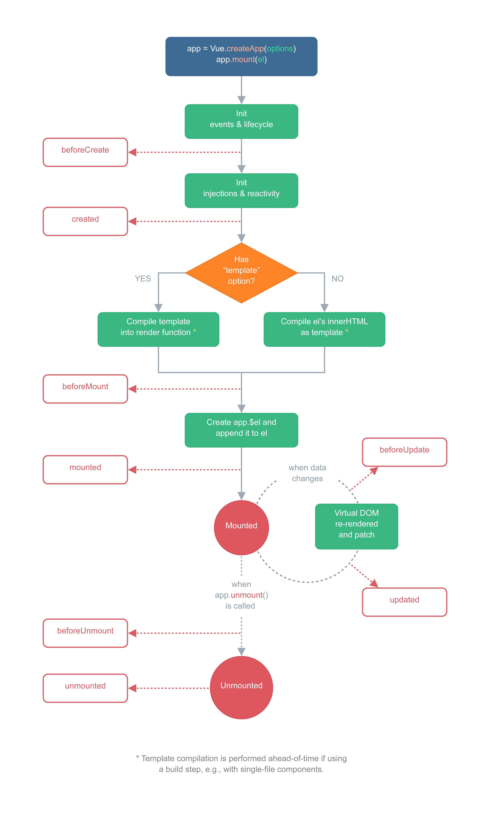
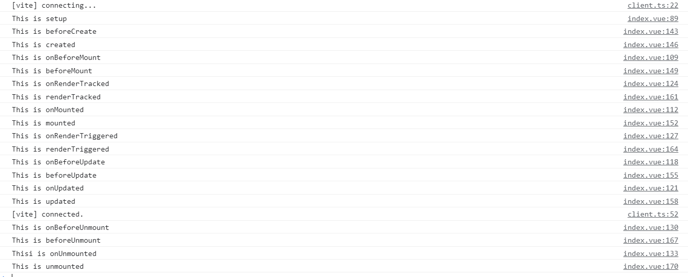

### 一、基本概念

#### 1、生命周期钩子



#### 2、`选项API`的生命周期钩子

##### beforeCreate

##### created

##### beforeMount

##### renderTracked

##### mounted

##### renderTriggered

##### beforeUpdate

##### updated

##### beforeUnmount

##### unmounted

##### activated

##### deactivated

##### errorCaptured

#### 3、`组合API`的生命周期钩子

##### setup

##### onBeforeMount

##### onRenderTracked

##### onMounted

##### onRenderTriggered

##### onBeforeUpdate

##### onUpdated

##### onBeforeUnmount

##### onUnmounted

##### onActivated

##### onDeactivated

##### onErrorCaptured

在捕获一个来自后代组件的错误时被调用。

#### 4、Vue2/Vue3 生命周期钩子对照

| **生命周期钩子**     | **Vue2**     | **Vue3（选项式API）** | **Vue3（组合式API）** |
| ------------- |-------------|-------------|-------------|
|  | beforeCreate | beforeCreate |  setup |
|  | created | created |
|  | beforeMount | beforeMount | onBeforeMount |
|  |  | renderTracked | onRenderTracked |
|  | mounted | mounted |   onMounted  |
|  |  | renderTriggered | onRenderTriggered |
|  | beforeUpdate | beforeUpdate | onBeforeUpdate |
|  | updated | updated | onUpdated |
|  | beforeDestroy | beforeUnmount | onBeforeUnmount |
|  | destroyed | unmounted | onUnmounted |
|  |  | activated | onActivated |
|  |  | deactivated | onDeactivated |
|  |  | errorCaptured | onErrorCaptured |

#### 5、Vue3生命周期钩子示例

```vue
<template>
  <div>{{ content }}</div>
</template>
<script lang="ts">
import { defineComponent,
  onBeforeMount, onMounted, onBeforeUpdate, onUpdated,
  onRenderTracked, onRenderTriggered,
  onBeforeUnmount, onUnmounted,
  reactive, toRefs } from 'vue'

export default defineComponent({
  name: 'Layout',
  setup() {
    console.log("This is setup");
    const state = reactive({
        content: ""
    })
    const stateAsRefs = toRefs(state)
    onBeforeMount(() => {
      console.log("This is onBeforeMount")
    })
    onMounted(() => {
        console.log("This is onMounted")
        setTimeout(() => {
          state.content = "666"
        })
    })
    onBeforeUpdate(() => {
      console.log("This is onBeforeUpdate")
    })
    onUpdated(() => {
      console.log("This is onUpdated");
    })
    onRenderTracked(({ key, target, type }) => {
      console.log("This is onRenderTracked")
    }),
    onRenderTriggered(({ key, target, type }) => {
      console.log("This is onRenderTriggered")
    }),
    onBeforeUnmount(() => {
      console.log("This is onBeforeUnmount")
    })
    onUnmounted(() => {
      console.log("Thisi is onUnmounted")
    })
    return {
      ...state,
      ...stateAsRefs
    }
  },
  beforeCreate() {
    console.log("This is beforeCreate")
  },
  created() {
    console.log("This is created")
  },
  beforeMount() {
    console.log("This is beforeMount")
  },
  mounted() {
    console.log("This is mounted")
  },
  beforeUpdate() {
    console.log("This is beforeUpdate")
  },
  updated() {
    console.log("This is updated")
  },
  renderTracked({ key, target, type }) {
    console.log("This is renderTracked")
  },
  renderTriggered({ key, target, type }) {
    console.log("This is renderTriggered")
  },
  beforeUnmount() {
    console.log("This is beforeUnmount")
  },
  unmounted() {
    console.log("This is unmounted")
  }
})
</script>
```

```typescript
import { createApp } from 'vue'
import App from './App.vue'

const app = createApp(App)
app.mount('#app')

setTimeout(() => {
    app.unmount();
}, 20000)
```



### 二、常用指令

#### 1、常用指令介绍

> **v-text、v-html**

> **v-show、v-if、v-else、v-else-if**

> **v-for**

> **v-on**

> **v-bind**

> **v-model**

> **v-slot**

> **v-pre**

> **v-cloak**

> **v-once**

> **v-memo**

记住一个模板的子树。

#### 2、Vue2/Vue3常用指令对照

| **Vue2**     | **Vue3** |
|-------------|-------------|
| v-text | v-text |
| v-html | v-html |
| v-show | v-show |
| v-if | v-if |
| v-else | v-else |
| v-else-if | v-else-if |
| v-for | v-for |
| v-on | v-on |
| v-bind | v-bind |
| v-model | v-model |
| v-slot | v-slot |
| v-cloak | v-cloak |
| v-once | v-once |
|  | v-pre |
|  | v-memo |

**推荐：**

[【掘金】 Vue 3 生命周期完整指南](https://juejin.cn/post/6945606524987244558)