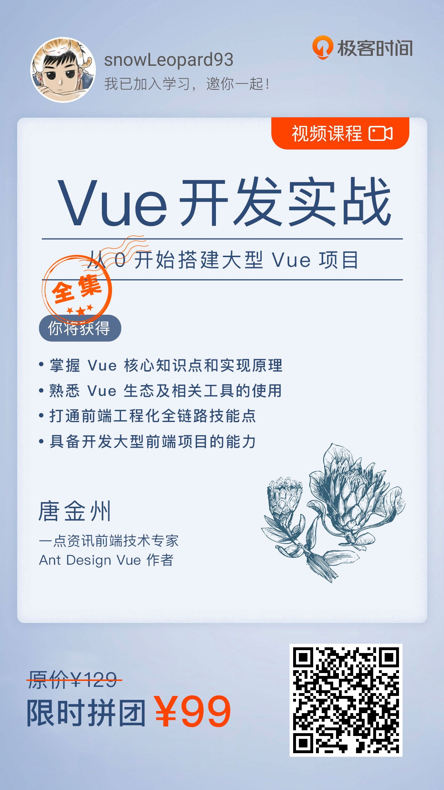

**Vue项目开发**

#### [Vue项目开发（一）.md](guide/Vue项目开发/Vue项目开发（一）.md)

**关键词：** `vue-cli4` `ant-design-vue` `基本布局`

#### [Vue项目开发（二）.md](guide/Vue项目开发/Vue项目开发（二）.md)

**关键词：** `菜单` `路由` `权限`

#### [Vue项目开发（三）.md](guide/Vue项目开发/Vue项目开发（三）.md)

**关键词：** `Echarts5` `防抖`

#### [Vue项目开发（四）.md](guide/Vue项目开发/Vue项目开发（四）.md)

**关键词：** `ant-design-vue` `表单`

#### [Vue项目开发（五）.md](guide/Vue项目开发/Vue项目开发（五）.md)

**关键词：** `ant-design-vue` `图标` `iconFont` `less-loader` `国际化`

#### [Vue项目开发（六）.md](guide/Vue项目开发/Vue项目开发（六）.md)

**关键词：** `构建打包`

#### [Vue项目开发加餐一（路由）.md](guide/Vue项目开发/Vue项目开发加餐一（路由）.md)

**关键词：** `路由`

**推荐：**

[vue-mall实战](https://github.com/snowLeopard93/vue-mall)

[ant-design-vue Form表单](https://www.antdv.com/components/form-cn/)

[vue-cli 链式操作](https://cli.vuejs.org/zh/guide/webpack.html#%E9%93%BE%E5%BC%8F%E6%93%8D%E4%BD%9C-%E9%AB%98%E7%BA%A7)

