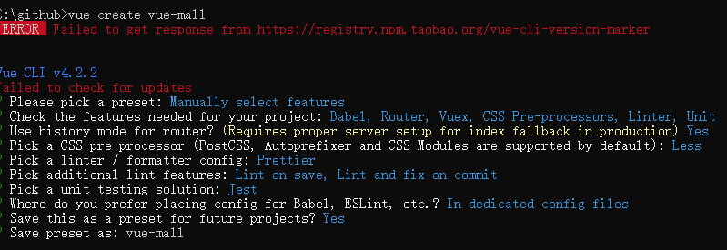

本部分主要介绍使用`vue-cli4`快速搭建vue项目及依赖安装、基本布局和主题切换等内容。

### 一、项目框架搭建

#### 1、创建项目

```
vue create vue-mall
```

基于`vue-cli4`，涉及技术包括`Babel`、`Vue-router`、`Vuex`、`CSS pre-processors（Less）`、`Linter（Prettier）`、`Unit`、`Jest`



#### 2、安装依赖

```
npm i ant-design-vue moment
```

#### 3、启动项目 

```
npm run serve
```

### 二、引入依赖

#### 1、全局引入

`main.js`

```javascript
import Antd from "ant-design-vue";
// import "ant-design-vue/dist/antd.css";
import "ant-design-vue/dist/antd.less";

Vue.use(Antd);
```

#### 2、部分引入

`main.js`

```javascript
import Button from "ant-design-vue/lib/button";
import "ant-design-vue/lib/button/style";

Vue.use(Button);
```

#### 3、`babel`按需加载

**（1）安装`babel-plugin-import`**

```
npm i babel-plugin-import --save
```

**（2）修改`babel.config.js`**

```javascript
module.exports = {
  presets: ["@vue/cli-plugin-babel/preset"],
  plugins: [
    [
      "import",
      { libraryName: "ant-design-vue", libraryDirectory: "es", style: "css" }
    ] // `style: true` 会加载 less 文件
  ]
};
```

**（3）修改部分引入**

`main.js`

```javascript
import { Button } from "ant-design-vue";

Vue.use(Button);
```

### 三、基本布局

布局使用`ant-design-vue`里的[Layout组件](https://www.antdv.com/components/layout/#Layout)

#### 1、拷贝布局

此处使用的是[侧边布局](antdv.com/components/layout-cn/#components-layout-demo-sider)

#### 2、修改布局

**（1）** 依次将 `<a-layout-sider>`、`<a-layout-header>`、`<a-layout-footer>` 里面的内容清空，替换为项目中自己的组件 `SiderMenu`、`Header`、`Footer`

**（2）** 将`<a-layout-sider>`里面的内容清空，替换为 `<router-view>`

**部分代码如下：**

```BasicLayOut.vue
<template>
  <div :class="[`nav-theme-${navTheme}`, `nav-layout-${navLayout}`]">
    <a-layout id="components-layout-demo-side" style="min-height: 100vh">
      <a-layout-sider
              v-if="navLayout === 'left'"
              :theme="navTheme"
              :trigger="null" v-model="collapsed" collapsible>
        <div class="logo">Ant Design Vue Mall</div>
        <SiderMenu />
      </a-layout-sider>
      <a-layout>
        <a-layout-header style="background: #fff; padding: 0">
          <a-icon
            class="trigger"
            :type="collapsed ? 'menu-unfold' : 'menu-fold'"
            @click="collapsed = !collapsed"
          ></a-icon>
          <Header />
        </a-layout-header>
        <a-layout-content style="margin: 0 16px">
          <router-view></router-view>
        </a-layout-content>
        <a-layout-footer style="text-align: center">
          <Footer />
        </a-layout-footer>
      </a-layout>
    </a-layout>
    <SettingDrawer/>
  </div>
</template>
```

### 四、抽屉

抽屉效果使用`ant-design-vue`里的[Drawer抽屉组件](https://www.antdv.com/components/drawer-cn/#components-drawer)

#### 1、拷贝抽屉

此处使用的是[基本抽屉](https://www.antdv.com/components/drawer-cn/#components-drawer-demo-basic)

#### 2、修改抽屉

将`<a-drawer>`里面的内容清空，替换为自己的表单页面

**部分代码如下：**

```SettingDrawer/index.vue
<template>
  <div>
    <a-drawer
      title="Basic Drawer"
      placement="right"
      :closable="false"
      @close="onClose"
      width="500px"
    >
      <div>
        <h2>整体风格定制</h2>
        <a-radio-group
                :value="$route.query.navTheme || 'dark'"
                @change="e => handleSetting('navTheme', e.target.value)">
          <a-radio value="dark">黑色</a-radio>
          <a-radio value="light">白色</a-radio>
        </a-radio-group>
      </div>
      <div>
        <h2>导航模式</h2>
        <a-radio-group
                :value="$route.query.navLayout || 'left'"
                @change="e => handleSetting('navLayout', e.target.value)">
          <a-radio value="left">左侧</a-radio>
          <a-radio value="top">顶部</a-radio>
        </a-radio-group>
      </div>
    </a-drawer>
  </div>
</template>
```

#### 3、设置抽屉的隐藏显示

通过API提供的`handle` 将抽屉直接挂载到dom上，然后通过修改`visible` 实现抽屉的隐藏显示

```SettingDrawer/index.vue
<template>
  <div>
    <a-drawer
      title="Basic Drawer"
      placement="right"
      :closable="false"
      @close="onClose"
      width="500px"
    >
      <template v-slot:handle>
        <div class="handle" @click="visible = !visible">
          <a-icon :type="visible?'close':'setting'"></a-icon>
        </div>
      </template>

      <div>
        <h2>整体风格定制</h2>
        <a-radio-group
                :value="$route.query.navTheme || 'dark'"
                @change="e => handleSetting('navTheme', e.target.value)">
          <a-radio value="dark">黑色</a-radio>
          <a-radio value="light">白色</a-radio>
        </a-radio-group>
      </div>
      <div>
        <h2>导航模式</h2>
        <a-radio-group
                :value="$route.query.navLayout || 'left'"
                @change="e => handleSetting('navLayout', e.target.value)">
          <a-radio value="left">左侧</a-radio>
          <a-radio value="top">顶部</a-radio>
        </a-radio-group>
      </div>
    </a-drawer>
  </div>
</template>
```

### 五、主题

#### 1、通过获取url参数修改主题

**1.1 监听`<a-radio-group>` 的 `change`，修改url上的参数，丢到`$router`**

**部分代码如下：**

```SettingDrawer/index.vue
<script>
export default {
  data() {
    return {
      visible: false
    };
  },
  methods: {
    onClose() {
      this.visible = false;
    },
    handleSetting(type, value) {
      this.$router.push({query: {...this.$route.query, [type]: value}})
    }
  }
};
</script>
```

**1.2 通过计算属性更新主题**

```BasicLayOut.vue
<script>
import Header from "./Header";
import Footer from "./Footer";
import SiderMenu from "./SiderMenu";
import SettingDrawer from '../components/SettingDrawer';

export default {
  name: "BasicLayout",
  data() {
    return {
      collapsed: false
    };
  },
  computed: {
    navTheme() {
      return this.$route.query.navTheme || "dark";
    },
    navLayout() {
      return this.$route.query.navLayout || "left";
    }
  },
  components: {
    Header,
    Footer,
    SiderMenu,
    SettingDrawer
  }
};
</script>
```

#### 2、通过`localStorge`和`store`修改主题

**注：前置知识：`store`的基本使用**

**2.1 将theme放到`store.js`中管理**

```src/store/modules/system.js
// 从localStorage获取，如果没有，则设置一个默认的
let theme = localStorage.getItem("vue-mall-theme");
if (!theme) {
  localStorage.setItem("vue-mall-theme", "light");
}

export default {
  namespaced: true,
  state: {
    // 主题
    theme: localStorage.getItem("vue-mall-theme")
  },
  mutations: {
    // 用来切换主题，同时将新的值更新到localStorage里面
    changeTheme(state, theme) {
      state.theme = theme;
      localStorage.setItem("vue-mall-theme", theme);
    }
  },
  // 用于返回当前主题的值
  getters: {
    theme: state => {
      return state.theme;
    }
  },
  actions: {},
  modules: {}
};
```

**2.2 在`BasicLayout.vue`中获取主题**

```src/layouts/BasicLayout.vue
<script>
import { mapState } from "vuex";

export default {
  name: "BasicLayout",
  // 此处使用 mapState 来获取store中存放的值
  computed: mapState({
    theme: state => state.system.theme
  }
};
</script>
```

**2.3 在`Header.vue`中切换主题**

```
<template>
  <div class="header" :class="[`header-theme-${headerTheme}`]">
    <div class="header-theme" title="主题切换">
      <IconFont
        type="icon-switch-on"
        style="font-size: 30px;"
        v-show="headerTheme === 'dark'"
        @click="changeTheme('light')"
      />
      <IconFont
        type="icon-switch-off"
        style="font-size: 30px;"
        v-show="headerTheme === 'light'"
        @click="changeTheme('dark')"
      />
    </div>
  </div>
</template>

<script>
export default {
  name: "Header",
  // props表示用来获取从父组件中传入的值
  props: {
    headerTheme: {
      type: String,
      default: "dark"
    }
  },
  methods: {
    // 切换主题
    changeTheme(theme) {
      // 通过 $store的commit方法，将值提交给store
      this.$store.commit("system/changeTheme", theme);
    }
  }
};
</script>
```

**推荐：**

[Ant Design Vue](https://www.antdv.com/docs/vue/introduce-cn/)