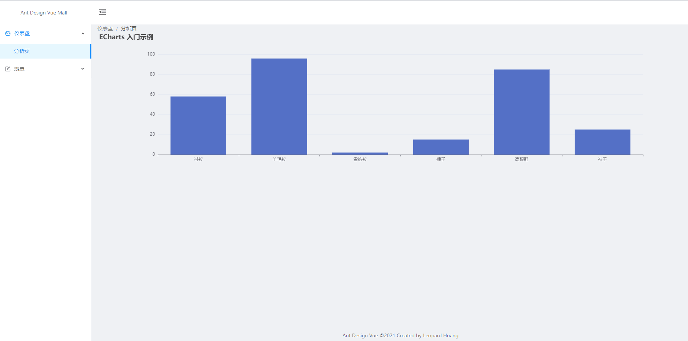

### 一、Echarts5使用

#### 1、Echarts5 安装及引入

**（1）安装** 

```
npm i echarts --save
```

**（2）引入**

```vue
import * as echarts from "echarts";
```

#### 2、Echart组件

```Chart.vue
<template>
  <div ref="chartDom"></div>
</template>

<script>
import * as echarts from "echarts";
import debounce from "lodash/debounce";
import { addListener, removeListener } from "resize-detector";
export default {
  name: "Chart",
  props: {
    option: {
      type: Object,
      default: () => {}
    }
  },
  created() {
    this.resize = debounce(this.resize, 300);
  },
  mounted() {
    this.renderChart();
    addListener(this.$refs.chartDom, this.resize);
  },
  beforeDestroy() {
    removeListener(this.$refs.chartDom, this.resize);
    this.chart.dispose();
    this.chart = null;
  },
  watch: {
    option(val) {
      this.chart.setOption(val);
    }
  },
  methods: {
    renderChart() {
      this.chart = echarts.init(this.$refs.chartDom);
      // 绘制图表
      this.chart.setOption(this.option);
    },
    resize() {
      this.chart.resize();
    }
  }
};
</script>

<style scoped></style>
```

```Analysis.vue
<template>
  <div>
    <Chart :option="chartOption" style="height: 400px;" />
  </div>
</template>

<script>
import random from "lodash/random";
import Chart from "../../components/Chart";
export default {
  name: "Analysis",
  data() {
    return {
      chartOption: {
        title: {
          text: "ECharts 入门示例"
        },
        tooltip: {},
        xAxis: {
          data: ["衬衫", "羊毛衫", "雪纺衫", "裤子", "高跟鞋", "袜子"]
        },
        yAxis: {},
        series: [
          {
            name: "销量",
            type: "bar",
            data: [5, 20, 36, 10, 10, 20]
          }
        ]
      }
    };
  },
  mounted() {
    this.interval = setInterval(() => {
      this.chartOption.series[0].data = this.chartOption.series[0].data.map(
        () => random(100)
      );
      this.chartOption = { ...this.chartOption };
    }, 10000);
  },
  beforeDestroy() {
    clearInterval(this.interval);
  },
  components: {
    Chart
  }
};
</script>

<style scoped></style>
```

**效果图：**


