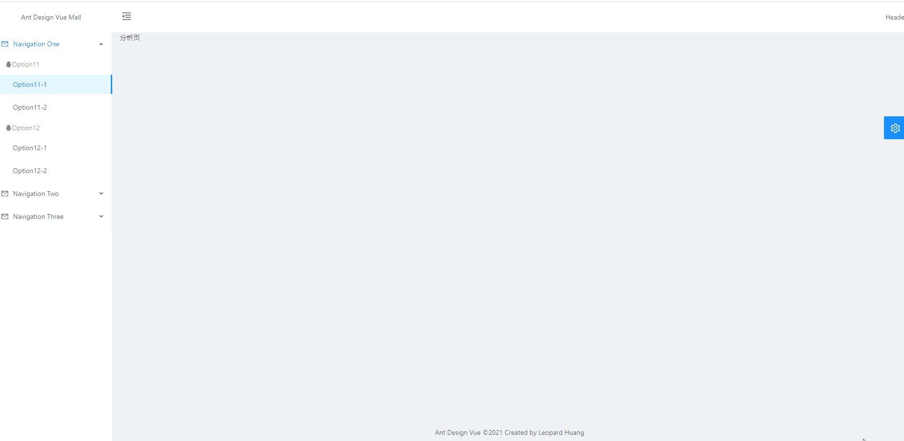
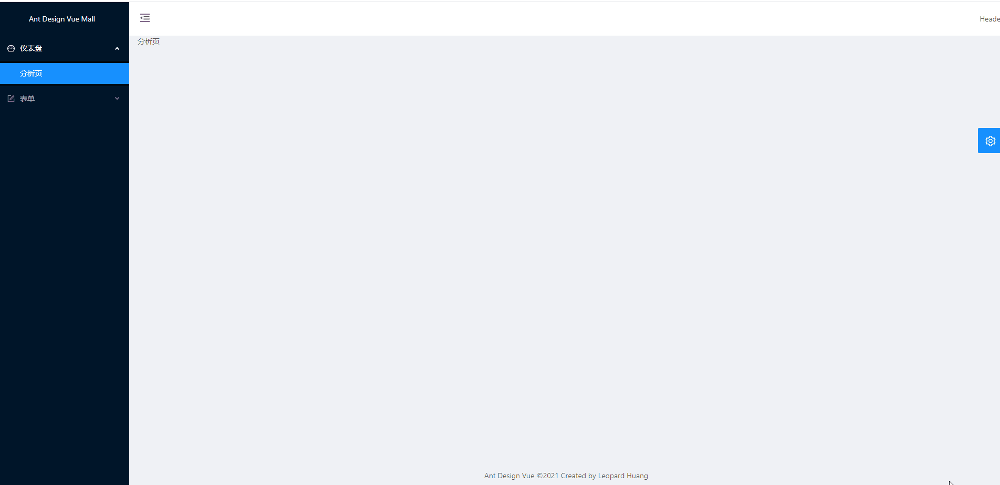
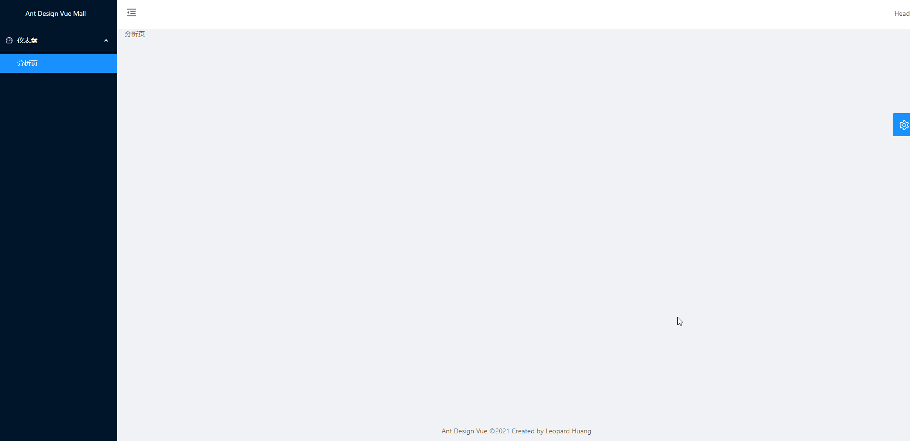

### 一、菜单展现

#### 1、拷贝菜单

菜单使用`ant-design-vue`[Menu 导航菜单](https://www.antdv.com/components/menu-cn/)里的[内嵌菜单](https://www.antdv.com/components/menu-cn/#components-menu-demo-inline-menu)

**部分代码如下：**

```SiderMenu.vue
<template>
  <div>
    <a-menu
      style="width: 256px"
      :default-selected-keys="['1']"
      :open-keys.sync="openKeys"
      mode="inline"
      :theme="theme"
      @click="handleClick"
    >
      <a-sub-menu key="sub1" @titleClick="titleClick">
        <span slot="title"
          ><a-icon type="mail" /><span>Navigation One</span></span
        >
        <a-menu-item-group key="g1">
          <template slot="title">
            <a-icon type="qq" /><span>Item 1</span>
          </template>
          <a-menu-item key="1">
            Option 1
          </a-menu-item>
          <a-menu-item key="2">
            Option 2
          </a-menu-item>
        </a-menu-item-group>
        <a-menu-item-group key="g2" title="Item 2">
          <a-menu-item key="3">
            Option 3
          </a-menu-item>
          <a-menu-item key="4">
            Option 4
          </a-menu-item>
        </a-menu-item-group>
      </a-sub-menu>
      <a-sub-menu key="sub2" @titleClick="titleClick">
        <span slot="title"
          ><a-icon type="appstore" /><span>Navigation Two</span></span
        >
        <a-menu-item key="5">
          Option 5
        </a-menu-item>
        <a-menu-item key="6">
          Option 6
        </a-menu-item>
        <a-sub-menu key="sub3" title="Submenu">
          <a-menu-item key="7">
            Option 7
          </a-menu-item>
          <a-menu-item key="8">
            Option 8
          </a-menu-item>
        </a-sub-menu>
      </a-sub-menu>
      <a-sub-menu key="sub4">
        <span slot="title"
          ><a-icon type="setting" /><span>Navigation Three</span></span
        >
        <a-menu-item key="9">
          Option 9
        </a-menu-item>
        <a-menu-item key="10">
          Option 10
        </a-menu-item>
        <a-menu-item key="11">
          Option 11
        </a-menu-item>
        <a-menu-item key="12">
          Option 12
        </a-menu-item>
      </a-sub-menu>
    </a-menu>
  </div>
</template>
```

#### 3、切换主题

**（1）参考`BasicLayout.vue`实现**

```SiderMenu.vue
<script>
export default {
  name: "SiderMenu",
  computed: {
    menuTheme() {
      return this.$route.query.navTheme || "dark";
    }
  }
}
</script>
```

**（2）通过`BasicLayout.vue`将值传递给子组件**

```BasicLayout.vue
<SiderMenu :menu-theme="navTheme"/>
```

```SiderMenu.vue
<script>
export default {
  name: "SiderMenu",
  props: {
    menuTheme: {
      type: String,
      default: "dark"
    }
  }
}
</script>
```

#### 3、修改菜单

将菜单数据赋值给某个变量，遍历显示。

**部分代码如下：**

```SiderMenu.vue
<template>
  <div>
    <a-menu
      style="width: 256px"
      :default-selected-keys="defaultSelectedKeys"
      :open-keys.sync="openKeys"
      mode="inline"
      :theme="menuTheme"
      @click="handleClick"
    >
      <a-sub-menu v-for="firstMenu in menuList" :key="firstMenu.key">
        <span slot="title"><a-icon type="mail" /><span>{{ firstMenu.title }}</span></span>
        <a-menu-item-group v-for="secondMenu in firstMenu.children" :key="secondMenu.key">
          <template slot="title">
            <a-icon type="qq" /><span>{{ secondMenu.title }}</span>
          </template>
          <a-menu-item v-for="threeMenu in secondMenu.children" :key="threeMenu.key">
            {{ threeMenu.title }}
          </a-menu-item>
        </a-menu-item-group>
      </a-sub-menu>
    </a-menu>
  </div>
</template>
<script>
export default {
  name: "SiderMenu",
  props: {
    menuTheme: {
      type: String,
      default: "dark"
    }
  },
  data() {
    return {
      // 当前展开的 key 数组  
      openKeys: [1],
      // 默认展开的 key 数组  
      defaultSelectedKeys: [111],
      menuList: [
        {
          key: 1,
          title: "Navigation One",
          children: [
            {
              key: 11,
              title: "Option11",
              children: [
                {
                  key: 111,
                  title: "Option11-1"
                },
                {
                  key: 112,
                  title: "Option11-2"
                }
              ]
            },
            {
              key: 12,
              title: "Option12",
              children: [
                {
                  key: 121,
                  title: "Option12-1"
                },
                {
                  key: 122,
                  title: "Option12-2"
                }
              ]
            }
          ]
        },
        {
          key: 2,
          title: "Navigation Two",
          children: [
            {
              key: 21,
              title: "Option21",
              children: [
                {
                  key: 211,
                  title: "Option21-1"
                },
                {
                  key: 212,
                  title: "Option21-2"
                }
              ]
            },
            {
              key: 22,
              title: "Option22",
              children: [
                {
                  key: 221,
                  title: "Option22-1"
                },
                {
                  key: 222,
                  title: "Option22-2"
                }
              ]
            }
          ]
        },
        {
          key: 3,
          title: "Navigation Three",
          children: [
            {
              key: 31,
              title: "Option31",
              children: [
                {
                  key: 311,
                  title: "Option31-1"
                },
                {
                  key: 312,
                  title: "Option31-2"
                }
              ]
            },
            {
              key: 32,
              title: "Option32",
              children: [
                {
                  key: 321,
                  title: "Option32-1"
                },
                {
                  key: 322,
                  title: "Option32-2"
                }
              ]
            }
          ]
        }
      ]
    };
  },
  watch: {
    openKeys(val) {
      console.log("openKeys", val);
    }
  },
  methods: {
    handleClick(e) {
      console.log("click", e);
    },
    titleClick(e) {
      console.log("titleClick", e);
    }
  }
};
</script>
```

**效果图：**



### 二、菜单与路由结合

#### 1、修改路由文件，对部分路由做特殊标识

**（1）用`hideInMenu: true`标识不需要显示的一级路由**

**（2）用`hideChildrenInMenu: true`标识不需要显示子路由的路由** 

**（3）给需要显示的路由增加`meta信息`，包括`icon`和`title`**

**（4）除上述以外，约定显示`name`不为空的路由**

#### 2、菜单数据从路由中动态获取

```SiderMenu.vue
getMenuData(routes = [], parentKeys = [], selectedKey) {
    const menuData = [];
    routes.forEach(item => {
      if (item.name && !item.hideInMenu) {
          this.openKeysMap[item.path] = parentKeys;
          this.selectedKeysMap[item.path] = [selectedKey || item.path];
          const newItem = { ...item };
          delete newItem.children;
          if (item.children && !item.hideChildrenInMenu) {
            newItem.children = this.getMenuData(item.children, [
              ...parentKeys,
              item.path
            ]);
          } else {
            this.getMenuData(
              item.children,
              selectedKey ? parentKeys : [...parentKeys, item.path],
              selectedKey || item.path
            );
          }
          menuData.push(newItem);
        } else if (
          !item.hideInMenu &&
          !item.hideChildrenInMenu &&
          item.children
        ) {
          menuData.push(
            ...this.getMenuData(item.children, [...parentKeys, item.path])
          );
        }
      });
   return menuData;
}
```

#### 3. 修改template

```SiderMenu.vue
<template>
  <div>
    <a-menu :theme="menuTheme" :selected-keys="selectedKeys" :open-keys.sync="openKeys" mode="inline">
      <a-sub-menu v-for="firstMenu in menuData" :key="firstMenu.path">
        <span slot="title">
          <a-icon v-if="firstMenu.meta.icon" :type="firstMenu.meta.icon" />
          <span>{{ firstMenu.meta.title }}</span>
        </span>
        <a-menu-item
          v-for="secondMenu in firstMenu.children"
          :key="secondMenu.path"
          @click="
            () => $router.push({ path: secondMenu.path, query: $route.query })
          "
        >
          {{ secondMenu.meta.title }}
        </a-menu-item>
      </a-sub-menu>
    </a-menu>
  </div>
</template>
```

**效果图：**



### 三、菜单权限控制

#### 1、增加403页面

**（1）403页面**

```403.vue
<template>
  <div>403</div>
</template>

<script>
export default {
  name: "403"
};
</script>

<style scoped></style>
```

**（2）配置403路由**

```javascript
import Forbidden from "../views/403";

const routes = [
{
    path: "/403",
    name: "403",
    hideInMenu: true,
    component: Forbidden
  }
]
```

#### 2、修改路由，增加权限标识

通过`meta`中的`authority`进行标识。

```javascript
const routes = [
  {
    path: "/user",
    hideInMenu: true,
    component: () =>
      import(/* webpackChunkName: "layout" */ "../layouts/UserLayout"),
    children: [
      {
        path: "/user",
        redirect: "/user/login"
      },
      {
        path: "/user/login",
        name: "login",
        component: () =>
          import(/* webpackChunkName: "user" */ "../views/User/Login")
      },
      {
        path: "/user/register",
        name: "register",
        component: () =>
          import(/* webpackChunkName: "register" */ "../views/User/Register")
      }
    ]
  },
  {
    path: "/",
    meta: { authority: ["user", "admin"] },
    component: () =>
      import(/* webpackChunkName: "layout" */ "../layouts/BasicLayout"),
    children: [
      {
        path: "/",
        redirect: "/dashboard/analysis"
      },
      {
        path: "/dashboard",
        name: "dashboard",
        meta: {
          icon: "dashboard",
          title: "仪表盘"
        },
        component: { render: h => h("router-view") },
        children: [
          {
            path: "/dashboard/analysis",
            name: "analysis",
            meta: {
              title: "分析页"
            },
            component: () =>
              import(
                /* webpackChunkName: "analysis" */ "../views/Dashboard/Analysis"
              )
          }
        ]
      },
      {
        path: "/form",
        name: "form",
        meta: {
          icon: "form",
          title: "表单",
          authority: ["admin"]
        },
        component: { render: h => h("router-view") },
        children: [
          {
            path: "/form/basic-form",
            name: "basicForm",
            meta: {
              title: "基础表单"
            },
            component: () =>
              import(/* webpackChunkName: "form" */ "../views/Forms/BasicForm")
          },
          {
            path: "/form/step-form",
            name: "stepForm",
            meta: {
              title: "分步表单"
            },
            hideChildrenInMenu: true,
            component: () =>
              import(
                /* webpackChunkName: "form" */ "../views/Forms/StepForm/index"
              ),
            children: [
              {
                path: "/form/step-form",
                redirect: "/form/step-form/info"
              },
              {
                path: "/form/step-form/info",
                name: "info",
                component: () =>
                  import(
                    /* webpackChunkName: "form" */ "../views/Forms/StepForm/Step1"
                  )
              },
              {
                path: "/form/step-form/confirm",
                name: "confirm",
                component: () =>
                  import(
                    /* webpackChunkName: "form" */ "../views/Forms/StepForm/Step2"
                  )
              },
              {
                path: "/form/step-form/result",
                name: "result",
                component: () =>
                  import(
                    /* webpackChunkName: "form" */ "../views/Forms/StepForm/Step3"
                  )
              }
            ]
          }
        ]
      }
    ]
  },
  {
    path: "/403",
    name: "403",
    hideInMenu: true,
    component: Forbidden
  },
  {
    path: "*",
    name: "404",
    hideInMenu: true,
    component: NotFound
  }
];
```

#### 4、增加一个权限认证js

```javascript
export function getCurrentAuthority() {
  return ["admin"];
}

export function check(authority) {
  const current = getCurrentAuthority();
  return current.some(item => authority.includes(item));
}

export function isLogin() {
  const current = getCurrentAuthority();
  return current && current[0] !== "guest";
}
```

#### 5、增加路由守卫的判断

```javascript
import findLast from "lodash/findLast";
import { check, isLogin } from "../utils/auth";
import { notification } from "ant-design-vue";

router.beforeEach((to, from, next) => {
  if (to.path !== from.path) {
    NProgress.start();
  }
  const record = findLast(to.matched, record => record.meta.authority);
  if (record && !check(record.meta.authority)) {
    if (!isLogin() && to.path !== "/user/login") {
      next({
        path: "/user/login"
      });
    } else if (to.path !== "/403") {
      notification.error({
        message: "403",
        description: "你没有权限访问，请联系管理员！"
      });
      next({
        path: "/403"
      });
    }

    NProgress.done();
  }
  next();
});
```

#### 6、过滤菜单数据

```SiderMenu.vue
<script>
import { check } from "../utils/auth";
export default {
  name: "SiderMenu",
  methods: {
    // 从路由中获取菜单
    getMenuData(routes = [], parentKeys = [], selectedKey) {
      const menuData = [];
      for (let item of routes) {
        if (item.meta && item.meta.authority && !check(item.meta.authority)) {
          break;
        }
        if (item.name && !item.hideInMenu) {
          this.openKeysMap[item.path] = parentKeys;
          this.selectedKeysMap[item.path] = [selectedKey || item.path];
          const newItem = { ...item };
          delete newItem.children;
          if (item.children && !item.hideChildrenInMenu) {
            newItem.children = this.getMenuData(item.children, [
              ...parentKeys,
              item.path
            ]);
          } else {
            this.getMenuData(
              item.children,
              selectedKey ? parentKeys : [...parentKeys, item.path],
              selectedKey || item.path
            );
          }
          menuData.push(newItem);
        } else if (
          !item.hideInMenu &&
          !item.hideChildrenInMenu &&
          item.children
        ) {
          menuData.push(
            ...this.getMenuData(item.children, [...parentKeys, item.path])
          );
        }
      }
      return menuData;
    }
  }
};
</script>
```

**效果图：**



### 四、权限组件

#### 1、权限组件

使用**函数式组件**的写法：

```Authorized.vue
<script>
import { check } from "../utils/auth";
export default {
  functional: true,
  props: {
    authority: {
      type: Array,
      required: true
    }
  },
  render(h, context) {
    const { props, scopedSlots } = context;
    return check(props.authority) ? scopedSlots.default() : null;
  }
};
</script>

<style scoped></style>
```


#### 2、全局注册并使用

**（1）全局注册**

```main.js
import Authorized from "./components/Authorized";

Vue.component("Authorized", Authorized);
``` 

**（2）使用**


```BasicLayout.vue
<Authorized :authority="['admin']">
    <SettingDrawer />
</Authorized>
```

### 五、权限指令

#### 1、权限指令

```directives/auth.js
import { check } from "../utils/auth";

function install(Vue, options = {}) {
  Vue.directive(options.name || "auth", {
    inserted(el, binding) {
      if (!check(binding.value)) {
        el.parentNode && el.parentNode.removeChild(el);
      }
    }
  });
}

export default { install };
```

#### 2、全局注册并使用

**（1）全局注册**

```main.js
import Auth from "./directives/auth";
Vue.use(Auth);
```

**（2）使用**

```BasicLayout.vue
<a-icon
    v-auth="['admin']"
    class="trigger"
    :type="collapsed ? 'menu-unfold' : 'menu-fold'"
    @click="collapsed = !collapsed"
></a-icon>
```