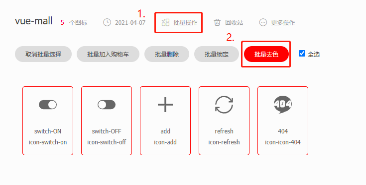
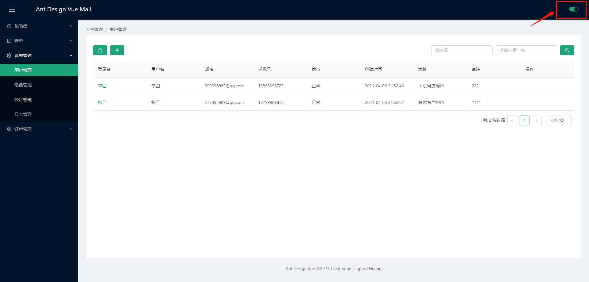

### 一、图标使用

#### 1、`ant-design-vue`

[ant-design-vue icon](https://www.antdv.com/components/icon-cn/#components-icon-demo-basic)

#### 2、icon-font

```main.js
const IconFont = Icon.createFromIconfontCN({
  scriptUrl: "//at.alicdn.com/t/font_2376320_22s4zik6wfl.js" // 在 iconfont.cn 上生成
});
Vue.component("IconFont", IconFont);
```

```vue
<template>
  <div style="text-align: center;">
    <IconFont type="icon-icon-404" style="font-size: 100px;" />
  </div>
</template>

<script>
import NotFoundImg from "@/assets/images/404.svg";
export default {
  name: "NotFound"
};
</script>
```

**修改icon颜色：**

**第一步：在`iconfont.cn`上批量去色**



**第二步：在初始化`IconFont`的时候传入一个新的类名**

```main.js
const IconFont = Icon.createFromIconfontCN({
  scriptUrl: "//at.alicdn.com/t/font_2376320_22s4zik6wfl.js", // 在 iconfont.cn 上生成
  // 额外属性
  extraCommonProps: {
    // class
    class: "icon"
  }
});
Vue.component("IconFont", IconFont);
```

**第三步：添加`icon`样式**

```css
.icon {
  color: #1da57a;
  vertical-align: -0.25em;
}
```

**效果图：**




#### 3、本地资源（非svg）

```vue
<template>
  <div style="text-align: center;">
    
  </div>
</template>
<script>
import NotFoundImg from "@/assets/images/404.svg";
export default {
  name: "NotFound",
  data() {
    return {
      NotFoundImg
    };
  }
};
</script>
```

#### 4、本地资源（svg）

**（1）安装`vue-svg-loader`**

```
npm i vue-svg-loader --save-dev
```

**（2）修改`vue.config.js`**

```vue.config.js
chainWebpack: config => {
    const svgRule = config.module.rule("svg");

    // 清除已有的所有 loader。
    // 如果你不这样做，接下来的 loader 会附加在该规则现有的 loader 之后。
    svgRule.uses.clear();

    // 添加要替换的 loader
    svgRule.use("vue-svg-loader").loader("vue-svg-loader");
  },
```

**（3）修改vue**

```vue
<template>
  <div style="text-align: center;">
    <IconFont type="icon-icon-404" style="font-size: 100px;" />
    <NotFoundSvg />
  </div>
</template>

<script>
import NotFoundSvg from "@/assets/images/404.svg";

export default {
  name: "NotFound",
  components: {
    NotFoundSvg
  }
};
</script>
```

### 二、定制主题

#### 1、修改`vue.config.js`

**（1）将less-loader版本升级到6.0.0**

```
npm i less-loader@6.0.0 --save-dev
```

**（2）修改vue.config.js**

```vue.config.js
module.exports = {
  css: {
    loaderOptions: {
      less: {
        lessOptions: {
          modifyVars: {
            "primary-color": "#1DA57A"
          },
          javascriptEnabled: true
        }
      }
    }
  }
}
```

#### 2、添加.less文件

用来处理抽屉组件的样式。

```SettingDrawer/index.vue
<style lang="less" src="./index.less" />
```

```SettingDrawer/index.less
@import "~ant-design-vue/lib/style/themes/default.less";

.setting-drawer-handle {
  position: absolute;
  top: 240px;
  right: 500px;
  width: 48px;
  height: 48px;
  background: @primary-color;
  color: #fff;
  font-size: 20px;
  text-align: center;
  line-height: 48px;
  border-radius: 3px 0 0 3px;
}
```

#### 3、修改index.html

```index.html
<script>
    window.less = {
        async: false,
        env: 'dev',
        javascriptEnabled: true,
        modifyVars: {
          "primary-color": "#1DA57A"
        }
    };
</script>
<script type="text/javascript" src="https://cdnjs.cloudflare.com/ajax/libs/less.js/2.7.2/less.min.js"></script>
```

**注：** 通过`window.less.modifyVars({"@primary-color": "red"})`动态切换主题不生效，暂未找到原因。

### 三、国际化

#### 1、ant-design 组件国际化

**（1）引入`ConfigProvider`**
```main.js
import {
  ConfigProvider
} from "ant-design-vue";

Vue.use(ConfigProvider);
```

**（2）修改App.vue**

```App.vue
<template>
  <div id="app">
    <a-config-provider :locale="locale">
      <router-view />
    </a-config-provider>
  </div>
</template>
<script>
import zhCN from "ant-design-vue/lib/locale-provider/zh_CN";
import enUS from "ant-design-vue/lib/locale-provider/en_US";
import moment from "moment";
export default {
  data() {
    return {
      locale: zhCN
    };
  },
  watch: {
    "$route.query.locale": function(val) {
      this.locale = val === "enUS" ? enUS : zhCN;
      moment.locale(val === "enUS" ? "en" : "zh-cn");
    }
  }
};
</script>
<style lang="less"></style>
```

**（3）切换语言**

```Header.vue
<template>
  <div :class="[`header-theme-${headerTheme}`]" class="header">
    <div class="header-locale">
      <a-dropdown>
        <a class="ant-dropdown-link" @click="e => e.preventDefault()">
          <a-icon type="global" />
        </a>
        <a-menu
          slot="overlay"
          @click="changeLocale"
          :selected-keys="[$route.query.locale || 'zhCN']"
        >
          <a-menu-item key="zhCN">
            中文
          </a-menu-item>
          <a-menu-item key="enUS">
            英文
          </a-menu-item>
        </a-menu>
      </a-dropdown>
    </div>
  </div>
</template>

<script>
export default {
  name: "Header",
  props: {
    headerTheme: {
      type: String,
      default: "dark"
    }
  },
  methods: {
    changeLocale({ key }) {
      this.$router.push({ query: { ...this.$route.query, locale: key } });
    }
  }
};
</script>

<style scoped>
.header {
  float: right;
  width: calc(100% - 256px);
}

.header-theme-dark {
  color: #ffffff;
  background: #001529;
}

.header-theme-light {
  color: #001529;
  background: #ffffff;
}

.header-locale {
  float: right;
  margin-right: 30px;
}
</style>
```

#### 2、本地资源国际化

**（1）本地资源国际化js**

```locale/zhCN.js
export default {
  "app.dashboard.analysis.timeLabel": "时间"
};
```

```locale/enUS.js
export default {
  "app.dashboard.analysis.timeLabel": "Time"
};
```

**（2）引入vue-i18n**

```
npm i vue-i18n --save
```

```main.js
import VueI18n from "vue-i18n";

import zhCN from "./locale/zhCN";
import enUS from "./locale/enUS";
import queryString from "query-string";

const i18n = new VueI18n({
  locale: queryString.parse(location.search).locale || "zhCN",
  messages: {
    zhCN: { message: zhCN },
    enUS: { message: enUS }
  }
});

new Vue({
  router,
  store,
  i18n,
  render: h => h(App)
}).$mount("#app");
```

**（3）使用**

```Analysis.vue
<template>
  <div>
    {{ $t("message")["app.dashboard.analysis.timeLabel"] }}
    <a-date-picker></a-date-picker>
  </div>
</template>
```

**（4）切换语言**

```Header.vue
<script>
export default {
  name: "Header",
  props: {
    headerTheme: {
      type: String,
      default: "dark"
    }
  },
  methods: {
    changeLocale({ key }) {
      this.$router.push({ query: { ...this.$route.query, locale: key } });
      this.$i18n.locale = key;
    }
  }
};
</script>
```
