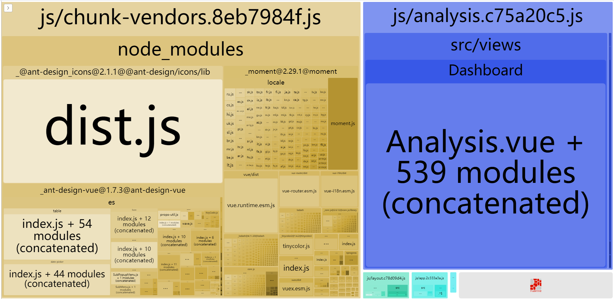
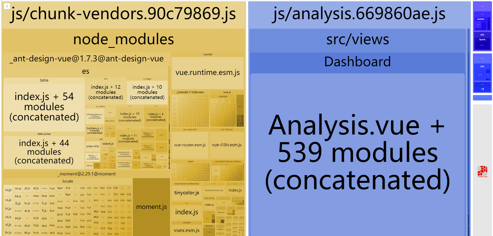
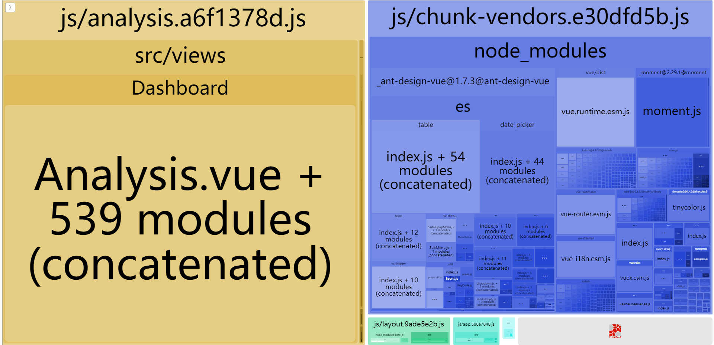

### 一、构建打包

#### 1、查看打包报告

```
npm run build --report
```

打包报告： `dist/report.html`



#### 2、图标按需加载

**（1）icons.js**

```js
// 图标名 首字母大写 + "outline"
export { default as SettingOutline } from "@ant-design/icons/lib/outline/SettingOutline";
export { default as DashboardOutline } from "@ant-design/icons/lib/outline/DashboardOutline";
```

**（2）vue.config.js**

```js
module.exports = {
  configureWebpack: {
    resolve: {
      alias: {
        "@ant-design/icons/lib/dist$": path.resolve(__dirname, "./src/icons.js")
      }
    }
  }
}
```



#### 3、moment语言包按需加载

```vue.config.js
const webpack = require("webpack");
module.exports = {
  configureWebpack: {
    plugins: [new webpack.IgnorePlugin(/^\.\/locale$/, /moment$/)]  
  }
}
```

```App.vue
import moment from "moment";
import "moment/locale/zh-cn";
```



**参考：**

[Reduce Antd icons bundle size](https://github.com/HeskeyBaozi/reduce-antd-icons-bundle-demo)

[How to optimize moment.js with webpack](https://github.com/jmblog/how-to-optimize-momentjs-with-webpack)