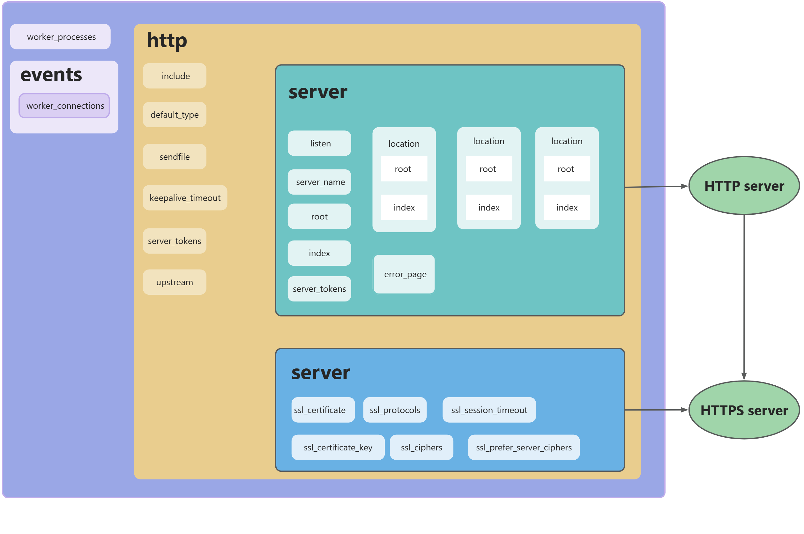

### 1、nginx-1.22.0\conf\nginx.conf

```bash

worker_processes  1;

events {
    worker_connections  1024;
}


http {
    include       mime.types;
    default_type  application/octet-stream;
    sendfile        on;
    keepalive_timeout  65;

    # 隐藏NGINX版本号
    server_tokens off;

    server {
        #server_name  47.112.246.205;

        listen 443 ssl;
        #配置HTTPS的默认访问端口为443。
        #如果未在此处配置HTTPS的默认访问端口，可能会造成Nginx无法启动。
        #如果您使用Nginx 1.15.0及以上版本，请使用listen 443 ssl代替listen 443和ssl on。
        server_name  serverName;
        root html;
        index index.html index.htm;
        # SSL相关配置
        ssl_certificate sslCertificate;  
        ssl_certificate_key sslCertificateKey; 
        ssl_session_timeout 5m;
        ssl_ciphers ssl_ciphers;
        #表示使用的加密套件的类型。
        ssl_protocols TLSv1.1 TLSv1.2 TLSv1.3; #表示使用的TLS协议的类型，您需要自行评估是否配置TLSv1.1协议。
        ssl_prefer_server_ciphers on;

        server_tokens off;

        location / {
            root         "D:\front-study\front\front-study";
            index        index.html;
        }              

        # redirect server error pages to the static page /50x.html
        #
        error_page   500 502 503 504  /50x.html;
        location = /50x.html {
            root   html;
        }
    }
}

```



### 2、配置SSL

将证书放到`nginx-1.22.0\conf\cert`文件夹下。