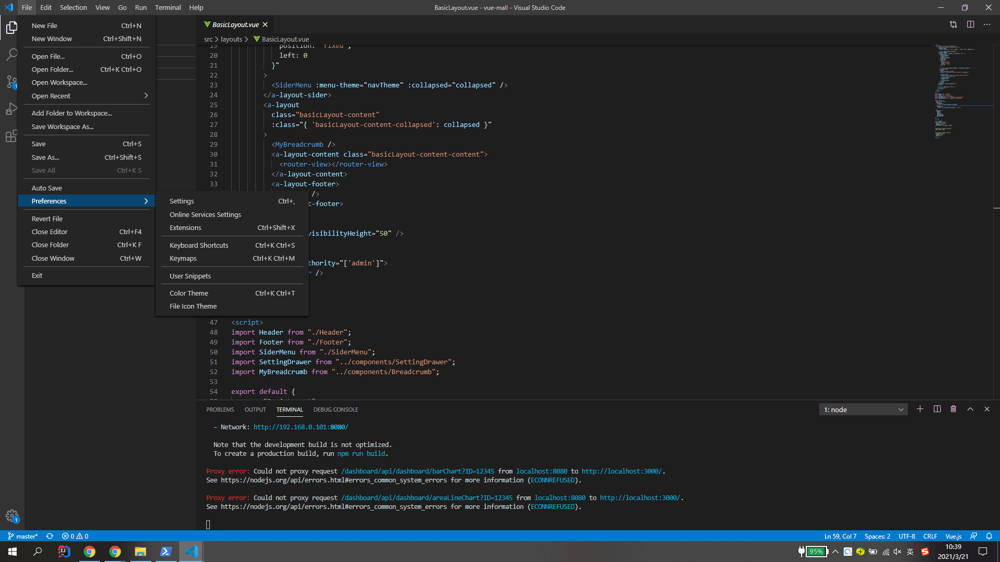
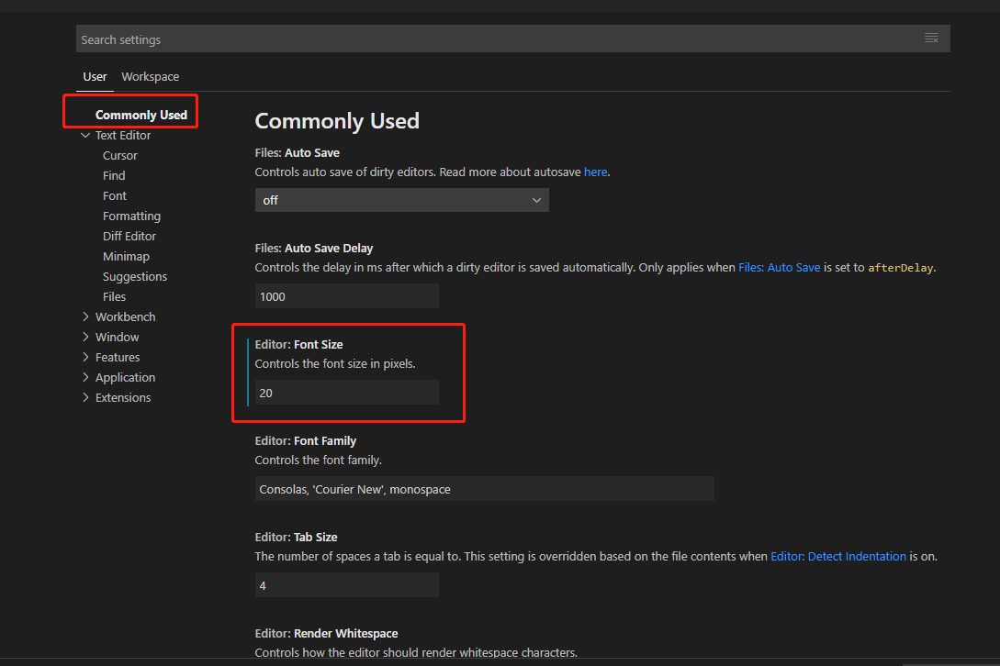
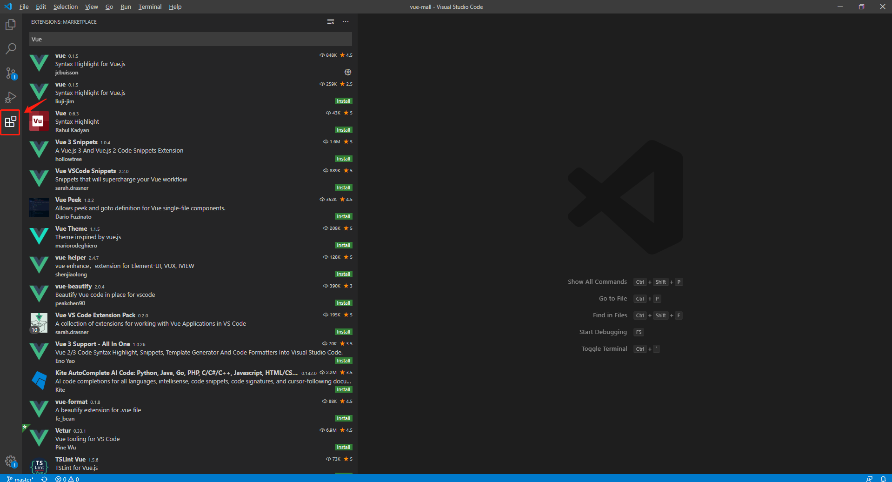
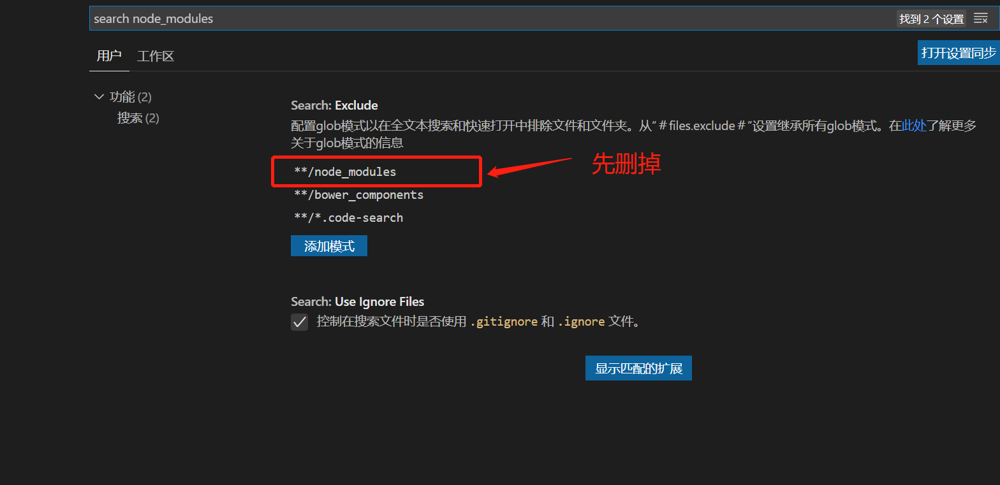
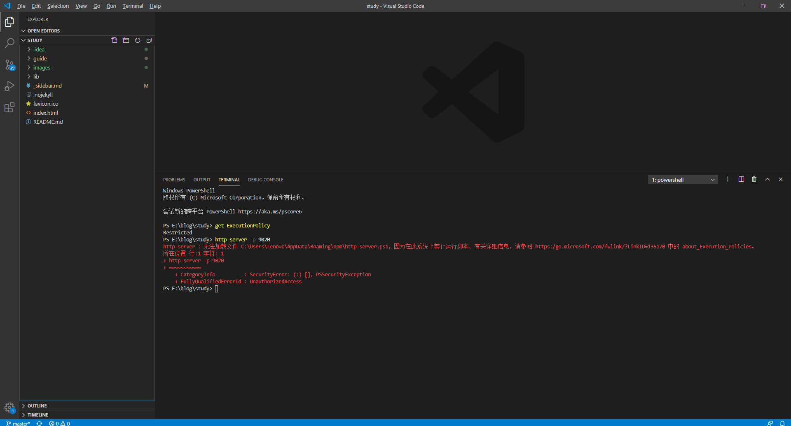
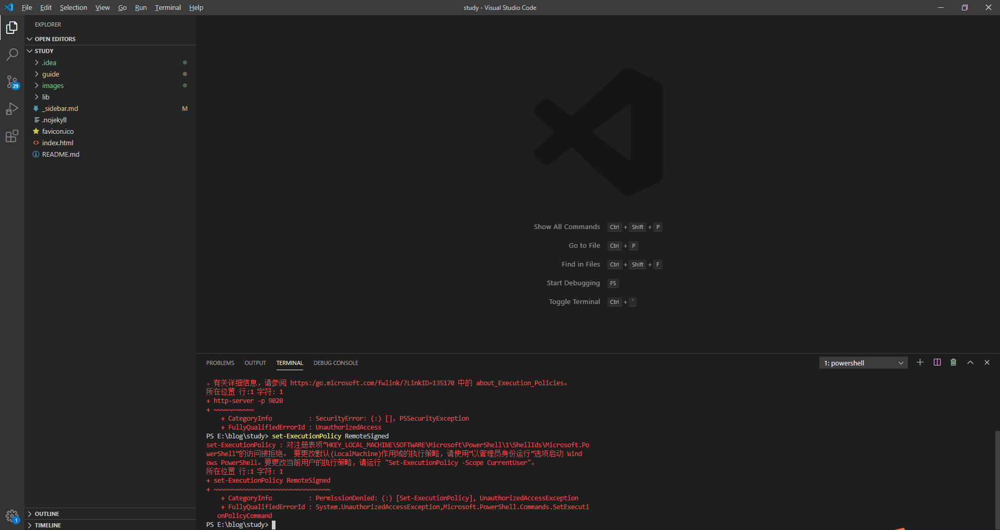
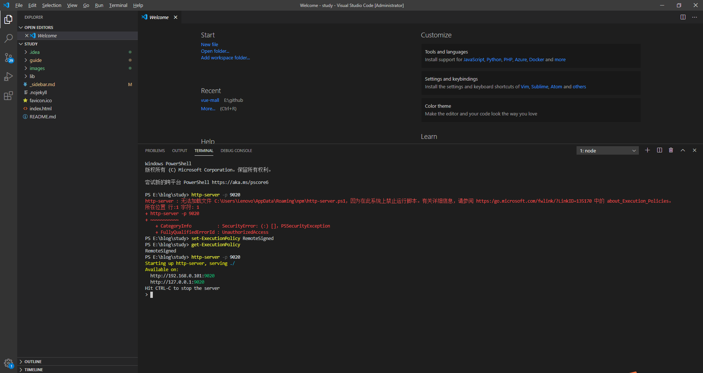
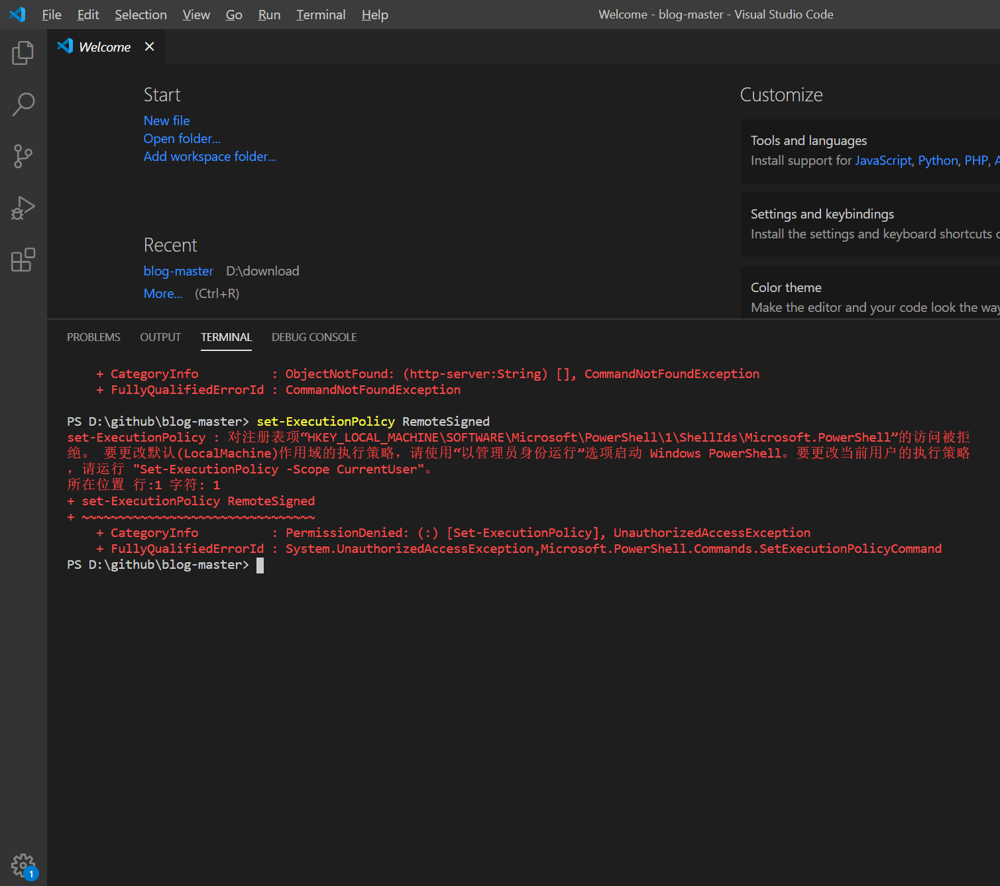

### 一、VisualStudioCode 常用快捷键

#### 1、根据文件名查找文件

ctrl-p

#### 2、根据内容查找

ctrl-shift-f

#### 3、定位到某一行

ctrl-g

#### 4、html:5 快速生成html

### 二、常用设置

#### 1、设置字体大小

#### 2、代码高亮显示

安装相应插件，如`Vue`等。

#### 3、查找`node_modules`文件

依次进入File -> Preferences -> Settings，搜索`search node_modules` -> User -> Features -> Search，删掉`**/node_modules`，如下图所示：

VisualStudioCode-9

### 三、问题处理

**1、无法执行脚本**

**注意：VisualStudioCode需要以管理员身份运行**

**2、对注册表项“HKEY_LOCAL_MACHINE\SOFTWARE\Microsoft\PowerShell\1\ShellIds\Microsoft.PowerShell”的访问被拒绝**

**解决方法：** 按照提示，依次输入`Set-ExecutionPolicy -Scope CurrentUser`和`RemoteSigned`即可。

**参考：**

[解决VSCODE 因为在此系统上禁止运行脚本 报错](https://blog.csdn.net/u013654125/article/details/106127753)