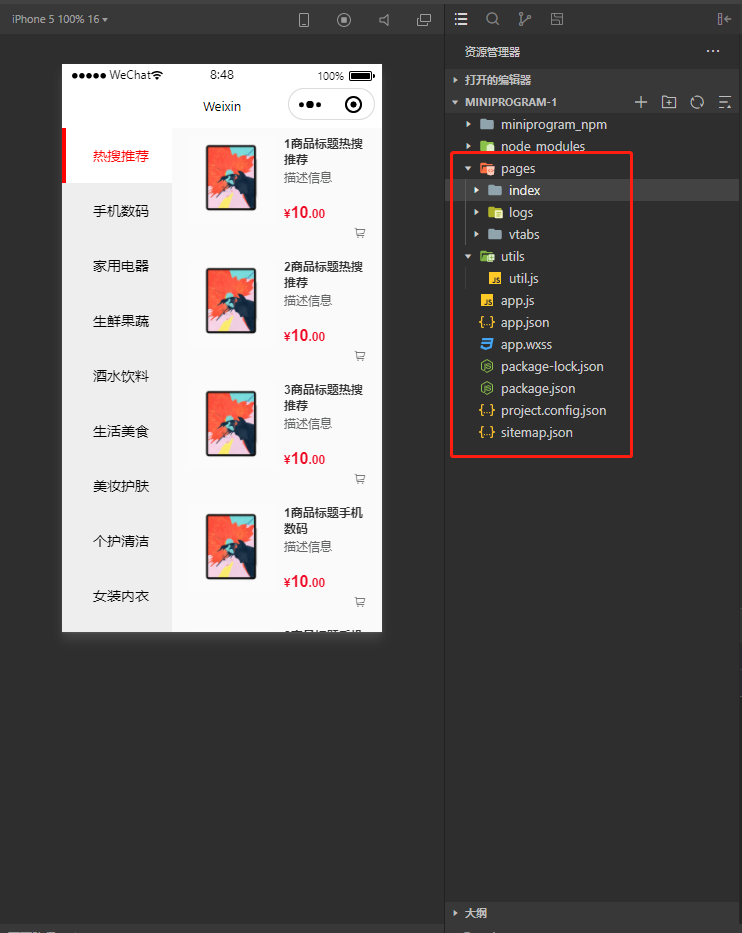
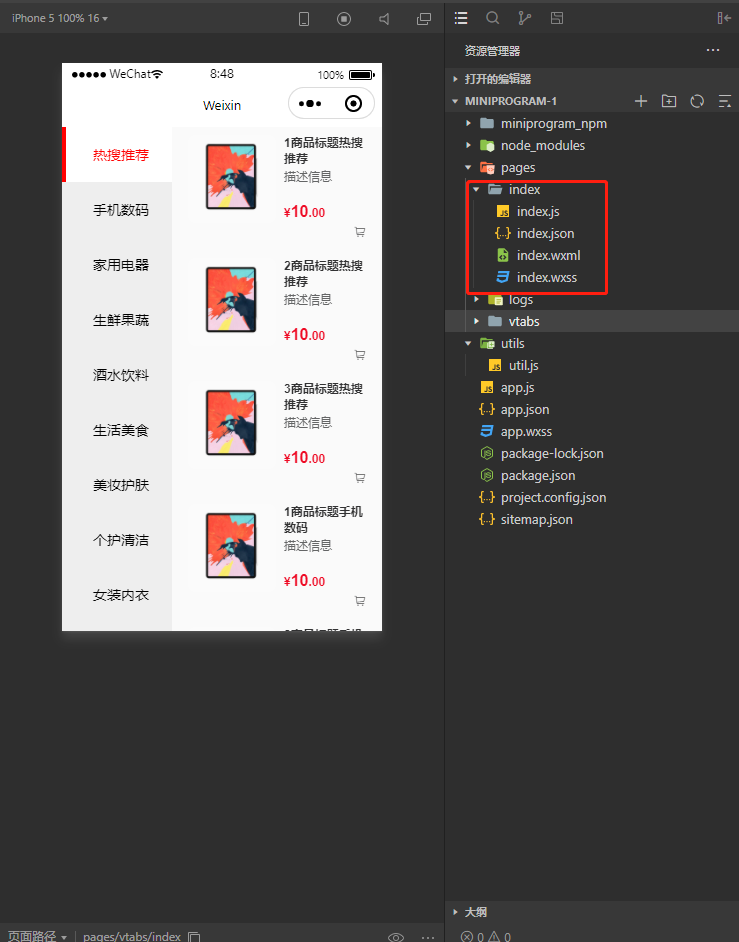

### 一、文件结构

#### 1、pages

`pages`目录用于存放页面文件，下面有多个文件夹，区分不同模块。

##### 1.1 index.js

```javascript
// pages/home/index.js
Page({

    /**
     * 页面的初始数据
     */
    data: {

    },

    /**
     * 生命周期函数--监听页面加载
     */
    onLoad: function (options) {

    },

    /**
     * 生命周期函数--监听页面初次渲染完成
     */
    onReady: function () {

    },

    /**
     * 生命周期函数--监听页面显示
     */
    onShow: function () {

    },

    /**
     * 生命周期函数--监听页面隐藏
     */
    onHide: function () {

    },

    /**
     * 生命周期函数--监听页面卸载
     */
    onUnload: function () {

    },

    /**
     * 页面相关事件处理函数--监听用户下拉动作
     */
    onPullDownRefresh: function () {

    },

    /**
     * 页面上拉触底事件的处理函数
     */
    onReachBottom: function () {

    },

    /**
     * 用户点击右上角分享
     */
    onShareAppMessage: function () {

    }
})
```

##### 1.2 index.json

```json
{
  "usingComponents": {}
}
```

[小程序配置-页面配置](https://developers.weixin.qq.com/miniprogram/dev/reference/configuration/page.html)

##### 1.3 index.wxml

```wxml
<!--index.wxml-->
<view class="container">
  <view class="userinfo">
    <block wx:if="{{canIUseOpenData}}">
      <view class="userinfo-avatar" bindtap="bindViewTap">
        <open-data type="userAvatarUrl"></open-data>
      </view>
      <open-data type="userNickName"></open-data>
    </block>
    <block wx:elif="{{!hasUserInfo}}">
      <button wx:if="{{canIUseGetUserProfile}}" bindtap="getUserProfile"> 获取头像昵称 </button>
      <button wx:elif="{{canIUse}}" open-type="getUserInfo" bindgetuserinfo="getUserInfo"> 获取头像昵称 </button>
      <view wx:else> 请使用1.4.4及以上版本基础库 </view>
    </block>
    <block wx:else>
      <image bindtap="bindViewTap" class="userinfo-avatar" src="{{userInfo.avatarUrl}}" mode="cover"></image>
      <text class="userinfo-nickname">{{userInfo.nickName}}</text>
    </block>
  </view>
  <view class="usermotto">
    <!-- <text class="user-motto">{{motto}}</text> -->

    <van-button type="primary">按钮</van-button>
  </view>
</view>
```

##### 1.4 index.wxss

```wxss
/**index.wxss**/
.userinfo {
  display: flex;
  flex-direction: column;
  align-items: center;
  color: #aaa;
}

.userinfo-avatar {
  overflow: hidden;
  width: 128rpx;
  height: 128rpx;
  margin: 20rpx;
  border-radius: 50%;
}

.usermotto {
  margin-top: 200px;
}
```

#### 2、utils

`utils`目录用于存放工具类。

```javascript
const formatTime = date => {
  const year = date.getFullYear()
  const month = date.getMonth() + 1
  const day = date.getDate()
  const hour = date.getHours()
  const minute = date.getMinutes()
  const second = date.getSeconds()

  return `${[year, month, day].map(formatNumber).join('/')} ${[hour, minute, second].map(formatNumber).join(':')}`
}

const formatNumber = n => {
  n = n.toString()
  return n[1] ? n : `0${n}`
}

module.exports = {
  formatTime
}
```

#### 3、app.js

`app.js`是入口文件。

```javascript
// app.js
App({
  onLaunch() {
    // 展示本地存储能力
    const logs = wx.getStorageSync('logs') || []
    logs.unshift(Date.now())
    wx.setStorageSync('logs', logs)

    // 登录
    wx.login({
      success: res => {
        // 发送 res.code 到后台换取 openId, sessionKey, unionId
      }
    })
  },
  globalData: {
    userInfo: null
  }
})
```

#### 4、app.json

```json
{
  // 需要展现的页面，默认加载数组里的第一个
  "pages":[
    "pages/vtabs/index",
    "pages/index/index",
    "pages/logs/logs"
  ],
  // 配置信息
  "window":{
    "backgroundTextStyle":"light",
    "navigationBarBackgroundColor": "#fff",
    "navigationBarTitleText": "Weixin",
    "navigationBarTextStyle":"black"
  },
  "sitemapLocation": "sitemap.json",
  "useExtendedLib": {
    "weui": true
  }
}
```

[小程序配置-全局配置](https://developers.weixin.qq.com/miniprogram/dev/reference/configuration/app.html)

#### 5、app.wxss

`app.wxss`是全局样式文件。

```css
/**app.wxss**/
.container {
  height: 100%;
  display: flex;
  flex-direction: column;
  align-items: center;
  justify-content: space-between;
  padding: 200rpx 0;
  box-sizing: border-box;
}
```

#### 6、project.config.json

`project.config.json`用于存放项目配置信息。

```json
{
    "description": "项目配置文件",
    "packOptions": {
        "ignore": []
    },
    "setting": {
        "urlCheck": false,
        "es6": true,
        "enhance": false,
        "postcss": true,
        "preloadBackgroundData": false,
        "minified": true,
        "newFeature": false,
        "coverView": true,
        "nodeModules": true,
        "autoAudits": false,
        "showShadowRootInWxmlPanel": true,
        "scopeDataCheck": false,
        "uglifyFileName": false,
        "checkInvalidKey": true,
        "checkSiteMap": true,
        "uploadWithSourceMap": true,
        "compileHotReLoad": false,
        "useMultiFrameRuntime": true,
        "useApiHook": true,
        "useApiHostProcess": true,
        "babelSetting": {
            "ignore": [],
            "disablePlugins": [],
            "outputPath": ""
        },
        "enableEngineNative": false,
        "bundle": false,
        "useIsolateContext": true,
        "useCompilerModule": true,
        "userConfirmedUseCompilerModuleSwitch": false,
        "userConfirmedBundleSwitch": false,
        "packNpmManually": true,
        "packNpmRelationList": [
            {
                "packageJsonPath": "./package.json",
                "miniprogramNpmDistDir": "./"
            }
        ],
        "minifyWXSS": true
    },
    "compileType": "miniprogram",
    "libVersion": "2.21.3",
    "appid": "wxf5c50e17a4d1f950",
    "projectname": "miniprogram-1",
    "debugOptions": {
        "hidedInDevtools": []
    },
    "scripts": {},
    "staticServerOptions": {
        "baseURL": "",
        "servePath": ""
    },
    "isGameTourist": false,
    "condition": {
        "search": {
            "list": []
        },
        "conversation": {
            "list": []
        },
        "game": {
            "list": []
        },
        "plugin": {
            "list": []
        },
        "gamePlugin": {
            "list": []
        },
        "miniprogram": {
            "list": []
        }
    }
}
```

#### 7、sitemap.json

[小程序配置-sitemap配置](https://developers.weixin.qq.com/miniprogram/dev/reference/configuration/sitemap.html)

#### 8、component

##### 8.1 index.js

```javascript
Component({
    /**
     * 组件的属性列表
     */
    properties: {

    },

    /**
     * 组件的初始数据
     */
    data: {

    },

    /**
     * 组件的方法列表
     */
    methods: {

    }
})
```

#### 9、附图





### 二、基本语法

#### 1、WXML基本语法

##### 1.1 数据绑定

```wxml
<view> {{message}} </view>
```

```javascript
Page({
  data: {
    message: 'Hello MINA!'
  }
})
```

##### 1.2 列表渲染

```wxml
<!--wxml-->
<view wx:for="{{array}}"> {{item}} </view>
```

```javascript
Page({
  data: {
    array: [1, 2, 3, 4, 5]
  }
})
```

##### 1.3 条件渲染

```wxml
<!--wxml-->
<view wx:if="{{view == 'WEBVIEW'}}"> WEBVIEW </view>
<view wx:elif="{{view == 'APP'}}"> APP </view>
<view wx:else="{{view == 'MINA'}}"> MINA </view>
```

```javascript
Page({
  data: {
    view: 'MINA'
  }
})
```

##### 1.4 模板

```wxml
<!--wxml-->
<template name="staffName">
  <view>
    FirstName: {{firstName}}, LastName: {{lastName}}
  </view>
</template>

<template is="staffName" data="{{...staffA}}"></template>
<template is="staffName" data="{{...staffB}}"></template>
<template is="staffName" data="{{...staffC}}"></template>
```

```javascript
// page.js
Page({
  data: {
    staffA: {firstName: 'Hulk', lastName: 'Hu'},
    staffB: {firstName: 'Shang', lastName: 'You'},
    staffC: {firstName: 'Gideon', lastName: 'Lin'}
  }
})
```

[WXML语法参考](https://developers.weixin.qq.com/miniprogram/dev/reference/wxml/)

#### 2、WXS基本语法