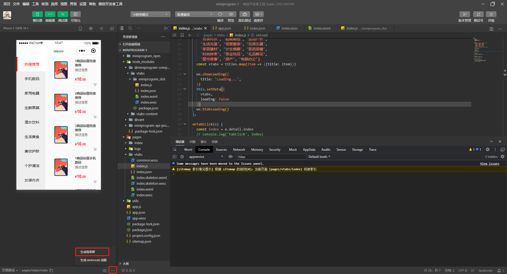
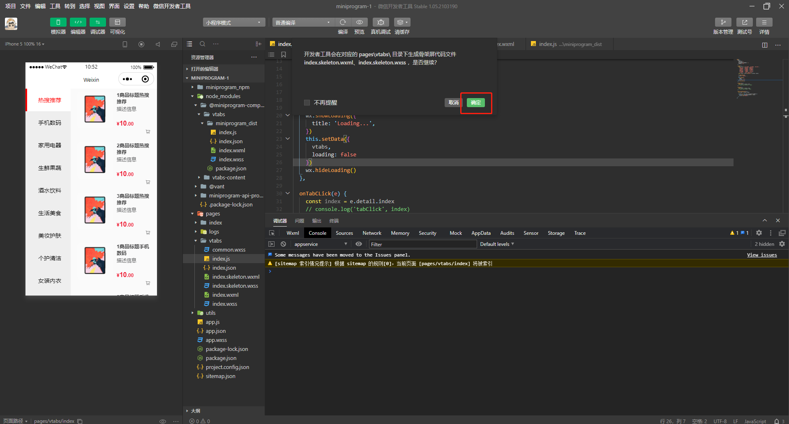
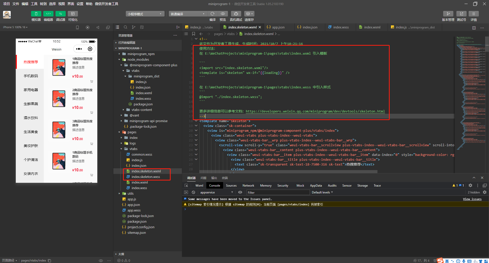
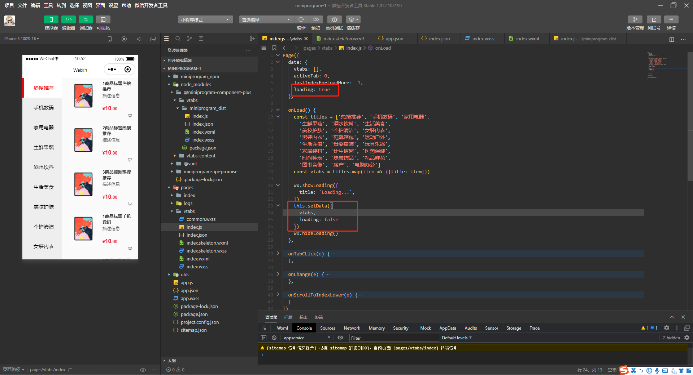
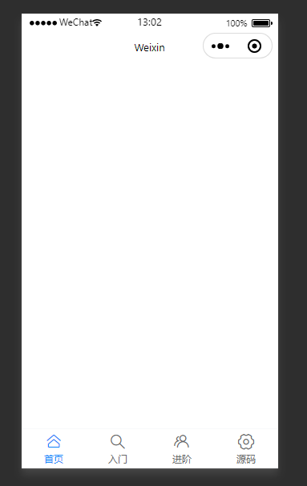

### 一、骨架屏效果









### 二、tab-bar效果

#### 1、引入vant-tabbar

**注意：** 需要先安装[@vant/weapp](https://youzan.github.io/vant-weapp/#/quickstart)

```json
// app.json
{
    "usingComponents": {
        "van-tabbar": "@vant/weapp/tabbar/index",
        "van-tabbar-item": "@vant/weapp/tabbar-item/index"
    }
}
```

#### 2、添加`微信小程序-tabbar`

```json
// app.json
{
    "tabBar":{
        "custom":true,
        "list":[
            {
                "pagePath":"pages/home/index",
                "text":"首页",
                "name": "home",
                "icon":"home-o"
            },
            {
                "pagePath":"pages/base/index",
                "text":"入门",
                "name": "base",
                "icon":"search"
            },
            {
                "pagePath":"pages/advanced/index",
                "text":"进阶",
                "name": "advanced",
                "icon":"friends-o"
            },
            {
                "pagePath":"pages/sourceCode/index",
                "text":"源码",
                "name": "sourceCode",
                "icon":"setting-o"
            }
        ]
    }
}
```

#### 3、封装`custom-tab-bar`组件

在微信小程序项目的根目录新建一个`custom-tab-bar`文件夹（路径和文件夹名称不能改），然后在文件夹中新建一个`Component`，会生成四个文件，分别是`index.js`、`index.json`、`index.wxml`和`index.wxss`。

##### 3.1、修改`index.js`

```javascript
// custom-tab-bar/index.js
Component({
    /**
     * 组件的属性列表
     */
    properties: {

    },

    /**
     * 组件的初始数据
     */
    data: {
        'active': "",
        "tabbarMap": {
            "home": {
                "pagePath": "pages/home/index"
            },
            "base": {
                "pagePath": "pages/base/index",
            },
            "advanced": {
                "pagePath": "pages/advanced/index"
            },
            "sourceCode": {
                "pagePath": "pages/sourceCode/index",
            }
        },
        'list': [{
                "text": "首页",
                "name": "home",
                "icon": "home-o"
            },
            {
                "text": "入门",
                "name": "base",
                "icon": "search"
            },
            {
                "text": "进阶",
                "name": "advanced",
                "icon": "friends-o"
            },
            {
                "text": "源码",
                "name": "sourceCode",
                "icon": "setting-o"
            }
        ]
    },

    /**
     * 组件的方法列表
     */
    methods: {
        onChange: function (event) {
            this.setData({
                active: event.detail
            })
            // 用于切换tab页
            wx.switchTab({
                url: "../../" + this.data.tabbarMap[event.detail].pagePath,
            })
        }
    }
})
```

##### 3.2、修改`index.wxml`

```wxml
<!--custom-tab-bar/index.wxml-->
<van-tabbar active="{{ active }}" bind:change="onChange">
  <van-tabbar-item
  wx:for="{{list}}"
  wx:key="index"
  name="{{item.name}}"
  icon="{{item.icon}}"
  data-path="{{item.pagePath}}">
    {{item.text}}
  </van-tabbar-item>
</van-tabbar>
```

#### 4、引用`custom-tab-bar`组件

```json
// pages/index/index.json
{
  "usingComponents": {
    "custom-tab-bar": "../../custom-tab-bar/index"
  }
}
```

```wxml
<!--pages/index/index.wxml-->
<view class="container">
    <custom-tab-bar></custom-tab-bar>
</view>
```

#### 5、tab-bar效果



**参考：**

[微信小程序 骨架屏](https://developers.weixin.qq.com/miniprogram/dev/devtools/skeleton.html)

[微信小程序 自定义tabbar](https://developers.weixin.qq.com/miniprogram/dev/framework/ability/custom-tabbar.html)