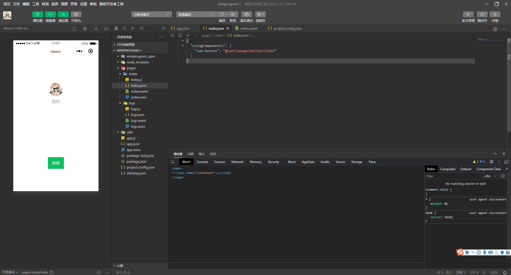

### 一、UI框架准备工作

#### 1、`@vant/weapp`

**（1）安装@vant/weapp**

```
npm i @vant/weapp -S --production
```


**（2）修改`app.json`**

去掉`"style": "v2"`

**（3）修改`project.config.json`**

```json
{
  ...
  "setting": {
    ...
    "packNpmManually": true,
    "packNpmRelationList": [
      {
        "packageJsonPath": "./package.json",
        "miniprogramNpmDistDir": "./"
      }
    ]
  }
}
```

#### 2、`weui`扩展组件

**（1）`vtabs`**

```
npm install @miniprogram-component-plus/vtabs --save

npm install @miniprogram-component-plus/vtabs-content --save
```

**（2）在`app.json`中引入`weui`**

```json
{ 
  "useExtendedLib": {
    "weui": true
  }
}
```


#### 3、构建npm


### 二、`@vant/weapp`组件的简单使用

#### 1、引入

打开`app.json`或对应页面的`json`文件：

```json
"usingComponents": {
  "van-button": "@vant/weapp/button/index"
}
```

#### 2、Button组件



**参考：**

[Vant Weapp](https://youzan.github.io/vant-weapp/#/home)

[Vant Weapp 快速上手](https://youzan.github.io/vant-weapp/#/quickstart)


### 三、`weui`扩展组件的简单使用

#### 1、`vtabs`

**（1）下载**[微信小程序扩展组件](https://github.com/wechat-miniprogram/miniprogram-component-plus)

```
git clone https://github.com/wechat-miniprogram/miniprogram-component-plus.git
```

**（2）安装依赖并编译**

```
npm install

npm run dev
```

**（3）拷贝`vtabs`文件夹**

拷贝`miniprogram_dev/example/vtabs`，放在微信小程序项目的`pages`文件夹下面，如图所示：


**（4）修改`vtabs`文件夹下的文件名**

**（5）修改`index.json`**

```json
{
  "usingComponents": {
    "mp-vtabs": "@miniprogram-component-plus/vtabs/index",
    "mp-vtabs-content": "@miniprogram-component-plus/vtabs-content/index"
  }
}
```

**（6）拷贝`common.wxss`**

拷贝`miniprogram_dev/example/common.wxss`，放在`pages/vtabs`文件夹下面

**（7）修改`index.wxss`中`common.wxss`的路径**

```
@import 'common.wxss';
```

**（8）修改`common.wxss`**

```
// 注释掉第一行的引入
/* @import '../components/weui-wxss/dist/style/weui.wxss'; */
```

**（9）在`app.json`中引入页面**

```json
{
  "pages":[
    "pages/vtabs/index",
  ],
  "useExtendedLib": {
    "weui": true
  }
}
```

**（10）编译**


**参考：**

[weui](https://developers.weixin.qq.com/miniprogram/dev/platform-capabilities/extended/weui/)

[weui 项目地址](https://github.com/wechat-miniprogram/weui-miniprogram)

[weui 官方文档](https://wechat-miniprogram.github.io/weui/docs/)