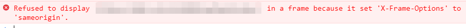
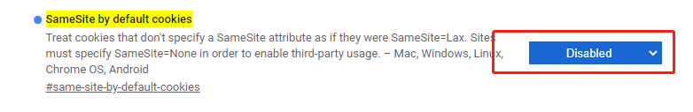

### 一、问题处理

#### 1. same-origin

**关键词：** `跨域`、`X-Frame-Options`、`same-origin`

**问题描述：**

嵌入第三方系统时，`console`控制台提示有`X-Frame-Options`设置，首先排查是否是第三方系统本身有该设置，其次检查浏览器。

**原因：**

`Chrome`升级之后，对防止跨域传送`cookie`做了设置，导致iframe无法嵌入。

**问题处理：**

访问 `chrome://flags/#same-site-by-default-cookies`，设置`SameSite by default cookies`的值为`disabled`

**参考：**

[chrome浏览器跨域Cookie的SameSite问题导致访问iframe内嵌页面异常](https://blog.csdn.net/yhyc812/article/details/108623844)

[Cookie 的 SameSite 属性](http://www.ruanyifeng.com/blog/2019/09/cookie-samesite.html)

#### 2. 播放声音

**关键词：** `audio`

**问题描述：**

使用`audio`标签时，无法自动播放声音，`console`控制台有如下提示。

**原因：**

`Chrome`升级之后，关闭了自动播放声音的设置，需要有用户交互时才能播放。

**问题处理：**

复制一个Chrome浏览器的快捷方式，右键属性，找到“目标”设置，在`Chrome.exe`后面加一个空格之后，添加`--autoplay-policy=no-user-gesture-required`，重启浏览器之后即可。

#### 3. font-size最小值

**关键词：** `font-size`

**原因：**

`Chrome`对css样式中的`font-size`有最小值限制。其中，`Chrome`版本92的最小值是12px，低版本的最小值可能会稍大一些。

**问题处理：**

**（1）方法一：**

打开`chrome://settings/fonts`，然后找到设置字体大小的选项，修改即可。