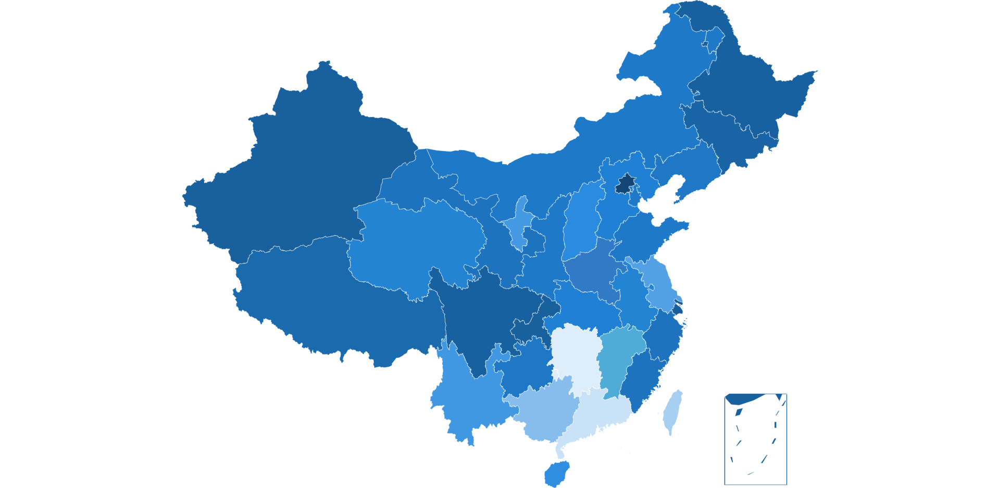

**Echarts常用效果速查（基于echarts3/echarts4）**

**（1）如无特殊说明，设置参数均从最顶层开始。**

**（2）如无特殊说明，未设置参数的表明该参数的设置具有通用性。**

### 一、柱状图

#### x轴

**（1）显示刻度、设置刻度**

**（2）显示label、设置label**

**（3）显示坐标轴名称、设置坐标轴名称**

#### y轴

**（1）显示刻度、设置刻度**

**（2）显示label、设置label**

**（3）显示坐标轴名称、设置坐标轴名称**

#### series

**注：** `series`支持传数组，也支持传对象

**（1）显示柱状图** `xAxis-type` `yAxis-type` `series-type`

```javascript
"xAxis": [
    {
        "type": "category"
    }
],
"yAxis": [
    {
        "type": "value"
    }
],
"series": [
    {
        "type": "bar"
    }
]
```

**（2）显示label、设置label**

#### tooltip

**（1）显示tooltip、设置tooltip**

**（2）tooltip文字对齐** `tooltip-textStyle-align`

```javascript
"tooltip" : {
    "textStyle": {
        "align": "left"
    }
},
```

**（3）tooltip位置** `tooltip-position`

```javascript
"tooltip" : {
    "position": "center",
},
```

#### 图例

**（1）显示图例、设置图例**

**（2）图例位置** `legend-orient` `legend-left` `legend-right` `legend-top` `legend-bottom`

```javascript
"legend": {
    "orient": 'vertical', // vertical 表示垂直，horizontal 表示水平
    "left": 10,
    "right": 10,
    "top": 10,
    "bottom": 10
}
```

**（3）图例滚动显示** `legend-type`

```javascript
"legend": {
    "type": "scroll"
}
```

**（4）图例文字样式** `legend-textStyle-color`

```javascript
"legend": {
    "textStyle": {
        "color": "#fff"
    }
}
```

**（5）图例换行显示**

```javascript
"legend": [
    {
        "data": ["上行移动", "上行联通", "上行电信"]
    },
    {
        "data": ["下行移动", "下行联通", "下行电信"],
        "y": 30
    }
]
```

### 二、条形图

#### x轴

**（1）显示刻度、设置刻度**

**（2）显示label、设置label**

**（3）显示坐标轴名称、设置坐标轴名称**

#### y轴

**（1）显示刻度、设置刻度**

**（2）显示label、设置label**

**（3）显示坐标轴名称、设置坐标轴名称**

#### series

**（1）显示条形图** `xAxis-type` `yAxis-type` `series-type`

```javascript
"xAxis": [
    {
        "type": "value"
    }
],
"yAxis": [
    {
        "type": "category"
    }
],
"series": [
    {
        "type": "bar"
    }
]
```

**（2）显示label、设置label**

**（3）渐变色** `series-itemStyle-normal`

```javascript
"series": [
    {
        "type": "bar",
        "itemStyle": {
            "normal": {
                "color": new echarts.graphic.LinearGradient(0, 0, 1, 0, [{
                    "offset": 0, color: "#0093ff" // 0% 处的颜色
                }, {
                   "offset": 1, color: "#00dff9" // 100% 处的颜色
                }])
            }
        },
    }
]
```

**（4）显示圆角** `series-type` `series-itemStyle-normal-barBorderRadius`

```javascript
"series": [
    {
        "type": "bar",
        "itemStyle": {
            "normal": {
                "barBorderRadius": [0, 10, 10, 0]
            }
        }
    }
]
```

**（5）设置阴影** `series-showBackground` `series-backgroundStyle-color`

```javascript
"series": [
    {
        "showBackground": true,
        "backgroundStyle": {
            "color": "102e57"
        },
    }
]
```

**（5）设置阴影圆角** `series-showBackground` `series-backgroundStyle-color` `series-backgroundStyle-borderRadius`

```javascript
"series": [
    {
        "showBackground": true,
        "backgroundStyle": {
            "color": "#102e57",
            "borderRadius": [0, 10, 10, 0]
        },
    }
]
```

#### tooltip

**（1）显示tooltip、设置tooltip**

#### 图例

**（1）显示图例、设置图例**

### 三、折线图

#### x轴

**（1）显示刻度、设置刻度**

**（2）显示label、设置label**

**（3）显示坐标轴名称、设置坐标轴名称**

**（4）刻度与值对齐** `xAxis-type` `xAxis-boundaryGap`

```javascript
"xAxis": [
    {
        "type": "category",
        "boundaryGap": false
    }
]
```

#### y轴

**（1）显示刻度、设置刻度** `yAxis-axisLabel` `yAxis-splitLine`

```javascript
"yAxis": [
    {
        "axisLabel": {
            "show": true,
            "textStyle": {
                "color": "#5993db"
            }
        },
        "splitLine": {
            "show": true,
            "lineStyle": {
                "color": "#1f447a", // 坐标轴颜色
                "type": "dashed" // 坐标轴刻度线显示类型：dashed 表示虚线
            }
        }
    }
]
```

**（2）显示label、设置label**

**（3）显示坐标轴名称、设置坐标轴名称**

#### series

**（1）显示折线图** `xAxis-type` `series-type`

```javascript
"xAxis": [
    {
        "type": "category"
    }
],
"series": [
    {
        "type": "line"
    }
]
```

**（2）显示label、设置label**

**（3）渐变色** `series-type` `series-areaStyle-normal`

```javascript
"series": [
    {
        "type": "line",
        "areaStyle": {
            "normal": {
                color: new echarts.graphic.LinearGradient(0, 0, 0, 1,[{
                    offset: 0, color: '#0d618d' // 0% 处的颜色
                }, {
                    offset: 1, color: '#103152' // 100% 处的颜色
                }]
            )
        }
    }
]
```
**（4）圆滑曲线**

```javascript
"series": [
    {
        "type": "line",
        "symbol": "none",
        "smooth": true
    }
]
```

#### tooltip

**（1）显示tooltip、设置tooltip**

#### 图例

**（1）显示图例、设置图例**

### 四、饼图（环形图）

#### series

**（1）显示饼图** `series-type`

```javascript
"series": [
    {
        "type": "pie"
    }
]
```

**（2）显示环形图** `series-type` `series-radius`

```javascript
"series": [
    {
        "type": "pie",
        "radius": ["60%", "80%"]
    }
]
```

#### legend

**（1）图例悬浮显示** `legend-tooltip-show`

```javascript
"legend": {
    "tooltip": {
        "show": true
    }
}
```

### 五、地图

#### 地图点位

**（1）点位显示图片** `series-type` `series-symbol`

```javascript
"series": [
    {
        "type": 'effectScatter',
        "symbol": "image://images/map-icon1.png",
        "symbolSize": 30,
    }
]
```

#### 地图区域

**（1）区域颜色** `geo-itemStyle` `geo-regions`

```javascript
"geo": {
    "itemStyle": {
        "normal": {
            "areaColor": "#18609e",
        },
        "emphasis": {
            "areaColor": "#18609e"
        }
    },
    "regions": [
        {
            "name": "黑龙江",
            "itemStyle": {
                "normal": {
                    "areaColor": "#1861a0",
                },
                "emphasis": {
                    "areaColor": "#1861a0"
                }
            },
        },
        {
            "name": "吉林",
            "itemStyle": {
                "normal": {
                    "areaColor": "#1964a5",
                },
                "emphasis": {
                    "areaColor": "#1964a5"
                }
            }
        }
    ]
}
```

**regions示例：**

```json
[
    {
        "name": "黑龙江",
        "itemStyle": {
            "normal": {
                "areaColor": "#1861a0"
            },
            "emphasis": {
                "areaColor": "#1861a0"
            }
        }
    },
    {
        "name": "吉林",
        "itemStyle": {
            "normal": {
                "areaColor": "#1964a5"
            },
            "emphasis": {
                "areaColor": "#1964a5"
            }
        }
    },
    {
        "name": "辽宁",
        "itemStyle": {
            "normal": {
                "areaColor": "#1e78c6"
            },
            "emphasis": {
                "areaColor": "#1e78c6"
            }
        }
    },
    {
        "name": "福建",
        "itemStyle": {
            "normal": {
                "areaColor": "#1d73be"
            },
            "emphasis": {
                "areaColor": "#1d73be"
            }
        }
    },
    {
        "name": "新疆",
        "itemStyle": {
            "normal": {
                "areaColor": "#18609e"
            },
            "emphasis": {
                "areaColor": "#18609e"
            }
        }
    },
    {
        "name": "西藏",
        "itemStyle": {
            "normal": {
                "areaColor": "#1a6aae"
            },
            "emphasis": {
                "areaColor": "#1a6aae"
            }
        }
    },
    {
        "name": "台湾",
        "itemStyle": {
            "normal": {
                "areaColor": "#a6cff2"
            },
            "emphasis": {
                "areaColor": "#a6cff2"
            }
        }
    },
    {
        "name": "广东",
        "itemStyle": {
            "normal": {
                "areaColor": "#cae2f7"
            },
            "emphasis": {
                "areaColor": "#cae2f7"
            }
        }
    },
    {
        "name": "海南",
        "itemStyle": {
            "normal": {
                "areaColor": "#2f8ee0"
            },
            "emphasis": {
                "areaColor": "#2f8ee0"
            }
        }
    },
    {
        "name": "云南",
        "itemStyle": {
            "normal": {
                "areaColor": "#4097e2"
            },
            "emphasis": {
                "areaColor": "#4097e2"
            }
        }
    },
    {
        "name": "内蒙古",
        "itemStyle": {
            "normal": {
                "areaColor": "#1e79c8"
            },
            "emphasis": {
                "areaColor": "#1e79c8"
            }
        }
    },
    {
        "name": "宁夏",
        "itemStyle": {
            "normal": {
                "areaColor": "#4499e3"
            },
            "emphasis": {
                "areaColor": "#4499e3"
            }
        }
    },
    {
        "name": "四川",
        "itemStyle": {
            "normal": {
                "areaColor": "#1861a0"
            },
            "emphasis": {
                "areaColor": "#1861a0"
            }
        }
    },
    {
         "name": "湖南",
         "itemStyle": {
            "normal": {
                "areaColor": "#deedfa"
            },
            "emphasis": {
                "areaColor": "#deedfa"
            }
         }
    },
    {
        "name": "江西",
        "itemStyle": {
            "normal": {
                "areaColor": "#4fabd7"
            },
            "emphasis": {
                "areaColor": "#4fabd7"
            }
        }
    },
    {
        "name": "江苏",
        "itemStyle": {
            "normal": {
                "areaColor": "#53a1e5"
            },
            "emphasis": {
                "areaColor": "#53a1e5"
            }
        }
    },
    {
        "name": "浙江",
            "itemStyle": {
                "normal": {
                    "areaColor": "#1d73be"
                },
                "emphasis": {
                    "areaColor": "#1d73be"
            }
        }
    },
    {
        "name": "上海",
        "itemStyle": {
            "normal": {
                "areaColor": "#175e9b"
            },
            "emphasis": {
                "areaColor": "#175e9b"
            }
        }
    },
    {
        "name": "广西",
        "itemStyle": {
            "normal": {
                "areaColor": "#86bded"
            },
            "emphasis": {
                "areaColor": "#86bded"
            }
        }
    },
    {
        "name": "河北",
        "itemStyle": {
            "normal": {
                "areaColor": "#2081d4"
            },
            "emphasis": {
                "areaColor": "#2081d4"
            }
        }
    },
    {
        "name": "山西",
        "itemStyle": {
            "normal": {
                "areaColor": "#2b8cdf"
            },
            "emphasis": {
                "areaColor": "#2b8cdf"
            }
        }
    },
    {
        "name": "青海",
        "itemStyle": {
            "normal": {
                "areaColor": "#2284d2"
            },
            "emphasis": {
                "areaColor": "#2284d2"
            }
        }
    },
    {
        "name": "湖北",
        "itemStyle": {
            "normal": {
                "areaColor": "#2080d3"
            },
            "emphasis": {
                "areaColor": "#2080d3"
            }
        }
    },
    {
        "name": "安徽",
        "itemStyle": {
            "normal": {
                "areaColor": "#2284d2"
            },
            "emphasis": {
                "areaColor": "#2284d2"
            }
        }
    },
    {
        "name": "香港",
        "itemStyle": {
            "normal": {
                "areaColor": "#cae2f7"
            },
            "emphasis": {
                "areaColor": "#cae2f7"
            }
        }
    },
    {
        "name": "澳门",
        "itemStyle": {
            "normal": {
                "areaColor": "#cae2f7"
            },
            "emphasis": {
                "areaColor": "#cae2f7"
            }
        }
    },
    {
        "name": "河南",
        "itemStyle": {
            "normal": {
                "areaColor": "#317ac7"
            },
            "emphasis": {
                "areaColor": "#317ac7"
            }
        }
    },
    {
        "name": "山东",
        "itemStyle": {
            "normal": {
                 "areaColor": "#1e79c8"
            },
            "emphasis": {
                "areaColor": "#1e79c8"
            }
        }
    },
    {
        "name": "陕西",
        "itemStyle": {
            "normal": {
                "areaColor": "#1e79c8"
            },
            "emphasis": {
                "areaColor": "#1e79c8"
            }
        }
    },
    {
        "name": "甘肃",
        "itemStyle": {
            "normal": {
                "areaColor": "#1d73be"
            },
            "emphasis": {
                "areaColor": "#1d73be"
            }
        }
    },
    {
        "name": "贵州",
        "itemStyle": {
            "normal": {
                "areaColor": "#1e78c5"
            },
            "emphasis": {
                "areaColor": "#1e78c5"
            }
        }
    },
    {
        "name": "北京",
        "itemStyle": {
            "normal": {
                "areaColor": "#124775"
            },
            "emphasis": {
                "areaColor": "#124775"
            }
        }
    },
    {
        "name": "天津",
        "itemStyle": {
            "normal": {
                "areaColor": "#1e79c9"
            },
            "emphasis": {
                "areaColor": "#1e79c9"
            }
        }
    },
    {
        "name": "重庆",
        "itemStyle": {
            "normal": {
                "areaColor": "#18609e"
            },
            "emphasis": {
                "areaColor": "#18609e"
            }
        }
    }
]
```

**效果图**



**（2）区域名字** `geo-label`

```javascript
"geo": {
    "label": {
        "normal": {
            "show": true,
            "color": "#fff",
            "fontSize": 15
        },
        "emphasis": {
            "show": true,
            "color": "#fff"
        }
    }
}
```