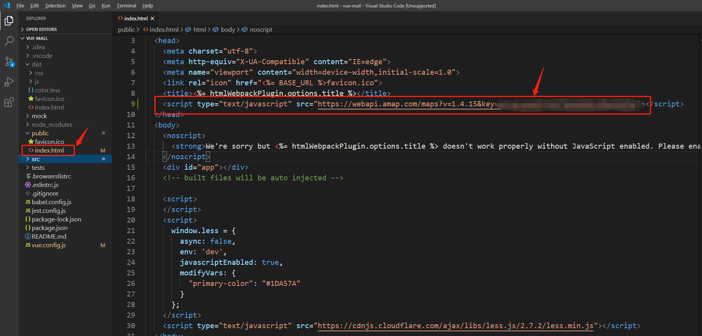
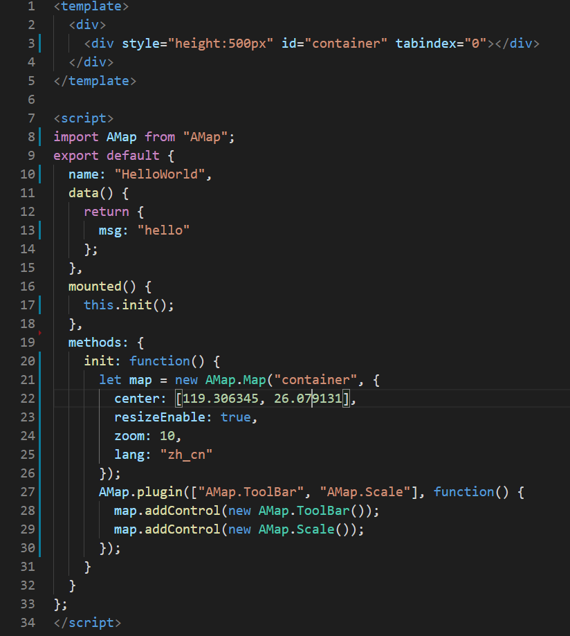
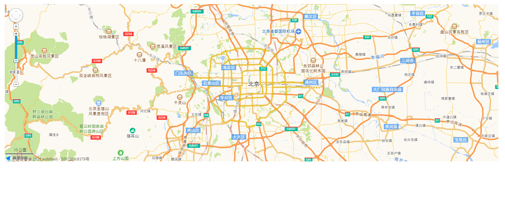

以`vue`+`高德地图`（版本为1.4.15）为例进行介绍。

### 一、引入及初始化

#### 1、在`index.html`中引入
`public\index.html`

```html
<script type="text/javascript" src="https://webapi.amap.com/maps?v=1.4.15&key=key值"></script> 
```



#### 2、引入`AMap`及初始化

```vue
<template>
  <div>
    <div style="height:500px" id="container" tabindex="0"></div>
  </div>
</template>

<script>
import AMap from "AMap";
export default {
  name: "HelloWorld",
  data() {
    return {
      msg: "hello"
    };
  },
  mounted() {
    this.init();
  },
  methods: {
    init: function() {
      let map = new AMap.Map("container", {
        center: [116.397428, 39.90923],
        resizeEnable: true,
        zoom: 10,
        lang: "zh_cn" // 英文的话是 en
      });
      AMap.plugin(["AMap.ToolBar", "AMap.Scale"], function() {
        map.addControl(new AMap.ToolBar());
        map.addControl(new AMap.Scale());
      });
    }
  }
};
</script>
```



#### 3、修改vue.config.js

```js
"configureWebpack": {
  "externals": {
      "AMap": "AMap"
    }
}
```

**效果图：**



**参考：**

[高德地图 JS API](https://developer.amap.com/api/javascript-api/guide/abc/prepare)