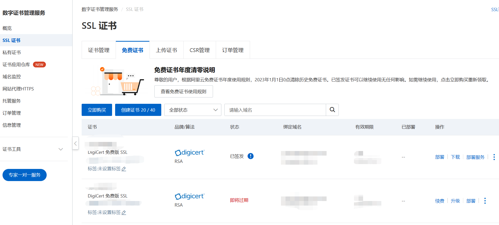
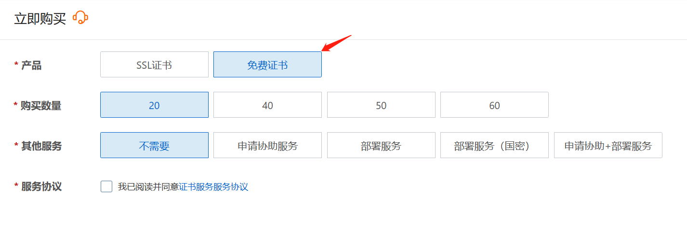
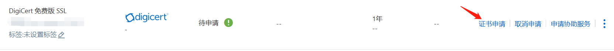
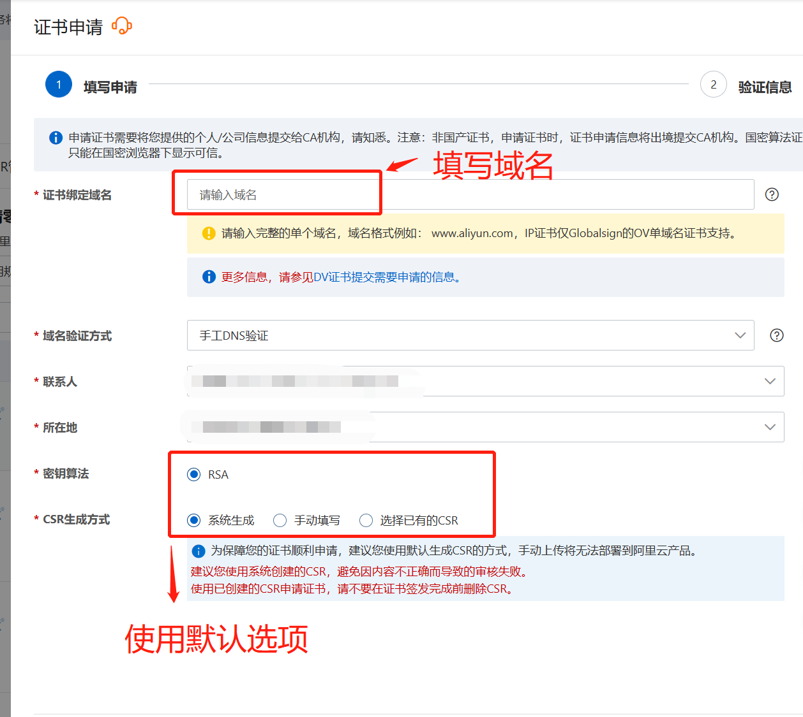
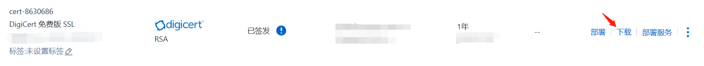
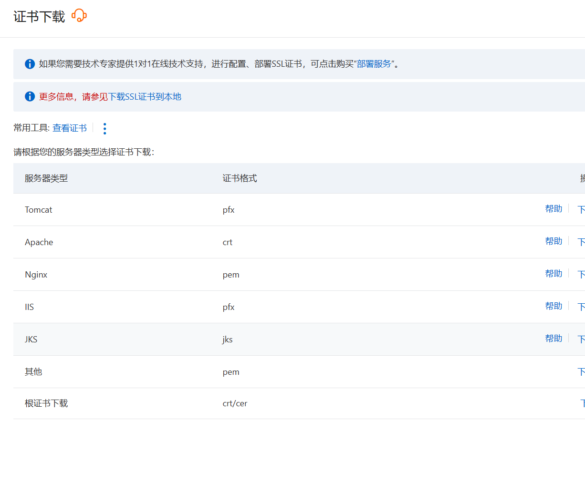
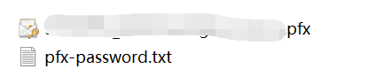
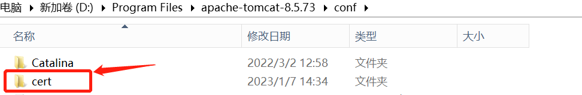

以阿里云为例，介绍SSL配置的步骤。

### 一、申请SSL证书

#### 1、访问SSL证书控制台

登录阿里云控制台，搜索SSL证书，进入SSL证书控制台。



#### 2、点击“立即购买”按钮

点击“立即购买”按钮，选择“免费证书”。



#### 3、点击“创建证书”按钮

#### 4、点击“证书申请”按钮



#### 5、填写信息，提交审核



#### 6、下载指定类型的证书





### 二、以tomcat为例，配置SSL证书

#### 1、解压证书

解压后会有两个文件，一个是pfx后缀的文件，一个是txt文件。



#### 2、tomcat目录添加一个cert目录

将解压后的证书放入到cert文件夹里面。



#### 3、修改同目录下的server.xml文件

```xml
<Connector port="443"   #port属性根据实际情况修改（HTTPS默认端口为443）。如果使用其他端口号，则您需要使用https://domain_name:port的方式来访问您的网站。
    protocol="HTTP/1.1"
    SSLEnabled="true"
    scheme="https"
    secure="true"
    keystoreFile="Tomcat安装目录/cert/domain_name.pfx" #证书名称前需加上证书的绝对路径，请使用您证书的文件名替换domain_name。
    keystoreType="PKCS12"
    keystorePass="证书密码"  #请替换为密码文件pfx-password.txt中的内容。
    clientAuth="false"
    SSLProtocol="TLSv1.1+TLSv1.2+TLSv1.3"
    ciphers="TLS_RSA_WITH_AES_128_CBC_SHA,TLS_RSA_WITH_AES_256_CBC_SHA,TLS_ECDHE_RSA_WITH_AES_128_CBC_SHA,TLS_ECDHE_RSA_WITH_AES_128_CBC_SHA256,TLS_RSA_WITH_AES_128_CBC_SHA256,TLS_RSA_WITH_AES_256_CBC_SHA256"/>
```

#### 4、启动tomcat，使用https访问验证是否配置成功

