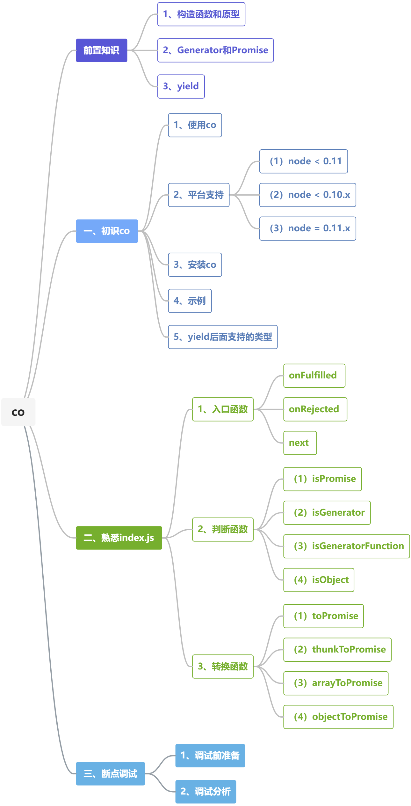
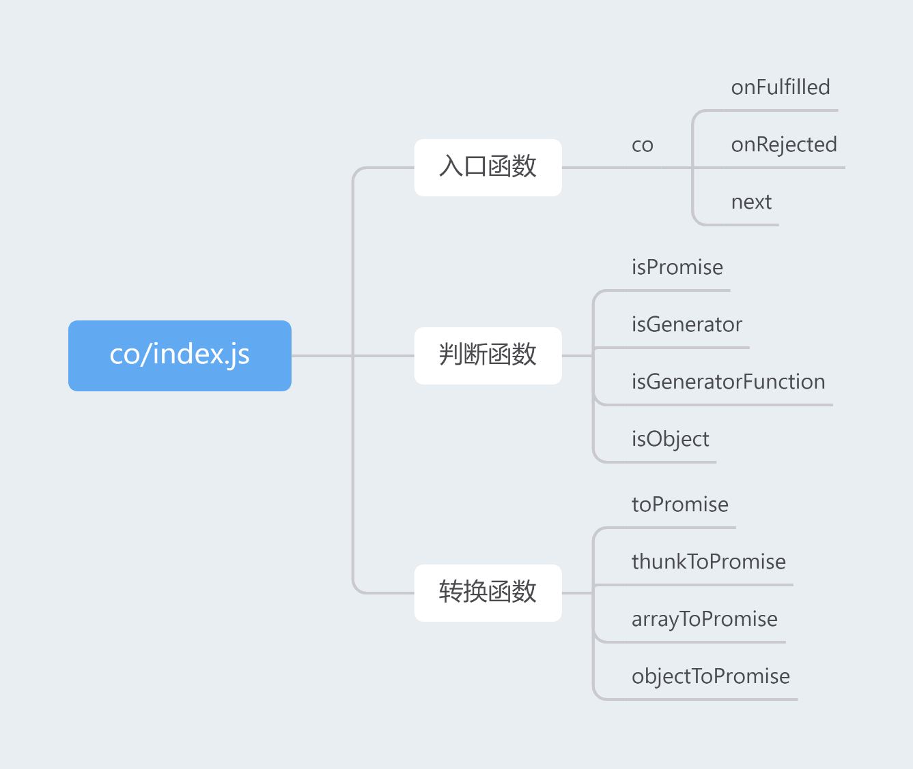
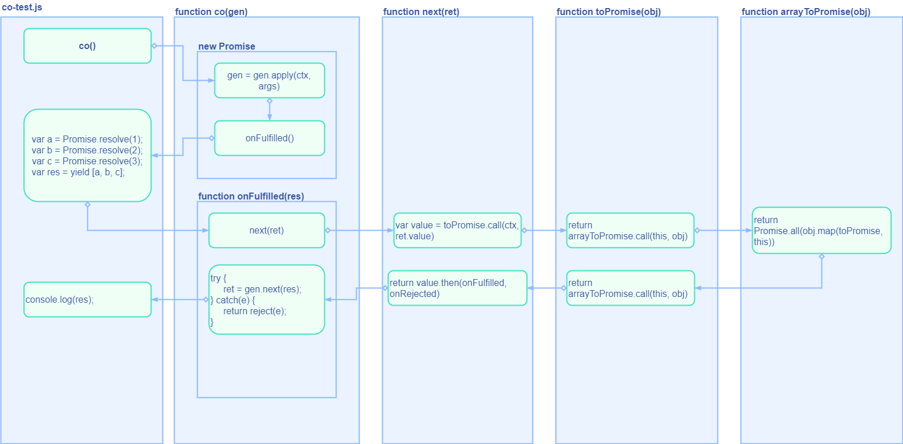

### 第四期 | co

【纪年】co源码解读：https://www.yuque.com/ruochuan12/group9/zihtiq

【明海Zzzz】co 源码解析：https://juejin.cn/post/6844903472362422286

本篇源码笔记是第四期，通过阅读和调试`co/index.js`熟悉了`co`的基本使用和调用流程。

**本期源码阅读的收获如下：**

（1）阅读一段没有接触过的源码之前，一定要阅读`Readme.md`，从`Readme.md`中可以得到许多有用的信息，比如它用来实现什么功能，拿到代码之后如何进行初始化，如何调用里面的方法，使用它之前需要有哪些环境依赖等等。同时，一定要注意阅读这部分源码之前，是否有前置知识，这些前置知识是否会影响自己接下来的阅读，自己是否对这些前置知识有一定的了解，是否需要先补充这部分的前置知识。

（2）如果阅读了`Readme.md`之后还是无从下手，可以再去查阅一些资料。

（3）熟悉了`vscode`的调试技巧。

（4）拿到一份源码文件之后，如果源码行数不多（比如`co/index.js`只有240行），可以先通读整份源码，掌握源码的大概结构，将源码里面定义的方法做个简单的归纳，使自己有个大致的了解之后，再去逐一断点调试。以`co/index.js`为例，按照自己的理解，

**toXXX** 一般就是将传入的值转换成另外一个类型之后返回；

**isXXX** 一般就是对传入的值进行某种判断，比如判断是不是`Object`,是不是`Promise`，是不是`Array`等等。

**本期源码阅读的不足之处：**

由于自己对`co`比较陌生，虽然通过断点逐步调试，了解了`co`是如何使用的，但对`co`的作用和原理还理解不够透彻，需要慢慢吸收。



### 前置知识

#### 1、`构造函数`和`原型`

[还在问什么是JavaScript构造函数、实例、原型对象以及原型链？看完这篇你就懂](https://juejin.cn/post/6864168067182968839)

[你还没搞懂this？](https://github.com/ljianshu/Blog/issues/7)

#### 2、`Generator`和`Promise`

关于`Generator`和`Promise`，推荐[阮一峰 ECMAScript 6 入门](https://es6.ruanyifeng.com/)中的两篇内容：

[Generator 函数的语法](https://es6.ruanyifeng.com/?search=yield&x=0&y=0#docs/generator)

[Promise 对象](https://es6.ruanyifeng.com/?search=yield&x=0&y=0#docs/promise)

#### 3、`yield`

[MDN yield](https://developer.mozilla.org/zh-CN/docs/Web/JavaScript/Reference/Operators/yield)

### 一、初识co

`Readme.md`

#### 1、使用co

```js
co(function() {
    var result = yield Promise.resolve(true);
    return result;
}).then(function(value) {
    console.log(value);
}, function(err) {
    console.log(err.stack);
})
```

```js
var fn = co.wrap(function(val) {
    return yield Promise.resolve(val);
});

fn(true).then(function(val) {

});
```

#### 2、平台支持

**（1）`node < 0.11`**

需要实现`Promise`

**（2）`node < 0.10.x`**

如果没有`generator`的支持，需要使用`gnode`或`regenerator`

**（3）`node = 0.11.x`**

必须使用`--harmony-generators` flag 或是`--harmony`

#### 3、安装co

```
$ npm install co
```

#### 4、示例

```js
var co = require('co');

co(function *() {
    var result = yield Promise.resolve(true);
}).catch(onerror);

co(function *(){
    var a = Promise.resolve(1);
    var b = Promise.resolve(2);
    var c = Promise.resolve(3);
    var res = yield [a, b, c];
    console.log(res);
}).catch(onerror);

co(function *() {
    try {
        yield Promise.reject(new Error('boom'));
    } catch (err) {
        console.log(err.message);
    }
}).catch(onerror);

function onerror(err) {
    console.err(err.stack);
}
```

#### 5、yield后面支持的类型

**（1）promise**

**（2）thunks**

**（3）array**

```js
co(function* () {
    var res = yield [
        Promise.resolve(1),
        Promise.resolve(2),
        Promise.resolve(3)
    ];
    console.log(res);
}).catch(onerror);
```

**（4）objects**

```js
co(function* () {
    var res = yield {
        1: Promise.resolve(1),
        2: Promise.resolve(2)
    };
    console.log(res);
}).catch(onerror);
```

**（5）generators**

**（6）generator functions**

### 二、熟悉`index.js`



[幕布 co/index.js](https://www.mubucm.com/doc/3OmeUOAJPbb)

#### 定义变量

```js
var slice = Array.prototype.slice;
```

#### 1、入口函数

```js
// 执行 生成器函数 或 生成器，返回一个promise
function co (gen) {
    var ctx = this;
    var args = slice.call(arguments, 1);

    return new Promise(function(resolve, reject) {
        // 判断传入的值 是否是一个 函数
        if (typeof gen === 'function') gen = gen.apply(ctx, args);
        if (!gen || typeof gen !== 'function') return resolve(gen);

        onFulfilled();
    })

    function onFulfilled (res) {
        var ret;
        try {
            ret = gen.next(res);
        } catch (e) {
            return reject(e);
        }
        next(ret);
        return null;
    }

    function onRejected (res) {
        var ret;
        try {
            ret = gen.throw(err);
        } catch (e) {
            return reject(e);
        }
        next(ret);
    }

    function next (ret) {
        if (ret.done) return resolve(ret.value);
        var value = toPromise.call(ctx, ret.value);
        if (value && isPromise(value)) return value.then(onFulfilled, onRejected);
        return onRejected(new TypeError('You may only yield a function, promise, generator, array, or object，'
            + ' but the followig object was passed："' + String(ret.value) + '"'));
    }
}
```

#### 2、判断函数

##### （1）`isPromise`

**判断是否是`promise`：** `obj.then`是一个`function`；

```js
function isPromise (obj) {
    return 'function' == typeof obj.then;
}
```

##### （2）`isGenerator`

**判断是否是`generator`：**  `obj.next`是一个`function`；`obj.throw`是一个`function`；

```js
function isGenerator (obj) {
    return 'function' == typeof obj.next && 'function' == typeof obj.throw;
}
```

##### （3）`isGeneratorFunction`

**判断是否是`generator Function`：**

**依据1：** `obj.constructor.name`或`obj.constructor.displayName`的值是`GeneratorFunction`；

注：即`obj`构造函数的`name`或`displayName`的值是`GeneratorFunction`；

**依据2：** `constructor.prototype.next`是一个`function`；`constructor.prototype.throw`是一个`function`；

注：即`obj`原型对象的`next`和`throw`均为`function`；

```js
function isGeneratorFunction (obj) {
    var constructor = obj.constructor;
    if(!constructor) return false;
    if('GeneratorFunction' === constructor.name || 'GeneratorFunction' === constructor.displayName) return true;
    return isGenerator(constructor.prototype);
}
```

##### （4）`isObject`

**判断是否是`object`：** `val.constructor`是`Object`

注：即`val`的构造函数是`Object`

```js
function isObject(val) {
    return Object === val.constructor;
}
```

#### 3、转换函数

##### （1）`toPromise`

```js
function toPromise (obj) {
    if (!obj) return obj;
    // 判断 obj.then 是否是 function
    if (isPromise(obj)) return obj;
    // 判断 obj 是否是 GeneratorFunction 或 Generator
    if (isGeneratorFunction(obj) || isGenerator(obj)) return co.call(this, obj);
    // 判断 obj 是否是 function
    if ('function' == typeof obj) return thunkToPromise.call(this, obj);
    // 判断 obj 是否是数组
    if (Array.isArray(obj)) return arrayToPromise.call(this, obj);
    // 判断 obj 是否是 Object
    if (isObject(obj)) return objectToPromise.call(this, obj);
    return obj;
}
```

##### （2）`thunkToPromise`

```js
function thunkToPromise (fn) {
    var ctx = this;
    return new Promise(function(resolve, reject) {
        fn.call(ctx, function(err, res) {
            if (err) return reject(err);
            if (arguments.length > 2) res = slice.call(arguments, 1);
            resolve(res);
        })
    })
}
```

##### （3）`arrayToPromise`

```js
function arrayToPromise (obj) {
    return Promise.all(obj.map(toPromise, this));
}
```

##### （4）`objectToPromise`

```js
function objectToPromise (obj) {
    var results = new obj.constructor();
    var keys = Object.keys(obj);
    var promises = [];
    for (var i = 0; i < keys.length; i++) {
        var key = keys[i];
        var promise = toPromise.call(this, obj[key]);
        if (promise && isPromise(promise)) defer(promise, key);
        else results[key] = obj[key];
    }
    return Promise.all(promise).then(function () {
        return results;
    })

    function defer (promise, key) {
        results[key] = undefined;
        promises.push(promise.then(function (res) {
            results[key] = res;
        }));
    }
}
```

### 三、断点调试

#### 1、调试前准备

##### （1）新建`.vscode`文件夹

##### （2）新建`launch.json`

`launch.json`放在`.vscode`文件夹下。

```json
{
    "version": "0.2.0",
    "configurations": [
        {
            "type": "node",
            "request": "launch",
            "name": "co调试",
            "skipFiles": [
                "<node_internals>/**"
            ],
            // 调试js 在当前打开目录下的路径
            "program": "${workspaceFolder}/src/router/workbench/index.js",
        }
    ]
}
```

##### （3）`F5`开启调试

#### 2、调试分析

##### （1）数组



```js
co(function*() {
    var a = Promise.resolve(1);
    var b = Promise.resolve(2);
    var c = Promise.resolve(3);
    var res = yield [a, b, c];
    console.log(res);
}).catch(error => {
    console.log(error);
})
```

**执行步骤：**

**第一步**，调用`co`，进入`new Promise`内部，此时传入的`gen`是一个`function`，因此会首先执行`gen = gen.apply(ctx, args)`，执行结束之后得到的`gen`的对象原型是`Generator`，
且`gen.next`是一个`function`，因此会执行`onFulfilled`方法。

**第二步**，调用`onFulfilled`方法，此时没有传参。

**第三步**，执行以下代码：

```js
var a = Promise.resolve(1);
var b = Promise.resolve(2);
var c = Promise.resolve(3);
var res = yield [a, b, c];
```

**第四步**，执行`try-catch`后面的`next`方法，传入的`ret`的值为`{value: [Promise, Promise, Promise], done: false}`，调用`toPromise`方法将值转为`promise`。执行到`Array.isArray(obj)`时为`true`，接着调用`arrayToPromise`方法，返回的是`Promise.all()`。（即等待里面的全部Promise都执行完之后再做后续操作）

**第五步**，循环调用`toPromise`方法，传入的值均为Promise（依次为1、2、3）。此时执行到`isPromise(obj)`时为`true`，直接返回`obj`。

**第六步**，再次调用`toPromise`方法，传入的值为三个`Promise`，执行到`Array.isArray(obj)`时为`true`，接着调用`arrayToPromise`方法。

**第七步**，回到`next`方法，此时的`value`的值为状态为`pending`的`Promise`，满足`value && isPromise(value)`，然后调用`value.then(onFulfilled, onRejected)`。

**第八步**，调用`onFulfilled`方法，此时传入的值为一个数组`[1,2,3]`，执行`gen.next(res)`方法，

**第九步**，执行以下代码：

```js
console.log(res);
```

**第十步**，执行`onFulfilled`方法中的`next(ret)`，此时返回的`ret`的值为`{value: undefined, done: true}`。

**第十一步**，调用`next`方法，判断`ret.done`为`true`，执行`resolve(ret.value)`，完成。


