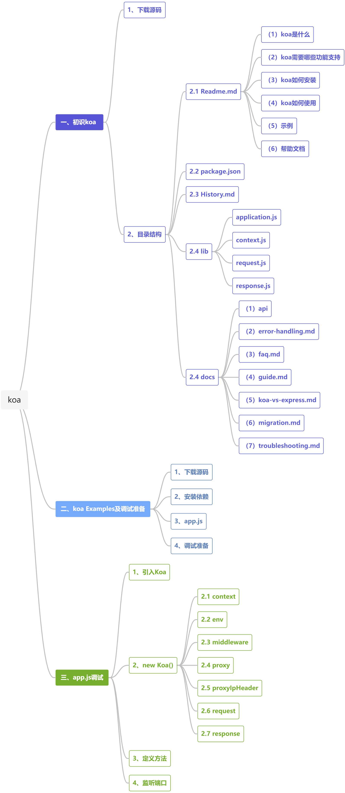
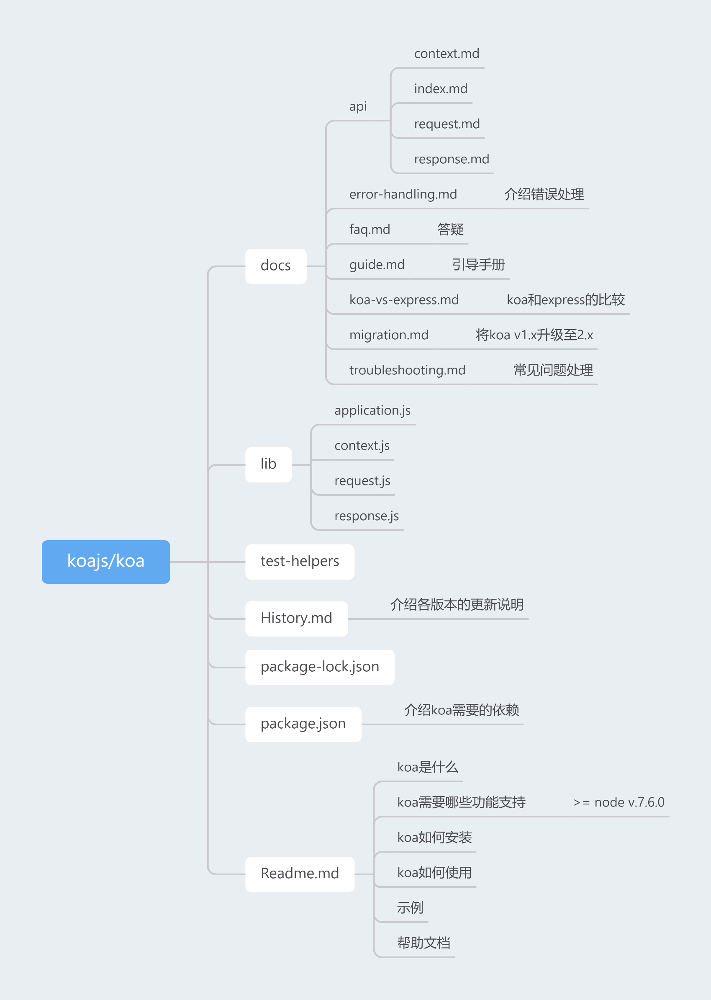
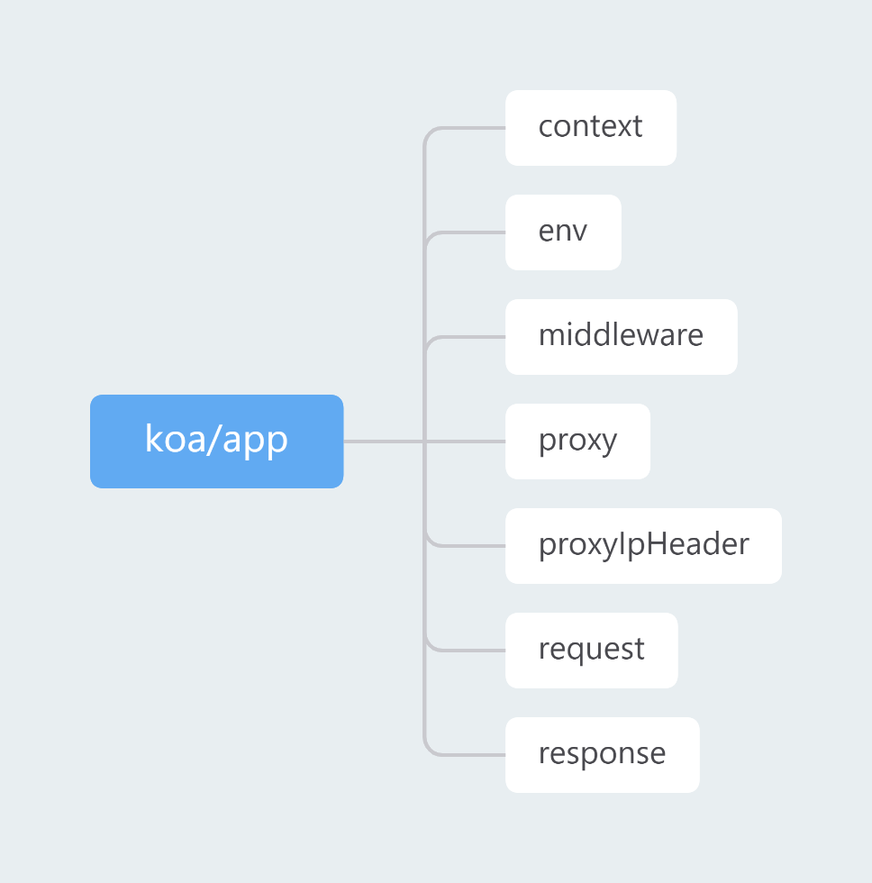

### 一、初识koa

#### 1、下载源码

```git
git clone https://github.com/koajs/koa.git
```

#### 2、目录结构



[幕布 koa目录结构](https://www.mubucm.com/doc/5e2XYEUtUBX)

##### 2.1 `Readme.md`

**（1）koa是什么**

**（2）koa需要哪些功能支持**

node version >= node v7.6.0

**（3）koa如何安装**

```
$ npm install koa
```

**（4）koa如何使用**

```js
const Koa = require('koa');
const app = new Koa();

// response
app.use(ctx => {
    ctx.body = 'Hello Koa';
})

app.listen(3000);
```

**（5）示例**

```js
// async function
app.use(async (ctx, next) => {
    const start = Date.now();
    await next();
    const ms = Date.now() - start;
    console.log(`${ctx.method} ${ctx.url} - ${ms}ms`);
})

// common function
app.use((ctx, next) => {
    const start = Date.now();
    return next().then(() => {
        const ms = Date.now() - start;
        console.log(`${ctx.method} ${ctx.url} - ${ms}ms`);
    })
})
```

**（5）帮助文档**

[Examples](https://github.com/koajs/examples)

[中文文档 v1.x](https://github.com/guo-yu/koa-guide)

[中文文档 v2.x](https://github.com/demopark/koa-docs-Zh-CN)

##### 2.2 `package.json`

介绍`koa`需要的依赖。

##### 2.3 `History.md`

介绍各版本的更新说明。

##### 2.4 `lib`

包括`application.js`、`context.js`、`request.js`、`response.js`

##### 2.4 `docs`

**（1）api**

包括`context.md`、`index.md`、`request.md`、`response.md`

**（2）error-handling.md**

介绍错误处理。

```js
app.use(async (ctx, next) => {
    try {
        await next();
    } catch(err) {
        err.status =  err.statusCode || err.status || 500;
        throw err;
    }
});

app.use(async (ctx, next) => {
    try {
        await next();
    } catch(err) {
        ctx.status = err.statusCode || err.status || 500;
        ctx.body = {
            message: err.message
        };
    }
})
```

**（3）faq.md**

答疑

**（4）guide.md**

引导手册

**（5）koa-vs-express.md**

`koa`和`express`的比较

**（6）migration.md**

将`koa` v1.x升级至v2.x

**（7）troubleshooting.md**

常见问题处理

### 二、koa Examples及调试准备

#### 1、下载源码

```git
git clone https://github.com/koajs/examples
```

#### 2、安装依赖

```bash
npm install
```

#### 3、app.js

```javascript
// koajs/koa/docs/middleware.gif中的代码

const Koa = require('koa');
const app = new Koa();

app.use(async (ctx, next) => {
  const start = Date.now();
  await next();
  const ms = Date.now() - start;
  ctx.set('X-Response-Time', `${ms}ms`);
});

app.use(async (ctx, next) => {
  const start = Date.now();
  await next();
  const ms = Date.now() - start;
  console.log(`${ctx.method} ${ctx.url} - ${ms}`);
});

app.use(async ctx => {
  ctx.body = 'Hello World';
});

app.listen(3000);
```

#### 4、调试准备

##### 4.1 新建`.vscode`文件夹

##### 4.2 新建`launch.json`

`launch.json`放在`.vscode`文件夹下。

```json
{
    "version": "0.2.0",
    "configurations": [
        {
            "type": "node",
            "request": "launch",
            "name": "启动程序",
            "skipFiles": [
                "<node_internals>/**"
            ],
            // app.js放在 my-koa-examples 文件夹下
            "program": "${workspaceFolder}/my-koa-examples/app.js",
        }
    ]
}
```

##### 4.3 `F5`开启调试

##### 4.4 页面访问`localhost:3030`

### 三、`app.js`调试

#### 1、引入`Koa`

```javascript
const Koa = require('koa');
```

#### 2、`new Koa()`

```javascript
const app = new Koa();
```



[幕布 koa/app](https://www.mubucm.com/doc/2FJ4-ir6YhX)

##### 2.1 context

值为对象

##### 2.1 env

值为`development`

##### 2.2 middleware

值为数组，存放`app.use`定义的方法。

##### 2.3 proxy

值为`false`

##### 2.4 proxyIpHeader

值为`X-Forwarded-For`

##### 2.5 request

值为对象

##### 2.6 response

值为对象

#### 3、定义方法

```javascript
// x-response-time
app.use(async (ctx, next) => {
  const start = Date.now();
  await next();
  const ms = Date.now() - start;
  // 往响应头中插入内容
  ctx.set('X-Response-Time', `${ms}ms`);
});

// logger
app.use(async (ctx, next) => {
  const start = Date.now();
  await next();
  const ms = Date.now() - start;
  // 往 vscode 调试控制台中输出内容
  console.log(`${ctx.method} ${ctx.url} - ${ms}`);
});

// response
app.use(async ctx => {
    // 往响应体中插入内容
    ctx.body = 'Hello World';
});
```

#### 4、监听端口

```javascript
// 对端口进行监听之后，当浏览器访问 localhost:3000 时会进入事先定义的方法内部
app.listen(3000);
```

**推荐：**

[koa Examples](https://github.com/koajs/examples)

[koa 中文文档 v1.x](https://github.com/guo-yu/koa-guide)

[koa 中文文档 v2.x](https://github.com/demopark/koa-docs-Zh-CN)