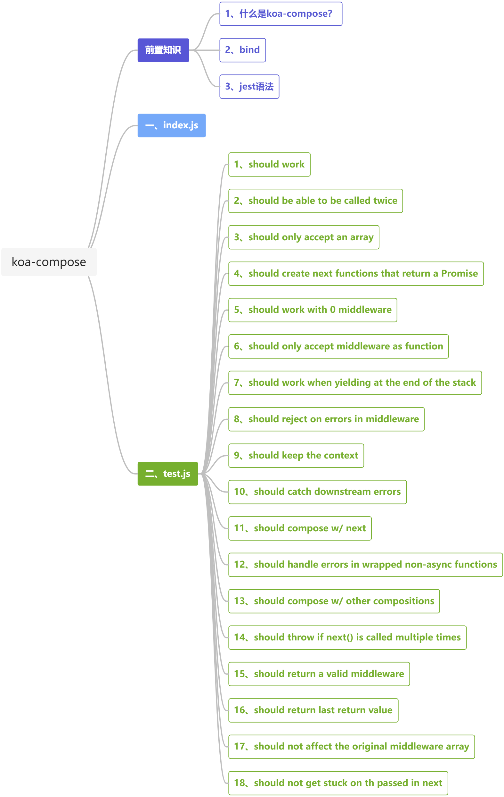
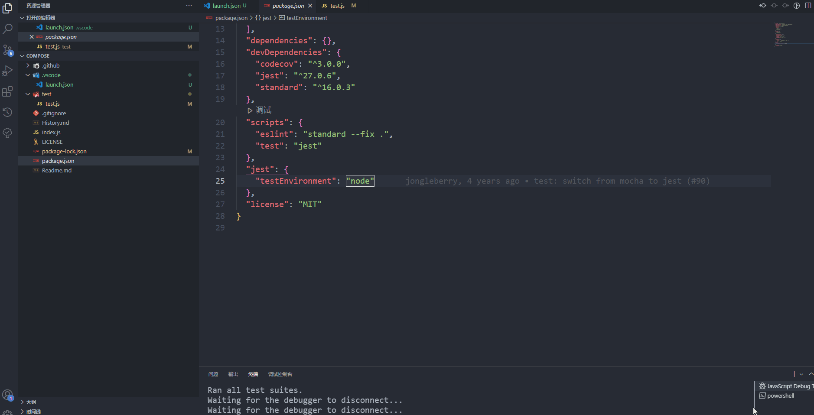
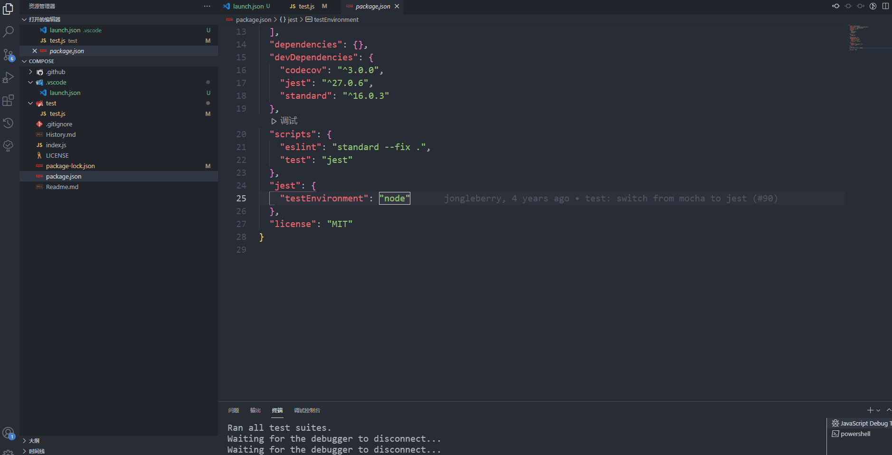
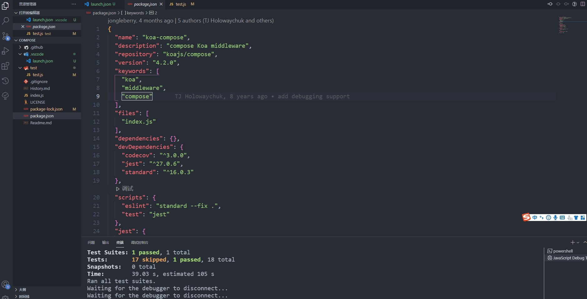
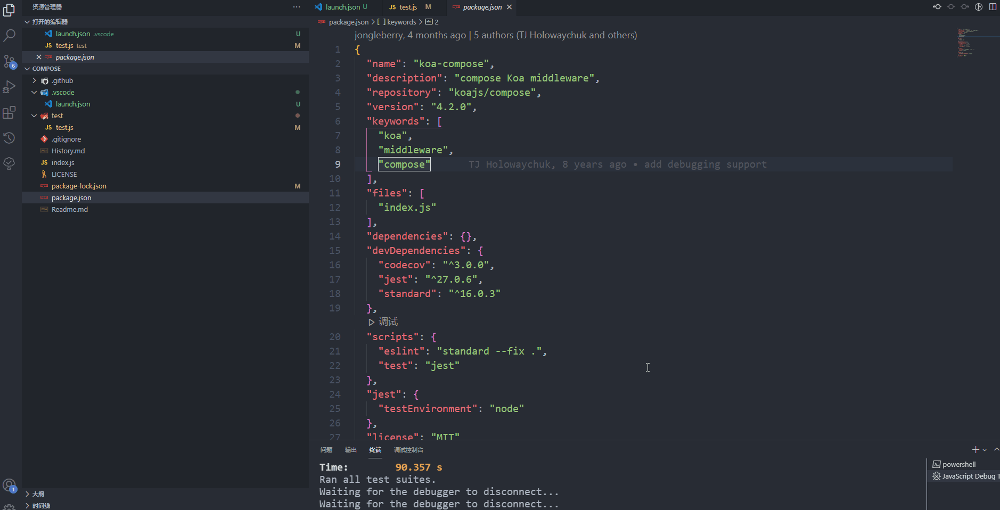
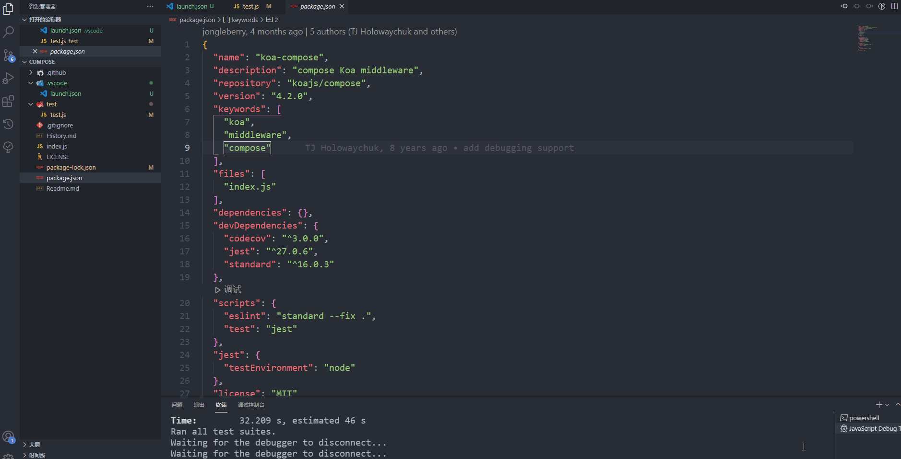
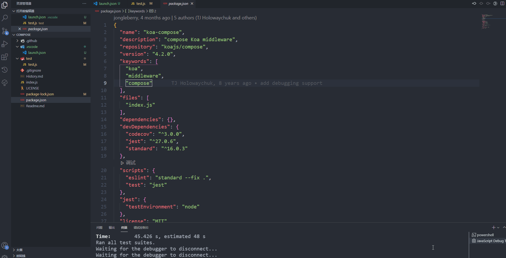
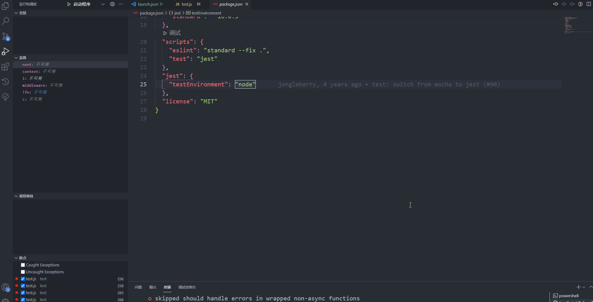
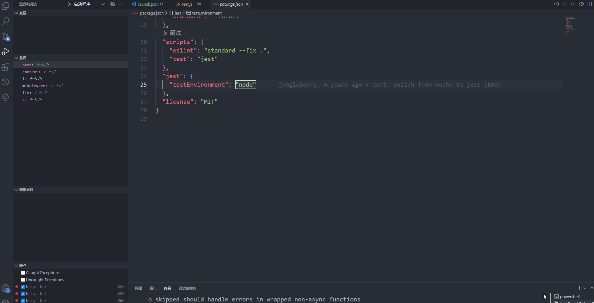
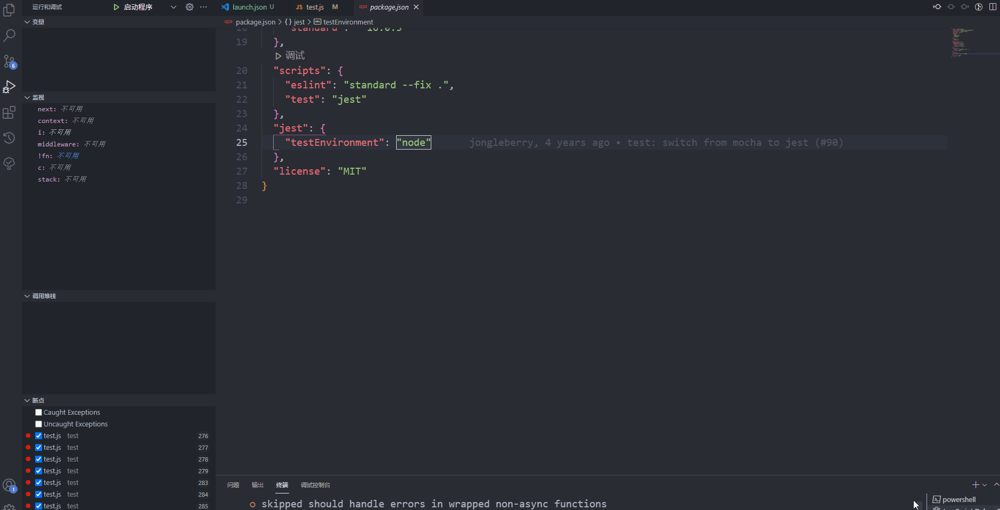

### 第五期 | koa-compose

**【若川】50行代码串行Promise，koa洋葱模型原来是这么实现？：** https://juejin.cn/post/7005375860509245471

**【_骁】koa-compose：** https://juejin.cn/post/7006954944418807822

本篇源码笔记是第五期，通过阅读和调试`compose/index.js`和`compose/test/test.js`，熟悉了`koa-compose`的调用逻辑。

**本期源码阅读的收获如下：**

通过多次调试`compose/test/test.js`中的第一个测试用例，终于对`koa`洋葱模型有了一个大致的认识，按照自己的理解就是不断创建新的函数，同时将此时的上下文信息依次传入，当判断到不需要创建新函数时，再逐层返回。

`koa-compose`中最关键的一行代码，这个处理思路可以应用到其他类似的场景中：

```javascript
return Promise.resolve(fn(context, dispatch.bind(null, i + 1)))
```

**【koajs/compose】：** https://github.com/koajs/compose

**【学习代码仓库地址】：** https://github.com/lxchuan12/koa-compose-analysis.git



### 前置知识

#### 1、什么是koa-compose？

`koa-compose`是一个工具函数，将多个中间件函数组合以后，调用这个中间件函数就可以依次执行添加的中间件函数。

#### 2、bind

`bind()`方法用于创建一个新的函数。

[this、apply、call、bind](https://juejin.cn/post/6844903496253177863)

#### 3、jest语法

[Jest 官网](https://www.jestjs.cn/)

[Jest 中文文档](https://www.jestjs.cn/docs/getting-started)

[Jest API](https://www.jestjs.cn/docs/api)

### 一、`index.js`

```javascript
function compose (middleware) {
    // 判断传入的是否是数组
    if (!Array.isArray(middleware)) throw new TypeError('Middleware stack must be an array!')
    for (const fn of middleware) {
        // 遍历数组，判断是否是 function
        if (typeof fn !== 'function') throw new TypeError('Middleware must be composed of function!')
    }

    return function (context, next) {
        let index = -1
        return dispatch(0)
        function dispatch (i) {
            if (i <= index) return Promise.reject(new Error('next() called multiple times'))
            index = i
            let fn = middleware[i]
            if (i === middleware.length) fn = next
            if (!fn) return Promise.resolve()
            try {
                // 最关键的一行
                // 将当前的 context和 新创建的 dispatch 方法 作为 当前中间件函数的参数 返回
                // 可能表述不太准确
                return Promise.resolve(fn(context, dispatch.bind(null, i + 1)))
            } catch (err) {
                return Promise.reject(err)
            }
        }
    }
}
```

### 二、`test.js`

#### 1、should work

```javascript
it('should work', async () => {
    const arr = []
    const stack = []

    stack.push(async (context, next) => {
        arr.push(1)
        // await wait(1)
        await next()
        // await wait(1)
        arr.push(6)
    })

    stack.push(async (context, next) => {
        arr.push(2)
        // await wait(1)
        await next()
        // await wait(1)
        arr.push(5)
    })

    stack.push(async (context, next) => {
        arr.push(3)
        // await wait(1)
        await next()
        // await wait(1)
        arr.push(4)
    })

    await compose(stack)({})
    expect(arr).toEqual(expect.arrayContaining([1, 2, 3, 4, 5, 6]))
})
```

**分析：**

（1）有`next()`的情况：



（2）无`next()`的情况：



#### 2、should be able to be called twice

```javascript
it('should be able to be called twice', () => {
    const stack = []

    stack.push(async (context, next) => {
      context.arr.push(1)
      await wait(1)
      await next()
      await wait(1)
      context.arr.push(6)
    })

    stack.push(async (context, next) => {
      context.arr.push(2)
      await wait(1)
      await next()
      await wait(1)
      context.arr.push(5)
    })

    stack.push(async (context, next) => {
      context.arr.push(3)
      await wait(1)
      await next()
      await wait(1)
      context.arr.push(4)
    })

    const fn = compose(stack)
    const ctx1 = { arr: [] }
    const ctx2 = { arr: [] }
    const out = [1, 2, 3, 4, 5, 6]

    return fn(ctx1).then(() => {
      assert.deepEqual(out, ctx1.arr)
      return fn(ctx2)
    }).then(() => {
      assert.deepEqual(out, ctx2.arr)
    })
})
```

#### 3、should only accept an array

传入参数只能是数组。

```javascript
it('should only accept an array', () => {
    expect(() => compose()).toThrow(TypeError)
})
```

#### 4、should create next functions that return a Promise

```javascript
it('should create next functions that return a Promise', function () {
    const stack = []
    const arr = []
    for (let i = 0; i < 5; i++) {
      stack.push((context, next) => {
        arr.push(next())
      })
    }

    compose(stack)({})

    for (const next of arr) {
      assert(isPromise(next), 'one of the functions next is not a Promise')
    }
})
```

#### 5、should work with 0 middleware

可以传入一个空数组。

```javascript
it('should work with 0 middleware', function () {
    return compose([])({})
})
```

#### 6、should only accept middleware as function

传入的中间件函数必须是`function`。

```javascript
it('should only accept middleware as functions', () => {
    expect(() => compose([{}])).toThrow(TypeError)
})
```

#### 7、should work when yielding at the end of the stack

```javascript
it('should work when yielding at the end of the stack', async () => {
    const stack = []
    let called = false

    stack.push(async (ctx, next) => {
      await next()
      called = true
    })

    await compose(stack)({})
    assert(called)
})
```

#### 8、should reject on errors in middleware

```javascript
it('should reject on errors in middleware', () => {
    const stack = []

    stack.push(() => { throw new Error() })

    return compose(stack)({})
      .then(() => {
        throw new Error('promise was not rejected')
      }, (e) => {
        expect(e).toBeInstanceOf(Error)
      })
})
```

#### 9、should keep the context

```javascript
it('should keep the context', () => {
    const ctx = {}

    const stack = []

    stack.push(async (ctx2, next) => {
      await next()
      expect(ctx2).toEqual(ctx)
    })

    stack.push(async (ctx2, next) => {
      await next()
      expect(ctx2).toEqual(ctx)
    })

    stack.push(async (ctx2, next) => {
      await next()
      expect(ctx2).toEqual(ctx)
    })

    return compose(stack)(ctx)
})
```

#### 10、should catch downstream errors

捕获异常之后能继续执行。

```javascript
it.only('should catch downstream errors', async () => {
    const arr = []
    const stack = []

    stack.push(async (ctx, next) => {
      arr.push(1)
      try {
        arr.push(6)
        await next()
        arr.push(7)
      } catch (err) {
        arr.push(2)
      }
      arr.push(3)
    })

    stack.push(async (ctx, next) => {
      arr.push(4)
      throw new Error()
    })

    await compose(stack)({})
    expect(arr).toEqual([1, 6, 4, 2, 3])
  })
```

#### 11、should compose w/ next

因为传入的是一个空数组，它的`next`是一个`function`，所以会执行一次

```javascript
return Promise.resolve(fn(context, dispatch.bind(null, i + 1)))
```

从而将`called`赋值为`true`，然后执行`assert(called)`

```javascript
 it.only('should compose w/ next', () => {
    let called = false

    return compose([])({}, async () => {
      called = true
    }).then(function () {
      assert(called)
    })
  })
```

**分析：**



#### 12、should handle errors in wrapped non-async functions

能够处理包裹在非异步方法里的错误。

```javascript
it.only('should handle errors in wrapped non-async functions', () => {
    const stack = []

    stack.push(function () {
      throw new Error()
    })

    return compose(stack)({}).then(() => {
      throw new Error('promise was not rejected')
    }, (e) => {
      expect(e).toBeInstanceOf(Error)
    })
  })
```

**分析：**



#### 13、should compose w/ other compositions

```javascript
it.only('should compose w/ other compositions', () => {
    const called = []

    return compose([
      compose([
        (ctx, next) => {
          called.push(1)
          return next()
        },
        (ctx, next) => {
          called.push(2)
          return next()
        }
      ]),
      (ctx, next) => {
        called.push(3)
        return next()
      }
    ])({}).then(() => assert.deepEqual(called, [1, 2, 3]))
  })
```

#### 14、should throw if next() is called multiple times

`next()`不能被多次调用。

```javascript
it('should throw if next() is called multiple times', () => {
    return compose([
      async (ctx, next) => {
        await next()
        await next()
      }
    ])({}).then(() => {
      throw new Error('boom')
    }, (err) => {
      assert(/multiple times/.test(err.message))
    })
})
```

**分析：**

（1）只有一个`next()`的情况：



（2）有两个`next()`的情况：



#### 15、should return a valid middleware

```javascript
it.only('should return a valid middleware', () => {
    let val = 0
    return compose([
      compose([
        (ctx, next) => {
          val++
          return next()
        },
        (ctx, next) => {
          val++
          return next()
        }
      ]),
      (ctx, next) => {
        val++
        return next()
      }
    ])({}).then(function () {
      expect(val).toEqual(3)
    })
})
```

**分析：**





#### 16、should return last return value

返回最后一个返回的值。

```javascript
it.only('should return last return value', () => {
    const stack = []

    stack.push(async (context, next) => {
      console.log("111")
      const val = await next()
      expect(val).toEqual(2)
      return 1
    })

    stack.push(async (context, next) => {
      console.log("222")
      const val = await next()
      expect(val).toEqual(0)
      return 2
    })

    const next = () => 0
    return compose(stack)({}, next).then(function (val) {
      expect(val).toEqual(1)
    })
  })
```




#### 17、should not affect the original middleware array

```javascript
it('should not affect the original middleware array', () => {
    const middleware = []
    const fn1 = (ctx, next) => {
      return next()
    }
    middleware.push(fn1)

    for (const fn of middleware) {
      assert.equal(fn, fn1)
    }

    compose(middleware)

    for (const fn of middleware) {
      assert.equal(fn, fn1)
    }
})
```

#### 18、should not get stuck on th passed in next

```javascript
it.only('should not get stuck on the passed in next', () => {
    const middleware = [(ctx, next) => {
      ctx.middleware++
      return next()
    }]
    const ctx = {
      middleware: 0,
      next: 0
    }

    return compose(middleware)(ctx, (ctx, next) => {
      ctx.next++
      return next()
    }).then(() => {
      expect(ctx).toEqual({ middleware: 1, next: 1 })
    })
  })
```