### 第八期 | mitt

本期源码笔记是第八期。通过阅读和调试`src/index.ts`和`test/index_test.ts`，熟悉了`mitt`订阅/发布事件的整个流程，在调试`test/index/index_test.ts`的过程中对对前端单元测试中用到的断言库`chai`、辅助工具`Sinon`和`sinon-chai`有了初步的了解，在阅读和调试`src/index.ts`的过程中，对`typescript`的一些常用语法加深了印象。另外，在移除事件处理程序中用到了`>>>`位运算符，使用 `>>> 0`可以实现取整和将负数转为非负整数。

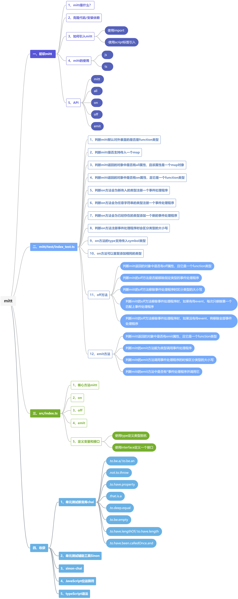

#### 一、初识mitt

##### 1、mitt是什么？

`mitt`是一个简单的事件发布订阅器。

##### 2、克隆代码/安装依赖

```
git clone https://github.com/developit/mitt
```

```sh
$ npm install
```

##### 3、如何引入mitt

###### （1）使用import

```javascript
import mitt from 'mitt'

var mitt = require('mitt')
```

###### （2）使用script标签引入

```html
<script src="https://unpkg.com/mitt/dist/mitt.umd.js"></script>

<!-- window.mitt -->
```

##### 4、mitt的使用

###### （1）js

```javascript
import mitt from 'mitt'
const emitter = mitt()
emitter.on('foo', e => console.log('foo', e))
emitter.on('*', (type, e) => console.log(type, e))

emitter.emit('foo', { a: 'b' })
emitter.all.clear()

function onFoo() {}
emitter.on('foo', onFoo)
emitter.off('foo', onFoo)
```

###### （2）ts

```typescript
import mitt from 'mitt';
type Events = {
    foo: string;
    bar?: number;
}

const emitter = mitt<Events>();
emitter.on('foo', (e) => {});
emitter.emit('foo', 42);
```

```typescript
import mitt, { Emitter } from 'mitt';
type Events = {
    foo: string;
    bar?: number;
}
const emitter = Emitter<Events> = mitt<Events>();
```

##### 5、API

###### （1）mitt

一个简单的事件发布订阅器，返回`Mitt`。

###### （2）all

一个需要注册处理程序的事件名称`map`。

###### （3）on

为给定类型注册一个事件处理程序。有两个参数，一个是`type`，一个是`handler`。其中`type`是`string`或`symbol`类型，表示需要监听的事件类型或全部事件，如果是监听全部事件时用*号表示，`handler`是一个`funcion`，表示响应给定事件调用的函数。

###### （4）off

与`on`对应，为给定的类型移除一个事件处理程序。有两个参数，一个是`type`，一个是`handler`。其中`type`是`string`或`symbol`类型，表示需要移除处理程序的事件类型，如果是*号，则表示移除所有事件类型的处理程序，`handler`是一个`funcion`，表示需要移除的处理函数。

###### （5）emit

调用给定类型的所有处理程序。又两个参数，一个是`type`，一个是`evt`。`type`表示需要调用的处理程序的类型，`evt`是一个对象，用于传递给每个处理程序。


#### 二、mitt/test/index_test.ts

##### 1、判断`mitt`默认对外暴露的是否是`function`类型

```ts
import chai, { expect } from 'chai';
// 注：代码原为 import mitt, { Emitter, EventHandlerMap } from '..';
// 提示 找不到模块 “..”或其相应的类型声明，后改为  '../src/index'
import mitt, { Emitter, EventHandlerMap } from '../src/index';
describe('mitt', () => {
    it('should default export be a funcion', () => {
        // chai 语法，表示检验类型是否与期望一致
        expect(mitt).to.be.a('function');
    });
})
```

##### 2、判断`mitt`是否支持传入一个`map`

```ts
import chai, { expect } from 'chai';
import { spy } from 'sinon';
import sinonChai from 'sinon-chai';
chai.use(sinonChai);
it('should accept an optional event handler map', () => {
     // chai 语法，判断传入一个空的Map，不会抛出异常
    expect(() => mitt(new Map())).not.to.throw;
    const map = new Map();
    const a = spy();
    const b = spy();
    map.set('foo', [a, b]);
    const events = mitt<{ foo: undefined }>(map);
    events.emit('foo');
    // sinon-chai 方法，判断只调用一次
    expect(a).to.have.been.calledOnce;
    expect(b).to.have.been.calledOnce;
});
```

##### 3、判断`mitt`返回的对象中是否有`all`属性，且该属性是一个`map`对象

```ts
describe('mitt#', () => {
    const eventType = Symbol('eventType')
    type Events = {
        foo: unknown;
        constructor: unknown;
        FOO: unknown;
        bar: unknown;
        Bar: unknown;
        'baz:bat!': unknown;
        'baz:baT!': unknown;
        Foo: unknown;
        [eventType]: unknown;
    };
    let events: EventHandlerMap<Events>, inst: Emitter<Events>;

    beforeEach(() => {
        events = new Map();
        inst = mitt(events);
    })

    describe('properties', () => {
        it('should expose the event handler map', () => {
            expect(inst)
                // 判断是否有某个属性
                .to.have.property('all')
                // 判断是否是 map类型
                .that.is.a('map')
        })
    })
})
```

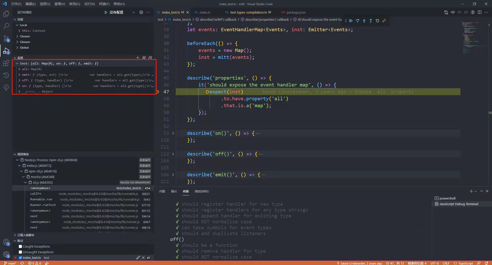

##### 4、判断`mitt`返回的对象中是否有`on`属性，且它是一个`function`类型

```ts
describe('on()', () => {
    it('should be a function', () => {
        expect(inst)
            .to.have.property('on')
            .that.is.a('function')
    })
})
```

##### 5、判断`on`方法会为新传入的类型注册一个事件处理程序

```ts
it('should register handler for new type', () => {
    const foo = () => {};
    inst.on('foo', foo);
    expect(events.get('foo')).to.deep.equal([foo]);
})
```

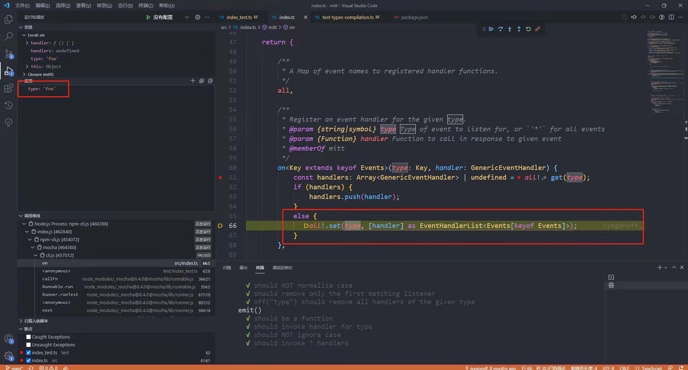

##### 6、判断`on`方法会为任意字符串的类型注册一个事件处理程序

```ts
it('should register handlers for any type strings', () => {
    const foo = () => {};
    inst.on('constructor', foo);
    expect(events.get('constructor')).to.deep.equal([foo]);
})
```

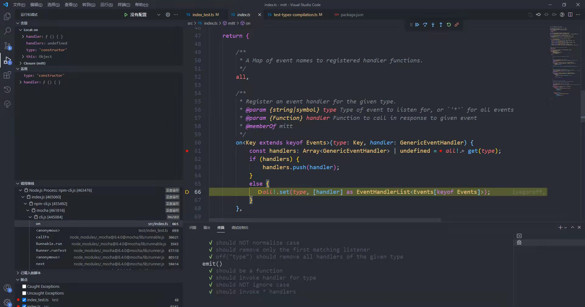

##### 7、判断`on`方法会为已经存在的类型添加一个新的事件处理程序

```ts
it('should append handler for existing type', () => {
    const foo = () => {};
    const bar = () => {};
    inst.on('foo', foo);
    inst.on('foo', bar);
    expect(events.get('foo')).to.deep.equal([foo, bar]);
})
```

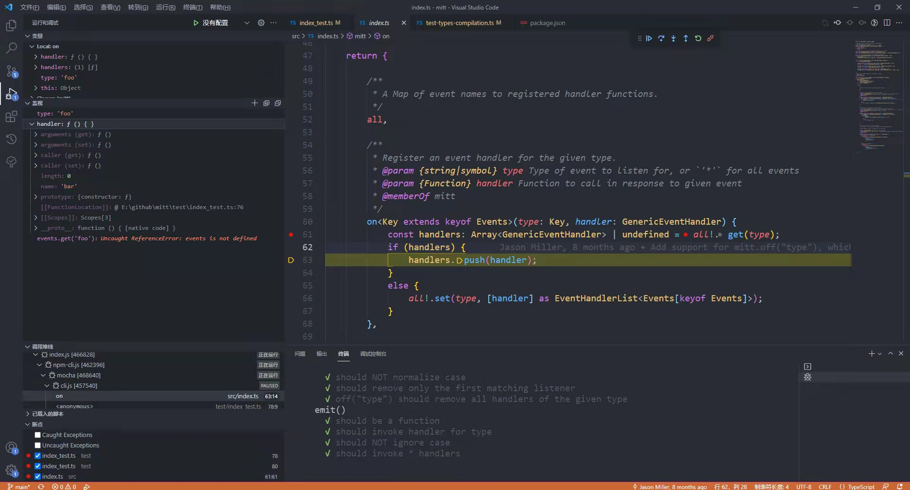

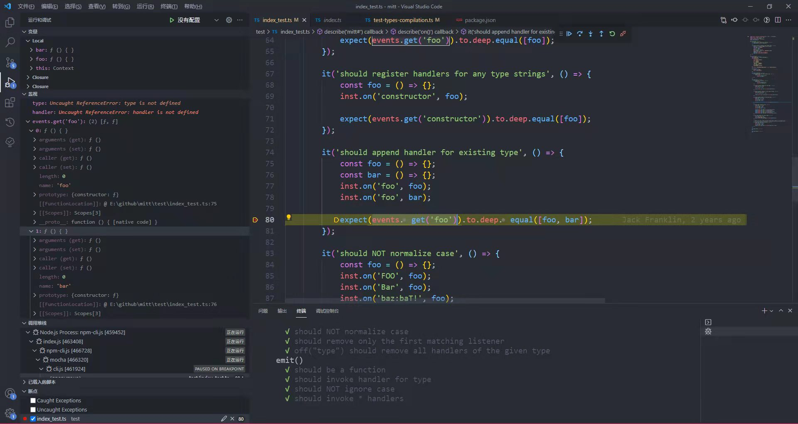

##### 8、判断`on`方法注册事件处理程序时会区分类型的大小写

```ts
it('should NOT normalize case', () => {
    const foo = () => {};
    inst.on('FOO', foo);
    inst.on('Bar', foo);
    inst.on('baz:baT!', foo);

    expect(events.get('FOO')).to.deep.equal([foo]);
    expect(events.has('foo')).to.equal(false);
    expect(events.get('Bar')).to.deep.equal([foo]);
    expect(events.has('bar')).to.equal(false);
    expect(events.get('baz:baT!')).to.deep.equal([foo]);
})
```

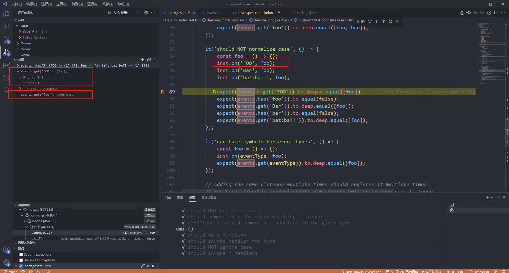

##### 9、`on`方法的`type`支持传入`symbol`类型

```ts
const eventType = Symbol('eventType')
// ......
it('can take symbol for event types', () => {
    const foo = () => {};
    inst.on(eventType, foo);
    expect(events.get(eventType)).to.deep.equal(foo);
})
```

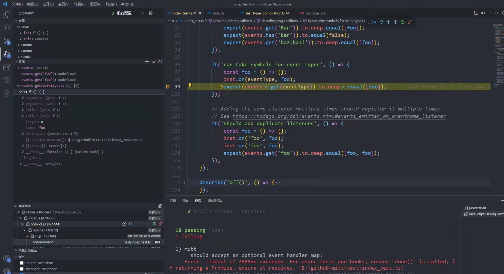

##### 10、`on`方法可以重复添加相同的类型

```ts
it('should add duplicate listeners', () => {
    const foo = () => {};
    inst.on('foo', foo);
    inst.on('foo', foo);
    exepect(events.get('foo')).to.deep.equal([foo, foo]);
})
```

##### 11、`off`方法

**（1）判断`mitt`返回的对象中是否有`off`属性，且它是一个`function`类型**

**（2）判断`mitt`的`off`方法是否能移除指定类型的事件处理程序**

**（3）判断`mitt`的`off`方法移除事件处理程序时区分类型的大小写**

**（4）判断`mitt`的`off`方法移除事件处理程序时，如果有传`event`，每次只移除第一个匹配上事件处理程序**

此处用到了`>>>`，当indexOf的值是-1时，将其转换成一个较大的值，避免将`handlers`直接清空。因为按照逻辑，当`handler`未传值的时候，需要调用`all!.set(type, [])`这行代码。

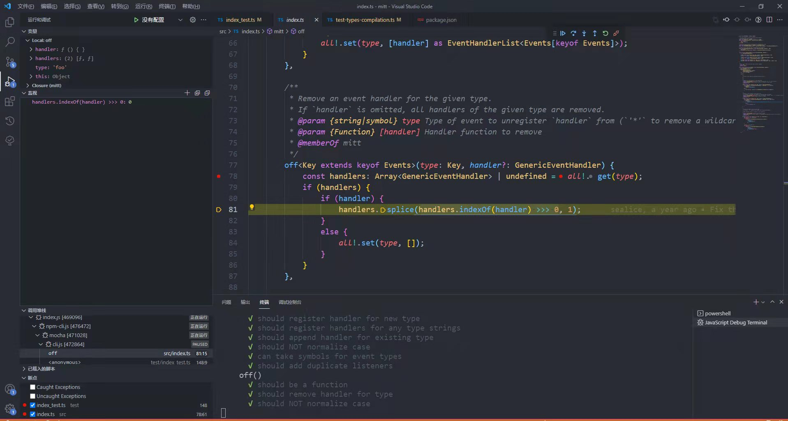

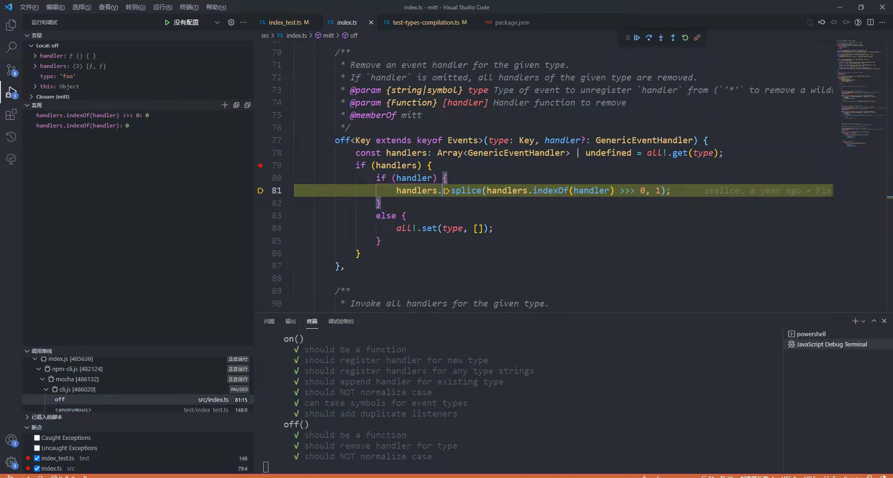

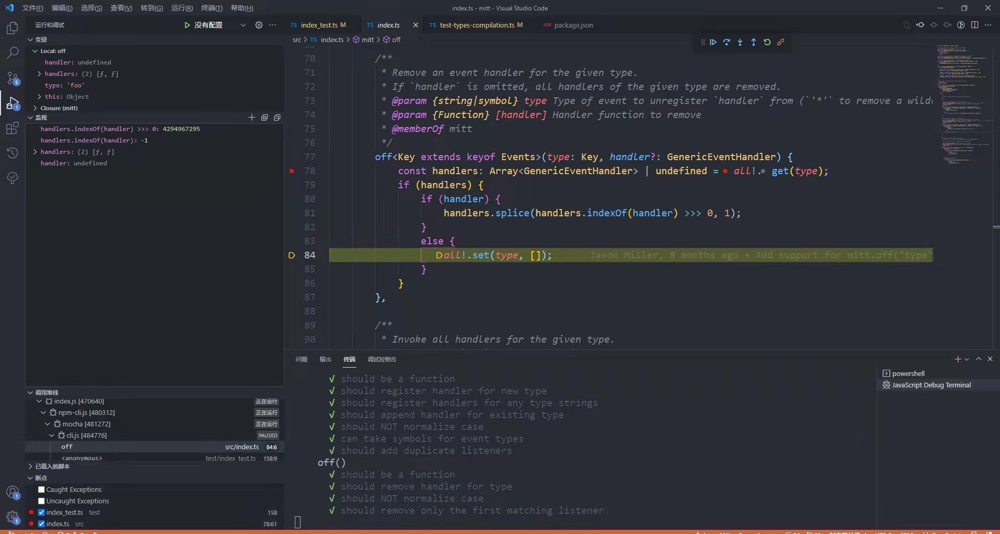

**（5）判断`mitt`的`off`方法移除事件处理程序时，如果没有传`event`，将移除全部事件处理程序**


```ts
describe('off()', () => {
    it('should be a function', () => {
        expect(inst)
            .to.have.property('off')
            .that.is.a('function');
    })

    it('should remove handlers for type', () => {
        const foo = () => {};
        inst.on('foo', foo);
        inst.off('foo', foo);
        expect(events.get('foo')).to.be.empty;
    })

    it('should NOT normalize case', () => {
        const foo = () => {};
        inst.on('FOO', foo);
        inst.on('Bar', foo);
        inst.on('baz:bat!', foo);

        inst.off('FOO', foo);
        inst.off('Bar', foo);
        inst.off('baz:baT!', foo);

        expect(events.get('FOO')).to.be.empty;
        expect(events.get('foo')).to.equal(false);
        expect(events.get('Bar')).to.be.empty;
        expect(events.get('bar')).to.equal(false);
        expect(events.get('baz:bat!')).to.have.lengthOf(1);
    })

    it('should remove only the first matching listener', () => {
        const foo = () => {};
        inst.on('foo', foo);
        inss.on('foo', foo);
        inst.off('foo', foo);
        expect(events.get('foo')).to.deep.equal([foo]);
        inst.off('foo', foo);
        expect(evnets.get('foo')).to.deep.equal([]);
    })

    it('off("type") should remove all hanlders of the given type', () => {
        const foo = () => {};
        inst.on('foo', foo);
        inst.on('foo', foo);
        inst.on('bar', foo);
        inst.off('foo');
        expect(events.get('foo')).to.deep.equal([]);
        expect(events.get('bar')).to.have.length(1);
        inst.off('bar');
        expect(events.get('bar')).to.deep.equal([]);
    })
})
```

##### 12、`emit`方法

**（1）判断`mitt`返回的对象中是否有`emit`属性，且它是一个`function`类型**

**（2）判断`mitt`的`emit`方法能为类型调用事件处理程序**

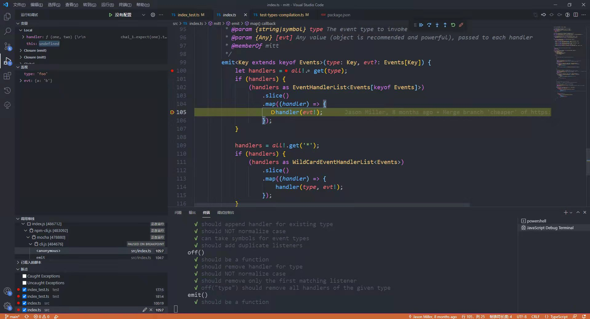


**（3）判断`mitt`的`emit`方法调用事件处理程序的时候区分类型的大小写**


**（4）判断`mitt`的`emit`方法中是否有`*`事件处理程序并调用它**

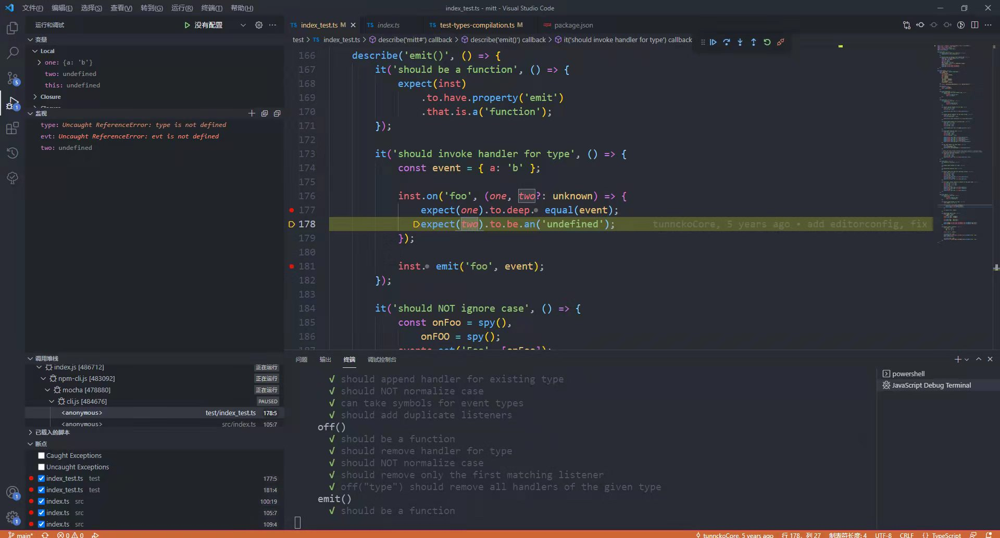

```ts
describe('emit()', () => {
    it('should be a function', () => {
        expect(inst)
            .to.have.property('emit')
            .that.is.a('function')
    });

    it('should invoke handler for type', () => {
        const event = { a: 'b' };
        inst.on('foo', (one, two?: unknown) => {
            expect(one).to.deep.equal(event);
            expect(two).to.be.an('undefined');
        });
        inst.emit('foo', event);
    })

    it('should NOT ignore case', () => {
        const onFoo = spy(),
            onFOO = spy();
        events.set('Foo', [onFoo]);
        events.set('FOO', [onFOO]);

        inst.emit('Foo', 'Foo arg');
        inst.emit('FOO', 'FOO arg');
        expect(onFoo).to.have.been.calledOnce.and.calledWidth('Foo arg');
        expect(onFOO).to.have.been.calledOnce.and.calledWidth('FOO arg');
    })

    it('should invoke * handlers', () => {
        const star = spy(),
            ea = { a: 'a' },
            eb = { b: 'b' };
        events.set('*', [star]);
        inst.emit('foo', ea);
        expect(star).to.have.been.calledOnce.and.calledWith('foo', ea);
        star.resetHistory();
        inst.emit('bar', eb);
        expect(star).to.have.been.calledOnce.and.calledWith('bar', eb);
    })
})
```

#### 三、src/index.ts

##### 1、核心方法`mitt`

```ts
export default function mitt<Events extends Record<EventType, unknown>>(
    all?: EventHandlerMap<Events>
): Emitter<Events> {
    type GenericEventHandler =
        | Handler<Events[keyof Events]>
        | WildcardHandler<Events>;
    all = all || new Map();

    return {
        all,
        on<Key extends keyof Events>(type: Key, handler: GenericEventHandler) {

        },
        off<Key extends keyof Events>(type: Key, handler: GenericEventHandler) {

        },
        emit<Key extends keyof Events>(type: Key, evt?: Events[Key]) {

        }
    }
}
```

在`test/index_test.ts`中是这样初始化的，结合上面理解就是：

`Events`是`Record`类型，规定了`key`的类型只能是`string`或是`symbol`，如`baz:bat!`、`Symbol('eventType')`等，`value`的类型是不确定的。`keyOf Events`就是取到`foo`/`constructor`......

`Handler<Events[keyof Events]`是为了取到对应`Events`的`Handler`。

```ts
const eventType = Symbol('eventType')
type Events = {
    foo: unknown;
    constructor: unknown;
    FOO: unknown;
    bar: unknown;
    Bar: unknown;
    'baz:bat!': unknown;
    'baz:baT!': unknown;
    Foo: unknown;
    [eventType]: unknown;
};

let events: EventHandlerMap<Events>, inst: Emitter<Events>;

beforeEach(() => {
    events = new Map();
    inst = mitt(events);
})
```

##### 2、on

```ts
on<Key extends keyof Events>(type: Key, handler: GenericEventHandler) {
    // 根据传入的 type 获得对应的 handlers
    const handlers: Array<GenericEventHandler> | undefined = all.get(type);
    if (handlers) {
        // 如果 handlers 有值。则往数组里再添加一个
        handlers.push(handler);
    } else {
        // 如果没有值，则往map里面添加一个，key 值为传入的 type，值则为一个 EventHandlerList
        all!.set(type, [handler] as EventHandlerList<Events[keyof Events]>);
    }
}
```

##### 3、off

```ts
off<Key extends keyof Events>(type: Key, handler: GenericEventHandler) {
    // 根据传入的 type 获得对应的 handlers
    const handlers: Array<GenericEventHandler> | undefined = all.get(type);
    if (handlers) {
       handlers.splice(handlers.indexOf(handler) >>> 0, 1);
    } else {
        // 如果没有值，则往map里面添加一个，key 值为传入的 type，值则为一个 EventHandlerList
        all!.set(type, []);
    }
}
```

##### 4、emit

```ts
emit<Key extends keyof Events>(type: Key, evt?: Events[Key]) {
    let handlers = all!.get(type);
    if (handlers) {
        (handlers as EventHandlerList<Events[keyof Events]>)
            .slice()
            .map((handler) => {
                handler(evt!);
            });
    }

    // 判断是否需要调用*的事件处理程序
    handlers = all!.get('*');
    if (handlers) {
        (handlers as WildCardEventHandlerList<Events>)
            .slice()
            .map((handler) => {
                handler(type, evt!);
            })
    }
}
```

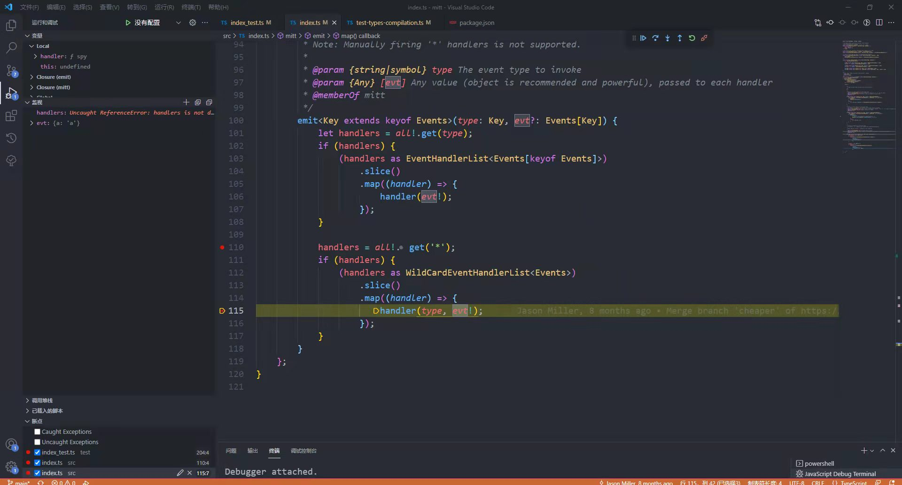

##### 5、定义变量和接口

**（1）使用`type`定义类型别名**

```ts
// EventType 表明值类型可以是 string 或是 symbol
export type EventType = string | symbol;

// 将一个入参类型为T，无返回值的函数，起个新名字叫 Handler，其中 T 不确定是什么数据类型
export type Handler<T = unknown> = (event: T) => void;

// 将一个有两个入参，无返回值的函数，起个新名字叫 WildcardHandler，其中 T 的类型是 Record<string, unknown>
// 可以理解为 第一个是 key 的类型，第二个是 value 的类型
// keyof T 是 索引类型查询操作符，表示取出 T 中所有的属性
export type WildcardHandler<T = Record<string, unknown>> = (
    type: keyof,
    event: T[keyof T]
) => void;

// 将一个类型为 Handler 的数组，起一个新名字叫 EventHandlerList，其中 T 不确定是什么数据类型
export type EventHandlerList<T = unknown> = Array<Handler<T>>;

// 将一个类型为 WildEventHandler 的数组，起一个新名字叫 WildCardEventHandlerList，其中 T 不确定是什么数据类型
export type WildCardEventHandlerList<T = Record<string, unknown>> = Array<WildEventHandler<T>>;

// 将一个 key 值为 Events 中某个属性或*，value 值为 EventHandlerList 或 WildCardEventHandlerList 的 map，起一个新名字叫 EventHandlerMap
// Recore<EventType, unknown> 等同于 Record<string, unknown> + Record<symbol, unknown>
export type EventHandlerMap<Events extends Record<EventType, unknown>> = Map<
    keyof Events | '*',
    EventHandlerList<Events[keyof Event]> | WildCardEventHandlerList<Events>
>;
```

**（2）使用`interface`定义一个接口**

`Emitter`接口里面有一个属性和三个方法，分别是：`all`、`on`、`off`和`emit`；

```ts
// Recore<EventType, unknown> 等同于 Record<string, unknown> + Record<symbol, unknown>
export interface Emitter<Events extends Record<EventType, unknown>> {
    all: EventHandlerMap<Events>;
    on<Key extends keyof Events>(type: Key, handler: Handler<Events[Key]>): void;
    on(type: '*', handler: WildEventHandler<Events>): void;

    off<Key extends keyof Events>(type: Key, handler: Handler<Events[Key]>): void;
    off(type: '*', handler: WildEventHandler<Events>): void;

    emit<Key extends keyof Events>(type: Key, event: Events[Key]): void;
    emit<Key extends keyof Events>(type undefined extends Events[Key] ? Key : never): void;
}
```

其中：

第一，`Key extends keyof Events`表示`Key`从`Events`里面的`key`中取值，例如：

```ts
type Events = {
    foo: unknown;
    constructor: unknown;
    FOO: unknown;
    bar: unknown;
    Bar: unknown;
    'baz:bat!': unknown;
    'baz:baT!': unknown;
    Foo: unknown;
    [eventType]: unknown;
};
// Key extends keyof Events 的值 可以是 foo、constructor、FOO......
```

第二，`:`后面的`void`表明几个方法都是没有返回值的；

第三，`Handler<Events[Key]>`表示需要传入相应`key`的事件处理程序。例如：

```ts
const foo = () => {};
// 此时是添加
inst.on('foo', foo);

// 此时是移除
inst.off('foo', foo);
```

**（3）Record的例子**

```ts
interface EmployeeType {
    id: number
    fullname: string
    role: string
}

let employees: Record<number, EmployeeType> = {
    0: { id: 1, fullname: "John Doe", role: "Designer" },
    1: { id: 2, fullname: "Ibrahima Fall", role: "Developer" },
    2: { id: 3, fullname: "Sara Duckson", role: "Developer" },
}

// 0: { id: 1, fullname: "John Doe", role: "Designer" },
// 1: { id: 2, fullname: "Ibrahima Fall", role: "Developer" },
// 2: { id: 3, fullname: "Sara Duckson", role: "Developer" }
```

#### 四、收获

##### 1、单元测试断言库`chai`

**（1）.to.be.a/.to.be.an**

**（2）.not.to.throw**

**（3）.to.have.property**

**（4）.that.is.a**

**（5）.to.deep.equal**

**（6）.to.be.empty**

**（7）.to.have.lengthOf/.to.have.length**

**（8）.to.have.been.calledOnce.and**

##### 2、单元测试辅助工具`Sinon`

##### 3、sinon-chai

用于为`Sinon`提供一些断言方法。

**（1）.to.have.been.calledOnce**

判断只调用一次。

##### 4、JavaScript位运算符

在`off`方法中移除事件处理程序时用到了`>>>`运算符，使用 `>>> 0`可以实现取整和将负数转为非负整数。

##### 5、typeScript语法

**参考：**

[chai API](https://www.chaijs.com/api/)

[Sinon API](https://sinonjs.org/releases/v13/)

[sinon-chai](https://www.npmjs.com/package/sinon-chai)

[知乎 TypeScript 类型声明 与 进阶](https://zhuanlan.zhihu.com/p/374812162)

[知乎 Typescript高级类型Record](https://zhuanlan.zhihu.com/p/356662885)

[TypeScript入门教程 函数的类型](https://ts.xcatliu.com/basics/type-of-function.html#%E9%87%8D%E8%BD%BD)

[TypeScript入门教程 类型别名](https://ts.xcatliu.com/advanced/type-aliases.html)

[TypeScript 数据类型](https://www.typescriptlang.org/docs/handbook/2/everyday-types.html)

[TypeScript中文手册 高级类型](https://typescript.bootcss.com/advanced-types.html)