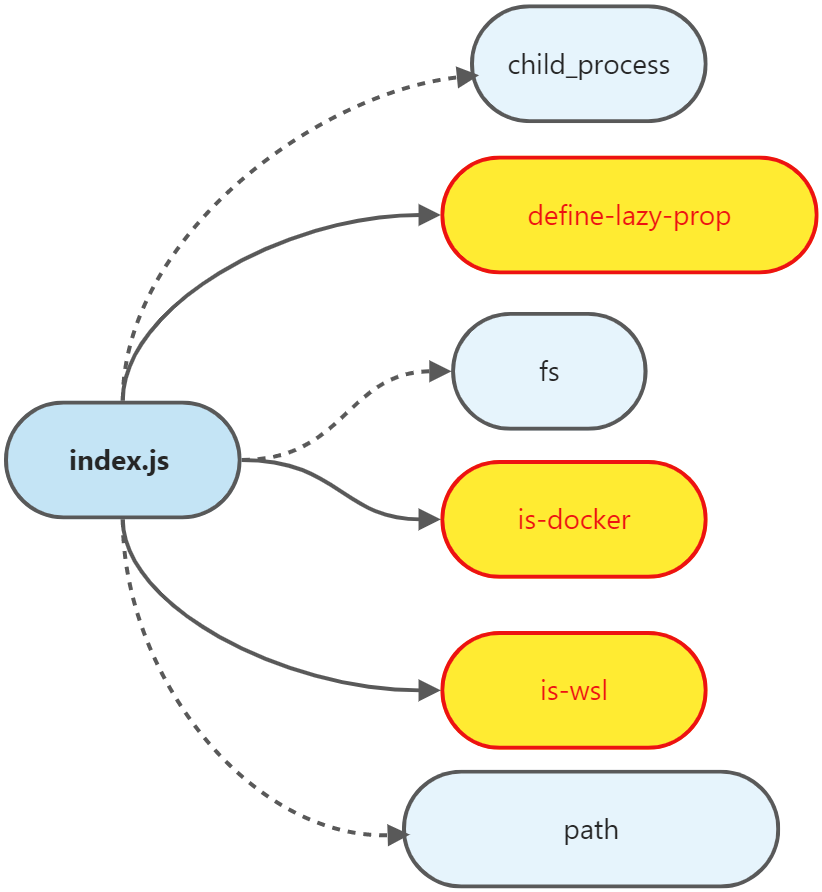

### 第13期 | open


#### 一、open的基本使用

##### 1、open的基本使用

```javascript
const open = require('open');

// Opens the image in the default image viewer and waits for the opened app to quit.
await open('unicorn.png', {wait: true});
console.log('The image viewer app quit');

// Opens the URL in the default browser.
await open('https://sindresorhus.com');

// Opens the URL in a specified browser.
await open('https://sindresorhus.com', {app: {name: 'firefox'}});

// Specify app arguments.
await open('https://sindresorhus.com', {app: {name: 'google chrome', arguments: ['--incognito']}});

// Open an app
await open.openApp('xcode');

// Open an app with arguments
await open.openApp(open.apps.chrome, {arguments: ['--incognito']});
```

#### 二、牛刀小试

##### 1、新建一个npm项目

```
// 新建一个 open-test 文件夹

$ npm init
```

##### 2、安装依赖

```
npm install open --save-dev
```

##### 3、index.js

```javascript
const open = require('open')
async function test() {
	await open('https://wwww.baidu.com')

	// 指定浏览器
	// 火狐
	// await open('https://www/baidu.com', {app: {name: 'firefox'}})
	// 谷歌
	await open('https://www/baidu.com', {app: {name: 'chrome'}})
}
```

##### 4、修改package.json

```json
{
	"name": "open-test",
	"main": "index.js",
	"scripts": {
		"test": "node index.js"
	},
	"author": "",
	"devDependencies": {
		"open": "^8.4.0"
	}
}
```

#### 三、调试前准备

##### 1、在项目中新建一个js

```javascript
const open = require('./index.js')
async function test() {
	await open('https://wwww.baidu.com')

	// 指定浏览器
	// 火狐
	// await open('https://www/baidu.com', {app: {name: 'firefox'}})
	// 谷歌
	await open('https://www/baidu.com', {app: {name: 'chrome'}})
}
```

##### 2、开启调试

打开`package.json`，找到`scripts`，点击上方的调试按钮。

#### 四、index.js





##### 1、入口

判断目标网址是否是字符串，如果不是，则抛出异常。如果是，则调用`baseOpen`方法。

```javascript
const open = (target, options) => {
	if (typeof target !== 'string') {
		throw new TypeError('Expected a `target`');
	}

	return baseOpen({
		...options,
		target
	});
};
```

##### 2、baseOpen

**第一步** 对传入参数进行处理，增加`wait`、`background`、`newInstance`、`allowNonzeroExitCode`四个参数。

**第二步** 判断`options`里的`app`参数是否是Array类型。如果是，则调用`pTryEach`方法，遍历`app`中的每个元素，再次调用`baseOpen`方法。

**第三步** 将`options.app`中的值解构成`app`和`arguments`。

**第四步** 判断`app`是否是Array类型。如果是，则调用`pTryEach`方法，遍历`app`中的每个元素，再次调用`baseOpen`方法。

**第五步** 从`process`中获取当前环境的信息，并分情况对`command`、`cliArguments`和`childProcessOptions`进行赋值，分以下三种情况：

第一种：darwin。

第二种：win32、windows的bash窗口（isWsl）且不是在Docker容器中（isDocker）。

第三种：其他情况。


**第六步** 以windows为例，

```
command = `${process.env.SYSTEMROOT}\\System32\\WindowsPowerShell\\v1.0\\powershell`

cliArguments = [
	'-NoProfile',
	'-NonInteractive',
	'–ExecutionPolicy',
	'Bypass',
	'-EncodedCommand',
	// ......
]

childProcessOptions = {
	windowsVerbatimArguments: true
}
```


```javascript
const baseOpen = async options => {
	options = {
		wait: false,
		background: false,
		newInstance: false,
		allowNonzeroExitCode: false,
		...options
	};

	if (Array.isArray(options.app)) {
		return pTryEach(options.app, singleApp => baseOpen({
			...options,
			app: singleApp
		}));
	}

	let {name: app, arguments: appArguments = []} = options.app || {};
	appArguments = [...appArguments];

	if (Array.isArray(app)) {
		return pTryEach(app, appName => baseOpen({
			...options,
			app: {
				name: appName,
				arguments: appArguments
			}
		}));
	}

	let command;
	const cliArguments = [];
	const childProcessOptions = {};

	if (platform === 'darwin') {
		command = 'open';

		if (options.wait) {
			cliArguments.push('--wait-apps');
		}

		if (options.background) {
			cliArguments.push('--background');
		}

		if (options.newInstance) {
			cliArguments.push('--new');
		}

		if (app) {
			cliArguments.push('-a', app);
		}
	} else if (platform === 'win32' || (isWsl && !isDocker())) {
		const mountPoint = await getWslDrivesMountPoint();

		command = isWsl ?
			`${mountPoint}c/Windows/System32/WindowsPowerShell/v1.0/powershell.exe` :
			`${process.env.SYSTEMROOT}\\System32\\WindowsPowerShell\\v1.0\\powershell`;

		cliArguments.push(
			'-NoProfile',
			'-NonInteractive',
			'–ExecutionPolicy',
			'Bypass',
			'-EncodedCommand'
		);

		if (!isWsl) {
			childProcessOptions.windowsVerbatimArguments = true;
		}

		const encodedArguments = ['Start'];

		if (options.wait) {
			encodedArguments.push('-Wait');
		}

		if (app) {
			// Double quote with double quotes to ensure the inner quotes are passed through.
			// Inner quotes are delimited for PowerShell interpretation with backticks.
			encodedArguments.push(`"\`"${app}\`""`, '-ArgumentList');
			if (options.target) {
				appArguments.unshift(options.target);
			}
		} else if (options.target) {
			encodedArguments.push(`"${options.target}"`);
		}

		if (appArguments.length > 0) {
			appArguments = appArguments.map(arg => `"\`"${arg}\`""`);
			encodedArguments.push(appArguments.join(','));
		}

		// Using Base64-encoded command, accepted by PowerShell, to allow special characters.
		options.target = Buffer.from(encodedArguments.join(' '), 'utf16le').toString('base64');
	} else {
		if (app) {
			command = app;
		} else {
			// When bundled by Webpack, there's no actual package file path and no local `xdg-open`.
			const isBundled = !__dirname || __dirname === '/';

			// Check if local `xdg-open` exists and is executable.
			let exeLocalXdgOpen = false;
			try {
				await fs.access(localXdgOpenPath, fsConstants.X_OK);
				exeLocalXdgOpen = true;
			} catch {}

			const useSystemXdgOpen = process.versions.electron ||
				platform === 'android' || isBundled || !exeLocalXdgOpen;
			command = useSystemXdgOpen ? 'xdg-open' : localXdgOpenPath;
		}

		if (appArguments.length > 0) {
			cliArguments.push(...appArguments);
		}

		if (!options.wait) {
			// `xdg-open` will block the process unless stdio is ignored
			// and it's detached from the parent even if it's unref'd.
			childProcessOptions.stdio = 'ignore';
			childProcessOptions.detached = true;
		}
	}

	if (options.target) {
		cliArguments.push(options.target);
	}

	if (platform === 'darwin' && appArguments.length > 0) {
		cliArguments.push('--args', ...appArguments);
	}

	const subprocess = childProcess.spawn(command, cliArguments, childProcessOptions);

	if (options.wait) {
		return new Promise((resolve, reject) => {
			subprocess.once('error', reject);

			subprocess.once('close', exitCode => {
				if (options.allowNonzeroExitCode && exitCode > 0) {
					reject(new Error(`Exited with code ${exitCode}`));
					return;
				}

				resolve(subprocess);
			});
		});
	}

	subprocess.unref();

	return subprocess;
};
```

##### 3、getWslDrivesMountPoint

用来获取挂载点。

```javascript
const getWslDrivesMountPoint = (() => {
	// Default value for "root" param
	// according to https://docs.microsoft.com/en-us/windows/wsl/wsl-config
	const defaultMountPoint = '/mnt/';

	let mountPoint;

	return async function () {
		if (mountPoint) {
			// Return memoized mount point value
			return mountPoint;
		}

		const configFilePath = '/etc/wsl.conf';

		let isConfigFileExists = false;
		try {
			await fs.access(configFilePath, fsConstants.F_OK);
			isConfigFileExists = true;
		} catch {}

		if (!isConfigFileExists) {
			return defaultMountPoint;
		}

		const configContent = await fs.readFile(configFilePath, {encoding: 'utf8'});
		const configMountPoint = /(?<!#.*)root\s*=\s*(?<mountPoint>.*)/g.exec(configContent);

		if (!configMountPoint) {
			return defaultMountPoint;
		}

		mountPoint = configMountPoint.groups.mountPoint.trim();
		mountPoint = mountPoint.endsWith('/') ? mountPoint : `${mountPoint}/`;

		return mountPoint;
	};
})();
```

##### 4、pTryEach

用来在遍历时捕获异常。

```javascript
const pTryEach = async (array, mapper) => {
	let latestError;

	for (const item of array) {
		try {
			return await mapper(item); // eslint-disable-line no-await-in-loop
		} catch (error) {
			latestError = error;
		}
	}

	throw latestError;
};
```

##### 5、openApp

默认定义三个浏览器类型，方便快速调用。

```javascript
const openApp = (name, options) => {
	if (typeof name !== 'string') {
		throw new TypeError('Expected a `name`');
	}

	const {arguments: appArguments = []} = options || {};
	if (appArguments !== undefined && appArguments !== null && !Array.isArray(appArguments)) {
		throw new TypeError('Expected `appArguments` as Array type');
	}

	return baseOpen({
		...options,
		app: {
			name,
			arguments: appArguments
		}
	});
};
```

##### 6、defineLazyProperty

将常用的浏览器类型（chrome、firefox和edge）用到的参数封装好之后对外暴露，方便调用。

```javascript
const apps = {};

defineLazyProperty(apps, 'chrome', () => detectPlatformBinary({
	darwin: 'google chrome',
	win32: 'chrome',
	linux: ['google-chrome', 'google-chrome-stable', 'chromium']
}, {
	wsl: {
		ia32: '/mnt/c/Program Files (x86)/Google/Chrome/Application/chrome.exe',
		x64: ['/mnt/c/Program Files/Google/Chrome/Application/chrome.exe', '/mnt/c/Program Files (x86)/Google/Chrome/Application/chrome.exe']
	}
}));

defineLazyProperty(apps, 'firefox', () => detectPlatformBinary({
	darwin: 'firefox',
	win32: 'C:\\Program Files\\Mozilla Firefox\\firefox.exe',
	linux: 'firefox'
}, {
	wsl: '/mnt/c/Program Files/Mozilla Firefox/firefox.exe'
}));

defineLazyProperty(apps, 'edge', () => detectPlatformBinary({
	darwin: 'microsoft edge',
	win32: 'msedge',
	linux: ['microsoft-edge', 'microsoft-edge-dev']
}, {
	wsl: '/mnt/c/Program Files (x86)/Microsoft/Edge/Application/msedge.exe'
}));
```

##### 7、detectPlatformBinary

```javascript
function detectPlatformBinary({[platform]: platformBinary}, {wsl}) {
	if (wsl && isWsl) {
		return detectArchBinary(wsl);
	}

	if (!platformBinary) {
		throw new Error(`${platform} is not supported`);
	}

	return detectArchBinary(platformBinary);
}
```

##### 8、detectArchBinary

```javascript
function detectArchBinary(binary) {
	if (typeof binary === 'string' || Array.isArray(binary)) {
		return binary;
	}

	const {[arch]: archBinary} = binary;

	if (!archBinary) {
		throw new Error(`${arch} is not supported`);
	}

	return archBinary;
}
```

#### 五、收获

`open`是个非常实用的工具，虽然用到了很多Nodejs中提供的方法，读起来可能费劲一些，但梳理之后思路还是非常清晰的。另外，在阅读源码的过程中，原本想跑一下测试用例，但有报错，后来就直接照着reademe中的示例写几行代码看效果了。

##### 1、关于Nodejs child_process

熟悉了`child_process`的一些常用方法，例如`spawn`

`spawn`用于使用给定的`command`和`args`中的命令行参数衍生新进程。


##### 2、is-wsl

用于检查进程在什么环境下运行。

##### 3、is-docker

用于检查进程是否在docker容器中运行。

##### 4、define-lazy-prop

在对象上定义延迟计算的属性。

#### 六、参考

##### 1、child_process

[child_process](http://nodejs.cn/api/child_process.html)