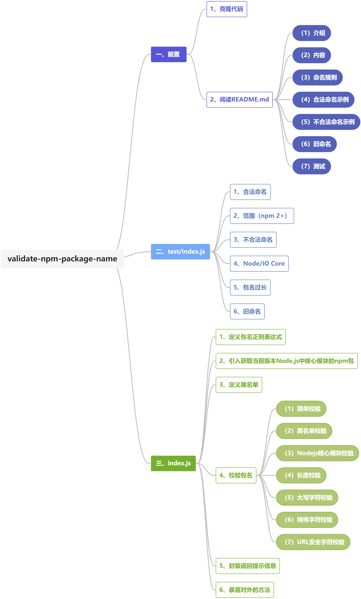

### 第七期 | validate-npm-package-name

本篇源码笔记是第七期，通过阅读和调试`npm/validate-npm-package-name/index.js`和`npm/validate-npm-package-name/test/index.js`，掌握了`npm`包的命名规则，同时熟悉了`validate-npm-package-name`这个`npm`包是如何校验`npm`包名是否合法。

`validate-npm-package-name`这部分源码相对而言比较简单，收获主要有以下几点：

（1）接触到`builtins`这个用于获取某一版本nodejs中使用到的核心模块，经常使用到的如`path`、`fs`等等。

（2）在封装组件时，应当将返回的提示信息剥离出来，进行适当封装，如`validate-npm-package-name/index.js`中的`done`方法。对于无需返回给业务组件的属性，可以使用`delete`删除该属性。

（3）在对组件进行更新时，应考虑对旧版本的兼容，如`validate-npm-package-name/index.js`为了兼容`npm`包的旧命名的判断，增加了一个`validForOldPackages`属性。

（4）在对入参进行判断时，为了使返回的提示信息更加清晰，可以分开判断，如依次判断是否是`null`、是否是`undefined`、是否是`string`类型、是否是空字符串、是否有前后空格等。



#### 一、前置

##### 1、克隆代码

```
git clone https://github.com/npm/validate-npm-package-name.git
```

##### 2、阅读`README.md`

**（1）介绍**

`validate-npm-package-name`用于校验`npm`包名是否合法，这个npm包会对外暴露一个同步方法，这个方法的入参是一个字符串，它会返回一个带有两个属性的对象，这两个属性都是布尔类型，分别是`validForNewPackages`和`validForOldPackages`。

**（2）内容**

`README.md`中包含命名规则、示例（包括合法命名的示例和不合法命名的示例）、旧命名、测试等几块内容。

**（3）命名规则**

第一，包名长度应大于0；

第二，包名中的所有字符都必须是小写的，即不允许大写或混和大小写名称；

第三，包名可以由连字符组成；

第四，包名必须不包含任何非url安全字符（印尼为名称最终成为URL的一部分）；

第五，包名不应以.或_开头；

第六，包名不包含前后空格；

第七，包名不包含以下任何字符：~)('!*；

第八，包名不能与`nodejs``io.js`核心模块或保留字符、黑名单字符相同，例如：

`http`、`stream`、`node_modules`、`favicon.ico`等；

第九，包名长度不能超过214；

**（4）合法命名示例**

```js
var validate = require("validate-npm-package-name");

validate("some-package");
validate("example.com");
validate("under_score");
validate("123numeric");
validate("@npm/thingy");
validate("@jane/foo.js");
```

**（5）不合法命名示例**

```js
validate("excited!");
validate(" leading-space:and:weirdchars");
```

**（6）旧命名**

如果你给函数一个曾经有效的命名，会返回如下内容：

```js
{
    validForNewPackages: false,
    validForOldPackages: true,
    warnings: [

    ]
}
```

**（7）测试**

```sh
npm install
npm test
```

#### 二、`test/index.js`

##### 1、合法命名

**（1）some-package**

validForNewPackages：true，validForOldPackages：true

**（2）example.com**

validForNewPackages：true，validForOldPackages：true

**（3）under_score**

validForNewPackages：true，validForOldPackages：true

**（4）period.js**

validForNewPackages：true，validForOldPackages：true

**（5）123numeric**

validForNewPackages：true，validForOldPackages：true

**（6）crazy!**（含有特殊字符!）

validForNewPackages：false，validForOldPackages：true

##### 2、范围（npm 2+）

**（1）@npm/thingy**

validForNewPackages：true，validForOldPackages：true

**（2）@npm-zors/money!time.js**（含有特殊字符!）

validForNewPackages：false，validForOldPackages：true

##### 3、不合法命名

**（1）''**

**（2）'.start-with-period'**（包名不应以.或_开头）

**（3）'_start-width-underscore'**（包名不应以.或_开头）

**（4）'contain:colons'**（包名必须不包含任何非url安全字符）

**（5）' leading-space'**（包名不包含前后空格）

**（6）'trailing-space '**（包名不包含前后空格）

**（7）'s/l/a/s/h/e/s'**（包名必须不包含任何非url安全字符）

**（8）'node_modules'**（包名不能与`nodejs``io.js`核心模块或保留字符、黑名单字符相同）

**（9）'favicon.ico'**（包名不能与`nodejs``io.js`核心模块或保留字符、黑名单字符相同）

##### 4、`Node/IO Core`

**（1）http**（包名不能与`nodejs``io.js`核心模块或保留字符、黑名单字符相同）

##### 5、包名过长

##### 6、旧命名

**（1） CAPITAL-LETTERS**（包名所有字符都必须是小写，不允许大写）

#### 三、`index.js`

##### 1、定义包名正则表达式

```javascript
var scopedPackagePattern = new RegExp('^(?:@([^/]+?)[/])?([^/]+?)$')
```


##### 2、引入获取当前版本`Node.js`中核心模块的`npm`包

```javascript
var builtins = require('builtins')
```

`node`版本为14.17.1时包括：`assert`、`buffer`、`child_process`、`cluster`、`console`、`constants`、`crypto`、`dgram`、`dns`、`domain`、`events`、`fs`、`http`、`https`、`module`、`net`、`os`、`path`、`process`、`punycode`、`querystring`、`readline`、`repl`、`stream`、`string_decoder`、`timers`、`tls`、`tty`、`url`、`util`、`v8`、`vm`、`zlib`.

##### 3、定义黑名单

目前黑名单里面只有`node_modules`和`favicon.ico`。

```javascript
var blacklist = [
  'node_modules',
  'favicon.ico'
]
```

##### 4、校验包名

**（1）简单校验**

包括`null`/`undefined`校验，是否是`string`类型，是否是空字符串，字符串前后是否有空格，是否以`.`/`_`开头等。

```javascript
var warnings = []
var errors = []

if (name === null) {
    errors.push('name cannot be null')
    return done(warnings, errors)
}

if (name === undefined) {
    errors.push('name cannot be undefined')
    return done(warnings, errors)
}

if (typeof name !== 'string') {
    errors.push('name must be a string')
    return done(warnings, errors)
}

if (!name.length) {
    errors.push('name length must be greater than zero')
}

if (name.match(/^\./)) {
    errors.push('name cannot start with a period')
}

if (name.match(/^_/)) {
    errors.push('name cannot start with an underscore')
}

if (name.trim() !== name) {
    errors.push('name cannot contain leading or trailing spaces')
}
```

**（2）黑名单校验**

```javascript
var warnings = []
var errors = []
blacklist.forEach(function (blacklistedName) {
    if (name.toLowerCase() === blacklistedName) {
      errors.push(blacklistedName + ' is a blacklisted name')
    }
})
```

**（3）`Nodejs`核心模块校验**

```javascript
var warnings = []
var errors = []
builtins.forEach(function (builtin) {
    if (name.toLowerCase() === builtin) {
      warnings.push(builtin + ' is a core module name')
    }
})
```

**（4）长度校验**

```javascript
var warnings = []
var errors = []
if (name.length > 214) {
    warnings.push('name can no longer contain more than 214 characters')
}
```

**（5）大写字符校验**

```javascript
var warnings = []
var errors = []
if (name.toLowerCase() !== name) {
    warnings.push('name can no longer contain capital letters')
}
```

**（6）特殊字符校验** ~'!()*

```javascript
var warnings = []
var errors = []
if (/[~'!()*]/.test(name.split('/').slice(-1)[0])) {
    warnings.push('name can no longer contain special characters ("~\'!()*")')
}
```

**（7）URL安全字符校验**

此处先用`encodeURIComponent`判断是否是URL中使用到的字符，如果是，再用包名正则表达式匹配，将用户名和包名分开校验。

```javascript
var warnings = []
var errors = []
if (encodeURIComponent(name) !== name) {
    // Maybe it's a scoped package name, like @user/package
    var nameMatch = name.match(scopedPackagePattern)
    if (nameMatch) {
      var user = nameMatch[1]
      var pkg = nameMatch[2]
      if (encodeURIComponent(user) === user && encodeURIComponent(pkg) === pkg) {
        return done(warnings, errors)
      }
    }

    errors.push('name can only contain URL-friendly characters')
  }
```

##### 5、封装返回提示信息

```javascript
var done = function (warnings, errors) {
    var result = {
        validForNewPackages: errors.length === 0 && warnings.length === 0,
        validForOldPackages: errors.length === 0,
        warnings: warnings,
        errors: errors
    }
    if (!result.warnings.length) delete result.warnings
    if (!result.errors.length) delete result.errors
    return result
}
```

##### 6、暴露对外的方法

```javascript
var validate = module.exports = function (name) {
    ......
}
validate.scopedPackagePattern = scopedPackagePattern
```

