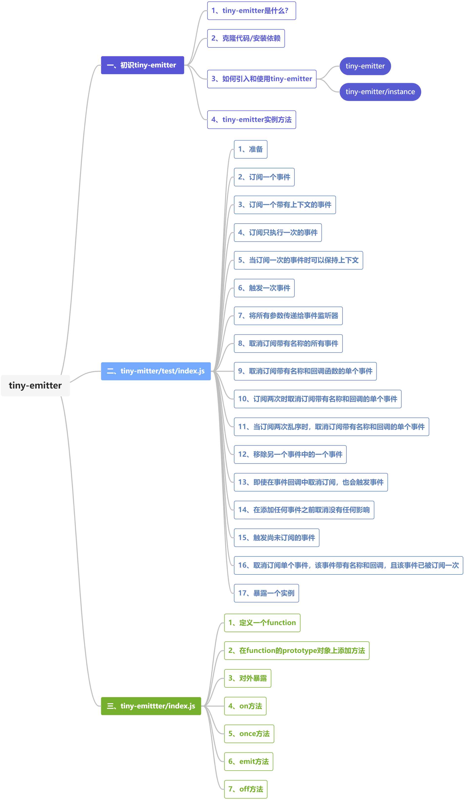
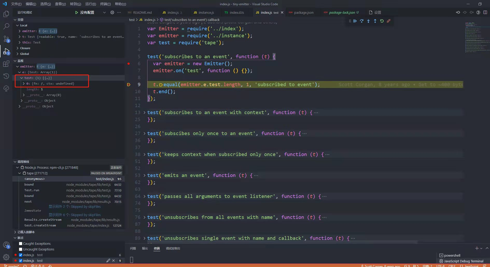
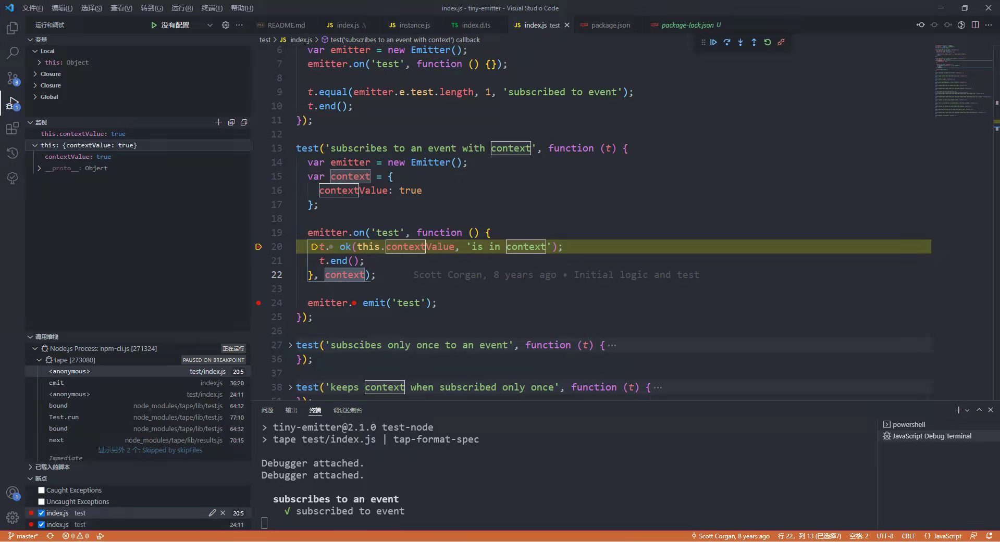
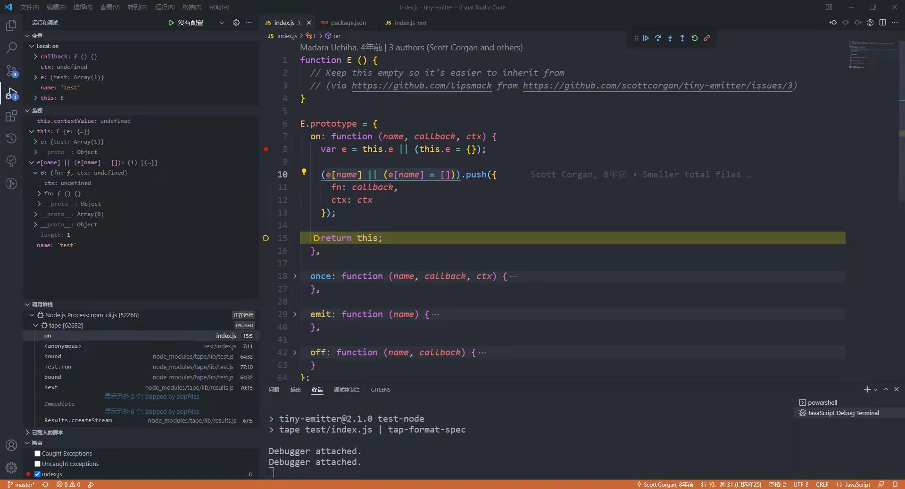
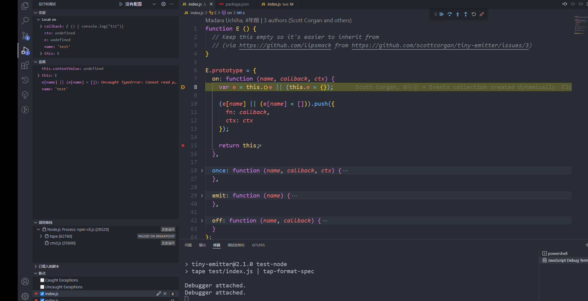
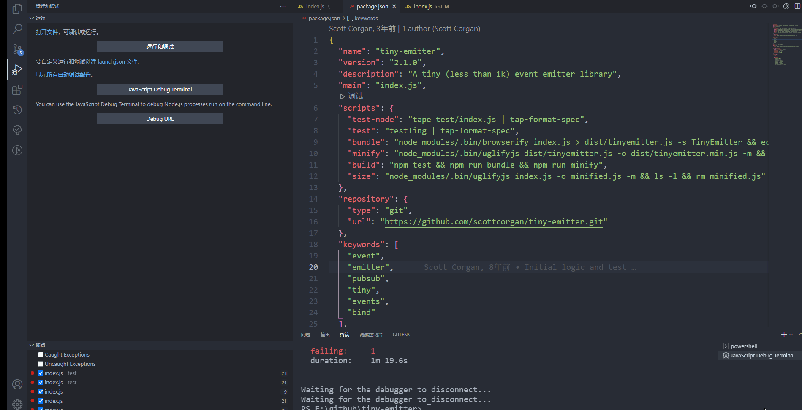

### 第八期 | tiny-emitter

本期源码笔记是第八期第二部分`tiny-emitter`。通过阅读和调试`tiny-mitter/test/index.js`和`tiny-emittter/index.js`，熟悉了`tiny-emitter`订阅/发布事件的整个流程。它其实与前面阅读的`mitt`订阅/发布事件的流程是类似的，比如都有`on`、`emit`和`off`方法，分别对应订阅事件、触发订阅事件和取消订阅事件。不同的是，`tiny-emitter`还多了一个`once`方法，用于处理某个事件只需要订阅一次的情况。因为它们有许多相似之处，有了`mitt`的基础，在阅读`tiny-emitter`的源码时，会稍微容易一些。



#### 一、初识tiny-emitter

##### 1、tiny-emitter是什么？

`tiny-emitter`是一个极小的事件发布订阅库。

##### 2、克隆代码/安装依赖

```
git clone https://github.com/scottcorgan/tiny-emitter.git
```

```sh
$ npm install
```

##### 3、如何引入和使用`tiny-emitter`

```sh
$ npm install tiny-emitter --save
```

##### （1）tiny-emitter

```javascript
var Emittter = require('tiny-emitter');
var emitter = new Emitter();
emitter.on('some-event', function(arg1, arg2, arg3) {
    //
})
emitter.emit('some-event', 'arg1 value', 'arg2 value', 'arg3 value');
```

##### （2）tiny-emitter/instance

```javascript
var emitter = require('tiny-emitter/instance');
emitter.on('some-event', function(arg1, arg2, arg3) {
    //
})
emitter.emit('some-event', 'arg1 value', 'arg2 value', 'arg3 value');
```

##### 4、`tiny-emitter`实例方法

###### （1）on(event, callback[, context])

`on`方法用于订阅事件。

###### （2）once(event, callback[, context])

`once`方法用于订阅事件一次。

###### （3）off(event[, callback])

`off`方法用于取消订阅一个事件或全部事件，如果没有传入`callback`，则取消订阅全部事件。

###### （4）emit(event[, arguments...])

`emit`方法用于触发一个事件。

#### 二、tiny-mitter/test/index.js

##### 1、准备

```javascript
var Emitter = require('../index');
var emitter = require('../instance');
var tape = require('tape');
```

##### 2、订阅一个事件

```javascript
test('subscribe to an event', function(t) {
    var emitter = new Emitter();
    emitter.on('test', function() {});
    t.equal(emitter.e.test.length, 1, 'subscribe to event');
    t.end();
})
```



##### 3、订阅一个带有上下文的事件

```javascript
test('subscribes to an event with context', function (t) {
  var emitter = new Emitter();
  var context = {
    contextValue: true
  };

  emitter.on('test', function () {
    t.ok(this.contextValue, 'is in context');
    t.end();
  }, context);

  emitter.emit('test');
});
```



##### 4、订阅只执行一次的事件

```javascript
test('subscibes only once to an event', function (t) {
  var emitter = new Emitter();

  emitter.once('test', function () {
    t.notOk(emitter.e.test, 'removed event from list');
    t.end();
  });

  emitter.emit('test');
});
```

##### 5、当订阅一次的事件时可以保持上下文

```javascript
test('keeps context when subscribed only once', function (t) {
  var emitter = new Emitter();
  var context = {
    contextValue: true
  };

  emitter.once('test', function () {
    t.ok(this.contextValue, 'is in context');
    t.notOk(emitter.e.test, 'not subscribed anymore');
    t.end();
  }, context);

  emitter.emit('test');
});
```

##### 6、触发一次事件

```javascript
test('emits an event', function (t) {
  var emitter = new Emitter();

  emitter.on('test', function () {
    t.ok(true, 'triggered event');
    t.end();
  });

  emitter.emit('test');
});
```

##### 7、将所有参数传递给事件监听器

```javascript
test('passes all arguments to event listener', function (t) {
  var emitter = new Emitter();

  emitter.on('test', function (arg1, arg2) {
    t.equal(arg1, 'arg1', 'passed the first argument');
    t.equal(arg2, 'arg2', 'passed the second argument');
    t.end();
  });

  emitter.emit('test', 'arg1', 'arg2');
});
```

##### 8、取消订阅带有名称的所有事件

```javascript
test('unsubscribes from all events with name', function (t) {
  var emitter = new Emitter();
  emitter.on('test', function () {
    t.fail('should not get called');
  });
  emitter.off('test');
  emitter.emit('test')

  process.nextTick(function () {
    t.end();
  });
});
```

##### 9、取消订阅带有名称和回调函数的单个事件

```javascript
test('unsubscribes single event with name and callback', function (t) {
  var emitter = new Emitter();
  var fn = function () {
    t.fail('should not get called');
  }

  emitter.on('test', fn);
  emitter.off('test', fn);
  emitter.emit('test')

  process.nextTick(function () {
    t.end();
  });
});
```

##### 10、订阅两次时取消订阅带有名称和回调的单个事件

```javascript
test('unsubscribes single event with name and callback when subscribed twice', function (t) {
  var emitter = new Emitter();
  var fn = function () {
    t.fail('should not get called');
  };

  emitter.on('test', fn);
  emitter.on('test', fn);

  emitter.off('test', fn);
  emitter.emit('test');

  process.nextTick(function () {
    t.notOk(emitter.e['test'], 'removes all events');
    t.end();
  });
});
```

##### 11、当订阅两次乱序时，取消订阅带有名称和回调的单个事件

```javascript
test('unsubscribes single event with name and callback when subscribed twice out of order', function (t) {
  var emitter = new Emitter();
  var calls = 0;
  var fn = function () {
    t.fail('should not get called');
  };
  var fn2 = function () {
    calls++;
  };

  emitter.on('test', fn);
  emitter.on('test', fn2);
  emitter.on('test', fn);
  emitter.off('test', fn);
  emitter.emit('test');

  process.nextTick(function () {
    t.equal(calls, 1, 'callback was called');
    t.end();
  });
});
```

##### 12、移除另一个事件中的一个事件

```javascript
test('removes an event inside another event', function (t) {
  var emitter = new Emitter();

  emitter.on('test', function () {
    t.equal(emitter.e.test.length, 1, 'event is still in list');

    emitter.off('test');

    t.notOk(emitter.e.test, 0, 'event is gone from list');
    t.end();
  });

  emitter.emit('test');
});
```

##### 13、即使在事件回调中取消订阅，也会触发事件

```javascript
test('event is emitted even if unsubscribed in the event callback', function (t) {
  var emitter = new Emitter();
  var calls = 0;
  var fn = function () {
    calls += 1;
    emitter.off('test', fn);
  };

  emitter.on('test', fn);

  emitter.on('test', function () {
    calls += 1;
  });

  emitter.on('test', function () {
    calls += 1;
  });

  process.nextTick(function () {
    t.equal(calls, 3, 'all callbacks were called');
    t.end();
  });

  emitter.emit('test');
});
```

##### 14、在添加任何事件之前取消没有任何影响

```javascript
test('calling off before any events added does nothing', function (t) {
  var emitter = new Emitter();
  emitter.off('test', function () {});
  t.end();
});
```

##### 15、触发尚未订阅的事件

```javascript
test('emitting event that has not been subscribed to yet', function (t) {
  var emitter = new Emitter();

  emitter.emit('some-event', 'some message');
  t.end();
});
```

##### 16、取消订阅单个事件，该事件带有名称和回调，且该事件已被订阅一次

```javascript
test('unsubscribes single event with name and callback which was subscribed once', function (t) {
  var emitter = new Emitter();
  var fn = function () {
    t.fail('event not unsubscribed');
  }

  emitter.once('test', fn);
  emitter.off('test', fn);
  emitter.emit('test');

  t.end();
});
```

##### 17、暴露一个实例

```javascript
test('exports an instance', function (t) {
  t.ok(emitter, 'exports an instance')
  t.ok(emitter instanceof Emitter, 'an instance of the Emitter class');
  t.end();
});
```

#### 三、tiny-emittter/index.js

##### 1、定义一个`function`

```javascript
function E () {
}
```

##### 2、在`function`的`prototype`对象上添加方法

```javascript
E.prototype = {
  on: function (name, callback, ctx) {
  },

  once: function (name, callback, ctx) {
  },

  emit: function (name) {
  },

  off: function (name, callback) {
  }
};
```

##### 3、对外暴露

```javascript
module.exports = E;
module.exports.TinyEmitter = E;
```

##### 4、`on`方法

先判断`this.e[name]`是否有值，如果有值则将传入的`name`,`callback`放入对应的`map`中。如果`name`已经存在，则继续放入。

```javascript
E.prototype = {
  on: function (name, callback, ctx) {
    var e = this.e || (this.e = {});

    (e[name] || (e[name] = [])).push({
      fn: callback,
      ctx: ctx
    });

    return this;
  },
}
```





##### 5、`once`方法

订阅只执行一次。

第一步，声明一个回调函数，回调函数中调用移除订阅的`off`方法；

第二步，调用生成订阅的`on`方法，此时将回调函数传入；

第三步，调用`emit`方法的时候，执行回调函数，移除订阅；

第四步，再次调用`emit`方法时，因为`evtArr`的数组为空，不执行后续操作。

```javascript
E.prototype = {
  once: function (name, callback, ctx) {
    // 此处先定义一个 self 变量，将this的值赋给它，方便后续在listener方法中获取外层的this对象
    // 并调用off方法，移除订阅
    var self = this;
    function listener () {
      self.off(name, listener);
      callback.apply(ctx, arguments);
    };

    listener._ = callback
    return this.on(name, listener, ctx);
  },
}
```



##### 6、`emit`方法

如果不是`once`，则会直接调用`on`时传入的`callback`函数；如果是`once`，由于调用`on`方法时传入的`callback`是一个`listener`函数，在listener函数中先执行了`off`方法，再执行调用`once`时传入的`callback`函数。

```javascript
E.prototype = {
  emit: function (name) {
    var data = [].slice.call(arguments, 1);
    var evtArr = ((this.e || (this.e = {}))[name] || []).slice();
    var i = 0;
    var len = evtArr.length;

    for (i; i < len; i++) {
      // 此处调用 回调函数
      evtArr[i].fn.apply(evtArr[i].ctx, data);
    }

    return this;
  },
}
```

##### 7、`off`方法

`off`方法用于移除订阅。

第一步，先判断对应名称的`evts`和`callback`是否存在；

第二步，遍历`evts`，判断`fn`或`fn._`是否与`callback`严格相等，如果不是，则放入另外一个数组中，这个数组用于替换原先的`evts`，同时将原先的`evts`删除。

```javascript
E.prototype = {
   off: function (name, callback) {
    var e = this.e || (this.e = {});
    var evts = e[name];
    var liveEvents = [];

    if (evts && callback) {
      for (var i = 0, len = evts.length; i < len; i++) {
        if (evts[i].fn !== callback && evts[i].fn._ !== callback)
          liveEvents.push(evts[i]);
      }
    }

    (liveEvents.length)
      ? e[name] = liveEvents
      : delete e[name];

    return this;
  }
}
```
