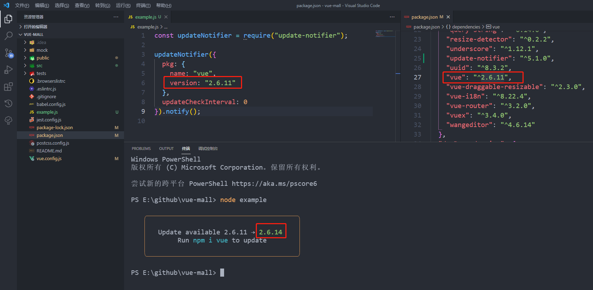

### 第六期 | update-notifier

**本期源码阅读的收获如下：**

（1）知识：

懒加载；

认识了一些`npm`工具包，这些工具包在平时的工作中有可能用到，如懒加载、获取`npm`包的版本信息、对`npm`包的两个版本号进行比较，`console`控制台的文字样式设置和高亮显示等等。

`import-lazy`，`is-ci`，`configstore`，`spawn`，`latest-version`，`semver-diff`，`is-npm`，`semver`，`chalk`，`pupa`，`is-installed-globally`，`is-yarn-global`，`has-yarn`

（2）对入参做处理时，应考虑兼容传入多种参数名称的情况。

**【yeoman/update-notifier】：** https://github.com/yeoman/update-notifier.git


#### 一、安装及调用

##### 1、安装

```
$ npm install update-notifier
```

##### 2、调用

`example.js`

```javascript
const updateNotifier = require("update-notifier");
updateNotifier({
    pkg: {
        name: "vue",
        version: "2.6.11"
    },
    updateCheckInterval: 0
}).notify();
```



##### 3、踩坑

根据`readme.md`中的示例，误以为传入的是整个`package.json`返回的对象，实际上并非如此，按照示例代码未能实现预期效果。

```javascript
const updateNotifier = require("update-notifier");
const pkg = require("./package.json")

updateNotifier({pkg}).notify();
```

#### 二、调试

##### 1、UpdateNotifier constructor

调用`constructor`方法时传入的是一个对象，如图所示：


```javascript
class UpdateNotifier {
    constructor(options = {}) {
		this.options = options;
		options.pkg = options.pkg || {};
		options.distTag = options.distTag || 'latest';

        // 对 name 和 version 做处理，支持传入 packageName 和 packageVersion
		options.pkg = {
			name: options.pkg.name || options.packageName,
			version: options.pkg.version || options.packageVersion
		};

        // 如果 name 或 version 有一个值不存在，则抛出异常
		if (!options.pkg.name || !options.pkg.version) {
			throw new Error('pkg.name and pkg.version required');
		}

		this.packageName = options.pkg.name;
		this.packageVersion = options.pkg.version;
        // 判断 传入的 updateCheckInterval 的类型是否是 number
        // 如果不是 number，则给一个常量值
		this.updateCheckInterval = typeof options.updateCheckInterval === 'number' ? options.updateCheckInterval : ONE_DAY;
        // 判断 process.env 中 是否有 NO_UPDATE_NOTIFIER
        // 或 process.env.NODE_ENV 等于 test
        // 或 process.argv 包含 --no-update-notifier
        // 或 当前环境是否是 持续集成的服务器
		this.disabled = 'NO_UPDATE_NOTIFIER' in process.env ||
			process.env.NODE_ENV === 'test' ||
			process.argv.includes('--no-update-notifier') ||
			isCi();
		this.shouldNotifyInNpmScript = options.shouldNotifyInNpmScript;

		if (!this.disabled) {
			try {
				const ConfigStore = configstore();
				this.config = new ConfigStore(`update-notifier-${this.packageName}`, {
					optOut: false,
					// Init with the current time so the first check is only
					// after the set interval, so not to bother users right away
					lastUpdateCheck: Date.now()
				});
			} catch {
				// Expecting error code EACCES or EPERM
				const message =
					chalk().yellow(format(' %s update check failed ', options.pkg.name)) +
					format('\n Try running with %s or get access ', chalk().cyan('sudo')) +
					'\n to the local update config store via \n' +
					chalk().cyan(format(' sudo chown -R $USER:$(id -gn $USER) %s ', xdgBasedir().config));

				process.on('exit', () => {
					console.error(boxen()(message, {align: 'center'}));
				});
			}
		}
	}

    check() {
    }

    async fetchInfo() {
    }

    notify(options) {
    }
}


module.exports = options => {
    const updateNotifier = new UpdateNotifier(options);
    updateNotifier.check();
    return updateNotifier();
}

module.exports.UpdateNotifier = UpdateNotifier;
```

##### 2、check

```javascript
check() {
    // 判断是否存在配置 或 是否禁用
    if (!this.config || this.config.get('optOut') || this.disabled) {
        return;
    }
    // 获取更新信息
    this.update = this.config.get('update');
    if (!this.update) {
        // 如果没有，则将当前版本赋值给更新信息
        this.update.current = this.packageVersion;
        this.config.delete('update');
    }
    // 判断当前时间减去配置信息中最后一次更新检查的时间 是否小于更新检查间隔，如果是 则返回
    if (Date.now() - this.config.get('lastUpdateCheck') < this.updateCheckInterval) {
        return;
    }

    spawn(process.execPath, [path.join(__dirname, 'check.js'), JSON.stringify(this.options)], {
        detached: true,
        stdio: 'ignore'
    }).uunref();
}
```


##### 3、fetchInfo

```javascript
async fetchInfo() {
    const {distTag} = this.options;
    // 用来获取最新的版本信息
    const latest = await latestVersion()(this.packageName, {version: distTag});

    return {
        latest,
        current: this.packageVersion,
        // 比较两个版本之间的差异
        type: semverDiff()(this.packageVersion, latest) || distTag,
        name: this.packageName
    }
}
```

##### 4、notify

```javascript
notify(options) {
    const suppressForNpm = !this.shouldNotifyInNpmScript && isNpm().isNpmOrYarn;
    if (!process.stdout.isTTY || suppressForNpm || !this.update || !semver().gt(this.update.latest, this.update.current)) {
        return this;
    }
    options = {
        isGlobal: isInstalledGlobally(),
        isYarnGlobal: isYarnGlobal()(),
        ...options
    }

    let installCommand;
    // 判断命令类型
    // yarn 全局安装
    // npm 全局安装
    // yarn 安装
    // npm 安装
    if (options.isYarnGlobal) {
        installCommand = `yarn global add ${this.packageName}`;
    } else if (options.isGlobal) {
        installCommand = `npm i -g ${this.packageName}`;
    } else if (hasYarn()()) {
        installCommand = `yarn add ${this.packageName}`;
    } else {
        installCommand = `npm i ${this.packageName}`;
    }

    const defaultTemplate = 'Update available ' +
        chalk().dim('{currentVersion}') +
        chalk().reset(' → ') +
        chalk().green('${latestVersion}') +
        ' \nRun ' + chalk().cyan('{updateCommand}') + ' to update';

    const template = options.message || defalutTemplate;

    options.boxenOptions = options.boxenOptios || {
        padding: 1,
        margin: 1,
        align: 'center',
        borderColor: 'yellow',
        borderStyle: 'round'
    }

    const message = boxen(){
        pupa()(template, {
            packageName: this.packageName,
            currentVersion: this.update.current,
            latestVersion: this.update.latest,
            updateCommand: installCommand
        }),
        options.boxenOptions
    }

    if (options.defer === false) {
        console.error(message);
    } else {
        process.on('exit', () => {
            console.error(message);
        });
        process.on('SIGINT', () => {
            console.error('');
            process.exit();
        })
    }

    return this;
}
```

#### 三、工具npm

##### 1、import-lazy

引入懒加载模块，按照自己的理解，加上后面那个`require`，表明是立即执行。

```javascript
const importLazy = require('import-lazy')(require);
```

##### 2、is-ci

判断当前环境是否是持续集成的服务器。

```javascript
const isCi = importLazy('is-ci');
```

##### 3、configstore

用来将`npm`包最后一次更新检查的时间保存下来。

```javascript
const configstore = importLazy('configstore');
```

##### 4、spawn

```javascript
const spawn = imoortLazy('spawn');
```

##### 5、latest-version

```javascript
const latestVersion = require('latest-version');
```

##### 6、semver-diff

返回两个版本之间的差异类型，可能的值有以下：

`major`，`premajor`，`minor`，`preminor`，`patch`，`prepatch`，`prerelease`，`build`，`undefined`

```javascript
const semverDiff = importLazy('semver-diff');

semverDiff()(this.packageVersion, latest) || distTag
```

##### 7、is-npm

判断是否是`npm`包。

```javascript
const isNpm = importLazy('is-npm');
```

```javascript
import {isNpmOrYarn, isNpm, isYarn} from 'is-npm';
console.log(isNpmOrYarn, isNpm, isYarn);
```

##### 8、semver

用于`npm`包的版本比较。

```javascript
const semver = importLazy('semver');
// gt 表示判断 最新版本 是否大于 当前版本
semver().gt(this.update.latest, this.update.current);

// 其他示例
gt(v1, v2): v1 > v2
gte(v1, v2): v1 >= v2
lt(v1, v2): v1 < v2
lte(v1, v2): v1 <= v2
eq(v1, v2): v1 == v2
```

##### 9、chalk

`console`控制台输出样式和高亮显示。

```javascript
const chalk = importLazy('chalk');
// 使文字具有较低的透明度
chalk().dim('{currentVersion}');
// 重置当前的样式
chalk().reset(' → ');
// 设置文字的颜色为绿色
chalk().green('{latestVersion}');
// 设置文字的颜色为蓝绿色
chalk().cyan('{updateCommand}');
```

##### 10、pupa

用于在`console`控制台模板中填充一些提示信息。

```javascript
const pupa = importLazy('pupa');
const template = options.message || defaultTemplate;
pupa()(template, {
	packageName: this.packageName,
	currentVersion: this.update.current,
	latestVersion: this.update.latest,
	updateCommand: installCommand
})
```

##### 11、is-installed-globally

判断包是否是全局安装。

```javascript
const isInstalledGlobally = importLazy('is-installed-globally');
```

##### 12、is-yarn-global

判断`yarn`是否是全局安装。

```javascript
const isYarnGlobal = importLazy('is-yarn-global');
```

##### 13、has-yarn

判断项目是否使用了`yarn`。

```javascript
const hasYarn = importLazy('has-yarn');
```

#### 四、其他js

##### 1、`latest-version/index.js`

```javascript
'use strict';
const packageJson = require('package-json');
const latestVersion = async (packageName, options) => {
    const {version} = await packageJson(packageName,toLowerCase(), options);
    return version;
}

module.exports = latestVersion;
module.exports.default = latestVersion;
```
