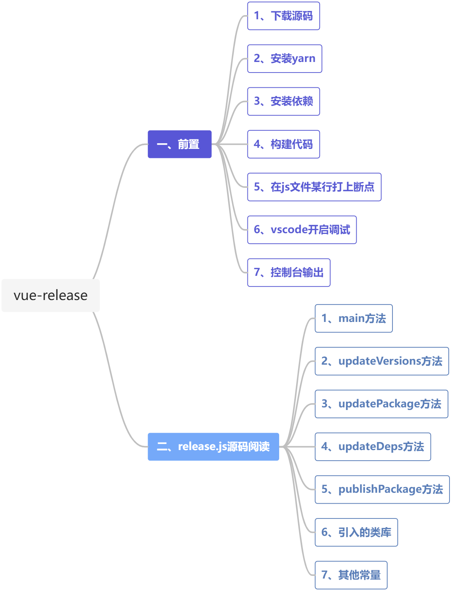
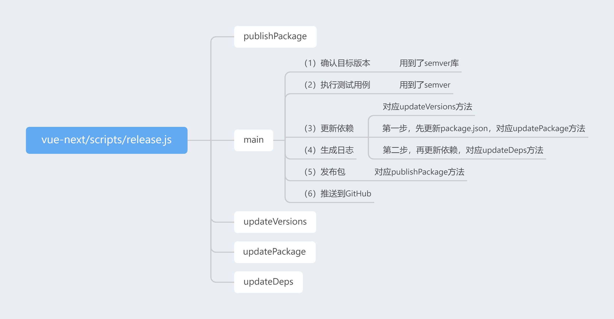

### 第三期 | vue-release

【若川】vue-release源码解读：https://juejin.cn/post/6997943192851054606

【纪年】vue-release源码解读：https://www.yuque.com/ruochuan12/group9/dv526b

本篇源码笔记是第三期，通过阅读和调试`vue-next/scripts/release.js`，熟悉了`vue-release`的大致发布流程，包括确认版本、执行测试用例、更新依赖、生成日志、发布包和推送到GitHub等步骤。自己比较独立的看完了，虽然有些细节的地方被自己遗漏了，但自己看完之后再结合【若川】和【纪年】的笔记补漏，感觉收获蛮多的。





[幕布 vue-next/scripts/release.js](https://mubu.com/doc/1y9IUWuG3TH)

### 一、前置

#### 1、下载源码

```
git clone https://github.com/vuejs/vue-next
// 或
git clone https://github.com/lxchuan12/vue-next-analysis
```

#### 2、安装yarn

```
npm install --global yarn
```

#### 3、安装依赖

```
yarn install
```

#### 4、构建代码

```
yarn build
```

#### 5、在js文件某行打上断点

#### 6、vscode开启调试

打开`package.json`，然后搜索`scripts`，在它的上方有个“调试”（或是`Debug`）按钮，点击它，然后搜索需要断点调试的js文件，点击它即可，

**注意：**

（1）vscode版本过低可能没有调试按钮，将vscode升级到最新版本即可，

（2）出现`Select release type`时，可以通过上下键切换`release type`，然后`enter`键确定。

（3）出现`Releasing v3.2.7. Confirm？(y/N) false`时，可以通过`T`键确定。

#### 7、控制台输出

```console
Running tests

Updating cross dependencies

    @vue/compiler-core -> dependencies -> @vue/shared@3.2.7
    @vue/compiler-dom -> dependencies -> @vue/shared@3.2.7
    @vue/compiler-dom -> dependencies -> @vue/compiler-core@3.2.7
    @vue/compiler-sfc -> dependencies -> @vue/compiler-core@3.2.7
    @vue/compiler-sfc -> dependencies -> @vue/compiler-dom@3.2.7
    @vue/compiler-sfc -> dependencies -> @vue/compiler-ssr@3.2.7
    @vue/compiler-sfc -> dependencies -> @vue/ref-transform@3.2.7
    @vue/compiler-sfc -> dependencies -> @vue/shared@3.2.7
    @vue/compiler-ssr -> dependencies -> @vue/shared@3.2.7
    @vue/compiler-ssr -> dependencies -> @vue/compiler-dom@3.2.7
    @vue/reactivity -> dependencies -> @vue/shared@3.2.7
    @vue/ref-transform -> dependencies -> @vue/compiler-core@3.2.7
    @vue/ref-transform -> dependencies -> @vue/shared@3.2.7
    @vue/runtime-core -> dependencies -> @vue/shared@3.2.7
    @vue/runtime-core -> dependencies -> @vue/reactivity@3.2.7
    @vue/runtime-dom -> dependencies -> @vue/shared@3.2.7
    @vue/runtime-dom -> dependencies -> @vue/runtime-core@3.2.7
    @vue/runtime-test -> dependencies -> @vue/shared@3.2.7
    @vue/runtime-test -> dependencies -> @vue/runtime-core@3.2.7
    @vue/server-renderer -> dependencies -> @vue/shared@3.2.7
    @vue/server-renderer -> dependencies -> @vue/compiler-ssr@3.2.7
    @vue/server-renderer -> peerDependencies -> vue@3.2.7
    vue -> dependencies -> @vue/shared@3.2.7
    vue -> dependencies -> @vue/compiler-dom@3.2.7
    vue -> dependencies -> @vue/runtime-dom@3.2.7
    @vue/compat -> peerDependencies -> vue@3.2.7

Building all packages

Committing changes

Publishing packages

Publishing compiler-core

Publishing compiler-dom

Publishing compiler-sfc

Publishing compiler-ssr

Publishing reactivity

Publishing ref-transform

Publishing runtime-core

Publishing runtime-dom

Publishing server-renderer

Publishing shared

Publishing vue

Publishing vue-compat

Pushing to GitHub
```
### 二、`release.js`源码阅读

`vue-next/scripts/release.js`

#### 1、`main`方法

**（1）确认目标版本**

用到了`semver`库

**（2）执行测试用例**

用到了`execa`库

**（3）更新依赖**

对应`updateVersions`方法

第一步，先更新`package.json`，对应`updatePackage`方法

第二步，再更新依赖，对应`updateDeps`方法

**（4）生成日志**

**（5）发布包**

对应`publishPackage`方法

**（6）推送到GitHub**

```javascript
async function main() {
    let targetVersion = args._[0]
    // 判断目标版本是否存在
    if (!targetVersion) {
        // 选择目标版本
        // no explicit version, offer suggestions
        const { release } = await prompt({
            type: 'select',
            name: 'release',
            message: 'Select release type',
            choices: versionIncrements.map(i => `${i} (${inc(i)})`).concat(['custom'])
        })
        // 判断是否需要自定义目标版本，如果是，则需要输入具体的目标版本
        if (release === 'custom') {
            targetVersion = (
                await prompt({
                    type: 'input',
                    name: 'version',
                    message: 'Input custom version',
                    initial: currentVersion
                })
            ).version
        } else {
            // 匹配目标版本
            targetVersion = release.match(/\((.*)\)/)[1]
        }
    }

    // 校验目标版本，如果不合法，则抛出异常
    if (!semver.valid(targetVersion)) {
        throw new Error(`invalid target version: ${targetVersion}`)
    }

    // 再次确认目标版本
    const { yes } = await prompt({
        type: 'confirm',
        name: 'yes',
        message: `Releasing v${targetVersion}. Confirm?`
    })

    if (!yes) {
        return
    }

    // 执行测试
    // run tests before release
    step('\nRunning tests...')
    if (!skipTests && !isDryRun) {
        await run(bin('jest'), ['--clearCache'])
        await run('yarn', ['test', '--bail'])
    } else {
        console.log(`(skipped)`)
    }

    // update all package versions and inter-dependencies
    step('\nUpdating cross dependencies...')
    // 先更新package.json，再更新依赖
    // 其中，先更新根目录下的package.json，再遍历更新其他package.json
    updateVersions(targetVersion)

    // build all packages with types
    step('\nBuilding all packages...')
    if (!skipBuild && !isDryRun) {
        await run('yarn', ['build', '--release'])
        // test generated dts files
        step('\nVerifying type declarations...')
        await run('yarn', ['test-dts-only'])
    } else {
        console.log(`(skipped)`)
    }

    // 生成日志
    // generate changelog
    await run(`yarn`, ['changelog'])
    const { stdout } = await run('git', ['diff'], { stdio: 'pipe' })
    if (stdout) {
        step('\nCommitting changes...')
        await runIfNotDry('git', ['add', '-A'])
        await runIfNotDry('git', ['commit', '-m', `release: v${targetVersion}`])
    } else {
        console.log('No changes to commit.')
    }

    // 发布包
    // publish packages
    step('\nPublishing packages...')
    for (const pkg of packages) {
        await publishPackage(pkg, targetVersion, runIfNotDry)
    }

    // 推送到github
    // push to GitHub
    step('\nPushing to GitHub...')
    await runIfNotDry('git', ['tag', `v${targetVersion}`])
    await runIfNotDry('git', ['push', 'origin', `refs/tags/v${targetVersion}`])
    await runIfNotDry('git', ['push'])
    if (isDryRun) {
        console.log(`\nDry run finished - run git diff to see package changes.`)
    }
    if (skippedPackages.length) {
        console.log(
            chalk.yellow(
                `The following packages are skipped and NOT published:\n- ${skippedPackages.join(
                '\n- '
                )}`
            )
        )
    }
    console.log()
}
```

#### 2、`updateVersions`方法

```javascript
function updateVersions(version) {
  // 1. update root package.json
  updatePackage(path.resolve(__dirname, '..'), version)
  // 2. update all packages
  packages.forEach(p => updatePackage(getPkgRoot(p), version))
}
```

#### 3、`updatePackage`方法

```javascript
function updatePackage(pkgRoot, version) {
  const pkgPath = path.resolve(pkgRoot, 'package.json')
  const pkg = JSON.parse(fs.readFileSync(pkgPath, 'utf-8'))
  pkg.version = version
  updateDeps(pkg, 'dependencies', version)
  updateDeps(pkg, 'peerDependencies', version)
  fs.writeFileSync(pkgPath, JSON.stringify(pkg, null, 2) + '\n')
}
```

#### 4、`updateDeps`方法

```javascript
// 更新依赖
function updateDeps(pkg, depType, version) {
  const deps = pkg[depType]
  if (!deps) return
  Object.keys(deps).forEach(dep => {
    if (
        // 判断依赖的key值是不是 vue 或是 以@vue开头 或是 包含@vue
        dep === 'vue' ||
        (dep.startsWith('@vue') && packages.includes(dep.replace(/^@vue\//, '')))
        ) {
            console.log(
                chalk.yellow(`${pkg.name} -> ${depType} -> ${dep}@${version}`)
            )
            deps[dep] = version
        }
    })
}
```

#### 5、`publishPackage`方法

```javascript
// 发布包
async function publishPackage(pkgName, version, runIfNotDry) {
    if (skippedPackages.includes(pkgName)) {
        return
    }
    const pkgRoot = getPkgRoot(pkgName)
    const pkgPath = path.resolve(pkgRoot, 'package.json')
    const pkg = JSON.parse(fs.readFileSync(pkgPath, 'utf-8'))
    if (pkg.private) {
        return
    }
    // For now, all 3.x packages except "vue" can be published as
    // `latest`, whereas "vue" will be published under the "next" tag.
    let releaseTag = null
    if (args.tag) {
        releaseTag = args.tag
    } else if (version.includes('alpha')) {
        releaseTag = 'alpha'
    } else if (version.includes('beta')) {
        releaseTag = 'beta'
    } else if (version.includes('rc')) {
        releaseTag = 'rc'
    } else if (pkgName === 'vue') {
        // TODO remove when 3.x becomes default
        releaseTag = 'next'
    }
    // TODO use inferred release channel after official 3.0 release
    // const releaseTag = semver.prerelease(version)[0] || null
    step(`Publishing ${pkgName}...`)
    try {
        await runIfNotDry(
            'yarn',
            [
                'publish',
                '--new-version',
                version,
                ...(releaseTag ? ['--tag', releaseTag] : []),
                '--access',
                'public'
            ],
            {
                cwd: pkgRoot,
                stdio: 'pipe'
            }
        )
        console.log(chalk.green(`Successfully published ${pkgName}@${version}`))
  } catch (e) {
    if (e.stderr.match(/previously published/)) {
        console.log(chalk.red(`Skipping already published: ${pkgName}`))
    } else {
        throw e
    }
  }
}
```

#### 6、引入的类库

```javascript
// 用于解析参数
const args = require('minimist')(process.argv.slice(2))

// 用于文件读写
const fs = require('fs')

// 用于获取路径
const path = require('path')

// 用于控制台高亮输出
const chalk = require('chalk')

// 用于版本号处理
const semver = require('semver')

// 用于询问确认
const { prompt } = require('enquirer')

// 用于执行脚本命令
const execa = require('execa')
```
#### 7、其他常量

```javascript
const currentVersion = require('../package.json').version
const preId =
  args.preid ||
  (semver.prerelease(currentVersion) && semver.prerelease(currentVersion)[0])
const isDryRun = args.dry
const skipTests = args.skipTests
const skipBuild = args.skipBuild
const packages = fs
  .readdirSync(path.resolve(__dirname, '../packages'))
  .filter(p => !p.endsWith('.ts') && !p.startsWith('.'))
const skippedPackages = []
const versionIncrements = [
  'patch',
  'minor',
  'major',
  ...(preId ? ['prepatch', 'preminor', 'premajor', 'prerelease'] : [])
]
// 版本号往上增加
const inc = i => semver.inc(currentVersion, i, preId)
const bin = name => path.resolve(__dirname, '../node_modules/.bin/' + name)
// 执行脚本命令
const run = (bin, args, opts = {}) =>
  execa(bin, args, { stdio: 'inherit', ...opts })
const dryRun = (bin, args, opts = {}) =>
  console.log(chalk.blue(`[dryrun] ${bin} ${args.join(' ')}`), opts)
const runIfNotDry = isDryRun ? dryRun : run
const getPkgRoot = pkg => path.resolve(__dirname, '../packages/' + pkg)
const step = msg => console.log(chalk.cyan(msg))
```

**推荐：**

[fs-extra](https://www.npmjs.com/package/fs-extra)

[npm semver](https://www.npmjs.com/package/semver)

[npm execa](https://www.npmjs.com/package/execa)