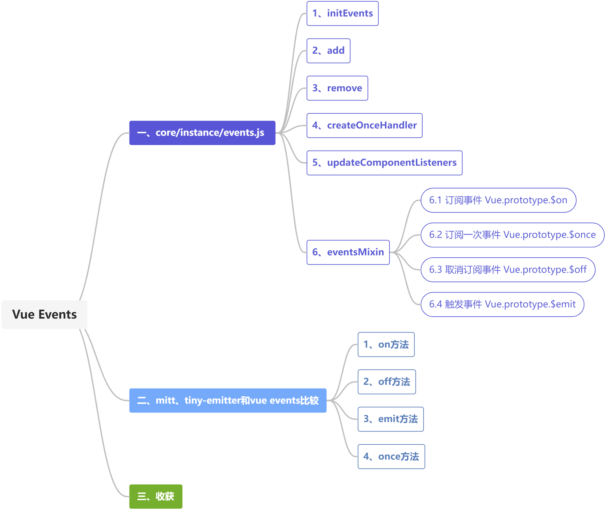

### 第八期 | vue events

本期源码笔记是第八期第三部分，主要是结合阅读[vue events.js](https://github.com/vuejs/vue/blob/dev/src/core/instance/events.js)源码，对事件发布订阅做一个简单的梳理。



### 一、core/instance/events.js

#### 1、initEvents

```javascript
export function initEvents (vm: Component) {
  vm._events = Object.create(null)
  vm._hasHookEvent = false
  // init parent attached events
  const listeners = vm.$options._parentListeners
  if (listeners) {
    updateComponentListeners(vm, listeners)
  }
}
```

#### 2、add

```javascript
function add (event, fn) {
  target.$on(event, fn)
}

```

#### 3、remove

```javascript
function remove (event, fn) {
  target.$off(event, fn)
}
```

#### 4、createOnceHandler

```javascript
function createOnceHandler (event, fn) {
  const _target = target
  return function onceHandler () {
    const res = fn.apply(null, arguments)
    if (res !== null) {
      _target.$off(event, onceHandler)
    }
  }
}
```

#### 5、updateComponentListeners

```javascript
export function updateComponentListeners (
  vm: Component,
  listeners: Object,
  oldListeners: ?Object
) {
  target = vm
  updateListeners(listeners, oldListeners || {}, add, remove, createOnceHandler, vm)
  target = undefined
}
```

#### 6、eventsMixin

与[tiny-emitter](https://github.com/scottcorgan/tiny-emitter.git)类似，有`$on`、`$once`、`$off`和`$emit`方法，分别对应订阅事件、订阅一次事件、取消订阅事件和触发事件等功能。

```javascript
export function eventsMixin (Vue: Class<Component>) {
  const hookRE = /^hook:/
  Vue.prototype.$on = function (event: string | Array<string>, fn: Function): Component {}

  Vue.prototype.$once = function (event: string, fn: Function): Component {}

  Vue.prototype.$off = function (event?: string | Array<string>, fn?: Function): Component {}

  Vue.prototype.$emit = function (event: string): Component {}
}
```

##### 6.1 订阅事件 Vue.prototype.$on

`Vue.prototype.$on`调用时会传入两个参数，分别是`event`和`fn`。其中，`event`为`string`类型或是`string`类型的数组，`fn`为一个`Function`。

（1）判断传入的`event`是否是数组，如果是，则遍历数组中的每个元素，调用`vm.$on`方法，订阅事件。

（2）如果不是数组，则判断`vm._events`中是否已经存在该事件，如果不存在，再将其放入`vm._events`中。

（3）判断传入的`event`字符串是否满足`hookRE`的正则校验，如果满足，则将`vm._hasHookEvent`的值设置为`true`。

```javascript
Vue.prototype.$on = function (event: string | Array<string>, fn: Function): Component {
    const vm: Component = this
    if (Array.isArray(event)) {
      for (let i = 0, l = event.length; i < l; i++) {
        vm.$on(event[i], fn)
      }
    } else {
      (vm._events[event] || (vm._events[event] = [])).push(fn)
      // optimize hook:event cost by using a boolean flag marked at registration
      // instead of a hash lookup
      if (hookRE.test(event)) {
        vm._hasHookEvent = true
      }
    }
    return vm
}
```

##### 6.2 订阅一次事件 Vue.prototype.$once

（1）定义一个`on`方法，函数内部执行两个操作，首先是调用`vm.off`方法，然后是使用`fn.apply`调用传入的`fn`方法。

（2）给`on`方法添加一个`fn`属性，将传入的`fn`赋值给该属性。

（3）调用`vm.$on`方法，订阅事件。

（4）返回`vm`。

```javascript
Vue.prototype.$once = function (event: string, fn: Function): Component {
    const vm: Component = this
    function on () {
      vm.$off(event, on)
      fn.apply(vm, arguments)
    }
    on.fn = fn
    vm.$on(event, on)
    return vm
}
```

##### 6.3 取消订阅事件 Vue.prototype.$off

（1）判断传入的`event`是否是数组，如果是，则遍历数组的每个元素，调用`vm.off`方法，然后直接返回`vm`。

（2）判断如果是传入的订阅事件存在，则将订阅事件中依次从`vm._events[event]`中移除，
```javascript
Vue.prototype.$off = function (event?: string | Array<string>, fn?: Function): Component {
    const vm: Component = this
    // all
    if (!arguments.length) {
      vm._events = Object.create(null)
      return vm
    }
    // array of events
    if (Array.isArray(event)) {
      for (let i = 0, l = event.length; i < l; i++) {
        vm.$off(event[i], fn)
      }
      return vm
    }
    // specific event
    const cbs = vm._events[event]
    if (!cbs) {
      return vm
    }
    if (!fn) {
      vm._events[event] = null
      return vm
    }
    // specific handler
    let cb
    let i = cbs.length
    while (i--) {
      cb = cbs[i]
      if (cb === fn || cb.fn === fn) {
        cbs.splice(i, 1)
        break
      }
    }
    return vm
  }
```

##### 6.4 触发事件 Vue.prototype.$emit

（1）从`vm._events[event]`中取出需要执行的订阅事件。

（2）遍历数组中的每个元素，调用`invokeWithErrorHandling`方法。

（3）`invokeWithErrorHandling`方法在`src/core/util/error.js`中定义。该方法中先判断传入的`args`是否有值，如果有值，则调用`handler.apply(context, args)`，如果没有值，则调用`handler.call(context)`，调用完之后对结果可能存在的异常进行捕获，并抛出相应的提示信息。

```javascript
Vue.prototype.$emit = function (event: string): Component {
    const vm: Component = this
    if (process.env.NODE_ENV !== 'production') {
      const lowerCaseEvent = event.toLowerCase()
      if (lowerCaseEvent !== event && vm._events[lowerCaseEvent]) {
        tip(
          `Event "${lowerCaseEvent}" is emitted in component ` +
          `${formatComponentName(vm)} but the handler is registered for "${event}". ` +
          `Note that HTML attributes are case-insensitive and you cannot use ` +
          `v-on to listen to camelCase events when using in-DOM templates. ` +
          `You should probably use "${hyphenate(event)}" instead of "${event}".`
        )
      }
    }
    let cbs = vm._events[event]
    if (cbs) {
      cbs = cbs.length > 1 ? toArray(cbs) : cbs
      const args = toArray(arguments, 1)
      const info = `event handler for "${event}"`
      for (let i = 0, l = cbs.length; i < l; i++) {
        invokeWithErrorHandling(cbs[i], vm, args, vm, info)
      }
    }
    return vm
  }
```

```javascript
export function invokeWithErrorHandling (
  handler: Function,
  context: any,
  args: null | any[],
  vm: any,
  info: string
) {
  let res
  try {
    res = args ? handler.apply(context, args) : handler.call(context)
    if (res && !res._isVue && isPromise(res) && !res._handled) {
      res.catch(e => handleError(e, vm, info + ` (Promise/async)`))
      // issue #9511
      // avoid catch triggering multiple times when nested calls
      res._handled = true
    }
  } catch (e) {
    handleError(e, vm, info)
  }
  return res
}
```

### 二、`mitt`、`tiny-emitter`和`vue events`比较


| **方法**  | **mitt** |  **tiny-emitter**  | **vue events** |
| ------------- |-------------|------------- |-------------|
| **订阅事件** |  on | on | Vue.prototype.$on |
| **取消订阅事件** | off | off | Vue.prototype.$off |
| **订阅一次事件** |  | once | Vue.prototype.$once |
| **触发事件** | emit | emit | Vue.prototype.$emit |


#### 1、`on`方法

##### 1.1 不同点

（1）订阅事件时的处理方式不同。

其中：

`mitt`是判断从`all.get()`中取出的`handlers`是否有值，如果有值，则往数组中继续添加传入的`handlers`，如果不存在，则使用`all!.set`方法添加一个新的`key`。

```typescript
on<Key extends keyof Events>(type: Key, handler: GenericEventHandler) {
    // 根据传入的 type 获得对应的 handlers
    const handlers: Array<GenericEventHandler> | undefined = all.get(type);
    if (handlers) {
        // 如果 handlers 有值。则往数组里再添加一个
        handlers.push(handler);
    } else {
        // 如果没有值，则往map里面添加一个，key 值为传入的 type，值则为一个 EventHandlerList
        all!.set(type, [handler] as EventHandlerList<Events[keyof Events]>);
    }
}
```

`tiny-emitter`则是判断订阅事件是否存在，如果不存在，则将其添加到数组中。

```javascript
E.prototype = {
  on: function (name, callback, ctx) {
    var e = this.e || (this.e = {});

    (e[name] || (e[name] = [])).push({
      fn: callback,
      ctx: ctx
    });

    return this;
  },
}
```

`vue events`的判断与`tiny-emitter`类似，但`vue events`支持同时订阅多个事件。

#### 2、`off`方法

##### 2.1 不同点

（1）取消订阅时的处理方式不同。

其中：

`mitt`是使用`splice`方法将第一个满足条件的订阅事件删除。

```typescript
off<Key extends keyof Events>(type: Key, handler: GenericEventHandler) {
    // 根据传入的 type 获得对应的 handlers
    const handlers: Array<GenericEventHandler> | undefined = all.get(type);
    if (handlers) {
       handlers.splice(handlers.indexOf(handler) >>> 0, 1);
    } else {
        // 如果没有值，则往map里面添加一个，key 值为传入的 type，值则为一个 EventHandlerList
        all!.set(type, []);
    }
}
```

`tiny-emitter`是将同一事件标识中的事件遍历一遍，如果与取消订阅时传入的`fn`不同，则将其丢入定义好的一个新数组中。遍历完成之后，将新数组赋值给对应事件标识，并将原数组删除。而

```javascript
E.prototype = {
   off: function (name, callback) {
    var e = this.e || (this.e = {});
    var evts = e[name];
    var liveEvents = [];

    if (evts && callback) {
      for (var i = 0, len = evts.length; i < len; i++) {
        if (evts[i].fn !== callback && evts[i].fn._ !== callback)
          liveEvents.push(evts[i]);
      }
    }

    (liveEvents.length)
      ? e[name] = liveEvents
      : delete e[name];

    return this;
  }
}
```

`vue events`则是先判断传入的是否时数组，如果不是，则遍历判断是否与取消订阅时传入的`fn`相同，如果相同，则使用`splice`方法将其删除。

#### 3、`emit`方法

##### 3.1 不同点

（1）触发事件时的处理方式不同。

其中：

`mitt`是通过`get`方法从数组中取出需要执行的回调函数，并依次执行。然后判断是否有需要全部事件都执行的回调函数，如果有，则依次执行。

```typescript
emit<Key extends keyof Events>(type: Key, evt?: Events[Key]) {
    let handlers = all!.get(type);
    if (handlers) {
        (handlers as EventHandlerList<Events[keyof Events]>)
            .slice()
            .map((handler) => {
                handler(evt!);
            });
    }

    // 判断是否需要调用*的事件处理程序
    handlers = all!.get('*');
    if (handlers) {
        (handlers as WildCardEventHandlerList<Events>)
            .slice()
            .map((handler) => {
                handler(type, evt!);
            })
    }
}
```

`tiny-emitter`是使用`evtArr[i].fn.apply`去做处理。

```javascript
E.prototype = {
  emit: function (name) {
    var data = [].slice.call(arguments, 1);
    var evtArr = ((this.e || (this.e = {}))[name] || []).slice();
    var i = 0;
    var len = evtArr.length;

    for (i; i < len; i++) {
      // 此处调用 回调函数
      evtArr[i].fn.apply(evtArr[i].ctx, data);
    }

    return this;
  },
}
```

`vue events`则是从`vm._events`中取出需要执行的回调函数，遍历其中每个元素，使用`invokeWithErrorHandling`对其进行处理，并将执行过程中的异常捕获，并抛出相应的提示信息。

#### 4、`once`方法

##### 4.1 相同点

（1）均传入了事件名称和回调函数两个参数。

其中，`tiny-emitter`传入的是`name`和`callback`，`vue events`传入的是`event`和`fn`。

（2）均定义了一个新的方法，在该方法中，先调用各自的`off`方法，然后再使用`apply`调用传入的回调函数。

##### 4.2 不同点

（1）`tiny-emitter`入参多了一个`ctx`


### 三、收获

（1）通过阅读和调试`mitt`、`tiny-emitter`和`vue events`三个事件订阅发布的源码实现，对于事件发布订阅有了更加清晰的认识。三者的实现思路大同小异，都包括了订阅事件、触发事件和取消订阅这三个基本功能。其中，`ting-emitter`和`vue events`还可以仅订阅一次事件，实现思路则是将传入的回调函数绑定到一个新的函数上，在触发事件的时候，先执行取消订阅的方法，然后再通过`apply`方法去调用原本要调用的回调函数。

（2）如果想手动调用`vue events`的`$on`、`$off`、`$emit`和`$once`方法，可以修改`vue`项目中的`main.js`。

```javascript
import Vue from "vue";
import App from "./App.vue";

Vue.config.productionTip = false;

const v = new Vue({
  render: (h) => h(App),
});

v.$mount("#app");

v.$on(["event-one", "event-two", "event-three"], () => {
  console.log("this is multi-event");
})

v.$on("event-one", () => {
  console.log("this is single-event");
})

setTimeout(() => {
  v.$emit("event-one");
}, 10000)
```