### 第十一期 | vue-dev-server

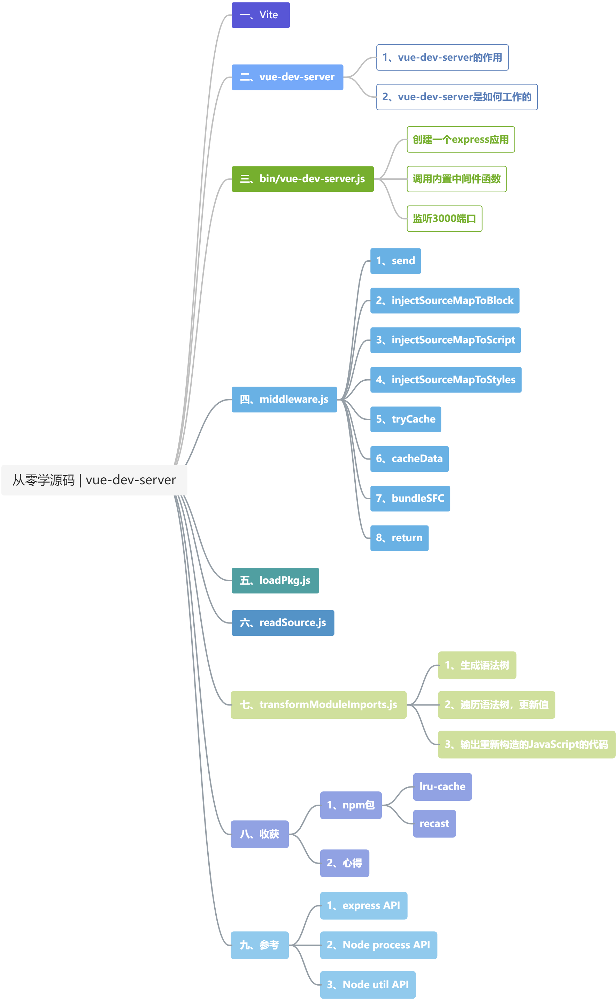

#### 一、Vite

[Vite 中文文档](https://cn.vitejs.dev/)

#### 二、vue-dev-server

##### 1、`vue-dev-server`的作用

在`package.json`是这样写的:"`Instant dev server for Vue single file component`"，即”用于Vue单文件组件的即时开发服务器“。

##### 2、`vue-dev-server`是如何工作的

（1）将浏览器请求导入作为原生ES模块导入；

（2）服务器拦截对`.vue`文件的请求，即时编译它们，将它们以JavaScript形式返回；

（3）对于提供在浏览器中工作的ES模块构建的库，只需直接从CDN引入它们；

（4）仅包名的`.js`文件的npm导入会动态重写，以指向本地安装的文件。目前，仅支持`vue`文件作为特例。其他包可能需要转换成以原生浏览器为目标的ES模块。

#### 三、bin/vue-dev-server.js

```js
const express = require('express')
const { vueMiddleware } = require('../middleware')

// 创建一个 express 应用
const app = express()
// 返回 Node.js 进程的当前工作目录。
const root = process.cwd()

app.use(vueMiddleware())

// express.static 是 Express 中的内置中间件函数，提供静态文件，并基于静态服务。
app.use(express.static(root))

// 监听3000端口
app.listen(3000, () => {
    console.log('server running at http://localhost:3000')
})
```

#### 四、middleware.js

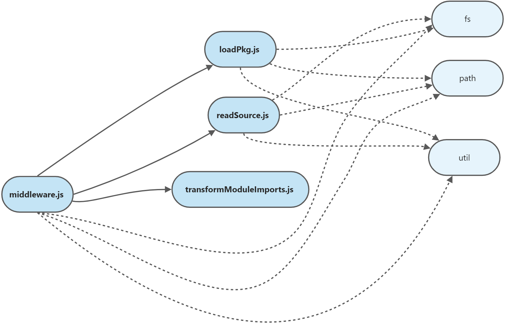

```js
const vueCompiler = require('@vue/component-compiler')
const fs = require('fs')
// Node util 实用工具，promisify 用于返回一个 promise
const stat = require('util').promisify(fs.stat)
const root = process.cwd()
const path = require('path')
// 将 url 进行解析
const parseUrl = require('parseurl')
const { transformModuleImports } = require('./transformModuleImports')
const { loadPkg } = require('./loadPkg')
const { readSource } = require('./readSource')

const defaultOptions = {
    cache: true
}

const vueMiddleware = (options = defaultOptions) => {
    let cache
    let time = {}
    if (options.cache) {
        const LRU = require('lru-cache')
        cache = new LRU({
            max: 500,
            length: function (n, key) { return n * 2 + key.length }
        })
    }

    const compiler = vueCompiler.createDefaultCompiler()

    function send(res, source, mime) {
        // ......
    }

    function injectSourceMapToBlack (block, lang) {
        // ......
    }

    function injectSourceMapToScript (script) {
        // ......
    }

    function injectSourceMapToStyles (styles) {
        // ......
    }

    async function tryCache (key, checkUpdateTime = true) {
        // ......
    }

    function cacheData (key, data, updateTime) {
        // ......
    }

    async function bundleSFC (req) {
        // ......
    }

    return async (req, res, next) {
        // ......
    }
}
exports.vueMiddleware = vueMiddleware
```

##### 1、send

设置响应头的`Content-Type`

```js
function send(res, source, mime) {
    res.sendHeader('Content-Type', mime)
    res.end(source)
}
```

##### 2、injectSourceMapToBlock

```js
function injectSourceMapToBlock(block, lang) {
    const map = Base64.toBase64(
        JSON.stringify(block.map)
    )
    let mapInject
    switch (lang) {
        case 'js': mapInject = `//# sourceMappingURL=data:application/json;base64,${map}\n`; break;
        case 'css': mapInject = `/*# sourceMappingURL=data:application/json;base64,${map}*/\n`; break;
        default: break;
    }

    return {
        ...block,
        code: mapInject + block.code
    }
}
```

##### 3、injectSourceMapToScript

```js
function injectSourceMapToScript(script) {
    return injectSourceMapToBlock(script, 'js')
}
```

##### 4、injectSourceMapToStyles

```js
function injectSourceMapToStyles(styles) {
    return styles.map(style => injectSourceMapToBlock(style, 'css'))
}
```

##### 5、tryCache

```js
async function tryCache(key, checkUpdateTime = true) {
    const data = cache.get(key)
    if (checkUpdateTime) {
        const cacheUpdateTime = time[key]
        const fileUpdateTime = (await stat(path.resolve(root, key.replace(/^\//, '')))).mtime.getTime()
        if (cacheUpdateTime < fileUpdateTime) return null
    }
    return data
}
```

##### 6、cacheData

该方法用来缓存数据。先获取缓存中的旧数据，然后比较数据，如果不相等，则将数据更新到缓存里面，同时更新一个记录更新时间的map。

```js
function cacheData(key, data, updateTime) {
    const old = cache.peek(key)
    if (old != data) {
        cache.set(key, data)
        if (updateTime) time[key] = updateTime
        return true
    } else return false
}
```

##### 7、bundleSFC

（1）filePath：文件路径

（2）source：文件里的内容

（3）updateTime：时间戳

```js
async function bundleSFC(req) {
    const { filePath, source, updateTime } = await readSource(req)
    const descriptorResult = compiler.compileToDescriptor(filePath, source)
    const assembledResult = vueCompiler.assemble(compiler, filePath, {
        ...descriptorResult,
        script: injectSourceMapToScript(descriptorResult.script),
        styles: injectSourceMapToStyles(descriptorResult.styles)
    })
    return { ...assembledResult, updateTime }
}
```

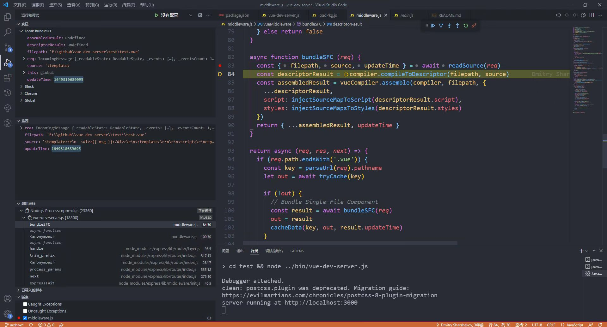

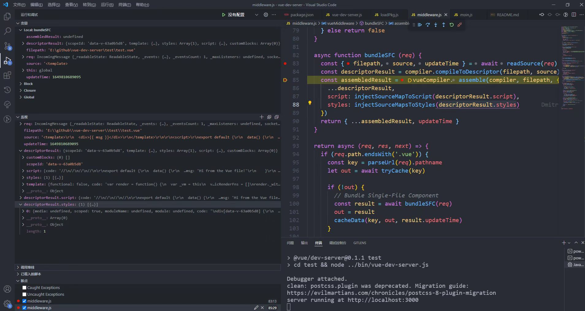

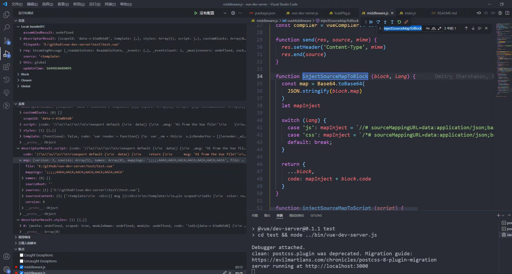

##### 8、return

这个是对外暴露的入口方法。

**情况1：请求的路径以'.vue'结尾**

（1）使用`parseUrl`获取请求中的`pathname`，然后调用`tryCache`方法，根据取到的`pathname`去缓存中取。

（2）如果缓存中没有取到，则调用`bundleSFC`方法去获取，得到结果之后，调用`cacheData`方法，将其缓存起来。

（3）得到结果之后，调用`send`方法，将其转换成`javascript`。

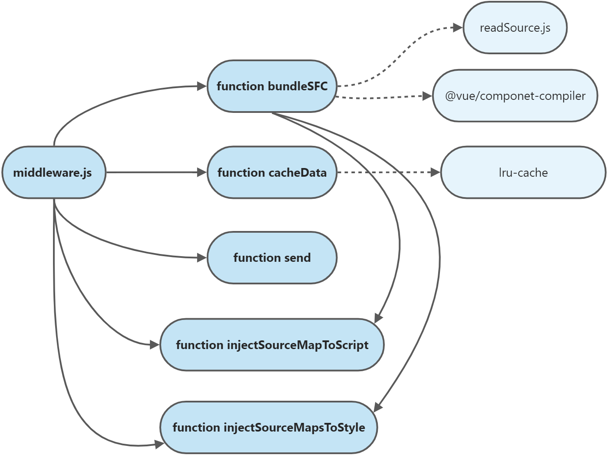

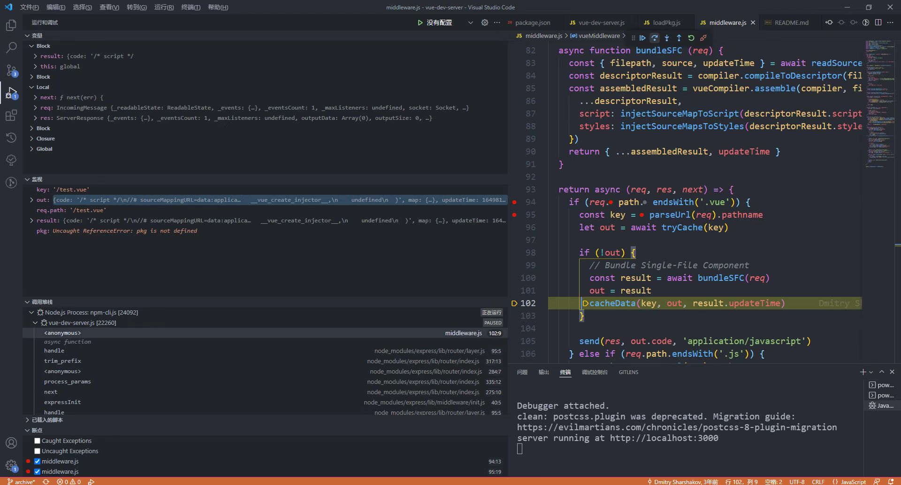

**情况2：请求的路径以'.js'结尾**

（1）使用`parseUrl`获取请求中的`pathname`和包名，然后调用`tryCache`方法，根据`pathname`去缓存中取。

（2）如果缓存中没有取到，则先调用`readSource`方法，然后将`result.source`传入`transformModuleImports`方法中解析。得到结果之后，调用`cacheData`方法，将其缓存起来。

（3）得到结果之后，调用`send`方法，将其转换成`javascript`。

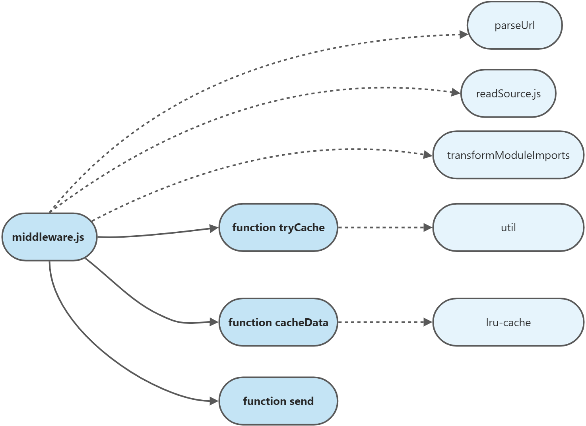

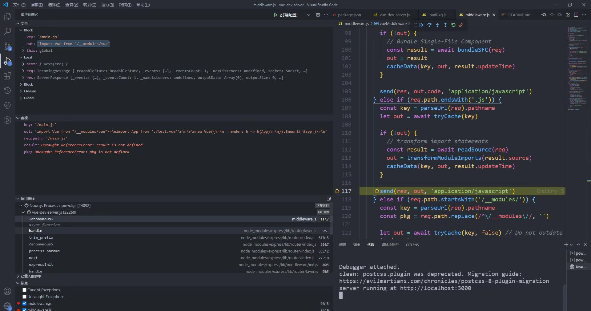

**情况3：请求的路径以'/__modules/'结尾**

（1）使用`parseUrl`获取请求中的`pathname`和包名，然后调用`tryCache`方法，根据`pathname`去缓存中取。

（2）如果缓存中没有取到，则调用`loadPkg`方法去获取，得到结果之后，调用`cacheData`方法，将其缓存起来。

（3）得到结果之后，调用`send`方法，将其转换成`javascript`。

（4）如果不满足条件，则调用`next()`，执行下一个。

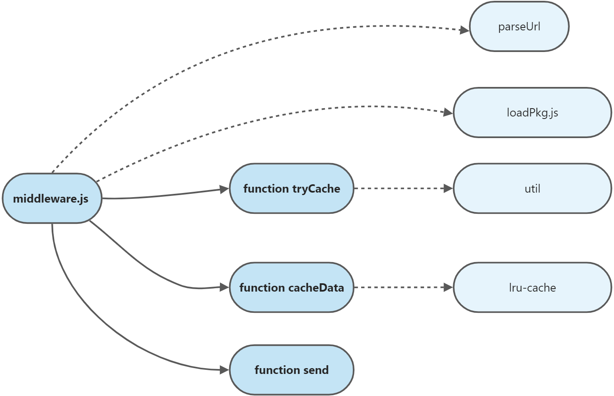

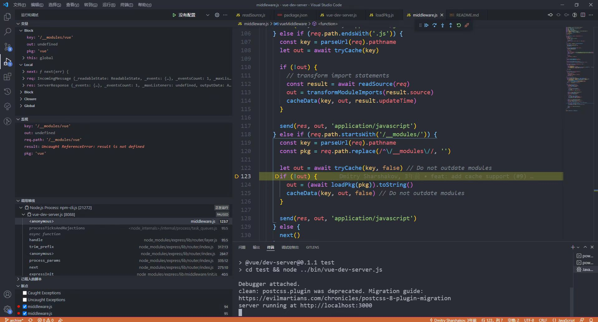

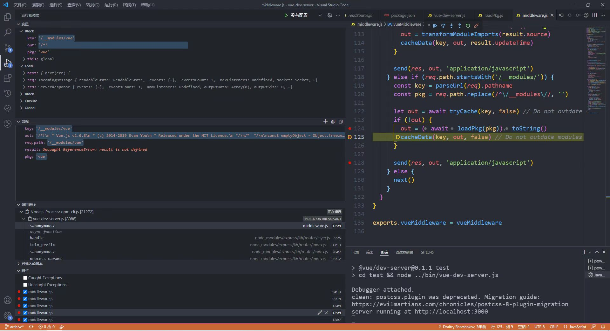

```js
return async (req, source, next) => {
    if (req.path.endsWith('.vue')) {
        // 情况1
        const key = parseUrl(req).pathname
        let out = await tryCache(key)
        if (!out) {
            const result = await bundleSFC(req)
            out = result
            cacheData(key, out, result.updateTIme)
        }
        send(res, out.code, 'application/javascript')
    } else if (req.path.endsWith('.js')) {
        // 情况2
        const key = parseUrl(req).pathname
        let out = await tryCache(key)
        if (!out) {
            const result = await readSource(req)
            out = transformModuleImports(result.source)
            cacheData(key, out, result.updateTIme)
        }
        send(res. out, 'application/javascript')
    } else if (req.path.endsWith('/__modules/')) {
        // 情况3
        const key = parseUrl(req).pathname
        const pkg = req.path.replace(/^\/__modules\//, '')
        let out = await tryCache(key, false)
        if (!out) {
            out = (await loadPkg(pkg)).toString()
            cacheData(key, out, false)
        }
        send(res. out, 'application/javascript')
    } else {
        next()
    }
}
```

#### 五、loadPkg.js

用于从本地加载`npm`包，目前只处理了`pkg`为`vue`的情况。

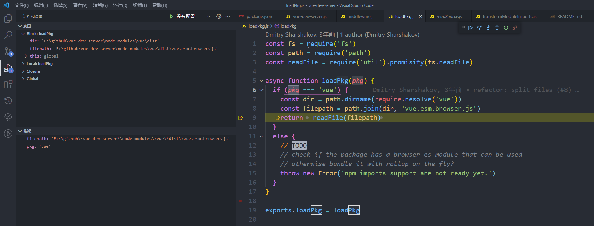

```js
const fs = require('fs')
const path = require('path')
const readFile = require('util').promisify(fs.readFile)
async function loadPkg(pkg) {
    if (pkg === 'vue') {
        const dir = path.dirname(require.resolve('vue'))
        const filepath = path.join(dir, 'vue.esm.browser.js')
        return readFile(filepath)
    } else {
        throw new Error('npm imports support are not ready yet.')
    }
}
exports.loadPkg = loadPkg
```

#### 六、readSource.js

用于根据文件路径去获取文件内容，同时返回文件路径、文件内容和更新时间等信息。

```js
const fs = require('fs')
const path = require('path')
const readFile = require('util').promisify(fs.readFile)
const stat = require('util').promisify(fs.stat)
const parseUrl = require('parseurl')
const root = process.cwd()

async function readSource(req) {
    const { pathname } = parseUrl(req)
    const filepath = path.resolve(root, pathname.replace(/^\//, ''))
    return {
        filepath,
        source: await readFile(filepath, 'utf-8')
        updateTime: (await stat(filepath)).mtime.getTime()
    }
}
exports.readSource = readSource
```

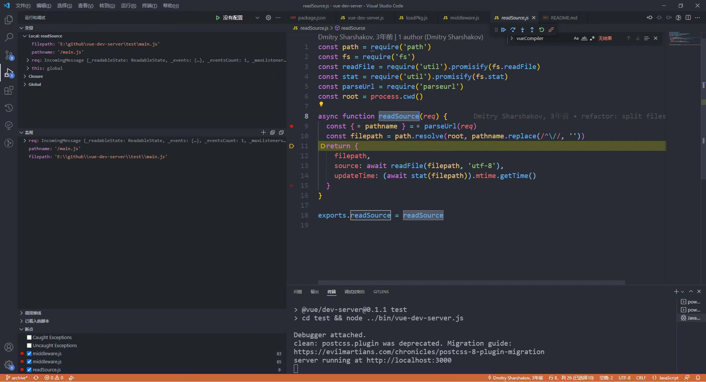

#### 七、transformModuleImports.js

```js
const recast = require('recast')
const isPkg = require('validate-npm-package-name')

function transformModuleImports(code) {
    const ast = recast.parse(code)
    recast.types.visit(ast, {
        visitImportDeclaration(path) {
            const source = path.node.source.value
            if (!/^\.\/?/.test(source) && isPkg(source)) {
                path.node.source = recast.types.builders.literal(`/__modules/${source}`)
            }
            this.traverse(path)
        }
    })
    return recast.print(ast).code
}
exports.transformModuleImports = transformModuleImports
```

##### 1、生成语法树

将传入的JavaScript代码使用`recast`的`parse`转换成ast语法树。

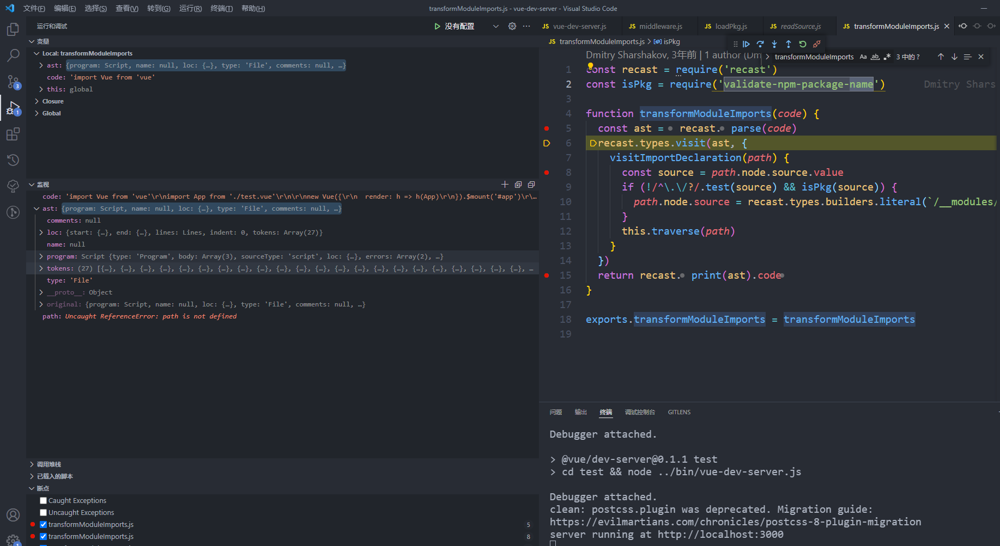

##### 2、遍历语法树，更新`path.node.source`的值，然后做转换

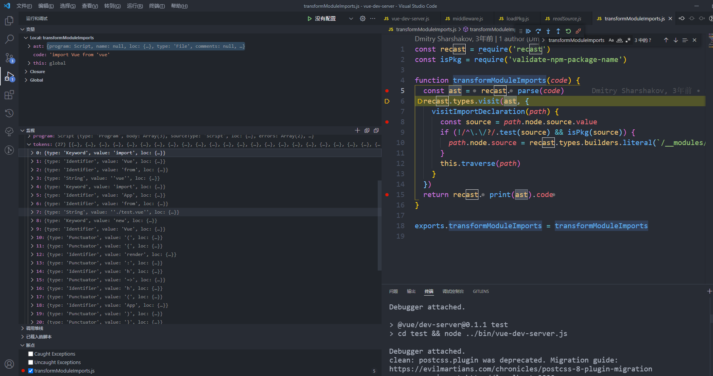

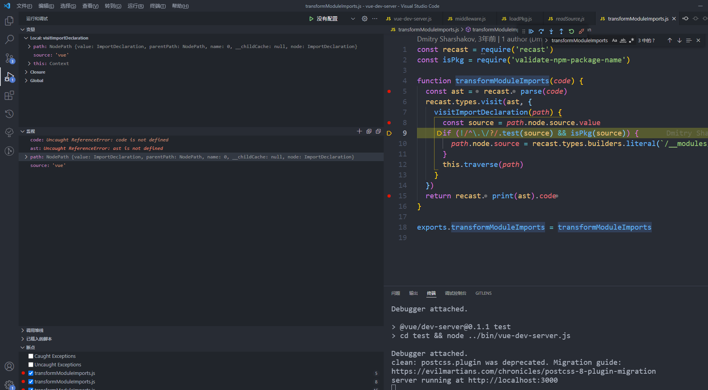

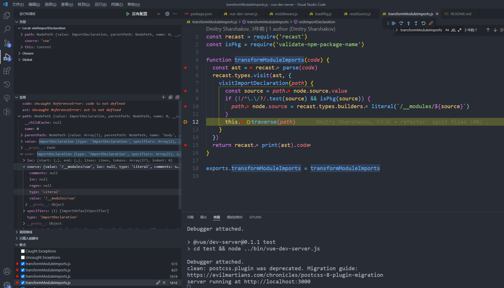

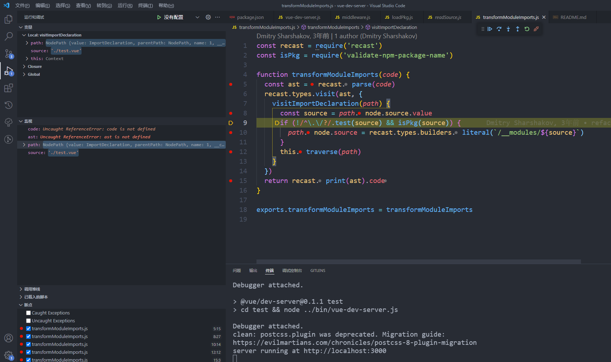

##### 3、使用`print`输出重新构造的JavaScript代码

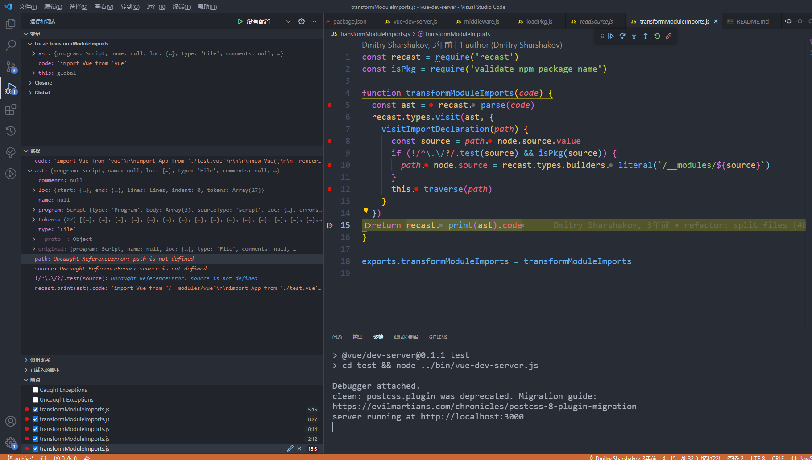

#### 八、收获

##### 1、npm包

（1）[lru-cache](https://www.npmjs.com/package/lru-cache)

**new LRUCache(options)**

**set(key, value)**

**get(key)**

会更新最近的项。

**peek(key, { allowStale } = {}) => value**

类似于`get`方法，但不会更新最近的项或删除陈旧的项。

（2）[recast](https://www.npmjs.com/package/recast)

用于构造语法树，它对外暴露了两个接口，一个是`parse`，用于将JavaScript代码转换成ast语法树，另一个是`print`，用于重新打印修改后的语法树。

##### 2、心得

通过阅读和调试`vue-dev-server`源码，熟悉了`vue-dev-server`的工作流程。分三种情况将`.vue`文件、`.js`文件和`/modules/`下面的文件进行解析，然后以`script`形式返回给页面。在解析的过程中，使用到了`readSource`、`transformModuleImports`、`loadPkg`分别用于根据文件路径去读取文件内容、生成新的语法树、从本地加载`npm`包。另外还用到了`lru-cache`先从缓存中读取，避免重复操作。对`ast`生成语法树部分，后面还需要加强理解。

#### 九、参考

##### 1、express API

（1）express()

（2）express.static(root, [options])

（3）app.use([path,] callback [, callback...])

在指定路径挂载指定中间件函数：当请求路径的前缀与路径匹配时，执行中间件函数。

（4）app.listen([port[, host[, backlog]]][, callback])

[express API](http://expressjs.com/en/4x/api.html)

##### 2、Node process API

（1）process.cwd()

[Node process API](http://nodejs.cn/api/process.html)

##### 3、Node util API

（1）[util.promisify(original)](http://nodejs.cn/api/util/util_promisify_original.html)

[Node util API](http://nodejs.cn/api/util.html)


