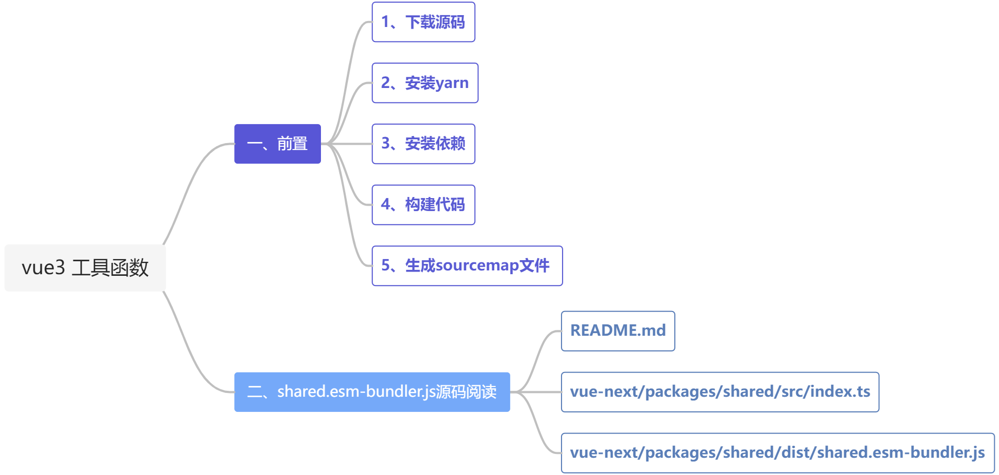

### 第二期 | vue3 工具函数

【若川】vue3工具函数源码解读：https://juejin.cn/post/6994976281053888519

【纪年】vue3工具函数源码解读：https://www.yuque.com/ruochuan12/cougi5/ccpmfi

本篇源码笔记是第二期，通过阅读和调试`vue-next/packages/shared/src/index.ts`，结合【若川】和【纪年】写的源码笔记，熟悉了vue3中使用到的一些工具函数，这些工具函数本身并不复杂，但对自己工作中简化工具类帮助还是蛮大的。



### 一、前置

#### 1、下载源码

```
git clone https://github.com/vuejs/vue-next
// 或
git clone https://github.com/lxchuan12/vue-next-analysis
```

#### 2、安装yarn

```
npm install --global yarn
```

#### 3、安装依赖

```
yarn install
```

#### 4、构建代码

```
yarn build
```

#### 5、生成`sourcemap`文件

在`package.json`文件中的`scripts`部分追加一行，然后在控制台执行 `yarn dev:sourcemap`命令。执行完之后查看`packages/vue/dist/vue.global.js.map`即为`vue.global.js`的`sourcemap`文件。

```
{
    "version": "3.2.1",
    "scripts": {
        "dev:sourcemap": "node scripts/dev.js --sourcemap"
    }
}
```

### 二、`shared.esm-bundler.js`源码阅读

`README.md`

`.github/contributing.md`

`vue-next/packages/shared/src/index.ts`

`vue-next/packages/shared/dist/shared.esm-bundler.js`

（1）babelParserDefaultPlugins

```typescript
export const babelParserDefaultPlugins = [
    'bigInt',
    'optionalChaining',
    'nullisCoalescingOperator'
] as const
```

（2）EMPTY_OBJ

```typescript
export const EMPTY_OBJ: { readonly [key: string]: any } = __DEV__
    ? Object.freeze({})
    : {}
```

（3）EMPTY_ARR

```typescript
export const EMPTY_ARR = __DEV__ ? Object.freeze([]) : []
```

（4）NOOP

```typescript
export const NOOP = {} => {}
```

（5）NO

```typescript
export const NO = () => false
```

**（6）isOn：** 判断字符串是否以on开头，且on后首字母是非小写字母。

```typescript
// ^符号在开头，则表示是什么开头。而在其他地方是指非。**
// 与之相反的是：$符合在结尾，则表示是以什么结尾。**
// [^a-z]是指不是a到z的小写字母。**

const onRE = /^on[^a-z]/
export const isOn = (key: string) => onRE.test(key)
```

**（7）isModelListener：** 判断是否是以`onUpdate`开头的监听器

```typescript
export const isModelListener = (key: string) => key.startWith('onUpdate:')
```

**（8）extend：** 合并对象

```typescript
export const extend = Object.assign
```

**（9）remove：** 移除数组中的某个元素

```typescript
export const remove = <T>(arr: T: [], el: T) => {
    const i = arr.indexOf(el)
    if(i > -1) {
        arr.splice(i, 1)
    }
}
```

**（10）hasOwn：** 判断某个属性是否属于某个对象

```typescript
const hasOwnProperty = Object.prototype.hasOwnProperty
export hasOwn = (
    val: object,
    key: string | symbol
): key is keyof typeof val => hasOwnProperty.call(val, key)
```

**（11）isArray：** 判断是否是数组

```typescript
export const isArray = Array.isArray
```

**（12）isMap：** 判断是否是Map

```typescript
export const isMap = (vak: unknown): val is Map<any, any> =>
 toTypeString(val) === '[object Map]'

// 示例：
const map = new Map();
const o = {p: 'Hello World'};
map.set(o, 'content')
console.log(Object.prototype.String.call(map)) // '[object Map]'
```

**（13）isSet：** 判断是否是Set

```typescript
export const isSet = (val: unknown): val is Set<any> =>
 toTypeString(val) === '[object Set]'
```

**（14）isDate：** 判断是否是Date

```typescript
export const isDate = (val: unknown): val is Date => val instancof Date
```

**（15）isFunction：** 判断是否是Function

```typescript
export const isFunction = (val: unknown): val is Function =>
   typeof val === 'function'
```

**（16）isString：** 判断是否是String

```typescript
export const isString = (val: unknown): val is string => typeof val === 'string'
```

**（17）isSymbol：** 判断是否是Symbol

```typescript
export const isSymbol = (val: unknown): val is symbol => typeof val === 'symbol'
```

**（18）isObject：** 判断是否是Object

```typescript
export const isObject = (val: unknown): val is Record<any, any> => {
    val !=== null && typeof val === 'object'
}
```

**（19）isPromise：** 判断是否是Promise

```typescript
export const isPromise = <T = any>(val: unknown): val is Promise<T> => {
    // 判断 传入的是否是对象，对象的then和catch是否是方法
    return isObject(val) && isFunction(val.then) && isFunction(val.catch)
}
```

**（20）toTypeString：** 将某个值的类型转换成字符串

```typescript
export const objectToString = Object.prototype.toString
export const toTypeString = (value: unknown): string =>
    objectToString.call(value)

// 示例：
console.log(Object.prototype.toString.call(2)) // [object Number]
console.log(Object.prototype.toString.call({"a": 1, "b": 2}})) // [object Object]

```

**（21）toRawType：** 对象转字符串，截取后第八位到倒数第二位

```typescript
export const toRawType = (value: unknown): string => {
    return toTypeString(value).slice(8, -1)
}
```

**（22）isPlainObject：** 判断是否是普通对象

```typescript
export const isPlainObject = (val: unknown): string =>
    toTypeString(val) === '[object Object]'
```

**（23）isIntegerKey：** 判断`key`值是否是整数

```typescript
export const isIntegerKey = (key: unknown) =>
    // 判断key值是字符串，不是NaN
    isString(key) &&
    key !== 'NaN' &&
    key[0] !== '-' &&
    '' + parseInt(key, 10) === key
```

**（24）isReservedProp：** 判断该属性是否为保留属性

```typescript
export const isReservedProp = /*#__PURE__*/ makeMap(
    // the leading column is intentional so empty string "" is also included
    ',key,ref' +
        'onVnodeBeforeMount,onVnodeMounted,' +
        'onVnodeBeforeUpdate,onVnodeUpdated,' +
        'onVnodeBeforeUnmount,onVnodeUnmounted'
)
```

**（25）cacheStringFunction：** 缓存字符串

```typescript
const cacheStringFunction = <T extends (str: string) => string>(fn: T): T => {
    const cache = Record<string, string> = Object.create(null)
    return ((str: string) =>{
        const hit = cache[str]
        return hit || (cache[str]) = fn(str)
    }) as any
}
 ```

**（26）camelize：** -连字符转小驼峰

```typescript
const camelizeRE = /-(\w)/g
export const camelize = cacheStringFunction((str: string): string => {
    return str.replace(camelizeRE, (_, c) => (c ? c.toUpperCase() : ''))
})
```

**（27）hyphenate：** 大写字母转-连字符

```typescript
const hyphenateRE = /\B([A-Z])/g
export const hyphenate = cacheStringFunction((str: string) =>
    str.replace(hyphenateRE, '-$`).toLowerCase()
)
```

**（28）capitalize：** 首字母大写

```typescript
export const capitalize = cacheStringFunction(
    (str: string) => str.charAt(0).toUpperCase() + str.slice(1)
)
```

**（29）toHandlerKey：** 在key值前面加`on`

```typescript
export const toHandlerKey = cacheStringFunction((str: string) =>
    str ? `on${capitalize(str)}` : ``
)
```

**（30）hasChanged：** 判断值是否有变化

```typescript
export const hasChanged = (value: any, oldValue: any): boolean =>
    !Object.is(value, oldValue)
```

**（31）invokeArrayFns：** 执行数组里的函数

```typescript
export const invokeArrayFns = (fns: Function[], arg?: any) => {
    for(let i = 0;i < fns.length; i++) {
        fns[i](arg)
    }
}
```

**（32）def：** 定义一个不可枚举的对象

```typescript
export const def = (obj: object, key: string | symbol, value: any) => {
    Object.defineProperty(obj, key, {
        configurable: true,
        enumerable: false,
        value
    })
}
```

**（33）toNumber：** 将字符串等转换成数值

```typescript
export const toNumber = (val: any): any => {
    const n = parseFloat(val)
    return isNaN(n) ? val : n
}
```

**（32）getGlobalThis：** 返回全局对象

```typescript
let _globalThis: any
export const getGlobalThis = (): any => {
    return {
        _globalThisL ||
        (_globalThis =
            typeof globalThis !== 'undefined'
            ? globalThis
            : typeof self !== 'undefined'
            ? self
            : typeof window !== 'undefined'
            ? window
            : typeof global !== 'undefined'
            ? global
            : {}
        )
    }
}
```

**推荐：**

[vuejs/vue-next](https://github.com/vuejs/vue-next)

[lxchuan12/vue-next-analysis](https://github.com/lxchuan12/vue-next-analysis)