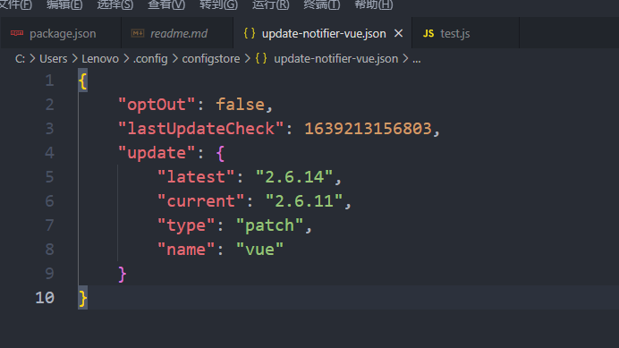
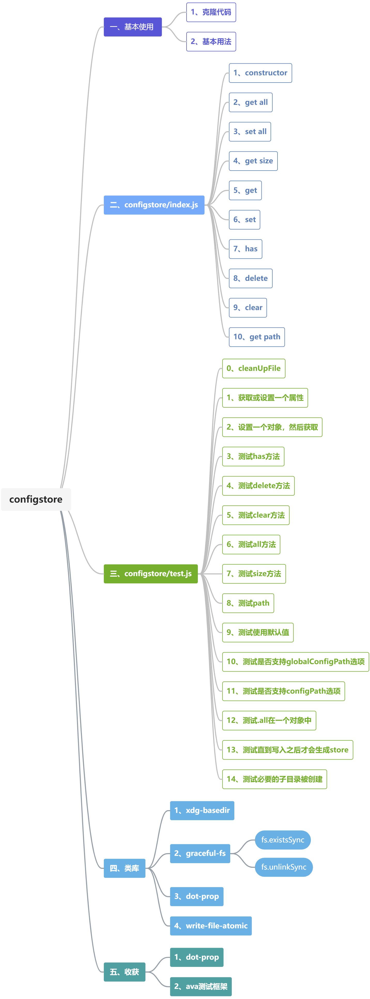
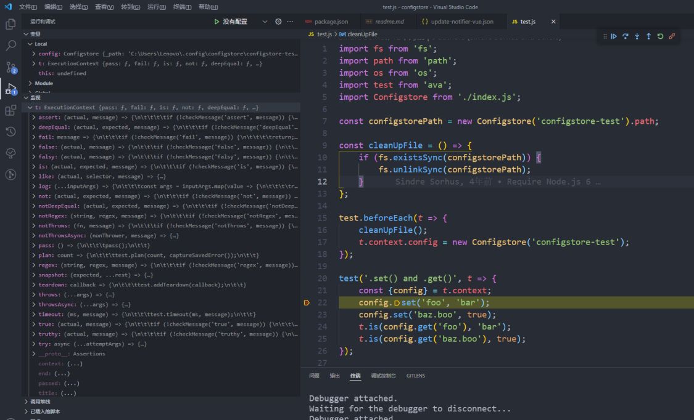
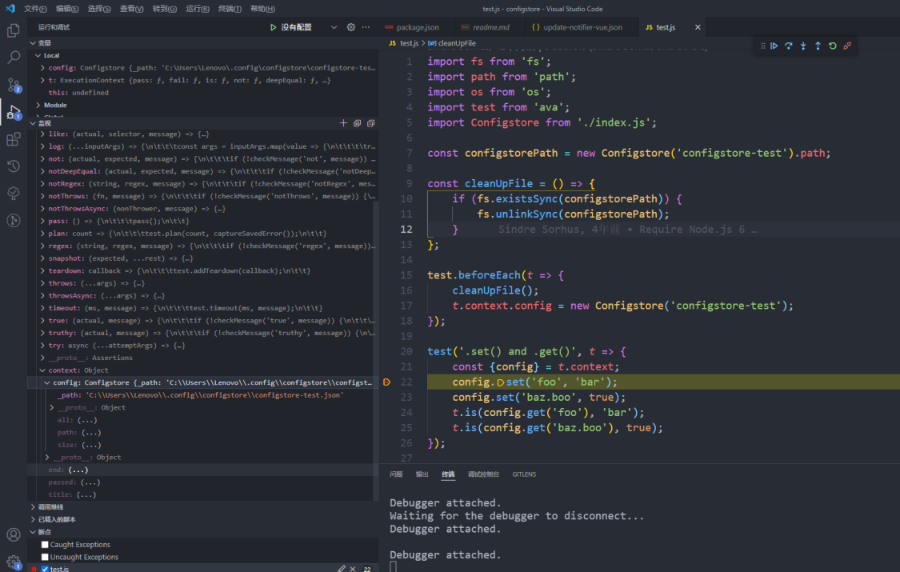

### 第十期 | configstore

`configstore`用于将配置信息保存到一个json文件中，这个json文件放在`$XDG_CONFIG_HOME`或是`~/.config`文件夹下面，例如`~/.config/configstore/some-id.json`。`configstore`这个`npm`包在`update-notifier`中有用到，用于将`npm`包的最后一次检查时间记录到本地的json文件中，有兴趣的可以将它克隆到本地阅读。

```javascript
const ConfigStore = configstore();
this.config = new ConfigStore(`update-notifier-${this.packageName}`, {
    optOut: false,
	// Init with the current time so the first check is only
    // after the set interval, so not to bother users right away
	lastUpdateCheck: Date.now()
});
```




**【yeoman/update-notifier】：** https://github.com/yeoman/update-notifier.git

**【yeoman/configstore】：** https://github.com/yeoman/configstore.git



#### 一、基本使用

##### 1、克隆代码

```sh
git clone https://github.com/yeoman/configstore.git
```

##### 2、基本用法

```javascript
import Configstore from 'configstore';

const packageJson = JSON.parse(fs.readFileSync('./package.json', 'utf8'));

// Create a Configstore instance.
const config = new Configstore(packageJson.name, {foo: 'bar'});

console.log(config.get('foo'));
//=> 'bar'

config.set('awesome', true);
console.log(config.get('awesome'));
//=> true

// Use dot-notation to access nested properties.
config.set('bar.baz', true);
console.log(config.get('bar'));
//=> {baz: true}

config.delete('awesome');
console.log(config.get('awesome'));
//=> undefined
```

#### 二、configstore/index.js

```javascript
import path from 'path';
import os from 'os';
import fs from 'graceful-fs';
import {xdgConfig} from 'xdg-basedir';
import writeFileAtomic from 'write-file-atomic';
import dotProp from 'dot-prop';
import uniqueString from 'unique-string';

export default class Configstore {
    constructor(id, defaults, options = {}) {}
    get all() {}
    set all(value) {}
    get size() {}
    get(key) {}
    set(key, value) {}
    has(key) {}
    delete(key) {}
    clear() {}
    get path() {}
}
```

##### 1、constructor

```javascript
import { xdgConfig } from 'xdg-basedir';
const configDirectory = xdgConfig || path.join(os.tmpdir(), uniqeString());
constructor(id, defaults, options = {}) {
    const pathPrefix = options.gloablConfigPath ?
        path.join(id, 'config.json') :
        path.join('configstore', `${id}.json`);
    this._path = options.configPath || path.join(configDirectory, pathPrefix);
    if (defaults) {
        this.all = {
            ...defaults,
            ...this.all
        }
    }
}
```

##### 2、get all

```javascript
import fs from 'graceful-fs';
const permissionError = 'You don\'t have access to this file.';
const writeFileOptions = {mode: 0o0600};

get all() {
    try {
        return JSON.parse(fs.readFileSync(this._path, 'utf-8'));
    } catch (error) {
        if (error.code === 'ENOENT') {
            return {};
        }
        if (error.code === 'EACESS') {
            error.message = `${error.message}\n${permissionError}\n`;
        }
        if (error.code === 'SyntaxError') {
            writeFileAtomic.sync(this._path, '', writeFileOptions);
            return {};
        }
        throw error;
    }
}
```

##### 3、set all

```javascript
import fs from 'graceful-fs';
const mkdirOptions = {mode: 0o0700, recursive: true};
const writeFileOptions = {mode: 0o0600};
set all(value) {
    try {
        fs.mkdirSync(path.dirname(this._path), mkdirOptions);
        writeFileAtomic.sync(this._path, JSON.stringify(value, undefined, '\t', writeFileOptions));
    } catch (error) {
        if (error.code === 'EACESS') {
            error.message = `${error.message}\n${permissionError}\n`;
        }
        throw error;
    }
}
```

##### 4、get size

```javascript
get size() {
    return Object.keys(this.all || {}).length;
}
```

##### 5、get 

```javascript
import dotProp from 'dot-prop';
get(key) {
    return dotProp.get(this.all, key);
}
```

##### 6、set

```javascript
import dotProp from 'dot-prop';
set(key, value) {
    const config = this.all;
    if (arguments.length === 1) {
        for (const k of Object.keys(key)) {
            dotDrop.set(config, k, key[k]);
        }
    } else {
        dotProp.set(config, key, value);
    }

    this.all = config;
}
```

##### 7、has

```javascript
has(key) {
    return dotProp.has(this.all, key);
}
```

##### 8、delete

```javascript
delete(key) {
    const config = this.all;
    dotProp.delete(config, key);
    this.all = config;
}
```

##### 9、clear

```javascript
clear() {
    this.all = {};
}
```

##### 10、get path

```javascript
get path() {
    return this._path;
}
```

#### 三、configstore/test.js

##### 0、cleanUpFile

```javascript
import fs from 'fs';
import path from 'path';
import os from 'os';
import test from 'ava';
import Configstore from './index.js';

const configstorePath = new Configstore('configstore-test').path;

const cleanUpFile = () => {
    // 同步检查给定路径中是否已存在文件
	if (fs.existsSync(configstorePath)) {
        // 同步删除文件
		fs.unlinkSync(configstorePath);
	}
};

// 在执行测试用例之前先检查指定路径下是否有文件，并将其删除
test.beforeEach(t => {
	cleanUpFile();
	t.context.config = new Configstore('configstore-test');
});
```

##### 1、获取或设置一个属性

```javascript
test('.set() and .get()', t => {
	const {config} = t.context;
	config.set('foo', 'bar');
	config.set('baz.boo', true);
	t.is(config.get('foo'), 'bar');
	t.is(config.get('baz.boo'), true);
});
```





##### 2、设置一个对象，然后获取

```javascript
test('.set() with object and .get()', t => {
	const {config} = t.context;
	config.set({
		foo1: 'bar1',
		foo2: 'bar2',
		baz: {
			boo: 'foo',
			foo: {
				bar: 'baz'
			}
		}
	});
	t.is(config.get('foo1'), 'bar1');
	t.is(config.get('foo2'), 'bar2');
	t.deepEqual(config.get('baz'), {
		boo: 'foo',
		foo: {
			bar: 'baz'
		}
	});
	t.is(config.get('baz.boo'), 'foo');
	t.deepEqual(config.get('baz.foo'), {bar: 'baz'});
	t.is(config.get('baz.foo.bar'), 'baz');
});
```

##### 3、测试`has`方法

```javascript
test('.has()', t => {
	const {config} = t.context;
	config.set('foo', '🦄');
	config.set('baz.boo', '🦄');
	t.true(config.has('foo'));
	t.true(config.has('baz.boo'));
	t.false(config.has('missing'));
});
```

##### 4、测试`delete`方法

```javascript
test('.delete()', t => {
	const {config} = t.context;
	config.set('foo', 'bar');
	config.set('baz.boo', true);
	config.set('baz.foo.bar', 'baz');
	config.delete('foo');
	t.not(config.get('foo'), 'bar');
	config.delete('baz.boo');
	t.not(config.get('baz.boo'), true);
	config.delete('baz.foo');
	t.not(config.get('baz.foo'), {bar: 'baz'});
	config.set('foo.bar.baz', {awesome: 'icecream'});
	config.set('foo.bar.zoo', {awesome: 'redpanda'});
	config.delete('foo.bar.baz');
	t.is(config.get('foo.bar.zoo.awesome'), 'redpanda');
});
```

##### 5、测试`clear`方法

```javascript
test('.clear()', t => {
	const {config} = t.context;
	config.set('foo', 'bar');
	config.set('foo1', 'bar1');
	config.set('baz.boo', true);
	config.clear();
	t.is(config.size, 0);
});
```

##### 6、测试`all`方法

```javascript
test('.all', t => {
	const {config} = t.context;
	config.set('foo', 'bar');
	config.set('baz.boo', true);
	t.is(config.all.foo, 'bar');
	t.deepEqual(config.all.baz, {boo: true});
});
```

##### 7、测试`size`方法

```javascript
test('.size', t => {
	const {config} = t.context;
	config.set('foo', 'bar');
	t.is(config.size, 1);
});
```

##### 8、测试`path`

```javascript
test('.path', t => {
	const {config} = t.context;
	config.set('foo', 'bar');
	t.true(fs.existsSync(config.path));
});
```

##### 9、测试使用默认值

```javascript
test('use default value', t => {
	const config = new Configstore('configstore-test', {foo: 'bar'});
	t.is(config.get('foo'), 'bar');
});
```

##### 10、测试是否支持`globalConfigPath`选项

```javascript
test('support `globalConfigPath` option', t => {
	const config = new Configstore('configstore-test', {}, {globalConfigPath: true});
	t.regex(config.path, /configstore-test(\/|\\)config.json$/);
});

```

##### 11、测试是否支持`configPath`选项

```javascript
test('support `configPath` option', t => {
	const customPath = path.join(os.tmpdir(), 'configstore-custom-path', 'foo.json');
	const config = new Configstore('ignored-namespace', {}, {
		globalConfigPath: true,
		configPath: customPath
	});
	t.regex(config.path, /configstore-custom-path(\/|\\)foo.json$/);
});
```

##### 12、测试`.all`在一个对象中

```javascript
test('ensure `.all` is always an object', t => {
	cleanUpFile();

	t.notThrows(() => {
		t.context.config.get('foo');
	});
});
```

##### 13、测试直到写入之后才会生成`store`

```javascript
test('the store is NOT created until write', t => {
	cleanUpFile();
	const config = new Configstore('configstore-test');
	t.false(fs.existsSync(config.path));
	config.set('foo', 'bar');
	t.true(fs.existsSync(config.path));
});
```

##### 14、测试必要的子目录被创建

```javascript
test('ensure necessary sub-directories are created', t => {
	const customPath = path.join(fs.mkdtempSync(path.join(os.tmpdir(), 'configstore-recursive-')), 'foo', 'bar', 'baz.json');
	const config = new Configstore('ignored-namespace', undefined, {
		globalConfigPath: true,
		configPath: customPath
	});
	t.false(fs.existsSync(config.path));
	config.set('foo', 'bar');
	t.true(fs.existsSync(config.path));
});
```

#### 四、类库

##### 1、xdg-basedir

为`linux`准备的用于获取目录等的类库。

##### 2、graceful-fs

对`fs module`做了改进。

**（1）fs.existsSync**

用于同步检查给定路径中是否已存在文件。

**（2）fs.unlinkSync**

用于同步删除文件。

##### 3、dot-prop

用于从使用点路径的嵌套的对象中获取、设置或删除一个属性，例如：

```javascript
import dotProp from 'dot-prop';
const obj = {
	baz: {
		foo: {
			bar: 'bar'
		}
	}
}

const value = dotProp.get("baz.foo.bar");
console.log(value);
```

##### 4、write-file-atomic

用于写入文件，是`fs.writeFile`的扩展。

#### 五、收获

##### 1、`dot-prop`

如果已知某个key的层级路径，需要对它对应的值进行操作时，可以使用`dot-prop`类库。

##### 2、`ava`测试框架

在阅读源码的这段时间，认识了许多前端测试框架，比如`Jest`、`chai`、`Sinon`、`Tape`，以及本篇源码中的`ava`。熟悉这些前端测试框架的基本语法和常用测试点，会在阅读其他源码时更容易理解源码要实现的功能点和思路，同时也有助于自己编写更加合理且有效的测试用例。

**推荐：**

[update-notifier](guide/update-notifier/update-notifier-1.md)

[掘金 JS测试框架Jest/Mocha/Ava的简单比较](https://juejin.cn/post/6844904009887645709)

[掘金 试试前端自动化测试！（基础篇）](https://juejin.cn/post/6844904194600599560)