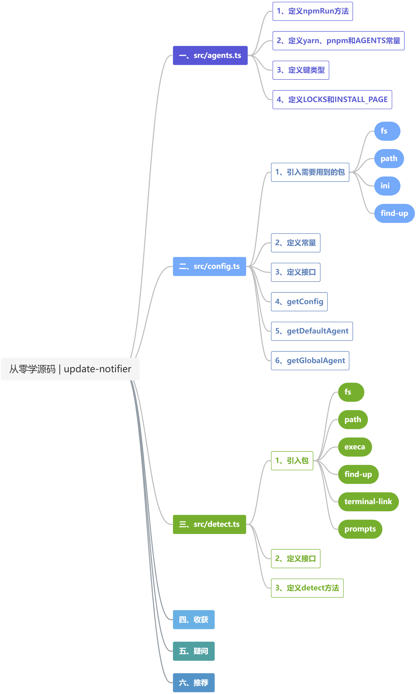
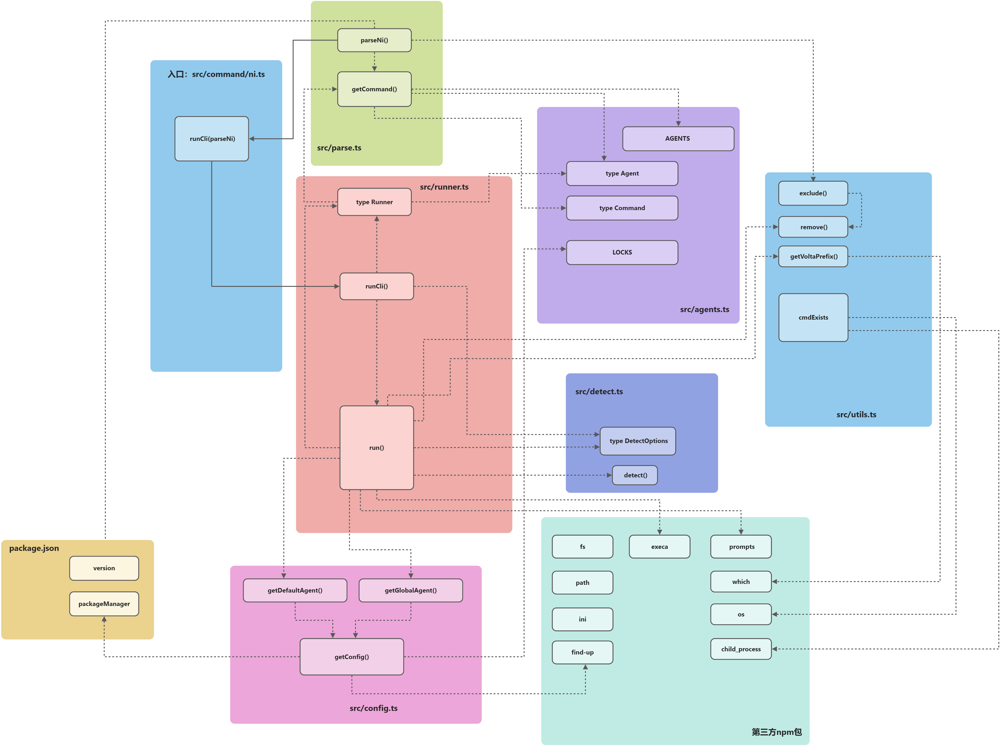
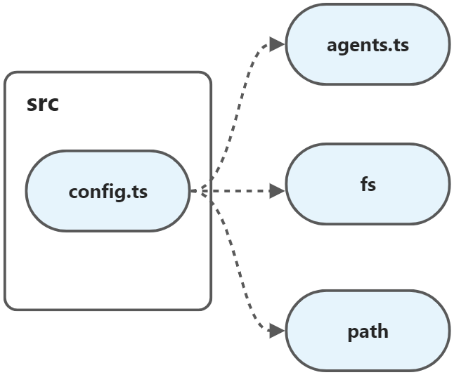
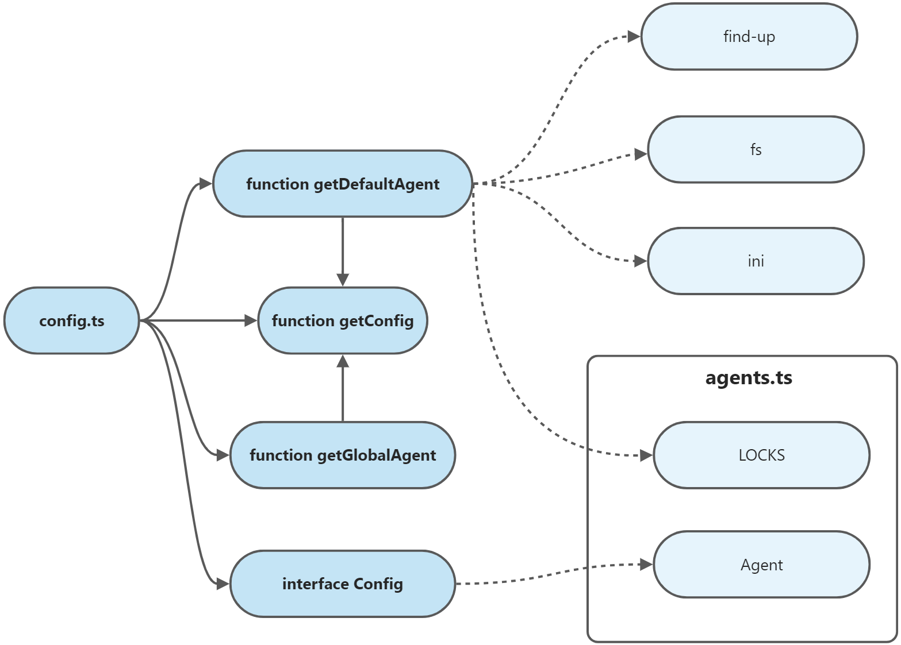
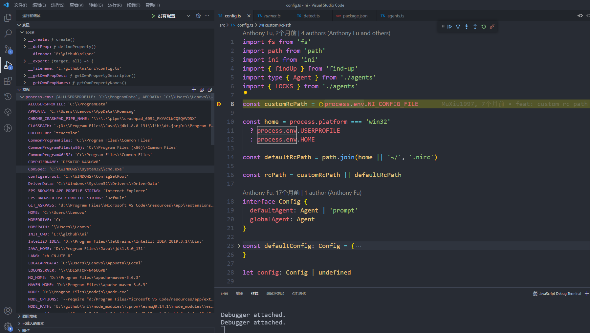
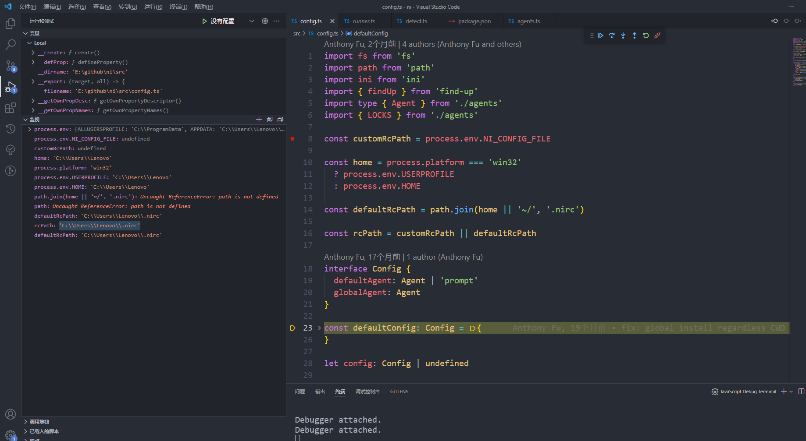
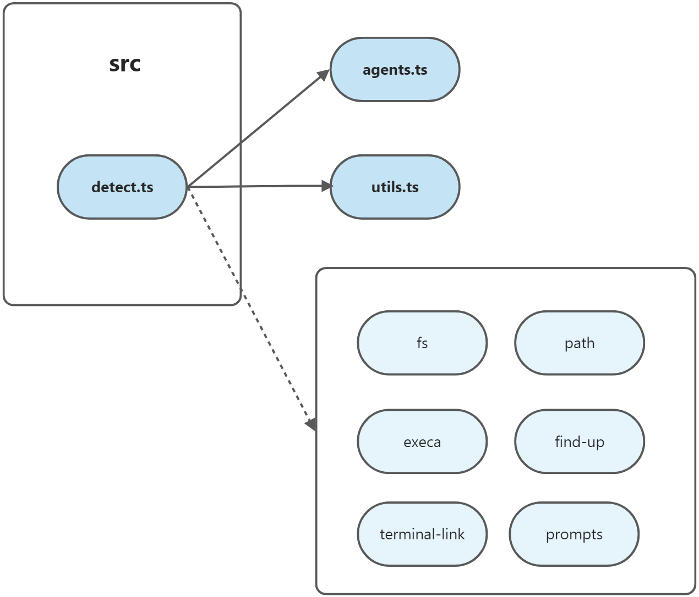
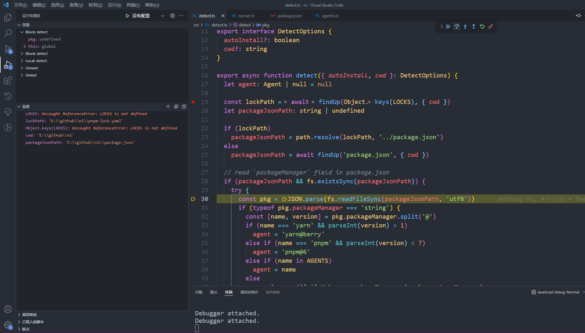
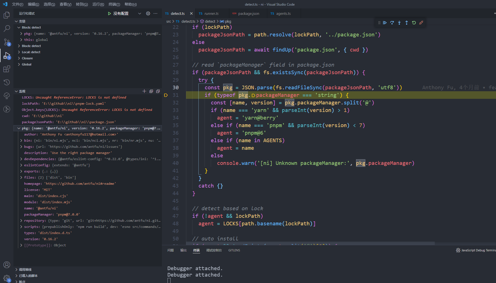
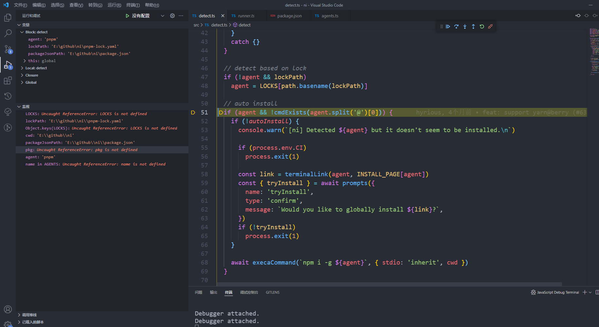

### 第十二期 | ni




#### 一、src/agents.ts


```typescript
const npmRun = (agent: string) => (args: string[]) => {
  //......
}

const yarn = {
    //......
}

const pnpm = {
    //......
}

export const AGENTS = {
    // ......
}

export type Agent = keyof typeof AGENTS
export type Command = keyof typeof AGENTS.npm

export const agents = Object.keys(AGENTS) as Agent[]

export const LOCKS: Record<string, Agent> = {
    //......
}

export const INSTALL_PAGE: Record<Agent, string> = {
    //......
}
```

##### 1、定义npmRun方法

```typescript
const npmRun = (agent: string) => (args: string[]) => {
    if (args.length > 1)
        return `${agent} run ${args[0]} -- ${args.slice(1).join(' ')}`
    else return `${agent} run ${args[0]}`
}
```

##### 2、定义`yarn`、`pnpm`和`AGENTS`常量

其中，`AGENTS`用于对外暴露。


| **key**  | **npm** |  **yarn** | **yarn@berry**  | **pnpm** | **pnpm@6** |
| ------------- |-------------|------------- |-------------|-------------|-------------|
| **agent** | npm | yarn | yarn | pnpm | pnpm |
| **run** | npmRun | yarn run | yarn run | pnpm run | npmRun |
| **install** | npm i | yarn install | yarn install | pnpm i | pnpm i |
| **frozen** | npm ci | yarn install --frozen-lockfile | yarn install --immutable | pnpm i --frozen-lockfile | pnpm i --frozen-lockfile |
| **global** | npm i -g | yarn global add | npm i -g | pnpm add -g | pnpm add -g |
| **add** | npm i | yarn add | yarn add  | pnpm add | pnpm add |
| **upgrade** | npm update | yarn upgrade | yarn up | pnpm update | pnpm update |
| **upgrade-interactive** | -- | yarn upgrad-interactive | yarn up -i | pnpm update -i | pnpm update -i |
| **execute** | npx | yarn dlx | yarn dlx | pnpm dlx | pnpm dlx |
| **uninstall** | npm uninstall | yarn remove | yarn remove | pnpm remove | pnpm remove |
| **global_uninstall** | npm uninstall -g | yarn global remove | npm uninstall -g | pnpm remove --global | pnpm remove --global |

```typescript
const yarn = {
    'agent': 'yarn {0}',
    'run': 'yarn run {0}',
    'install': 'yarn install {0}',
    'frozen': 'yarn install --frozen-lockfile',
    'global': 'yarn global add {0}',
    'add': 'yarn add {0}',
    'upgrade': 'yarn upgrade {0}',
    'upgrade-interactive': 'yarn upgrad-interactive {0}',
    'execute': 'yarn dlx {0}',
    'uninstall': 'yarn remove {0}',
    'global_uninstall': 'yarn global remove {0}',
}

const pnpm = {
    'agent': 'pnpm {0}',
    'run': 'pnpm run {0}',
    'install': 'pnpm i {0}',
    'frozen': 'pnpm i --frozen-lockfile',
    'global': 'pnpm add -g {0}',
    'add': 'pnpm add {0}',
    'upgrade': 'pnpm update {0}',
    'upgrade-interactive': 'pnpm update -i {0}',
    'execute': 'pnpm dlx {0}',
    'uninstall': 'pnpm remove {0}',
    'global_uninstall': 'pnpm remove --global {0}',
}

export const AGENTS = {
    'npm': {
        'agent': 'npm {0}',
        'run': npmRun('npm'),
        'install': 'npm i {0}',
        'frozen': 'npm ci',
        'global': 'npm i -g {0}',
        'add': 'npm i {0}',
        'upgrade': 'npm update {0}',
        'upgrade-interactive': null,
        'execute': 'npx {0}',
        'uninstall': 'npm uninstall {0}',
        'global_uninstall': 'npm uninstall -g {0}',
    },
    'yarn': yarn,
    'yarn@berry': {
        ...yarn,
        'frozen': 'yarn install --immutable',
        'upgrade': 'yarn up {0}',
        'upgrade-interactive': 'yarn up -i {0}',
        // yarn3 removed 'global'
        'global': 'npm i -g {0}',
        'global_uninstall': 'npm uninstall -g {0}',
    }
    'pnpm': pnpm,
    // pnpm v6.x or below
    'pnpm@6': {
        ...pnpm,
        run: npmRun('pnpm')
    }
}
```

##### 3、定义键类型

```typescript
export type Agent = keyof typeof AGENTS

export type Command = keyof typeof AGENTS.npm

// 等价于
type Agent = "npm" | "yarn" | "yarn@berry" | "pnpm" | "pnpm@6"
```

##### 4、定义`LOCKS`和`INSTALL_PAGE`

```typescript
export const LOCKS: Record<string, Agent> = {
    'pnpm-lock.yaml': 'pnpm',
    'yarn.lock': 'yarn',
    'package-lock.json': 'npm'
}

export const INSTALL_PAGE: Record<Agent, string> = {
    'pnpm': 'https://pnpm.js.org/en/installation',
    'pnpm@6': 'https://pnpm.js.org/en/installation',
    'yarn': 'https://classic.yarnpkg.com/en/docs/install',
    'yarn@berry': 'https://yarnpkg.com/getting-started/install',
    'npm': 'https://www.npmjs.com/get-npm'
}
```

#### 二、src/config.ts





##### 1、引入需要用到的包

```typescript
import fs from 'fs'
import path from 'path'
import ini from 'ini'
import { findUp } from 'find-up'
import type { Agent } from './agents'
import { LOCKS } from './agents'
```

##### 2、定义常量





```typescript
const customRcPath = process.env.NI_CONFIG_FILE

const home = process.platform === 'win32'
  ? process.env.USERPROFILE
  : process.env.HOME

const defaultRcPath = path.join(home || '~/', '.nirc')

const rcPath = customRcPath || defaultRcPath
```

##### 3、定义接口

```typescript
interface Config {
  defaultAgent: Agent | 'prompt'
  globalAgent: Agent
}

const defaultConfig: Config = {
  defaultAgent: 'prompt',
  globalAgent: 'npm',
}

let config: Config | undefined
```

##### 4、getConfig

**第一步，**判断`config`是否有值。如果不存在，则调用`findUp`方法，查找`package.json`。

**第二步：**从文件内容中获取`packageManager`的值。

```json
{
  "name": "@antfu/ni",
  "version": "0.16.2",
  "packageManager": "pnpm@7.0.0",
  "description": "Use the right package manager",
  "license": "MIT",
  "author": "Anthony Fu <anthonyfu117@hotmail.com>",
  "repository": {
    "type": "git",
    "url": "git+https://github.com/antfu/ni.git"
  }
}
```

**第三步：**使用正则表达式，将`packageManager`的值与`LOCKS`里面的值进行匹配，并得到`agent`和`version`。

```typescript
export const LOCKS: Record<string, Agent> = {
  'pnpm-lock.yaml': 'pnpm',
  'yarn.lock': 'yarn',
  'package-lock.json': 'npm',
}
```

```typescript
const [, agent, version] = packageManager.match(new RegExp(`^(${Object.values(LOCKS).join('|')})@(\d).*?$`)) || []
```

**第四步：**判断`agent`是否有值，则构造得到`config`对象。它由两部分构成，首先是默认的属性，包括`defaultAgent`和`globalAgent`，然后判断`agent`是否严格等于`yarn`且版本号大于1，如果满足条件，则`defaultAgent`的值是`yarn@berry`，否则旧是`agent`的值。

**第五步：**如果`agent`的值不存在，则传入`rcPath`，调用`fs.existsSync`方法，判断其是否存在。如果也不满足，则将`defaultConfig`的值赋值给`config`。

**第六步：**如果调用`fs.existsSync`方法，判断其存在，则读取该文件里的内容，然后使用`ini.parse`进行解析之后赋值给`config`。

```typescript
config = Object.assign({}, defaultConfig, ini.parse(fs.readFileSync(rcPath, 'utf-8')))
```

```typescript
config = Object.assign({}, defaultConfig, { defaultAgent: (agent === 'yarn' && parseInt(version) > 1) ? 'yarn@berry' : agent })
```

```typescript
export async function getConfig(): Promise<Config> {
  if (!config) {
    const result = await findUp('package.json') || ''
    let packageManager = ''
    if (result)
      packageManager = JSON.parse(fs.readFileSync(result, 'utf8')).packageManager ?? ''
    const [, agent, version] = packageManager.match(new RegExp(`^(${Object.values(LOCKS).join('|')})@(\d).*?$`)) || []
    if (agent)
      config = Object.assign({}, defaultConfig, { defaultAgent: (agent === 'yarn' && parseInt(version) > 1) ? 'yarn@berry' : agent })
    else if (!fs.existsSync(rcPath))
      config = defaultConfig
    else
      config = Object.assign({}, defaultConfig, ini.parse(fs.readFileSync(rcPath, 'utf-8')))
  }
  return config
}
```

##### 5、getDefaultAgent

用于暴露给`runner.ts`，在执行`run`方法时调用。

```typescript
export async function getDefaultAgent() {
  const { defaultAgent } = await getConfig()
  if (defaultAgent === 'prompt' && process.env.CI)
    return 'npm'
  return defaultAgent
}
```

##### 6、getGlobalAgent

```typescript
export async function getGlobalAgent() {
  const { globalAgent } = await getConfig()
  return globalAgent
}
```

#### 三、src/detect.ts



##### 1、引入包

```typescript
import fs from 'fs'
import path from 'path'
import { execaCommand } from 'execa'
import { findUp } from 'find-up'
import terminalLink from 'terminal-link'
import prompts from 'prompts'
import type { Agent } from './agents'
import { AGENTS, INSTALL_PAGE, LOCKS } from './agents'
import { cmdExists } from './utils'
```

##### 2、定义接口

```typescript
export interface DetectOptions {
  autoInstall?: boolean
  cwd?: string
}
```

##### 3、定义`detect`方法

**第一步，**先使用`findUp`方法查找`lock`文件的路径。

**第二步，**判断`lock`文件路径是否存在。如果存在，则使用`path.resolve`得到`package.json`的路径。如果不存在，则需要使用`findUp`方法查找`package.json`文件。



**第三步，**如果`packageJsonPath`值不为空，且文件存在，则尝试读取该文件。



**第四步，**判断文件内容中的`packageManager`属性的值是否是`string`类型，如果是，则尝试使用`@`对其进行分隔，然后得到`name`和`version`。

**第五步，**对`name`和`version`进行判断。

（1）名称是`yarn`且版本号大于1。

`agent`的值设置为`yarn@berry`。

（2）名称是`pnpm`且版本号小于7。

`agent`的值设置为`pnpm@6`。

（3）名称在`AGENTS`里面。

将`name`的值赋值给`agent`。

（4）其他情况。

提示不支持的包管理器。

**第六步，**如果`agent`的值不存在，但`lockPath`的值存在，则尝试从`LOCKS`中得到`agent`的值。

**第七步，**调用`utils`里面的`cmdExists`方法，验证包管理器是否安装。如果没有自动安装，则提示没有安装，然后显示一个安装的链接地址和确认提示选项。

**第八步，**调用`execaCommand`方法，执行全局安装的命令。



```typescript
export async function detect({ autoInstall, cwd }: DetectOptions) {
  let agent: Agent | null = null

  const lockPath = await findUp(Object.keys(LOCKS), { cwd })
  let packageJsonPath: string | undefined

  if (lockPath)
    packageJsonPath = path.resolve(lockPath, '../package.json')
  else
    packageJsonPath = await findUp('package.json', { cwd })

  // read `packageManager` field in package.json
  if (packageJsonPath && fs.existsSync(packageJsonPath)) {
    try {
      const pkg = JSON.parse(fs.readFileSync(packageJsonPath, 'utf8'))
      if (typeof pkg.packageManager === 'string') {
        const [name, version] = pkg.packageManager.split('@')
        if (name === 'yarn' && parseInt(version) > 1)
          agent = 'yarn@berry'
        else if (name === 'pnpm' && parseInt(version) < 7)
          agent = 'pnpm@6'
        else if (name in AGENTS)
          agent = name
        else
          console.warn('[ni] Unknown packageManager:', pkg.packageManager)
      }
    }
    catch {}
  }

  // detect based on lock
  if (!agent && lockPath)
    agent = LOCKS[path.basename(lockPath)]

  // auto install
  if (agent && !cmdExists(agent.split('@')[0])) {
    if (!autoInstall) {
      console.warn(`[ni] Detected ${agent} but it doesn't seem to be installed.\n`)

      if (process.env.CI)
        process.exit(1)

      const link = terminalLink(agent, INSTALL_PAGE[agent])
      const { tryInstall } = await prompts({
        name: 'tryInstall',
        type: 'confirm',
        message: `Would you like to globally install ${link}?`,
      })
      if (!tryInstall)
        process.exit(1)
    }

    await execaCommand(`npm i -g ${agent}`, { stdio: 'inherit', cwd })
  }

  return agent
}
```
#### 四、收获

`ni`实现的功能比较清晰，就是根据传入的参数判断应该使用哪种包管理工具，然后根据已经配置好的映射关系找到对应的命令，并执行这个命令。在上次阅读`src/commands/ni.ts`、`src/parse.ts`中的`parseNi`方法、`src/runner.ts`和`src/utils.ts`的基础上，这次学习了`src/agents.ts`、`src/config.ts`、`src/detect.ts`这几个文件里的源码。通过这几个文件，主要有以下几点收获：

（1）它会先将不同类型的包管理器中的命令进行映射，然后根据从`package.json`中读取到的`packageManager`参数，判断应该使用哪一种包管理器。

（2）如果没有安装相应的包管理器，则会给出相应提示，确认是否安装相应的包管理器，然后执行相应的全局安装命令。

##### 1、npm包

**（1）find-up**

通过遍历父目录查找文件或目录。

**（2）ini**

**（3）child_process**

**（4）terminal-link**

#### 五、疑问

根据前后逻辑判断，应该是将命令放入执行，验证是否存在相应的包管理器。

```typescript
execSync(
      os.platform() === 'win32'
        ? `cmd /c "(help ${cmd} > nul || exit 0) && where ${cmd} > nul 2> nul"`
        : `command -v ${cmd}`,
    )
```

#### 六、推荐

[TypeScript - 简单易懂的 keyof typeof 分析](https://juejin.cn/post/7023238396931735583)

