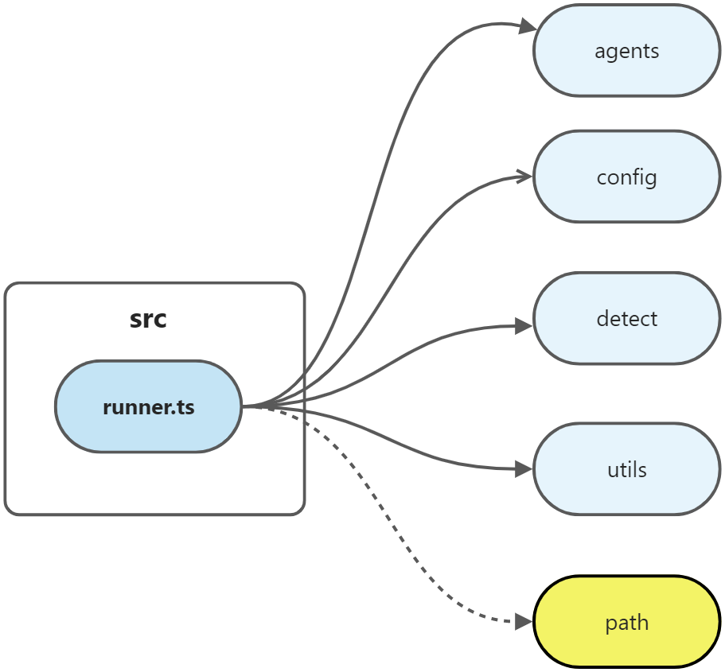

### 第十二期 | ni


#### 一、ni

##### 1、`ni`是如何工作的？

通过阅读`README.md`，得知`ni`可以帮助我们选择正确的包管理工具。它在运行之前，会根据项目中的`lock`文件（`yarn.lock`、`pnpm-lock.yaml`或`package-lock.json`）判断当前应该使用哪种包管理工具，然后执行对应的命令。

##### 2、`ni`的目录结构


#### 二、src/commands/ni.ts

```typescript
import { parseNi } from "./parse"
import { runCli } from "../runner"

runCli(parseNi)
```


#### 三、src/parse.ts


`src/parse.ts`对外暴露了七个方法。其中，对外暴露的`parseXXX`方法在对传入的`agent`、`command`、`args`做进一步处理之后，再调用`getCommand`方法返回结果。


##### 1、getCommand

`getCommand`方法传入了三个参数，分别是`agent`、`command`和`args`。其中`agent`和`command`的值在`src/agents.ts`中进行定义。

**第一步**，判断传入的agent是否在`src/agents.ts`中定义的`Agent`类型中。如果不存在，则抛出异常，提示不支持的类型。

**第二步**，根据传入的`agent`和`command`，在`AGENTS`中进行匹配。

**第三步**，判断获取到的结果是否是`function`类型，如果是，则将传入的`args`代入，执行该方法。

**第四步**，如果未获取到结果，则抛出异常，提示该命令不支持。

**第五步**，将传入的`args`替换结果中的`{0}`，并去除前后空格，最后返回。

```typescript
export function getCommand(
  agent: Agent,
  command: Command,
  args: string[] = [],
) {
  if (!(agent in AGENTS))
    throw new Error(`Unsupported agent "${agent}"`)

  const c = AGENTS[agent][command]

  if (typeof c === 'function')
    return c(args)

  if (!c)
    throw new Error(`Command "${command}" is not support by agent "${agent}"`)
  return c.replace('{0}', args.join(' ')).trim()
}
```


##### 2、parseNi

入口文件是`src/commands/ni.ts`。

**第一步**，判断传入的`args`的长度是否为1，且值为`-v`，如果是，则从`package.json`中读取`@antfu/ni`当前的版本，并直接退出。

**第二步**，判断传入的`args`是否包含`-g`，如果是，则表明需要全局安装，调用`getCommand`方法，且传入的第二个参数值为`global`，第三个参数值则是将`-g`这个参数移除掉然后传入。

**第三步**，判断传入的`args`是否包含`--frozen-if-present`，如果是，则先将`--frozen-if-present`这个值剔除掉，然后调用`getCommand`方法。调用时第二个参数会判断`ctx.hasLock`是否为true，如果是，则传入的第二个参数值为`frozen`，否则传入的值为`install`。通过查看`src/agents.ts`中的`AGENTS`得知，使用`npm`时，`frozen`对应的是`npm ci`命令，它是一个和`npm install`类似的`npm`命令。

**第四步**，判断传入的`args`是否包含`--frozen`，如果是，则调用`getCommand`方法，同时第二个参数传入的值为`frozen`，第三个参数的值为将`--frozen`移除之后传入。

**第五步**，判断传入的`args`的长度是否为0，或是遍历每个参数都以`-`开头，如果是，则直接调用`getCommand`方法，同时第二个参数传入的值为`install`，第三个参数直接将`args`传入。

**第六步**，如果以上均不满足，则直接调用`getCommand`方法，同时第二个参数传入的值为`add`，第三个参数直接将`args`传入。

```typescript
import { version } from '../package.json'
export const parseNi = <Runner>((agent, args, ctx) => {
  if (args.length === 1 && args[0] === '-v') {
    // eslint-disable-next-line no-console
    console.log(`@antfu/ni v${version}`)
    process.exit(0)
  }

  if (args.includes('-g'))
    return getCommand(agent, 'global', exclude(args, '-g'))

  if (args.includes('--frozen-if-present')) {
    args = exclude(args, '--frozen-if-present')
    return getCommand(agent, ctx?.hasLock ? 'frozen' : 'install', args)
  }

  if (args.includes('--frozen'))
    return getCommand(agent, 'frozen', exclude(args, '--frozen'))

  if (args.length === 0 || args.every(i => i.startsWith('-')))
    return getCommand(agent, 'install', args)

  return getCommand(agent, 'add', args)
})
```


##### 3、parseNr

入口文件是`src/commands/nr.ts`。

```typescript
export const parseNr = <Runner>((agent, args) => {
  if (args.length === 0)
    args.push('start')

  if (args.includes('--if-present')) {
    args = exclude(args, '--if-present')
    args[0] = `--if-present ${args[0]}`
  }

  return getCommand(agent, 'run', args)
})
```

##### 4、parseNu

入口文件是`src/commands/nu.ts`。

```typescript
export const parseNu = <Runner>((agent, args) => {
  if (args.includes('-i'))
    return getCommand(agent, 'upgrade-interactive', exclude(args, '-i'))

  return getCommand(agent, 'upgrade', args)
})
```

##### 5、parseNun

入口文件是`src/commands/nun.ts`。

```typescript
export const parseNun = <Runner>((agent, args) => {
  if (args.includes('-g'))
    return getCommand(agent, 'global_uninstall', exclude(args, '-g'))
  return getCommand(agent, 'uninstall', args)
})
```

##### 6、parseNx

入口文件是`src/commands/nx.ts`。

```typescript
export const parseNx = <Runner>((agent, args) => {
  return getCommand(agent, 'execute', args)
})
```

##### 7、parseNa

入口文件是`src/commands/na.ts`。

```typescript
export const parseNa = <Runner>((agent, args) => {
  return getCommand(agent, 'agent', args)
})
```

#### 四、src/runner.ts

**第一步**，在`ni.ts`中，先将`parseNi`作为参数传入`src/runner.ts`的`runCli`方法。

**第二步**，在`runCli`方法中调用`run`方法，此时继续将`parseNi`作为参数传入。

**第三步**，在`run`方法中再去执行传入的`parseNi`方法。



```typescript
import { resolve } from 'path'
import prompts from 'prompts'
import { execCommand } from 'execa'
import type { Agent } from './agents'
import { agents } from './agents'
import { getDefaultAgent, getGlobalAgent } from './config'
import type { DetectOptions } from './detect'
import { detect } from './detect'
import { getVoltaPrefix, remove } from './utils'
```

```typescript
export interface RunnerContext {
    hasLock?: boolean,
    cwd?: string
}
```

##### 1、runCli


```typescript
export type Runner = (agent: Agent, args: string[], ctx?: RunnerContenxt) => Promise<string | undefined> | string | undefined

export async function runCli(fn: Runner, options: DetectOptions = {}) {
    const args = process.argv.slice(2).filter(Boolean)
    try {
        await run(fn, args, options)
    }
    catch (error) {
        process.exit(1)
    }
}
```

##### 2、run

**第一步**，判断传入的`args`里面是否带有`debug`标识`?`，如果有，则将其移除。

**第二步**，判断传入的`args`里面第一个值是否是`-C`。

**第三步**，判断传入的`args`里面是否带有`-g`，如果有，则需要先去调用`getGlobalAgent`方法获取命令。如果没有，则执行第四步。

**第四步**，调用`detect`方法或是调用`getDefaultAgent`方法，获取类型。如果类型是`prompt`，则需要显示确认选项。如果没有选择，则返回，

**第五步**，如果不是`prompt`，则执行传入的方法。如果`command`的值不存在，则返回。

**第六步**，判断是否有`Volta`前缀，如果没有，则拼接一个空字符串。

**第七步**，执行命令。

```typescript
const DEBUG_SIGN = '?'
export async function run(fn: Runner, args: string[], options: DetectOptions = {}) {
    const debug = args.includes(DEBUG_SIGN)
    if (debug) {
        remove(args, DEBUG_SIGN)
    }
    let cwd = process.cwd()
    let command
    if (args[0] === '-C') {
        cwd = resolve(cwd, args[1])
        args.splice(0, 2)
    }
    const isGlobal = args.includes('-g')
    if (isGlobal) {
        command = await fn(await getGlobalAgent(), args)
    }
    else {
        let agent = await detect({ ...options, cwd}) || await getDefaultAgent()
        if (agent === 'prompt') {
            agent = (await prompts({
                name: 'agent',
                type: 'select',
                message: 'Choose the agent',
                choices: agent.filter(i => !i.includes('@')).map(value => ({ title: value, value })),
            })).agent
            if (!agent)
                return
        }
        command = await fn(agent as Agent, args, {
            hasLock: Boolean(agent),
            cwd,
        })
    }
    if (!command)
        return
    const voltaPrefix = getVoltaPrefix()
    if (!voltaPrefix) {
        command = voltaPrefix.concat(' ').concat(command)
    }

    if (debug) {
        console.log(command)
        return
    }

    await execaCommand(command, { stdio: 'inherit', encoding: 'utf-8', cwd })
}
```

#### 五、src/utils.ts

```typescript
import os from 'os'
import { execSync } from 'child_process'
import which from 'which'
```

##### 1、remove

```typescript
export function remove<T>(arr: T[], v: T) {
  const index = arr.indexOf(v)
  if (index >= 0)
    arr.splice(index, 1)

  return arr
}
```

##### 2、exclude

```typescript
export function exclude<T>(arr: T[], v: T) {
  return remove(arr.slice(), v)
}
```

##### 3、cmdExists

```typescript
export function cmdExists(cmd: string) {
  try {
    // #8
    execSync(
      os.platform() === 'win32'
        ? `cmd /c "(help ${cmd} > nul || exit 0) && where ${cmd} > nul 2> nul"`
        : `command -v ${cmd}`,
    )
    return true
  }
  catch {
    return false
  }
}
```

##### 4、getVoltaPrefix

```typescript
export function getVoltaPrefix(): string {
  // https://blog.volta.sh/2020/11/25/command-spotlight-volta-run/
  const VOLTA_PREFIX = 'volta run'
  const hasVoltaCommand = which.sync('volta', { nothrow: true }) !== null
  return hasVoltaCommand ? VOLTA_PREFIX : ''
}
```

#### 六、问题

##### 1、提示`Cannot find module 'node:buffer'`

**问题描述：**

在控制台执行`npm run dev`时提示`Cannot find module 'node:buffer'`。根据错误提示所在文件，打开`node_modules/execa/index.js`，第一行就是引入`node:buffer`。

```js
import {Buffer} from 'node:buffer';
```

**解决方案：**

（1）`buffer`是`Node`里面的模块，打开`node_modules/execa/package.json`，排查是否有版本限制。

```json
{
    "name": "execa",
    "version": "6.1.0",
    "engines": "^12.20.0 || ^14.13.1 || >= 16.0.0"
}
```

（2）检查本地的`Node`版本，安装对应的`Node`版本。

```
node -v
// 14.17.1
```

#### 七、收获

`ni`实现的功能比较清晰，就是根据传入的参数判断应该使用哪种包管理工具，然后根据已经配置好的映射关系找到对应的命令，并执行这个命令。此次源码阅读，主要熟悉了`ni`的目录结构，以及`src/commands/ni.ts`、`src/parse.ts`中的`parseNi`方法、`src/runner.ts`和`src/utils.ts`等几个部分的代码，大致熟悉了它的执行逻辑。虽然实现功能比较清晰，但由于需要考虑各种情况，同时方便后续扩展，里面涉及的ts文件相对而言还是比较多的，我用到了`vscode`的插件[Dependency Cruiser Extension](https://marketplace.visualstudio.com/items?itemName=juanallo.vscode-dependency-cruiser)，用来帮助梳理代码之间的依赖关系。

我觉得源码阅读收获最大的是，我从最开始的不懂怎么入手读源码，到后来的能够读一期源码里的一个方法、一个文件，再到现在能够把源码里相关用到的文件都调试一遍，就比如这期源码里面的`src/agents.ts`、`src/config.ts`、`src/detect.ts`、`src/storage.ts`等几个文件感觉还可以从中学到一些东西，我打算放在下次阅读。源码阅读的时候能够一步步走进去，了解每个方法是做什么的，为什么要这样做，这样做有什么好处，还可以学到许多有用的`npm`包和写代码的技巧。在阅读源码的过程中也会遇到各种问题，就需要静下心来思考如何去解决，帮助自己积累经验。

##### 1、typescript


**（1）** 操作符`?`

```typescript
// 当 ctx 存在时，调用 ctx.hasLock
// 若 ctx 不存在，则返回空
ctx?.hasLock ? 'frozen' : 'install'
```

**（2）** 仅导入类型

```typescript
import type { Agent } from './agents'
import type { DetectOptions } from './detect'
```

**（3）** 可选参数`?:`

```typescript
export interface RunnerContext {
    hasLock?: boolean,
    cwd?: string
}
```

##### 2、npm命令

**（1）** npm ci

与`npm install`类似，用于安装依赖，但比`npm install`快，更严格。`npm`依赖`package.json`，而`npm ci`依赖`package-lock.json`。

##### 3、volta

https://docs.volta.sh/reference/run