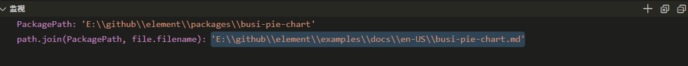

### 第15期 | element-new


#### 一、初识element-new

`element/build/bin/new.js`用于快速生成一个新组件。

打开vscode控制台，输入如下命令：

```
$ node build/bin/new.js busi-echart
```

其中，`busi-echart`是组件的名称，执行命令之后会添加下图所示的这些文件：


##### 1、examples/docs

添加的文件是帮助文档。

##### 2、nav.config.json

添加的文件是导航栏配置。

##### 3、packages/componentName

添加的文件是vue文件和注册组件的js。

```
<template>
    <div class="el-busi-echart"></div>
</template>
<script>
export default {
    name: 'ElBusiEchart'
}
</script>
```

```js
import BusiEchart from './src/main';

BusiEchart.install = function(Vue) {
    Vue.component(BusiEchart.name, BusiEchart);
}

export default BusiEchart;
```

##### 4、packages/theme-chalk

添加的文件用于引入样式文件，一个是对应组件的样式文件`busi-echart.scss`，另一个是样式文件入口`index.scss`。

```scss
@import "mixins/mixins";
@import "common/var";

@include b(busi-echart) {

}
```

```scss
//...
@import "./busi-echart.scss";
```

##### 5、test/unit/specs

添加的文件是单元测试文件。

```
import { createTest, destroyVM} from '../util';
import BusiEchart from 'packages/busi-echart';

describe('BusiEchart', () => {
    let vm;
    afterEach(() => {
        destroyVM(vm);
    })

    it('create', () => {
        vm = createTest(BusiEchart, true);
        expect(vm.$el).to.exist;
    })
})
```

##### 6、types

添加的文件是类型注释文件。

```ts
import { ElementUIComponent } from './component';

export declare class ElBusiEchart extends ElementUICompoent {

}
```

```
import { ElBusiEchart } from './busi-echart'
// ...
export class BusiEchart extends ElBusiEchart {}
```

##### 7、components.json

用于引入注册组件的js。

```
{
    'busi-echart': './packages/busi-echart/index.js'
}
```

#### 二、调试

##### 1、判断组件名是否存在

```js
if (!process.argv[2]) {
  console.error('[组件名]必填 - Please enter new component name');
  process.exit(1);
}
```

##### 2、引入需要用到的依赖和定义常量

**2.1 引入依赖**

此处用到的依赖有`path`、`fs`、`file-save`、`uppercamelcase`。其中，`path`、`fs`、`file-save`是Node文件读写中经常用到的，`uppercamelcase`用于将字符串转换成首字母大写，驼峰命名的格式。如传入的是`busi-echart`，则组件名称为`BusiEchart`。

```js
const path = require('path');
const fs = require('fs');
const fileSave = require('file-save');
const uppercamelcase = require('uppercamelcase');
const componentname = process.argv[2];
const chineseName = process.argv[3] || componentname;
const ComponentName = uppercamelcase(componentname);
const PackagePath = path.resolve(__dirname, '../../packages', componentname);
```

**2.2 定义常量**

将注册组件的js、新组件的vue文件、帮助文档、单元测试文件、样式文件、类型注释文件里的内容放到一个数组中。在后面创建package的时候遍历这个数组，将内容写入到对应的文件中。

```js
const Files = [
  {
    filename: 'index.js',
    content: `import ${ComponentName} from './src/main';

/* istanbul ignore next */
${ComponentName}.install = function(Vue) {
  Vue.component(${ComponentName}.name, ${ComponentName});
};

export default ${ComponentName};`
  },
  {
    filename: 'src/main.vue',
    content: `<template>
  <div class="el-${componentname}"></div>
</template>

<script>
export default {
  name: 'El${ComponentName}'
};
</script>`
  },
  {
    filename: path.join('../../examples/docs/zh-CN', `${componentname}.md`),
    content: `## ${ComponentName} ${chineseName}`
  },
  {
    filename: path.join('../../examples/docs/en-US', `${componentname}.md`),
    content: `## ${ComponentName}`
  },
  {
    filename: path.join('../../examples/docs/es', `${componentname}.md`),
    content: `## ${ComponentName}`
  },
  {
    filename: path.join('../../examples/docs/fr-FR', `${componentname}.md`),
    content: `## ${ComponentName}`
  },
  {
    filename: path.join('../../test/unit/specs', `${componentname}.spec.js`),
    content: `import { createTest, destroyVM } from '../util';
import ${ComponentName} from 'packages/${componentname}';

describe('${ComponentName}', () => {
  let vm;
  afterEach(() => {
    destroyVM(vm);
  });

  it('create', () => {
    vm = createTest(${ComponentName}, true);
    expect(vm.$el).to.exist;
  });
});
`
  },
  {
    filename: path.join('../../packages/theme-chalk/src', `${componentname}.scss`),
    content: `@import "mixins/mixins";
@import "common/var";

@include b(${componentname}) {
}`
  },
  {
    filename: path.join('../../types', `${componentname}.d.ts`),
    content: `import { ElementUIComponent } from './component'

/** ${ComponentName} Component */
export declare class El${ComponentName} extends ElementUIComponent {
}`
  }
];
```

##### 3、添加到 components.json

先判断新组件在json中是否存在，如果不存在，则将其注册组件js的路径添加到json中。

```js
const componentsFile = require('../../components.json');
if (componentsFile[componentname]) {
  console.error(`${componentname} 已存在.`);
  process.exit(1);
}
componentsFile[componentname] = `./packages/${componentname}/index.js`;
fileSave(path.join(__dirname, '../../components.json'))
  .write(JSON.stringify(componentsFile, null, '  '), 'utf8')
  .end('\n');
```

##### 4、添加到 index.scss

通过`fs.readFileSync`将`index.scss`中原有的内容读取出来，然后将新组件的scss文件名追加到原有内容后面，再将其写入到`index.scss`中。

```js
const sassPath = path.join(__dirname, '../../packages/theme-chalk/src/index.scss');
const sassImportText = `${fs.readFileSync(sassPath)}@import "./${componentname}.scss";`;
fileSave(sassPath)
  .write(sassImportText, 'utf8')
  .end('\n');
```

##### 5、添加到 element-ui.d.ts

通过`fs.readFileSync`将`element-ui.d.ts`中原有的内容读取出来，先拼接上新组件的`export`字符串，然后定位到第一个`export`出现的位置，将构造好的`import`字符串插入到它前面，最后将其写入到`element-ui.d.ts`中。

```js
const elementTsPath = path.join(__dirname, '../../types/element-ui.d.ts');

let elementTsText = `${fs.readFileSync(elementTsPath)}
/** ${ComponentName} Component */
export class ${ComponentName} extends El${ComponentName} {}`;

const index = elementTsText.indexOf('export') - 1;
const importString = `import { El${ComponentName} } from './${componentname}'`;

elementTsText = elementTsText.slice(0, index) + importString + '\n' + elementTsText.slice(index);

fileSave(elementTsPath)
  .write(elementTsText, 'utf8')
  .end('\n');
```

##### 6、创建 package

遍历之前定义的数组，调用`fileSave`方法将文件内容写入到指定的文件中。


index.js


src/main.vue


path.join('../../examples/docs/zh-CN', `${componentname}.md`)


path.join('../../examples/docs/en-US', `${componentname}.md`)


path.join('../../examples/docs/es', `${componentname}.md`)


path.join('../../examples/docs/fr-FR', `${componentname}.md`)



path.join('../../test/unit/specs', `${componentname}.spec.js`)


path.join('../../packages/theme-chalk/src', `${componentname}.scss`)


path.join('../../types', `${componentname}.d.ts`)


```js
Files.forEach(file => {
  fileSave(path.join(PackagePath, file.filename))
    .write(file.content, 'utf8')
    .end('\n');
});
```

##### 7、添加到 nav.config.json

```js
const navConfigFile = require('../../examples/nav.config.json');

Object.keys(navConfigFile).forEach(lang => {
  let groups = navConfigFile[lang][4].groups;
  groups[groups.length - 1].list.push({
    path: `/${componentname}`,
    title: lang === 'zh-CN' && componentname !== chineseName
      ? `${ComponentName} ${chineseName}`
      : ComponentName
  });
});

fileSave(path.join(__dirname, '../../examples/nav.config.json'))
  .write(JSON.stringify(navConfigFile, null, '  '), 'utf8')
  .end('\n');
```

`nav.config.json`是导航栏配置，在遍历过程中有个`chineseName`参数，这个参数实际上是创建组件时传入的一个参数。

```js
const chineseName = process.argv[3] || componentname;
```

#### 三、收获

`element`的`new.js`代码行数不多，逻辑也相对清晰，就是通过传入参数，然后根据已经定义好的模板，快速生成一个element组件。这对于后续希望在日常工作中封装组件框架或是API文档都提供了一个非常好的思路。

在代码中还有很多地方都用到了文件读写操作，这对于希望用Node通过读写文件实现一个小功能的人而言，或许可以作为不错的参考。


#### 四、拓展

1、Makefile

#### 四、参考

[element new](https://github1s.com/ElemeFE/element/blob/dev/build/bin/new.js)