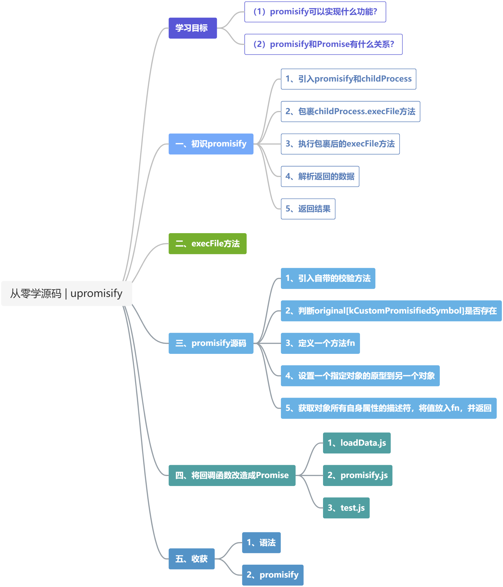
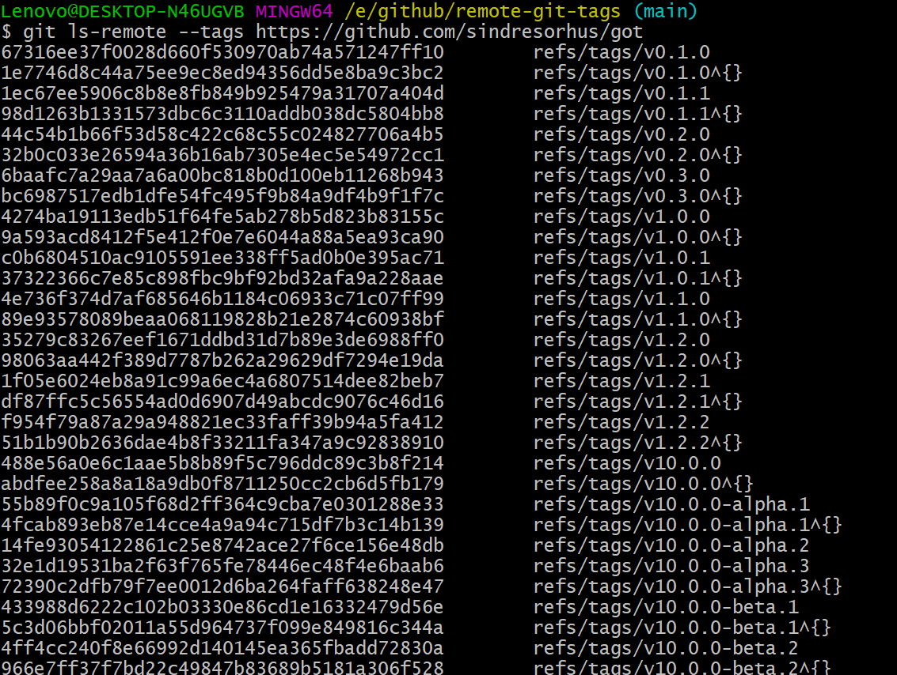
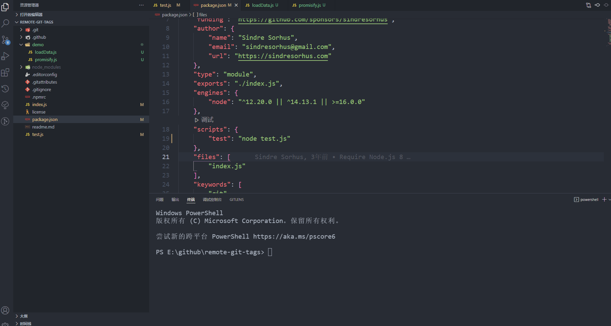

### 第14期 | promisify



**学习目标：**

（1）`promisify`可以实现什么功能？

（2）`promisify`和`Promise`有什么关系？

#### 一、初识`promisify`

`remote-git-tags`用于读取指定git仓库的`tags`和对应的`hash`值。`index.js`代码不多，主要用到了`node`中两个方法，一个是`util`中的`promisify`，一个是`child_process`的`execFile`。

##### 1、引入`promisify`和`childProcess`

##### 2、包裹`childProcess.execFile`方法

##### 3、执行包裹后的`execFile`方法

`const { stdout } = await execFile('git', ['ls-remote', '--tags', repoUrl]);`可以理解成在git命令行窗口输入这样一行命令：
`git ls-remote --tags https://github.com/sinndresorhus/got`，得到的结果如图所示：



##### 4、解析返回的数据

##### 5、返回结果

```js
import { promisify } from 'node:util';
import childProcess from 'node:child_process';

// 将 childProcess.execFile 用 promisify 包裹起来
const execFile = promisify(childProcess.execFile);

export default async function remoteGitTags(repoUrl) {
    // 等待 包裹了一层 promisify 的 execFile 执行成功，并返回结果
    const { stdout } = await execFile('git', ['ls-remote', '--tags', repoUrl]);
    const tags = new Map();
    // 对返回的数据进行解析处理
    for (const line of stdout.trim().split('\n')) {
        const [hash, tagReference] = line.split('\t');
        const tagName = tagReference.replace(/^refs\/tags\//, ''),replace(/\^{}$/, '');
        tags.set(tagName, hash);
    }

    return tags;
}
```

#### 二、`execFile`方法

如果想要从`remote-git-tags`的`index.js`中了解`promisify`可以实现的功能，首先需要了解`execFile`是如何使用的。


通过查阅API，结合上面的例子得知，`execFile`用于执行特定的程序，将参数以数组的形式传入，然后用回调函数将结果返回。举例如下：

```js
import childProcess from 'node:child_process';

childProcess.execFile('git', ['ls-remote', '--tags', 'https://github.com/sinndresorhus/got'], (error, stdout, stderr) => {
    console.log(stdout);
})
```

```js
import childProcess from 'node:child_process';

childProcess.execFile('node', ['--version'], (error, stdout, stderr) => {
    console.log(stdout);
})
```

接下来回到`remote-git-tags`中查看包裹了一层的`execFile`方法是如何使用的：

```js
const { stdout } = await execFile('git', ['ls-remote', '--tags', repoUrl]);
```

是不是有种似曾相识的感觉？没错，这里用到了`ES6`中的`await`语法。用于等待某个异步方法返回结果之后，再继续执行后面的操作。大胆猜想一下，`promisify`方法是不是将原本需要在回调函数中获取的内容，改成了通过`Promise`返回。

#### 三、`promisify`源码

[Node util 源码](https://github.com/nodejs/node/blob/v18.12.0/lib/internal/util.js)

以下是`util promisify`源码。

```js
const kCustomPromisifiedSymbol = SymbolFor('nodejs.util.promisify.custom');
const kCustomPromisifyArgsSymbol = Symbol('customPromisifyArgs');

let validateFunction;

function promisify(original) {
  // Lazy-load to avoid a circular dependency.
  if (validateFunction === undefined)
    ({ validateFunction } = require('internal/validators'));

  validateFunction(original, 'original');

  if (original[kCustomPromisifiedSymbol]) {
    const fn = original[kCustomPromisifiedSymbol];

    validateFunction(fn, 'util.promisify.custom');

    return ObjectDefineProperty(fn, kCustomPromisifiedSymbol, {
      __proto__: null,
      value: fn, enumerable: false, writable: false, configurable: true
    });
  }

  // Names to create an object from in case the callback receives multiple
  // arguments, e.g. ['bytesRead', 'buffer'] for fs.read.
  const argumentNames = original[kCustomPromisifyArgsSymbol];

  function fn(...args) {
    return new Promise((resolve, reject) => {
      ArrayPrototypePush(args, (err, ...values) => {
        if (err) {
          return reject(err);
        }
        if (argumentNames !== undefined && values.length > 1) {
          const obj = {};
          for (let i = 0; i < argumentNames.length; i++)
            obj[argumentNames[i]] = values[i];
          resolve(obj);
        } else {
          resolve(values[0]);
        }
      });
      ReflectApply(original, this, args);
    });
  }

  ObjectSetPrototypeOf(fn, ObjectGetPrototypeOf(original));

  ObjectDefineProperty(fn, kCustomPromisifiedSymbol, {
    __proto__: null,
    value: fn, enumerable: false, writable: false, configurable: true
  });

  const descriptors = ObjectGetOwnPropertyDescriptors(original);
  const propertiesValues = ObjectValues(descriptors);
  for (let i = 0; i < propertiesValues.length; i++) {
    // We want to use null-prototype objects to not rely on globally mutable
    // %Object.prototype%.
    ObjectSetPrototypeOf(propertiesValues[i], null);
  }
  return ObjectDefineProperties(fn, descriptors);
}

promisify.custom = kCustomPromisifiedSymbol;
```

##### 1、引入自带的校验方法

校验传入的参数是否是一个`function`

```js
const validateFunction = hideStackFrames(value, name) => {
    if (typeof value !== 'function') {
        throw new ERR_INVALID_ARG_TYPE(name, 'Function', value);
    }
}
```

##### 2、判断`original[kCustomPromisifiedSymbol]`是否存在

如果存在，则校验`original[kCustomPromisifiedSymbol]`是否是一个`function`，然后在对象上定义一个新属性，并返回。

##### 3、定义一个方法`fn`

```js
const argumentNames = original[kCustomPromisifyArgsSymbol];

function fn(...args) {
    return new Promise((resolve, reject) => {
      ArrayPrototypePush(args, (err, ...values) => {
        if (err) {
          return reject(err);
        }
        if (argumentNames !== undefined && values.length > 1) {
          const obj = {};
          for (let i = 0; i < argumentNames.length; i++)
            obj[argumentNames[i]] = values[i];
          resolve(obj);
        } else {
          resolve(values[0]);
        }
      });
      ReflectApply(original, this, args);
    });
}
```

##### 4、设置一个指定对象的原型到另一个对象

```js
ObjectSetPrototypeOf(fn, ObjectGetPrototypeOf(original));
```

然后在对象上定义一个新属性：

```js
ObjectDefineProperty(fn, kCustomPromisifiedSymbol, {
    __proto__: null,
    value: fn, enumerable: false, writable: false, configurable: true
});
```

##### 5、获取对象所有自身属性的描述符，将值放入`fn`，并返回

```js
const descriptors = ObjectGetOwnPropertyDescriptors(original);
const propertiesValues = ObjectValues(descriptors);
for (let i = 0; i < propertiesValues.length; i++) {
    // We want to use null-prototype objects to not rely on globally mutable
    // %Object.prototype%.
    ObjectSetPrototypeOf(propertiesValues[i], null);
}
return ObjectDefineProperties(fn, descriptors);
```

#### 四、将回调函数改造成Promise

##### 1、loadData.js

```js
export function loadData([param1, param2, param3], cb) {
	console.log('222')
    setTimeout(() => {
		console.log('333')
		let a = [
			'loadData',
			param1,
			param2,
			param3
		]
        cb(a)
    }, 2000)
}
```

##### 2、promisify.js

```js
export function promisify(oldFunc) {
    function fn(...args) {
        return new Promise((resolve, reject) => {
            args.push((...values) => {
                console.log('444')
                resolve(values)
            })
			console.log('111')
            Reflect.apply(oldFunc, this, args);
        })
    }
    return fn
}
```

##### 3、test.js

```js
import { loadData } from './demo/loadData.js'
import { promisify } from './demo/promisify.js'

const loadDataPromise = promisify(loadData)
async function testLoad() {
    const content = await loadDataPromise(['111', '222', '333'])
    console.log('testLoad', content)
}

testLoad();
```



#### 五、收获

##### 1、语法

**1.1 Symbol.for()**

[Symbol.for()](https://developer.mozilla.org/en-US/docs/Web/JavaScript/Reference/Global_Objects/Symbol/for)

**1.2 Object.setPrototypeOf()**

设置一个指定的对象的原型（即，内部 [[Prototype]] 属性）到另一个对象或 null。

[Object.setPrototypeOf()](https://developer.mozilla.org/zh-CN/docs/Web/JavaScript/Reference/Global_Objects/Object/setPrototypeOf)

**1.3 Object.getOwnPropertyDescriptors()**

用来获取一个对象的所有自身属性的描述符。

[](https://developer.mozilla.org/zh-CN/docs/Web/JavaScript/Reference/Global_Objects/Object/getOwnPropertyDescriptors)

**1.4 Object.defineProperty()**

[](https://developer.mozilla.org/zh-CN/docs/Web/JavaScript/Reference/Global_Objects/Object/defineProperty)

**1.5 Reflect**

[Reflect](https://developer.mozilla.org/zh-CN/docs/Web/JavaScript/Reference/Global_Objects/Reflect)

##### 2、promisify

（1）`promisify`可以实现将回调函数改造成`Promise`返回。

（2）`promisify`中用到了`Promise`语法，以此实现对回调函数的改造。

#### 参考

[remote-git-tags](https://github.com/sindresorhus/remote-git-tags)

[Node child_process](https://nodejs.org/dist/latest-v18.x/docs/api/child_process.html)

[Node util](https://nodejs.org/dist/latest-v18.x/docs/api/util.html)

[Node util promisify](https://nodejs.org/dist/latest-v18.x/docs/api/util.html#utilpromisifyoriginal)

[ES6 await](https://developer.mozilla.org/zh-CN/docs/Web/JavaScript/Reference/Operators/await)