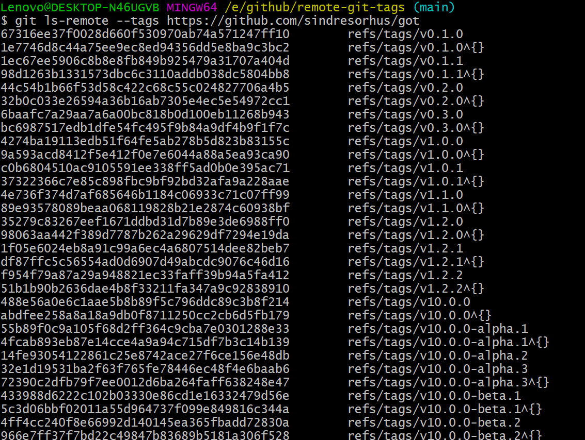

### 第14期 | promisify

`remote-git-tags`用于读取指定git仓库的`tags`和对应的`hash`值。代码不多，主要用到了`node`中的两个非常熟悉的模块，一个是`util`，一个是`child_process`。

#### 一、index.js

##### 1、引入`promisify`和`childProcess`

##### 2、包裹`childProcess.execFile`方法

##### 3、执行`childProcess.execFile`方法


`const { stdout } = await execFile('git', ['ls-remote', '--tags', repoUrl]);`可以理解成在git命令行窗口输入这样一行命令：
`git ls-remote --tags https://github.com/sinndresorhus/got`，得到的结果如图所示：



##### 4、解析返回的数据

##### 5、返回结果

```js
import { promisify } from 'node:util';
import childProcess from 'node:child_process';

// 将 childProcess.execFile 用 promisify 包裹起来
const execFile = promisify(childProcess.execFile);

export default async function remoteGitTags(repoUrl) {
    // 等待 包裹了一层 promisify 的 execFile 执行成功，并返回结果
    const { stdout } = await execFile('git', ['ls-remote', '--tags', repoUrl]);
    const tags = new Map();
    // 对返回的数据进行解析处理
    for (const line of stdout.trim().split('\n')) {
        const [hash, tagReference] = line.split('\t');
        const tagName = tagReference.replace(/^refs\/tags\//, ''),replace(/\^{}$/, '');
        tags.set(tagName, hash);
    }

    return tags;
}
```

#### 二、test.js

```js
import test from 'ava';
import remoteGitTags from './index.js';

test('main', async t => {
    const tags = await remoteGitTags('https://github.com/sindresorhus/got');
    // 得到的 tags 是一个以版本号为键值的map
    t.is(tags.get('v6.0.0'), 'e5c2d9e93137263c68db985b3dc5b57865c67b82');
    t.is(tags.get('v5.0.0'), '0933d0bb13f704bc9aabcc1eec7a8e33dc8aba51');
})
```

#### 参考

[remote-git-tags](https://github.com/sindresorhus/remote-git-tags)

[Node child_process](https://nodejs.org/dist/latest-v18.x/docs/api/child_process.html)

[Node util](https://nodejs.org/dist/latest-v18.x/docs/api/util.html)